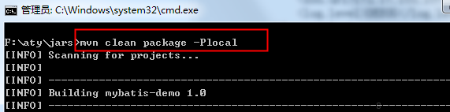
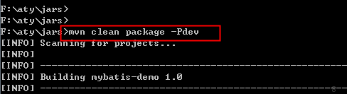
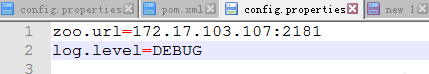
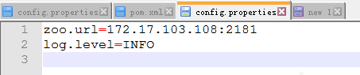

# Maven 内置变量

一个优秀的构建系统必须足够灵活，应该能够让项目在不同的环境下都能成功构建。maven为了支持构建的灵活性，内置了三大特性，即：属性、profile和资源过滤。

## maven属性

maven属性分6类：

### 1. 内置属性

内置属性：


`${basedir}` 表示项目根目录,即包含 `pom.xml` 文件的目录;

`${version}` 表示项目版本;

`${project.basedir}` 同 `${basedir}`;

`${project.baseUri}` 表示项目文件地址;

`${maven.build.timestamp}` 表示项目构件开始时间;
`${maven.build.timestamp.format}` 表示属性 `${maven.build.timestamp}` 的展示格式,默认值为`yyyyMMdd-HHmm`,可自定义其格式,其类型可参考`Java.text.SimpleDateFormat`。用法如下：

```xml
<properties>
<maven.build.timestamp.format>yyyy-MM-dd HH:mm:ss</maven.build.timestamp.format>
</properties>
```

### 2. POM属性


```xml
<project>
   <modelVersion>4.0.0</modelVersion>
   <groupId>org.sonatype.mavenbook</groupId>
   <artifactId>project-a</artifactId>
   <version>1.0-SNAPSHOT</version>
   <packaging>jar</packaging>
   <build>
      <finalName>${project.groupId}-${project.artifactId}</finalName>
   </build>
</project>
```

可以使用点标记(.)的路径来引用POM元素的值。


```bash
${basedir} 项目根目录
${project.build.directory} 构建目录，缺省为target
${project.build.outputDirectory} 构建过程输出目录，缺省为target/classes
${project.build.finalName} 产出物名称，缺省为${project.artifactId}-${project.version}
${project.packaging} 打包类型，缺省为jar
${project.xxx} 当前pom文件的任意节点的内容
```

### 3. 自定义属性

用户可以在pom的<properties>元素下自定义maven属性。

```xml
<project>
  <properties>
    <my.pro>abc</my.pro>
  </properties>
</project>
```

在其他地方使用`${my.pro}`使用该属性值。


### 4. setting属性

用户可以使用以settings开头的属性引用settings.xml中xml元素的值，如`${settings.localRepository}`指向用户本地仓库的地址。

### 5. java系统属性

maven可以使用当前java系统的属性，如`${user.home}`指向了用户目录。

### 6. 环境变量属性

env变量，暴露了你操作系统或者shell的环境变量。便 如在Maven POM中一个对`${env.PATH}`的引用将会被`${PATH}`环境变量替换，在Windows中为`%PATH%`。所有环境变量都可以使用以env.开头的属性。如：`${env.JAVA_HOE}`。

## maven profile

profile其实就相当于定义了一系列的profile变量，在具体构建时可用使用其中的某个profile去变量替换资源文件。


```bash
jdbc.driverClassName=${db.driver}  
jdbc.url=${db.url}  
jdbc.username=${db.user}  
jdbc.password=${db.pwd} 
```


```xml
<profiles>  
 <profile>  
  <id>dev</id>  
  <properties>  
   <db.driver>oracle.jdbc.driver.OracleDriver</db.driver>  
   <db.url>jdbc:oracle:thin:@10.252.48.3:1521:dbname</db.url>  
   <db.user>username</db.user>  
   <db.pwd>userpwd</db.pwd>  
  </properties>  
 </profile>  
 <profile>  
  <id>test</id>  
  <properties>  
   <db.driver>oracle.jdbc.driver.OracleDriver</db.driver>  
   <db.url>jdbc:oracle:thin:@10.252.48.3:1521:testdbname</db.url>  
   <db.user>testusername</db.user>  
   <db.pwd>testuserpwd</db.pwd>  
  </properties>  
 </profile>  
</profiles>  
```

根据需要，可以在以下文件声明profile：

- pom.xml 针对当前项目。
- 用户 settings.xml 用户目录下的.m2/settings.xml， 对当前用户的所有项目有效。
- 全局 settings.xml 即maven安装目录下的conf/settings.xml。对本机上的所有项目有效。

一般的项目都会运行在不同的环境上，比如我们有本地环境、开发环境、测试环境、生产环境等等。这些不同的环境，必然有不同的配置。比如日志级别，开发环境我们一般设置成debug，而生产环境一般设置成warn。我们肯定不希望：手动修改项目配置文件，然后才打包发布到不同的环境。

这个时候我们可以使用maven的profile，在pom.xml中为不同的环境配置不同的profile。


```xml
<project>
    <profiles>
        <profile>
            <id>local</id>
            <activation>
                <activeByDefault>true</activeByDefault>
            </activation>
            <properties>
                <zoo.url>172.17.103.107:2181</zoo.url>                
                <log.level>DEBUG</log.level>
            </properties>
        </profile>
        <profile>
            <id>dev</id>
            <activation>
                <activeByDefault>false</activeByDefault>
            </activation>
            <properties>
                <zoo.url>172.17.103.108:2181</zoo.url>                
                <log.level>INFO</log.level>
            </properties>
        </profile>
    </profiles>
</project>
```

如果我们需要打本地环境的包，可以激活本地环境的profile：



如果我们需要打开发环境的包，可以激活开发环境的profile




## 资源过滤

所谓的资源：也就就是指`src/main/resources`和`src/test/resources`文件下的所有文件，默认情况下，这些文件会被复制到`classpath`下面，即`target/classes`下面。

所谓资源过滤，就是过滤这些文件夹下面的文件里面的内容。上面我们为本地环境和开发环境配置了不同的profile，我们代码怎么去读取这些配置的值呢？我们可以定义一个`config.properties`，放在`src/main/resources/`下面：

```bash
zoo.url=${zoo.url}
log.level=${log.level}
```

接下来我们需要在pom.xml中开启资源过滤：目的是为了让maven将文件中的占位符替换成实际值。


```xml
<build>
    <!-- 替换配置文件中的数据项 start -->
    <resources>
        <resource>           
           <directory>src/main/resources</directory>
           <filtering>true</filtering>
        </resource>
    </resources>
    <testResources>
        <testResource>
            <directory>src/test/resources</directory>
            <filtering>true</filtering>
        </testResource>
    </testResources>
    <!-- 替换配置文件中的数据项 end -->        
</build>
```

如果我们激活本地环境的profile，可以看到最终构建出的config.properties内容如下：



如果我们激活开发环境的profile，可以看到最终构建出的config.properties内容如下：



通过maven的profile和资源过滤，我们只需要在不同的环境激活对应的profile，配置信息就会自动改变，不需要我们取修改项目中的代码或者配置文件，所有变量都是定义在pom.xml中的。

下面具体介绍一下资源过滤的属性：


```xml
<build>    
            
        <!-- 主资源目录 -->    
        <resources>    
            <resource>    
                <!-- 设定主资源目录  -->    
                <directory>src/main/resources</directory>    
                    
                <!-- maven default生命周期，process-resources阶段执行maven-resources-plugin插件的resources目标处理主资源目下的资源文件时，只处理如下配置中包含的资源类型     
                <includes>    
                    <include>*.xml</include>    
                </includes>    
                 -->    
                     
                <!-- maven default生命周期，process-resources阶段执行maven-resources-plugin插件的resources目标处理主资源目下的资源文件时，不处理如下配置中包含的资源类型（剔除下如下配置中包含的资源类型）     
                <excludes>    
                    <exclude>*.xml</exclude>    
                </excludes>    
                -->    
                    
                <!-- maven default生命周期，process-resources阶段执行maven-resources-plugin插件的resources目标处理主资源目下的资源文件时，指定处理后的资源文件输出目录，默认是${build.outputDirectory}指定的目录    
                <targetPath>d:/</targetPath>    
                   -->    
                      
                <!-- maven default生命周期，process-resources阶段执行maven-resources-plugin插件的resources目标处理主资源目下的资源文件时，是否对主资源目录开启资源过滤 -->    
                <filtering>true</filtering>    
                    
            </resource>    
        </resources>    
    </build>  
```