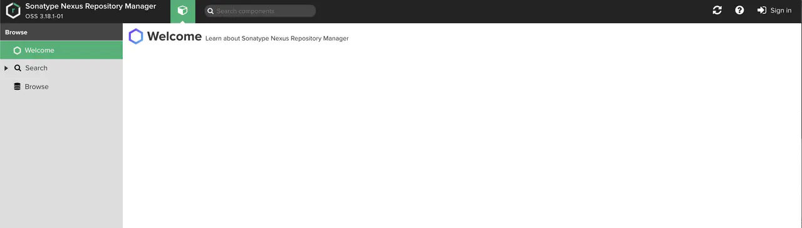
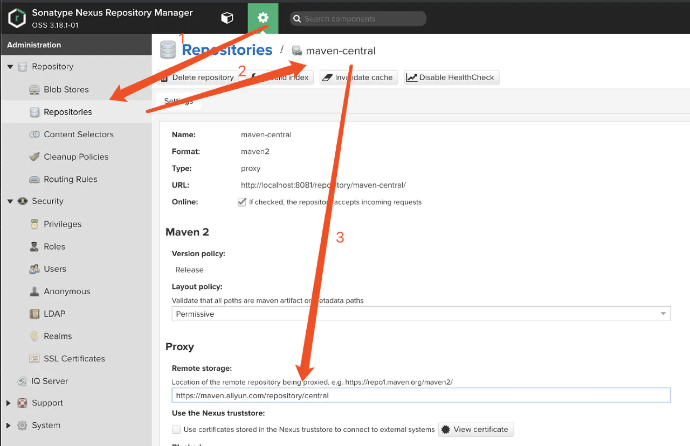
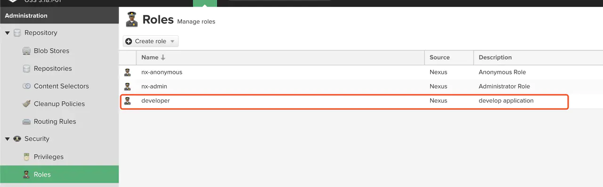
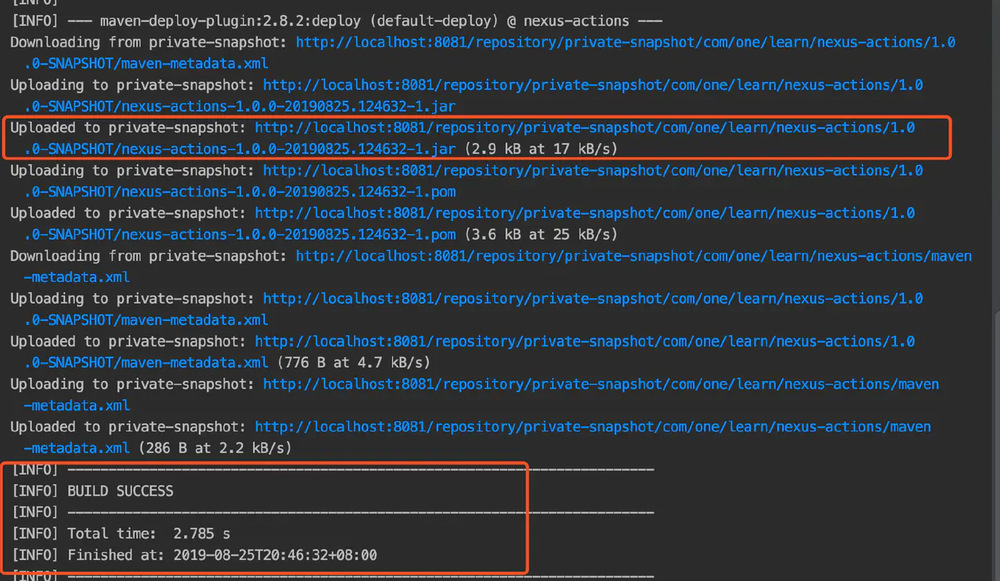

# Maven 私服

## 前言

在 Java EE 开发中，我们使用 Maven 构建工具主要来管理项目的第三方库的依赖，以及公司内部其他项目服务的依赖。因此 Maven 私服就是必不可少的一环，本文主要对 Maven 私服的三大方面进行介绍：

- 什么是 Maven 私服
- 如何搭建 Maven 私服
- 如何使用 Maven 私服

> 本文面对的读者应有 Maven 使用经验，了解 Maven 的一些基本概念，如果不太熟悉可以参见文末的参考资料学习。

## 什么是 Maven 私服

在介绍 Maven 私服之前，我们首先清楚下什么是 Maven 仓库。

**Maven 仓库：Maven 统一存储所有Maven项目依赖，插件，以及所上传项目的地方。**

并且 Maven 仓库还分成两类：本地仓库和远程仓库。

- 本地仓库，就是我们本地电脑安装Maven后，在 配置文件 setting.xml 里 `localRepository` 所需要指定目录的那个文件夹。
- 远程仓库，就是在外部网络里（包括局域网）指定 URL 的专门存放 Java 库，Maven插件等的服务器，，例如中央仓库，就是一个典型的远程仓库，它包含了世界上绝大多数开源的 Java 库，类似的还有许多其他的公开库

而本文提到的私服，就是另一种特殊的远程仓库，它通常架设在局域网内的一台服务器上，用于代理所有外部的远程仓库，并且能接受内部项目的上传和获取。

而这些仓库又有是什么用呢？当 Maven 项目需要依赖一些其他项目的 Java 库时，Maven 首先会在本地仓库查找，如果存在对应的库，就直接使用；如果本地仓库不存在，Maven 就会去远程仓库查找，找到对应的 Java 库后下载到本地仓库再使用，以便于下次需要该Java库时，直接使用缓存在本地仓库的依赖库即可，省去了重复通过网络查找并下载的时间，对于 Maven 插件也是同样的过程。

通常情况下，中央仓库是Maven 默认的远程仓库，而当引入了私服后，本地仓库查找结束未找到所需要的依赖库时，就先从私服仓库开始查找，仍未找到的话，最后再去中央仓库查找，具体过程可以参考下图：

在这里我们再看下私服的作用有哪些：

- 内网访问，节省外网带宽。
- 一次外网下载，内网所有用户就可以只下载私服缓存，加速 Maven 项目构建。
- 允许上传和下载私有库，并且不被外部访问，更加安全。
- 减少外部网络因素，提供项目构建的稳定性。
- 方便内部项目服务的依赖引用，而不需要其他项目的完整源代码。

这里对最后一小点的作用添加下具体描述：当我们有独立的两个Maven 项目，比如订单服务项目和会员服务项目，其中订单服务项目需要会员服务，依赖会员服务的 API 包，通过私服可以将编译后的会员服务的 API 包上传，然后订单服务程序直接下载引用私服上的会员服务 API 包即可，这样就不需要导入会员服务项目代码，也不用关心会员服务具体实现了，起到了内部服务项目轻度引用的作用，描述可参见下图。

## 搭建 Maven 私服

了解 Maven 私服之后，我们进一步学习。我们首先来搭建一个 Maven 私服。在这里我们使用最流行的开源 Maven 仓库管理软件 -  Nexus，来快速搭建 Maven 私服，传统的搭建方式为在 Nexus 官网上下载开源版的 Nexus OSS 进行安装：[https://www.sonatype.com/nexus-repository-oss](https://www.sonatype.com/nexus-repository-oss) 。而本文将采用Docker 方式安装 Nexus，不仅快速简单，而占用更少的机器资源。

> 如果对 Docker 不熟悉的同学，可以参见 [10分钟快速掌握Docker必备基础知识](https://juejin.im/post/6844903918372143112?utm_source=gold_browser_extension%23heading-34) 学习了解下，简单使用 Docker 也是十分容易的。

### 下载 Nexus 镜像

在终端控制台上使用 Docker 指令下载 Nexus 官方提供的Docker 镜像：

看到下图结果时，就表示镜像下载完成，可以通过 `docker images` 查看。

### 启动 Nexus 容器

使用下方指令启动 Nexus 容器：

在这里对输入的 Docker 指令的参数进行简单的说明：

- `-d` 表示让容器后台运行。
- `-p 8081:8081` 表示了容器启动时开放内部端口 8081（后者的8081） 映射主机端口的 8081 ，即通过 `localhost:8081`  可以访问到 Nexus 容器所提供的服务。
- `-v /Users/One/Desktop/Nexus/nexus-data:/nexus-data` 表示将容器内部 `/var/nexus-data` 挂载到当前主机的指定目录，需要注意的是，`-v` 指定的外部路径必须为全路径。
- `--restart=always` 比较简单，表示当 docker 服务启动时，该容器也跟着启动。

执行上述指令后，稍等片刻，访问 `http://localhost:8081/` ，看到对应的 Nexus 后台就表示私服安装完成了，是不是很简单呢。

> 容器启动过程中，由于机器配置的不同，可能会出现启动慢的情况，只需耐心等待即可。

启动完成后，我们可以在所挂载的本机目录下查看 Nexus 容器运行产生的文件。

## 配置 Maven 私服

私服安装之后，我们首先进行登录操作，点击页面左上角的 Sign In 按钮，就会出现和下图一样的提示：

说明了 Nexus 默认登录账号为 admin，并且密码位于文件 `/nexus-data/admin.password` 下，我们只需在本地配置的挂载目录下查看该文件即可。

输入默认的账号密码之后成功登录之后，Nexus 就会强制要求修改 admin 的密码,并且设置基本访问权限，完成之后就正式进入了 Nexus 私服后台。

这里简单对界面元素进行介绍：

1. 默认的浏览界面，可以搜索查看仓库的组件，以及进行上传操作。
2. 用于管理私服程序的配置。
3. 账户信息查看，允许修改密码。

进入私服程序的配置界面，我们需要对默认配置进行几点调整。

### 中央仓库的代理路径设置

将私服配置里中央仓库的代理仓库路径更新为[阿里云仓库](https://maven.aliyun.com/mvn/view)提供的代理地址：[https://maven.aliyun.com/repository/central](https://maven.aliyun.com/repository/central)  这样一来可以更快速地访问在中央仓库上所需要的依赖和插件。

### 新建自定义的仓库

点击`Create repository`,然后选择类型为 `maven2(hosted)`

然后输入仓库名称 private-release，并在 Version policy 一栏中选择 Release，表示这个仓库的存储依赖为正式发布的组件，然后在 Deployment policy 一栏中选择 Allow redeploy，允许部署和更新私服上的组件。

最后点击蓝色按钮-`Create repository` 之后，就可以在仓库列表看到自定义的仓库了，有了 release 仓库，我们再按照同样方式操作添加一个 snapshot 仓库，只需在  Version policy  一栏调整为 Snapshot 即可。

### 添加角色

Nexus 默认只有两种角色：`nx-anonymous` 和 `nx-admin`，前者只有浏览的权限，后者为管理员权限，一般情况下，我们还需要正对开发人员创建个角色。点击 `Create Role`，添加一个 Role ID 为 `developer` 的自定义角色,  并且只添加自定义仓库的使用权限，删除操作除外。

保存之后，新增的角色就展示在列表中，有了角色，就可以关联用户，进行权限分配了。

### 添加用户

跟权限类似，默认的用户只有两种：`admin` 和 `anonymous`，我们同样需要创建属于开发者的用户对象。点击 `Create local user`，填入用户名，密码等必填信息之后，关联我们先前的创建的角色，并保存即可。

用户创建完成之后，我们就可以用新的用户登录私服，查看对应权限的内容了，例如我们用新建的用户登录，所能操作的只有查看和搜索自定义的私服仓库。

这样一来我们就创建好了自己的私服仓库，配置完成之后，开发者就可以在 Maven 项目开发中使用了。

## 使用 Maven 私服

有了私服和用于开发的账号，我们就需要在本地 Maven 配置文件 setting.xml 进行关联。

设置 server 账户信息：

设置私服仓库地址：（这里的地址，可以通过 Nexus 后台上仓库页面的 `cpoy` 按钮自动复制得到）

### Maven 项目部署到私服

配置完成后，我们可以创建一个Maven工程，尝试下打包到 Maven 私服。利用 IDE 快速生成 Maven 项目，在 POM 文件添加 `distributionManagement` 节点，并且指定对应的私服仓库 id 和地址，如下：

最后只要执行部署命令  `mvn clean deploy` 或者利用 IDE 的 部署插件即可，当控制台出现 `BUILD SUCCESS` ，如下图类似时则说明部署完成。

从日志上可以看出，我们的项目上传都了 private- snapshot 仓库下，此时我们可以在私服网站上的  private- snapshot 仓库查看到上传的 jar。

> 如果部署过程中出现如下提示：带有 `Access denied to` 则说明在 setting.xml 配置的用户权限不足，无法将 jar 部署到对应私服仓库上去。
>
> 
>
> 

需要注意的是，对于一个Maven项目而言，如果项目的版本号中有 “SNAPSHOT” 字样，则表示当前处于开发版本，Maven 会将发布到 `snapshotRepository` 节点对应地址上去。否则，Maven则认为这是一个发布版本，将程序发布到 `repository` 节点对应的地址上。由于示例项目的版本为 `1.0.0-SNAPSHOT` ，所以最终项目上传到了 `private-snapshot` 这个 Snapshot 类型的仓库下。

接下来如果其他项目要依赖这个 jar 时，只需要在其 POM 文件引入对应的坐标即可。

### 将第三方 jar 包部署到 Maven 私服

这里说到了第三方 jar 包，不是平常所提到的开源库，更多的是来自其他第三方系统的 jar 包，由于项目需要，使用项目导入的方式来很不方便，更好的处理方式就是将第三方系统的 jar 包手动上传到 Maven 私服上，需要使用的项目直接从私服仓库中拉取即可。

这种方式实现起来也比较方便，分为两种：可视化界面操作和命令行操作。

可视化界面操作：就是在 Nexus 后台上进去，执行上传操作必须要对于的上传权限才可以，一般都是管理员账号进行操作，选择仓库后进去上传页面，指定本地需要上传的项目，自定义完坐标信息保存即可。

命令行方式：直接在终端输入下面指令即可：

- -DgroupId 和 -DartifactId 构成了该jar包在 pom.xml 的坐标， 即对应依赖的 `groupId` 和 `artifactId`
- -`Dfile` 表示需要上传的jar包的绝对路径
- -Durl 为私服仓库的url精确地址
- -DrepositoryId 为私服仓库定义的id
- -Dversion 指定了版本号
- -Dpackaging 指定了打包方式

当控制台日志出现 `BUILD SUCCESS` 信息时则表示打包成功，如果出现打包失败，很有可能是 Maven 配置文件里 `server` 元素下的用户权限不足导致，需要 Nexus 后台对用户角色进行上传权限的分配。

## 结语

在 Java 企业级项目开发中，建立并维护私服是使用 Maven 必不可少的一步，本文从 Maven 的简单介绍，到快速搭建和使用来进一步掌握 Maven 私服，为后续的企业微服务架构做好铺垫。