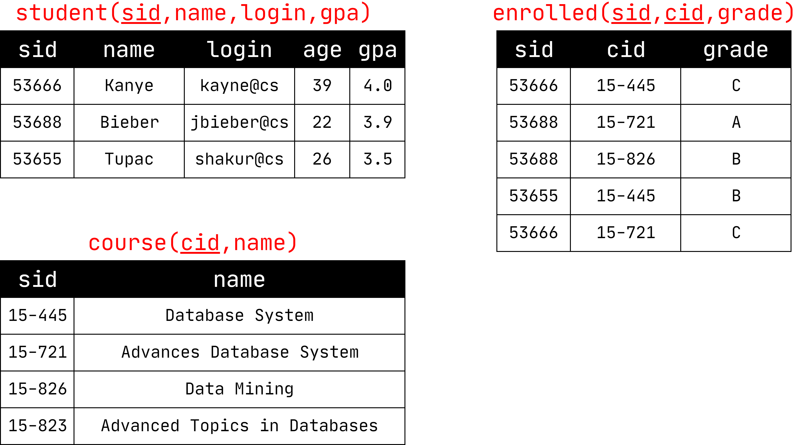
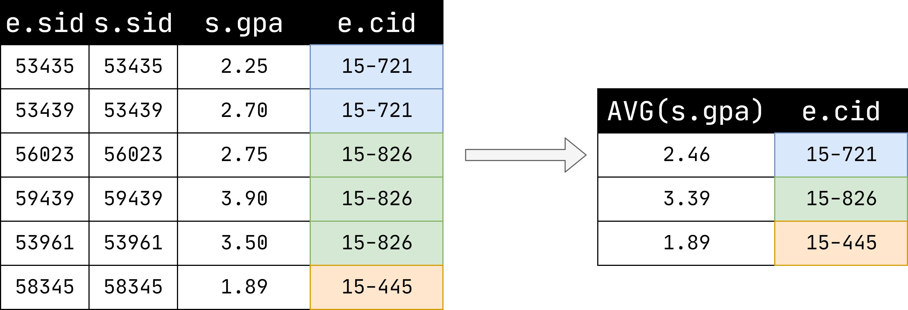

# 官方资源

[1]课程ppt :[02-advancedsql.pdf](notes/数据库/15445/ppt/02-advancedsql.pdf ':ignore')

[2]课程笔记 : [02-advancedsql.pdf](notes/数据库/15445/note/02-advancedsql.pdf ':ignore')

# SQL的历史

最新的SQL规范：2016

→ SQL:2016 → JSON, Polymorphic tables

→ SQL:2011 → Temporal DBs, Pipelined DML

→ SQL:2008 → TRUNCATE, Fancy sorting

→ SQL:2003 → XML, windows, sequences, auto-gen IDs.

→ SQL:1999 → Regex, triggers, OO  

大部分的DBMS都至少遵守`SQL-92`，因为制定SQL标准的人都来自各大SQL公司，都将自己公司产品的相关特性指定进去，慢慢的就没公司遵守。

各大数据库的详细对比：[http://troels.arvin.dk/db/rdbms/](http://troels.arvin.dk/db/rdbms/)

# 该笔记所用到的数据库模型

# 聚合函数

从一堆元组返回单个值得函数：

→ `AVG(col)`→ 返回所有值得平均值

→ `MIN(col)`→ 返回最小得行值

→ `MAX(col)`→ 返回最大得行值

→ `SUM(col)`→ 返回所有行值得总和

→ `COUNT(col)`→ 返回行数

?>  聚合函数只能在SELECT输出列表中使用

获取student表中login以"@cs"结尾的行数：

`SELECT COUNT(login) AS cnt FROM student WHERE login LIKE '%@cs'`

或

`SELECT COUNT(*) AS cnt FROM student WHERE login LIKE '%@cs'`

或

`SELECT COUNT(1) AS cnt FROM student WHERE login LIKE '%@cs'`

?>`COUNT` ,`SUM`, `AVG`支持DISTINCT

## 聚合之外的其他列的输出未定义

获取每门课的平均GPA:

SELECT AVG(s.gpa), `e.cid` FROM enrolled AS e ,student AS s WHERE e.sid = s.sid

# GROUP BY

将元组投影到子集中并针对每个子集计算聚合

SELECT AVG(s.gpa), e.cid FROM enrolled AS e, student AS s WHERE e.sid = s.sid `GROUP BY` e.cid 

?> SELECT输出子句中的非聚合值必须出现在GROUP BY子句中。
SELECT AVG(s.gpa), e.cid, `s.name` FROM enrolled AS e, student AS s WHERE e.sid = s.sid GROUP BY e.cid 中s.name为出现在GROUP BY子句中,故错误。

# HAVING

根据聚合计算过滤结果，就像GROUP BY的WHERE子句。

## 错误

SELECT AVG(s.gpa) AS avg_gpa, e.cid FROM enrolled AS e, student AS s WHERE e.sid = s.sid AND `avg_gpa > 3.9` GROUP BY e.cid 

## 正确

SELECT AVG(s.gpa) AS avg_gpa, e.cid FROM enrolled AS e, student AS s WHERE e.sid = s.sid GROUP BY e.cid `HAVING avg_gpa > 3.9`; 

# 字符串操作

|          | String  Case | String Quotes |
| :------: | :----------: | :-----------: |
| `SQL-92` | `Sensitive`  | `Single Only` |
| Postgres |  Sensitive   |  Single Only  |
|  MySQL   | Insensitive  | Single/Double |
|  SQLite  |  Sensitive   | Single/Double |
|   DB2    |  Sensitive   |  Single Only  |
|  Oracle  |  Sensitive   |  Single Only  |

## 字符串匹配

`LIKE`用于字符串匹配。

字符串匹配运算符:

`→ '%'` 匹配任意长度的字符串（包括空字符串） 

`→ '_'` 仅仅匹配一个字符

## 字符串拼接

SQL标准说要使用 `||` 将两个或多个字符串连接在一起

### SQL-92

SELECT name FROM student WHERE login = LOWER(name) `||` '@cs'  

### MSSQL

SELECT name FROM student WHERE login = LOWER(name)  `+`  '@cs'  

### MySQL

SELECT name FROM student  WHERE login = `CONCAT`(LOWER(name), '@cs')

# 输出重定向

将查询结果存储在另一个表中：

→尚未定义表

→已存在的表格，且具有相同的列数

## SQL-92

SELECT DISTINCT cid `INTO` CourseIds FROM enrolled;  

## MYSQL

CREATE TABLE CourseIds ( SELECT DISTINCT cid FROM enrolled);  

# 输出控制

## ORDER BY <column*> [ASC|DESC]  

通过一个或多个列中的值对输出元组进行排序。

SELECT sid, grade FROM enrolled WHERE cid = '15-721' `ORDER BY grade`

SELECT sid FROM enrolled WHERE cid = '15-721' `ORDER BY grade DESC, sid ASC`

## LIMIT \<count\> [offset] 

→ 限制输出元组的数量
→ 可以设置一个偏移

SELECT sid, name FROM student WHERE login LIKE '%@cs' `LIMIT 10  `

SELECT sid, name FROM student WHERE login LIKE '%@cs' `LIMIT 20 OFFSET 10  `

# 嵌套查询

包含其他查询的查询通常难以优化，内部查询可以（几乎）出现在查询中的任何位置。

获取14-445中所有学生的名字：

`STEP1` SELECT name FROM student WHERE ...  *...为选择14-445这门课学生的sid的集合*

`STEP2` ... → SELECT sid FROM enrolled WHERE cid = '15-445' 

`STEP3` SELECT name FROM student WHERE `sid IN ( SELECT sid FROM enrolled WHERE cid )`

## 操作符

`ALL`→ 必须满足子查询中所有行的表达式

`ANY`→ 在子查询中必须满足至少一行的表达式。

`IN`→ 类似于 '=ANY()' .

`EXISTS`→ 至少返回一行

 # 窗口函数

对一组相关的元组执行“滑动”计算。

像聚合一样，但元组不会分组为单个输出元组。

> SELECT ... ` FUNC-NAME(...) OVER (...) ` FROM tableName  
>
> `FUNC-NAME` : 汇总功能 、特殊功能
>
> `OVER `: 切分数据

## 汇总功能

我们之前讨论的任何内容

## 特殊功能

`→ ROW_NUMBER()`→ ROW_NUMBER()函数作用就是将select查询到的数据进行排序，每一条数据加一个序号，它不能用做于学生成绩的排名，一般多用于分页查询， 比如查询前10个 查询10-100个学生。

`→ RANK()`→ RANK()函数，顾名思义排名函数，可以对某一个字段进行排名，这里为什么和ROW_NUMBER()不一样那，ROW_NUMBER()是排序，当存在相同成绩的学生时，ROW_NUMBER()会依次进行排序，他们序号不同，而Rank()则不一样出现相同的，他们的排名是一样的。

## OVER

OVER关键字指定在计算窗口函数时如何将元组组合在一起。 使用PARTITION BY指定组

SELECT cid, sid, `ROW_NUMBER() OVER (PARTITION BY cid) `FROM enrolled ORDER BY cid 

# COMMON TABLE EXPRESSIONS  

提供一种编写用于较大查询的辅助语句的方法。

→可以将其视为仅用于一个查询的临时表。 嵌套查询和视图的替代方法。

`WITH` cteName` AS` ( SELECT 1 ) SELECT * FROM cteName  

您可以将输出列绑定到AS关键字之前的名称。

WITH cteName (`col1`, `col2`) `AS` ( SELECT 1, 2 ) SELECT `col1` + `col2` FROM cteName  