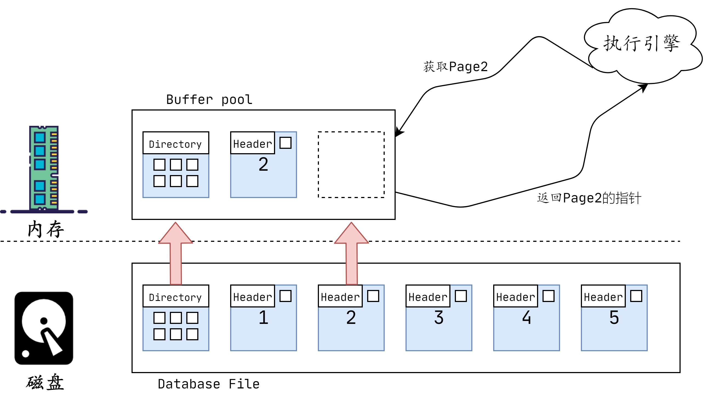
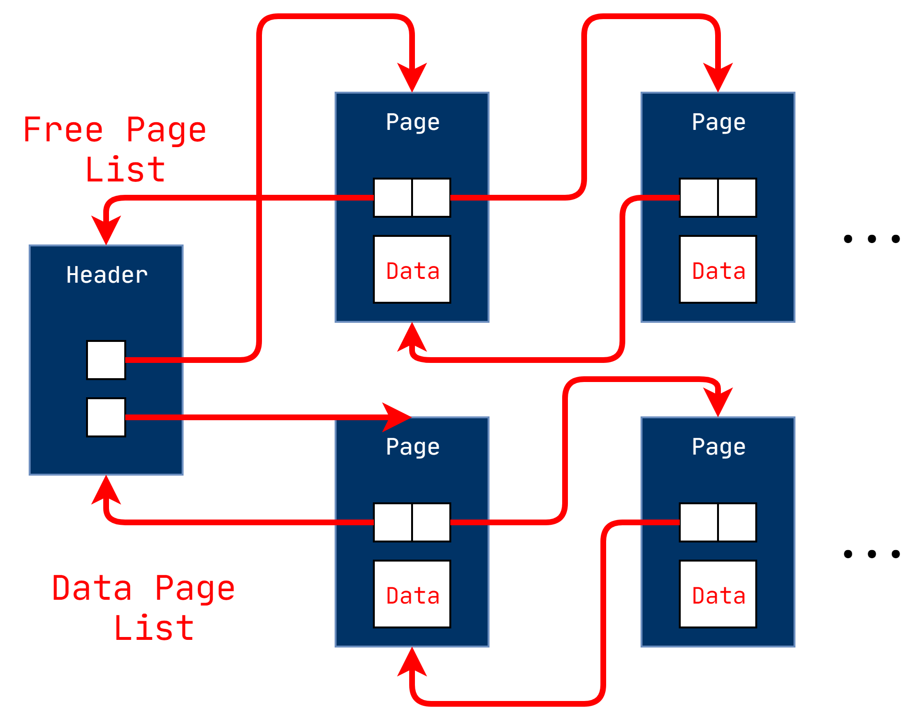
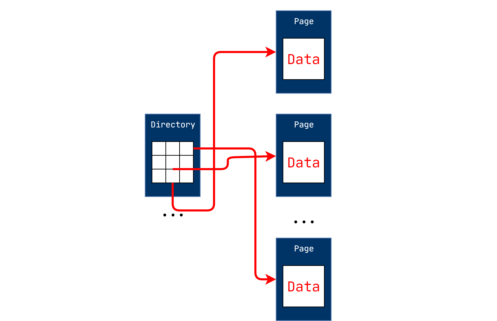
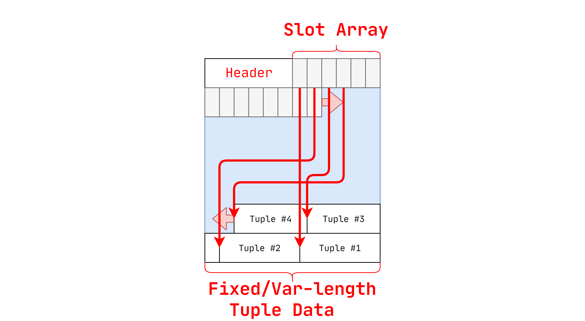

# 官方资源

[1]课程ppt : [03-storage1.pdf](notes/数据库/15445/ppt/03-storage1.pdf ':ignore')

[2]课程笔记 : [03-storage1.pdf](notes/数据库/15445/note/03-storage1.pdf ':ignore')

# 面向磁盘的DBMS

数据库全部在磁盘上，数据库文件中的数据被组织成页面，第一页是目录页面。 为了对数据进行操作，DBMS需要将数据带入内存。它通过具有一个缓冲池来实现此目的，该缓冲池管理着磁盘和内存之间的来回移动。 DBMS还具有将执行查询的执行引擎。 执行引擎将向缓冲池询问特定的页面，并且缓冲池将负责将该页面带入内存并为执行引擎提供指向内存中页面的指针。 当执行引擎在该内存上运行时，缓冲池管理器将确保页面在那里。

# DBMS与OS对文件移动的比较

DBMS的高级设计目标是支持超出可用内存量的数据库。由于对磁盘的读/写非常昂贵，因此必须仔细管理。 我们不希望由于从磁盘中获取某些东西而造成大的停滞，从而拖慢其他一切的速度。 因此，我们希望DBMS在等待从磁盘获取数据时能够处理其他查询。

这种高级设计目标就像虚拟内存一样，那里有很大的地址空间，并且OS可以从磁盘引入页面。

实现此虚拟内存的一种方法是使用mmap在进程地址空间中映射文件的内容，这使OS负责在磁盘和内存之间来回移动页面。 不幸的是，这意味着如果mmap遇到页面错误，这将阻止该过程 。

- 如果您需要编写，则永远不要在DBMS中使用mmap。
- DBMS（几乎）总是想自己控制事物，并且可以做得更好，因为它了解有关正在访问的数据和正在处理的查询的更多信息。
- 操作系统不是您的朋友。

通过下列可以使用OS提供的系统调用：

- madvise：在计划阅读某些页面时告知操作系统。
- mlock：告诉操作系统不要将内存范围交换到磁盘。
- msync：告诉操作系统将内存范围刷新到磁盘。

**由于正确性和性能原因，我们不建议在DBMS中使用mmap。**

即使系统将具有OS可以提供的功能，但让DBMS自己实施这些过程也可以使其具有更好的控制和性能。

# 文件存储

DBMS将数据库存储为磁盘上的一个或多个文件。

→操作系统对这些文件的内容一无所知。

不同的DBMS以不同的方式管理磁盘上文件中的页面。

→堆文件组织

→顺序/排序文件组织

→哈希文件组织

堆文件是页面的无序集合，其中元组以随机顺序存储。

→创建/获取/写入/删除页面

→还必须支持遍历所有页面

## Linked List  实现

在文件的开头维护一个头页面，该页面存储两个指针：

→空闲页面列表的HEAD。

→数据页列表的HEAD。

每个页面都跟踪其自身的可用插槽数

## Page Directory  实现

DBMS维护特殊页面，这些页面跟踪数据库文件中数据页面的位置。

该目录还记录每页的可用插槽数。

DBMS必须确保目录页面与数据页面同步。

# Page的布局

## Page Header

每个页面都包含有关页面内容的元数据的标头。

→页面大小

→校验和

→DBMS版本

→交易可见性

→压缩信息

对于任何页面存储体系结构，我们现在都需要了解如何组织存储在页面内部的数据。

→我们仍然假设我们仅存储元组。

## Tuple的存储

### 方案1

跟踪页面中元组的数量，然后在末尾附加一个新的元组。

### 方案2

最常见的布局方案称为分页页面。

插槽数组将“插槽”映射到元组的起始位置偏移量。

标头跟踪：

→已使用插槽的数量

→最后使用的插槽起始位置的偏移量

# Tuple的布局

每个元组均以包含有关元数据的标头为前缀。

→可见性信息（并发控制）

→NULL值的位图

我们不需要存储有关架构的元数据

属性通常以创建表时指定它们的顺序存储。

这样做是出于软件工程方面的原因。

