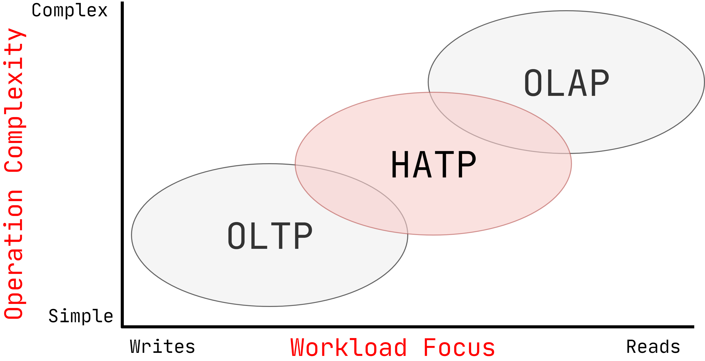

# 官方资源

[1]课程ppt : [04-storage2.pdf](notes/数据库/15445/ppt/04-storage2.pdf ':ignore')

[2]课程笔记 : [04-storage2.pdf](notes/数据库/15445/note/04-storage2.pdf ':ignore')

# 日志结构的文件组织

DBMS只存储日志记录，而不是在页面中存储元组。

系统将日志记录追加到有关如何修改数据库的文件中：

→插入存储整个元组。

→删除将元组标记为已删除。

→更新仅包含已修改属性的增量。

建立索引以使其跳至日志中的位置。

定期压缩日志。

# 数据表示

元组本质上是字节序列。

DBMS的工作是将这些字节解释为属性类型和值。

DBMS的目录包含有关表的模式信息，系统使用这些表来确定元组的布局。

`INTEGER`/`BIGINT`/`SMALLINT`/`TINYINT`

→ C/C++ 原生数据类型

`FLOAT`/`REAL` vs. `NUMERIC`/`DECIMAL`

→ IEEE-754 浮点数标准/ 定点小数

`VARCHAR`/`VARBINARY`/`TEXT`/`BLOB`

→ Header中含有长度信息, 后面跟着字节数组。

`TIME`/`DATE`/`TIMESTAMP`

→ 自Unix时代以来的32/64位整数（微秒）

## 可变精度数

使用 C / C ++原生的数据类型的不精确，精度可变的数字类型。

→例如：`FLOAT`，`REAL` /` DOUBLE`

按照IEEE-754的规定直接存储。

通常比任意精度的数字快，但可能会有舍入误差。

## 固定精度数

具有任意精度和小数位数的数值数据类型。 在无法接受舍入误差时使用。

→例如：`NUMERIC`，`DECIMAL`

通常以精确的，可变长度的二进制表示形式存储，并带有其他元数据。

→类似于`VARCHAR`，但不存储为字符串

### POSTGRES: NUMERIC  

实现类似于高精度加减法

## 超大数据

### OverFlow Page

大多数DBMS不允许元组超过单个页面的大小。

为了存储大于页面的值，DBMS使用单独的溢出存储页面。

→Postgres：TOAST（> 2KB）

→MySQL：溢出（> 1/2页大小）

→SQL Server：溢出（>页面大小）

### External File 

某些系统允许您将很大的值存储在外部文件中。

视为BLOB类型。

→Oracle：BFILE数据类型

→Microsoft：FILESTREAM数据类型

DBMS无法操纵外部文件的内容。

→没有耐用性保护。

→没有交易保护。

# 系统目录

DBMS在其内部目录中存储有关数据库的元数据。

→表，列，索引，视图

→用户，权限

→内部统计

几乎每个DBMS都会自己存储数据库的目录。

→将对象抽象包装在元组周围。

→用于“引导”目录表的专用代码。

您可以查询DBMS的内部`INFORMATION_SCHEMA`目录以获取有关数据库的信息。

→ANSI标准的只读视图集，可提供有关数据库中所有表，视图，列和过程的信息

DBMS还具有非标准的快捷方式来检索此信息。

# 存储模型

关系模型没有指定我们必须将所有元组的属性一起存储在单个页面中。

对于某些workloads (工作情况)，这实际上可能不是最佳的布局

## OLTP  

On-line Transaction Processing (联机事务处理)，简单查询，读取/更新与数据库中单个实体有关的少量数据。

## OL AP  

On-line Analytical Processing(联机分析处理)，复杂查询读取跨多个实体的数据库的大部分内容。

## N-ARY  存储模型

DBMS在页面中连续存储单个元组的所有属性。

OLTP工作负载的理想选择，在这些工作负载中查询往往只对单个实体进行操作并插入大量工作负载。

## DECOMPOSITION 存储模型

DBMS在页面中连续存储所有元组的单个属性的值。

→也称为“列存储”

### 元组ID

选择1：固定长度的偏移

→每个值的属性长度相同。

选择2：嵌入式元组ID

→每个值及其元组ID存储在列中

