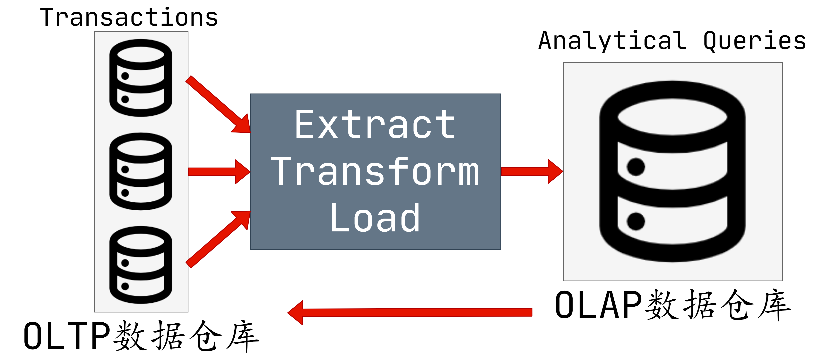
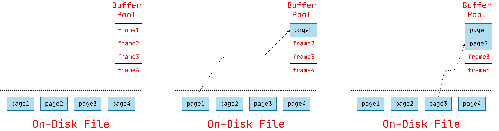
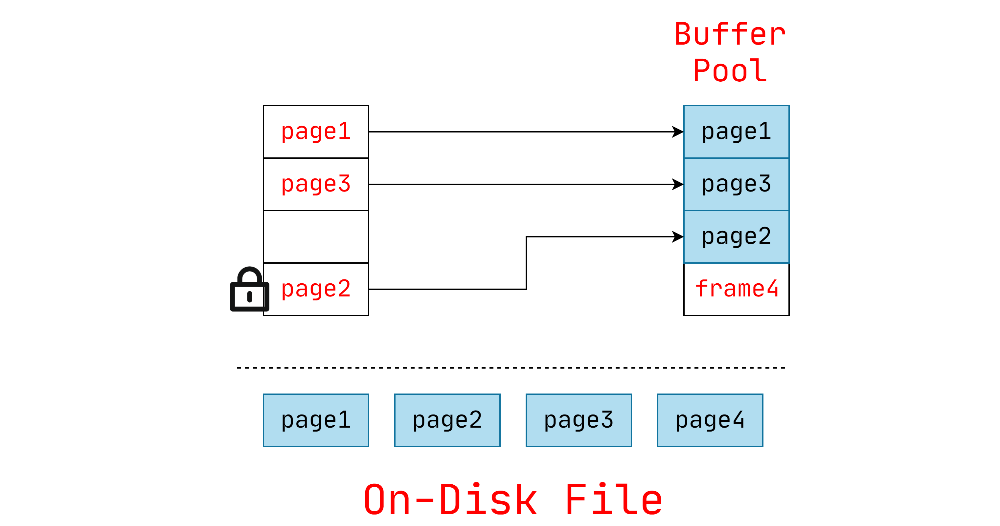
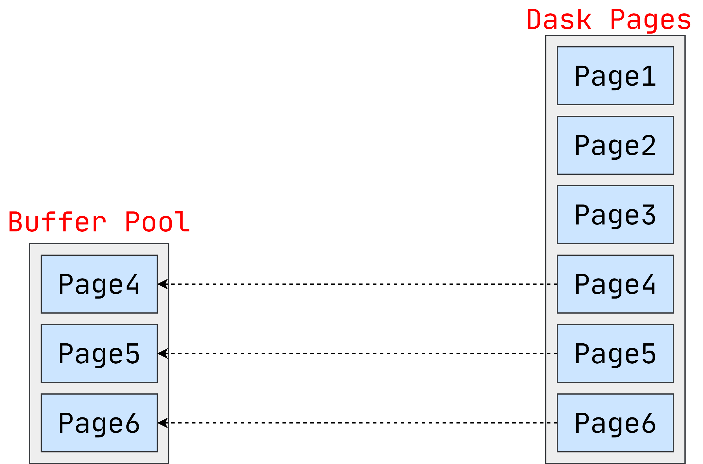
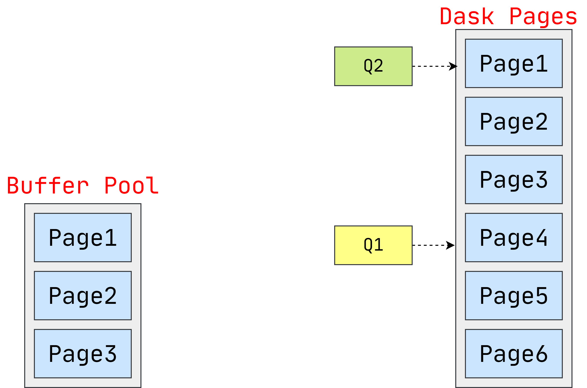

# 官方资源

[1]课程ppt : [05-bufferpool.pdf](notes/数据库/15445/ppt/05-bufferpool.pdf ':ignore')

[2]课程笔记 : [05-bufferpool.pdf](notes/数据库/15445/note/05-bufferpool.pdf ':ignore')

# 双重环境

前端采用OLTP型数据库，负责数据的查询、修改。后端采用OLAP型数据库，负责数据的分析。

# Buffer Pool Manager  

## Buffer Pool 组织

内存区域组织为固定大小的页面数组。

数组条目称为**frame**。

当DBMS请求页面时，将精确的副本放置在这些frame之一中。

## Buffer Pool元数据

**page table**跟踪当前在内存中的页面。

每页还维护其他元数据：

→Dirty Flag 

→Pin/Reference 计数器

## LOCKS VS LATCHES  

在讨论DBMS如何保护其内部元素时，我们需要在`LOCKS`和`LATCHES`之间进行区分。

LOCKS：

→保护数据库的逻辑内容免受其他事务的影响。

→保持事务持续时间。

→需要能够回滚更改。

LATCHES：

→保护DBMS内部数据结构的关键部分免受其他线程的攻击。

→保持操作时间。

→不需要能够回滚更改。

## PAGE TABLE VS PAGE DIRECTORY  

`PAGE DIRECTORY `是从页面ID到数据库文件中页面位置的映射。

→所有更改都必须记录在磁盘上，以便DBMS在重新启动时能够找到。

`PAGE TABLE`是在缓冲池帧中从页ID到页副本的映射。

→这是一个内存中的数据结构，不需要存储在磁盘上。

## 分配策略

`Global Policies`:  

→为所有活动的查询事务做出决策。

`Local Policies`:  

→将帧分配给特定的查询事务，而不考虑并发查询事务的行为。

→仍然需要支持共享页面。

## BUFFER POOL  优化

### 多个Buffer Pool

对于整个系统，DBMS并不总是具有单个缓冲池。

→多个缓冲池实例

→每个数据库的缓冲池

→每页类型缓冲池

帮助减少`LATCHES`争用并改善局部性

### 预读

DBMS还可以根据查询计划预取页面。

→顺序扫描

→索引扫描

### 扫描共享

当第二次查询会用到查询一中的数据时，会共享Buffer Pool中的数据。

# 更换策略

## CLOCK更换策略 

类似于LRU，而无需每页单独的时间戳。

→每个页面都有一个参考位。

→访问页面时，设置为1。

使用“时针”将页面组织在循环缓冲区中：

→扫描时，检查页面的位是否设置为1。

→如果是，则设置为零。 如果否，则逐出。

LRU和CLOCK替换策略容易受到顺序泛洪的影响。

→查询执行顺序扫描，读取每个页面。

→这样会污染读取页面的缓冲池

一次又一次。 最近使用的页面实际上是最不需要的页面。