# 官方资源

[1]课程ppt : [06-hashtables.pdf](notes/数据库/15445/ppt/06-hashtables.pdf ':ignore')

[2]课程笔记 : [06-hashtables.pdf](notes/数据库/15445/note/06-hashtables.pdf ':ignore')

# Hash Tables  

哈希表实现了将键映射到值的无序关联数组。它使用哈希函数为给定键计算数组的偏移量，从该偏移量可以
可以找到值。

空间复杂度：`O(n)`

操作复杂度：

→平均：`O(1)`

→最差：`O(n)`

## Static Hash Tables

分配一个巨大的数组，该数组为您需要存储的每个元素分配一个插槽。

要查找条目，请通过`%n`以找到数组中的偏移量

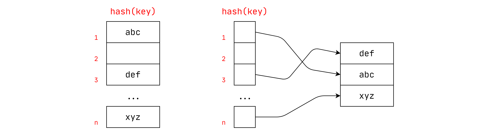

## 前提

您会提前知道元素的数量

每个键都是唯一的

最完美的的哈希函数：

→ 如果`key1` ≠ `key2`，则 `hash(key1)` ≠ `hash(key2)`

# Hash Funcations

对于任何输入key，返回该key的对应的整数。
我们不想对DBMS哈希表使用加密哈希函数。而且我们想要快速且碰撞率低的Hash算法。

[CRC-64](https://create.stephan-brumme.com/crc32/) (1975)

→ 在网络中用于错误检测

[MurmurHash](https://github.com/aappleby/smhasher) (2008)

→ 设计用于快速通用哈希函数

[Google CityHash](https://github.com/google/cityhash) (2011)

→ 设计为了较短的key(<64 bytes).

[Facebook XXHash](http://cyan4973.github.io/xxHash/) (2012)

→ 来自zstd压缩的创建者

[Google FarmHash](https://github.com/google/farmhash) (2014)

→ 较新版本的CityHash具有更低的冲突率

> 其中`XXHash`表现是最好的

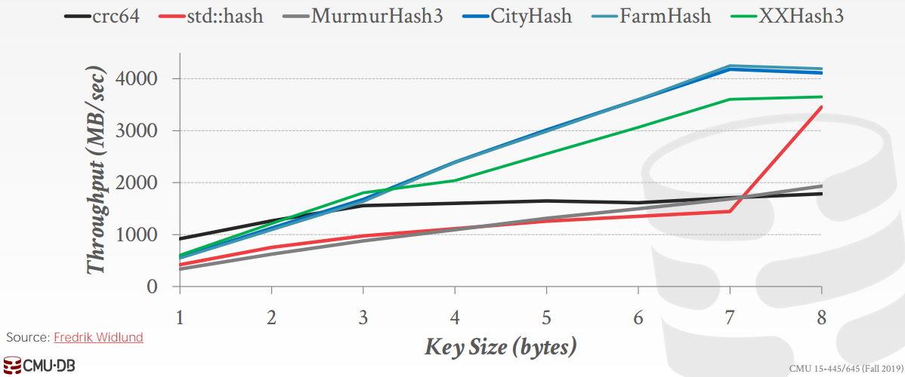

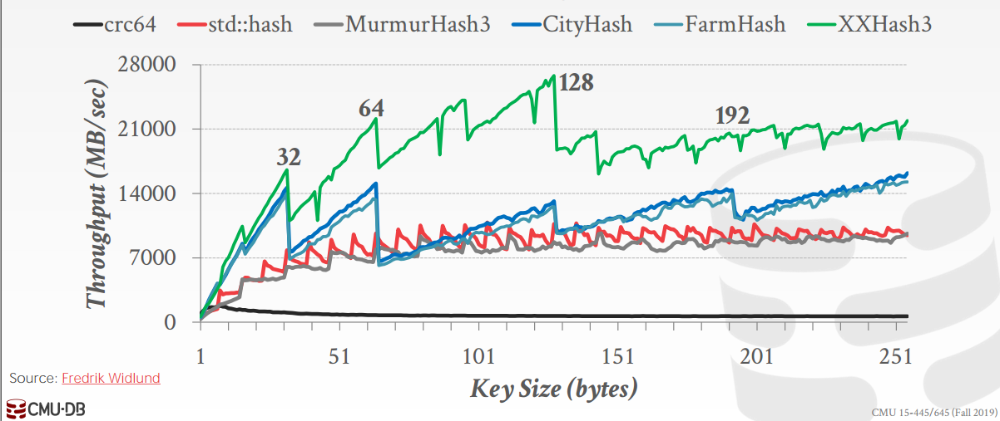

# 静态哈希方案

## 开放地址Hash

### 插入

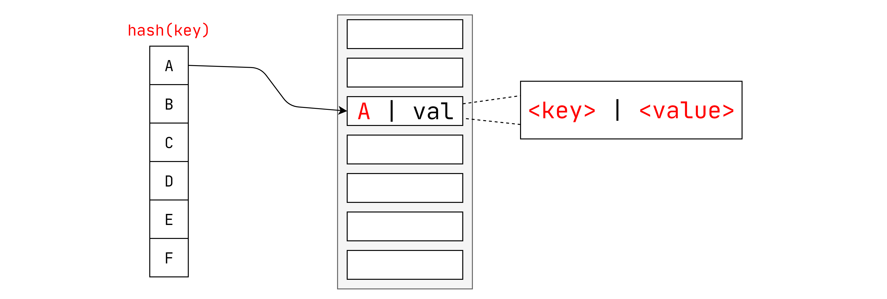

### 解决冲突

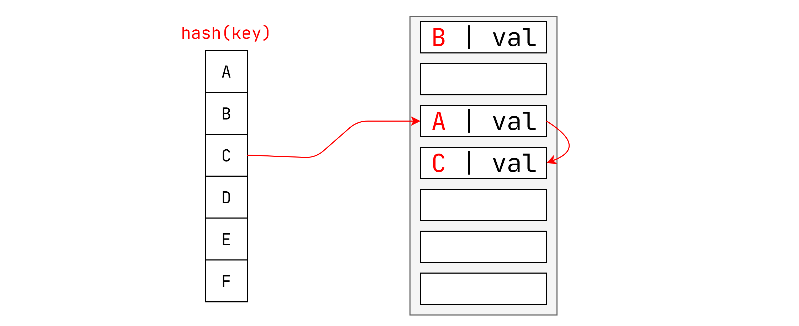

### 删除

#### 设置墓碑

如图想要删除C，避免当C被删除找不到D，需要在C的位置上设置一个标志（墓碑`⚰`）。

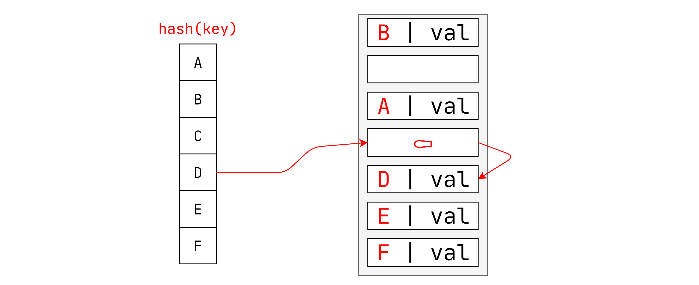

#### 移动

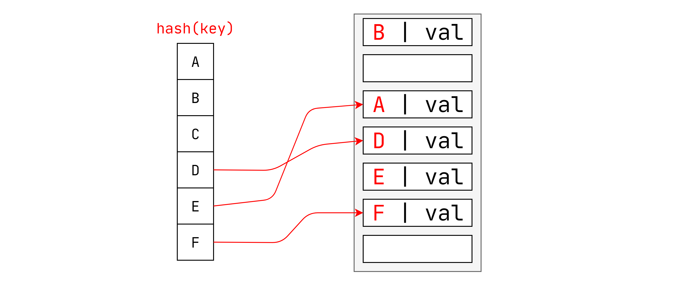

### 非唯一性索引

选择1：单独的链表

→将每个键的值存储在单独的存储区中。

选择2：冗余密钥

→将重复的键条目存储在哈希表中。

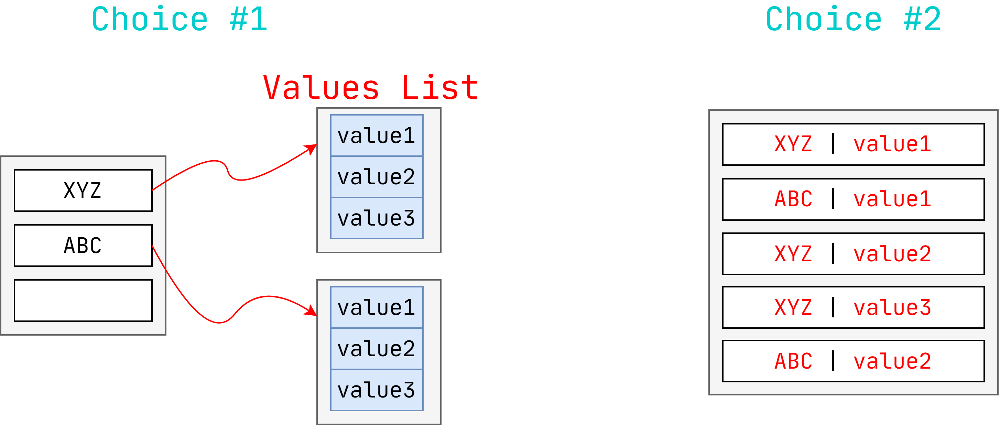

## 罗宾汉Hash

线性探针哈希的变体，可从`“rich”`的`key`中窃取插槽并将其分配给`“poor”`的`key`。

→每个键从表中的最佳位置开始跟踪它们的位置数。

→插入时，如果第一个`key`比第二个`key`更远离其最佳位置，则一个`key`会占用另一个`key`的插槽。

### 插入

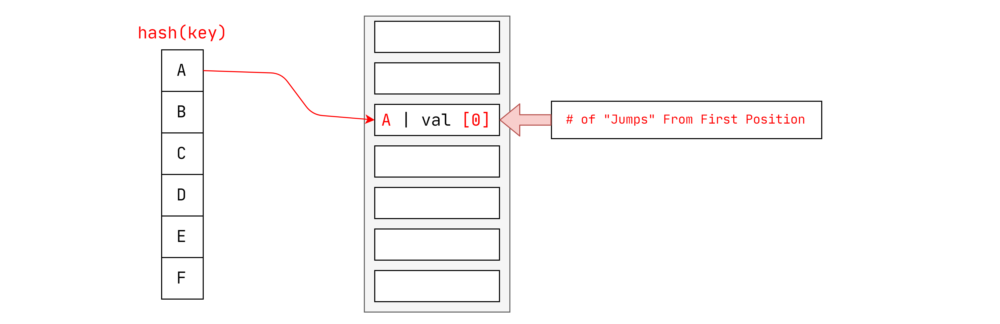

### 解决冲突

#### 寻找插槽

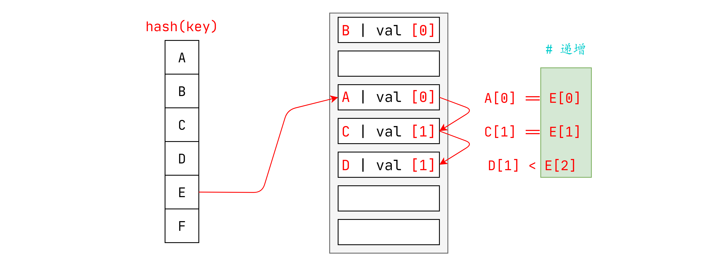

#### 调整位置

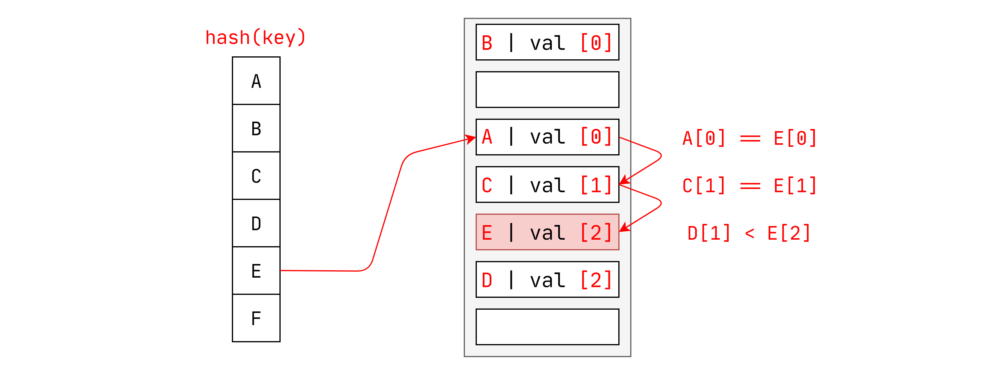

## 布谷鸟Hash

将多个哈希表与不同的哈希函数seed一起使用。

→在插入时，检查每张table并选择有空位的任何一个槽。

→如果没有表具有可用空间，请从其中一个表中逐出该元素，然后将其重新哈希以找到新位置。

查找和删除始终为O（1），因为每个哈希表仅检查一个位置。

### 插入

#### 有两个空位

随便选择一个

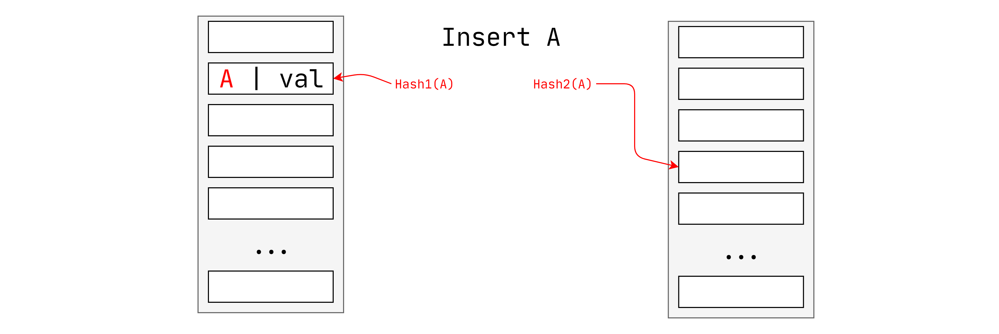

#### 有一个空位

插入到空位中

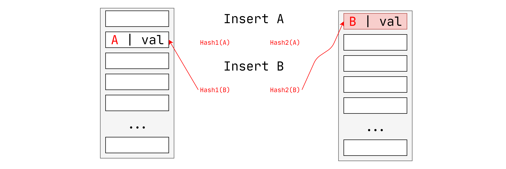

### 解决冲突

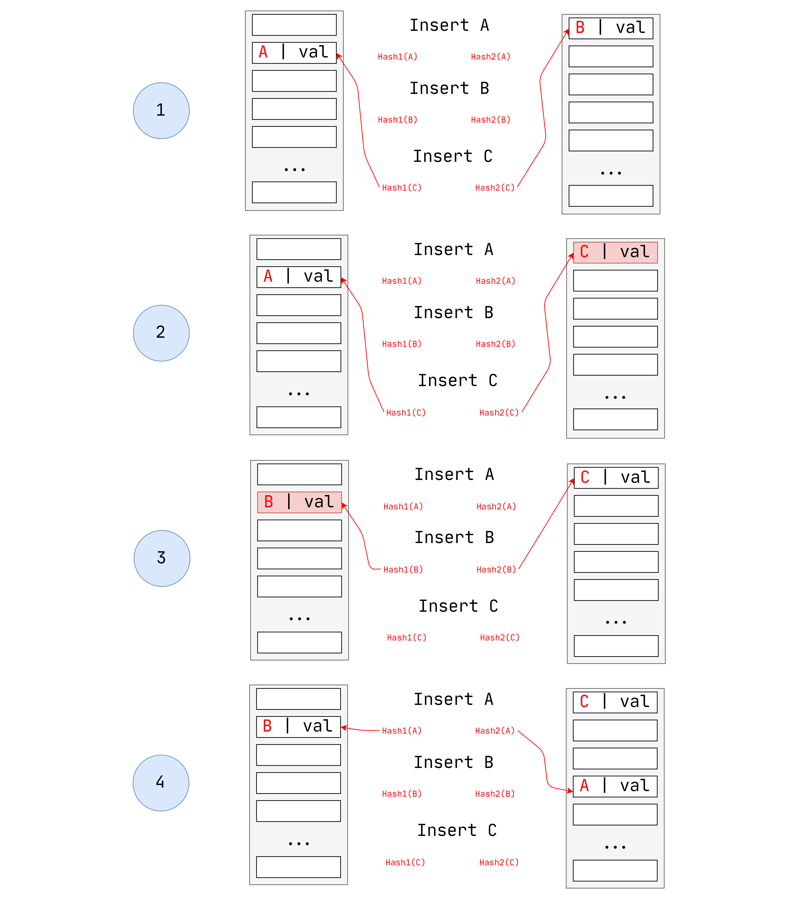

## 动态哈希方案

先前的哈希表要求DBMS知道其要存储的元素数量

→否则，如果需要增加/缩小大小，它将重建表

动态哈希表可根据需要调整大小

→链式散列

→可扩展哈希

→线性散列

### 链式Hash  

维护哈希表中每个插槽的存储桶的链表

通过将具有相同哈希键的所有元素放入同一存储桶中来解决冲突

→要确定是否存在某个元素，请哈希到其存储桶并对其进行扫描

→插入和删除是查找的概括

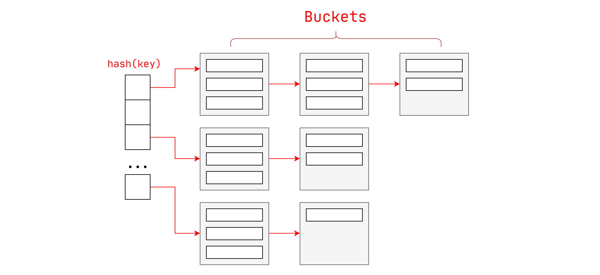

对于链式Hash，如果没有空间剩余，将会分配overflow buckets, 用链表把它们连接起来。（长的链表降低了性能）

### 可扩展Hash

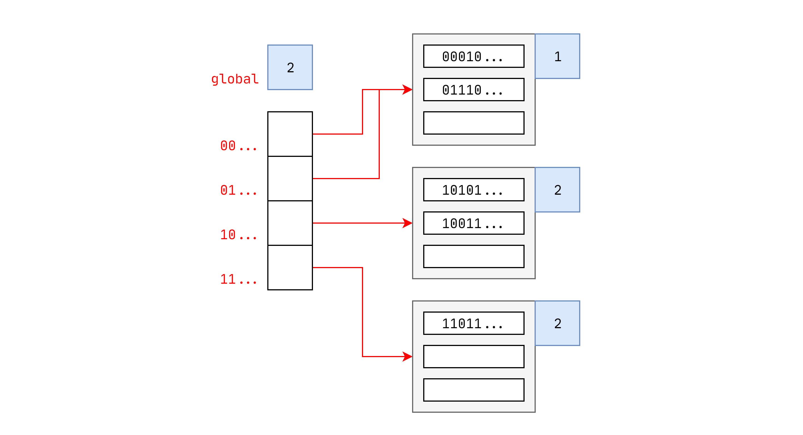

#### 查找

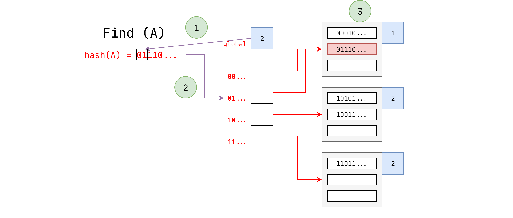

#### 插入

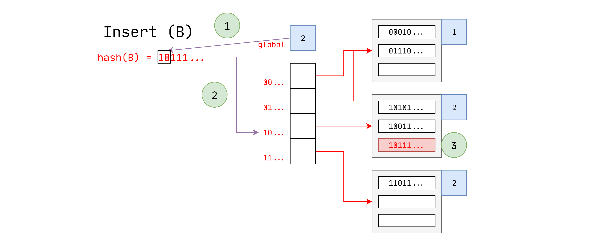

#### 解决冲突

### 线性Hash

线性Hash相较于可扩展Hash最大不同就是，在可扩展Hash中遇到`OverFlow`需要将数组翻倍。而线性Hash只需要分裂`Split`指针指向的`Bucket`。

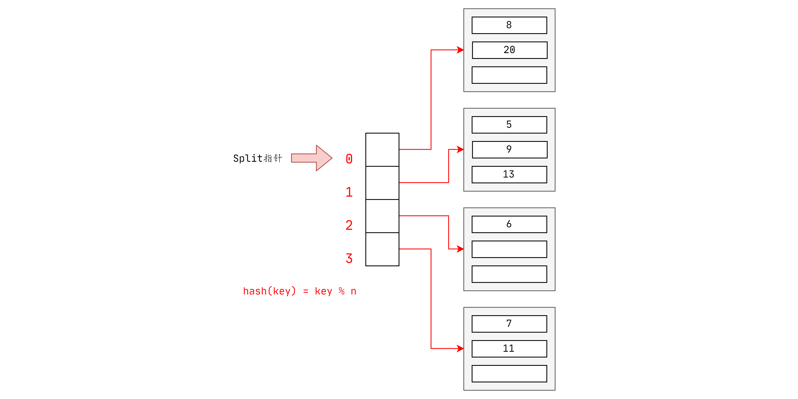

#### 解决冲突

可见在发生`OverFlow`时，并不会拆分发生溢出的`Buckets`，而是拆分`Split`指针指向的值。

#### 查找

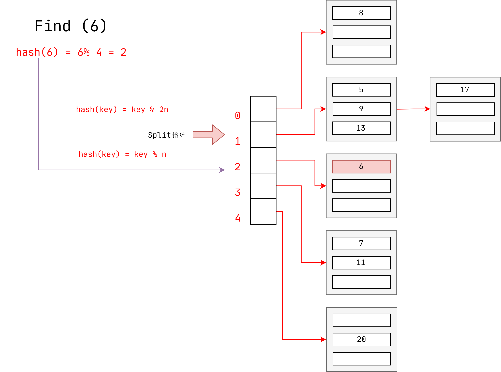

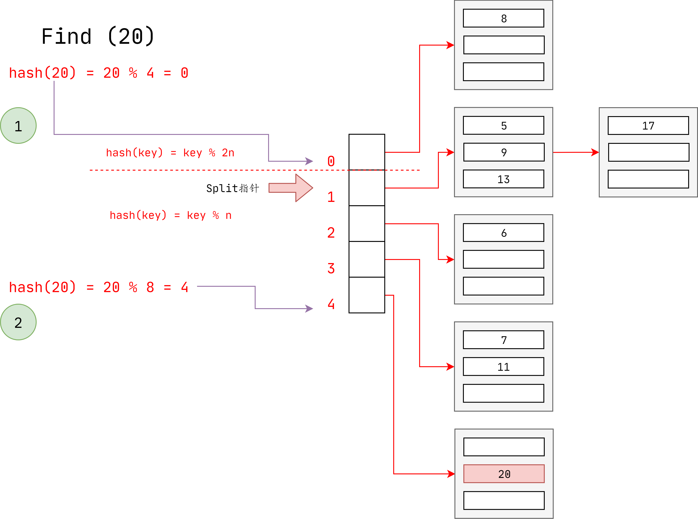