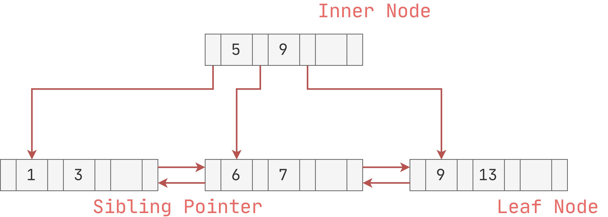
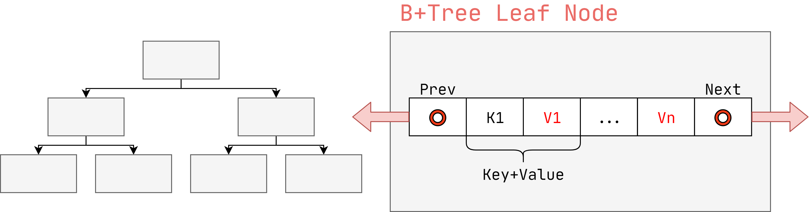

# 官方资源

[1]课程ppt : [07-trees1.pdf](notes/数据库/15445/ppt/07-trees1.pdf ':ignore')

[2]课程笔记 : [07-trees1.pdf](notes/数据库/15445/note/07-trees1.pdf ':ignore')

# Tree Indexes I 

构建索引的另一种方式就是通过Tree。

# B+ Tree

有一个称为B树的特定数据结构。

人们还使用该术语来泛指一类平衡树数据结构：

→ **B-Tree** (1971)

→ **B+Tree** (1973)

→ **B\*Tree** (1977?)

→ **B^link-Tree** (1981)

## 相关资料

**关于B树及B+树可以通过以下两篇文章了解：**

漫画：什么是B-树？[https://juejin.im/post/5c31f64c6fb9a049ac794ffc](https://juejin.im/post/5c31f64c6fb9a049ac794ffc)

漫画：什么是B+树？[https://mp.weixin.qq.com/s/jRZMMONW3QP43dsDKIV9VQ](https://mp.weixin.qq.com/s/jRZMMONW3QP43dsDKIV9VQ)

**同时可以借助以下两个可视化工具帮助你理解：**

B-树可视化工具：[https://www.cs.usfca.edu/~galles/visualization/BTree.html](https://www.cs.usfca.edu/~galles/visualization/BTree.html)

B+树可视化工具：[https://www.cs.usfca.edu/~galles/visualization/BPlusTree.html](https://www.cs.usfca.edu/~galles/visualization/BPlusTree.html)

**关于他们的实现代码可以查看：**

B-Tree/BTree 的Java实现：[https://www.jianshu.com/p/d2d1181aa93d](https://www.jianshu.com/p/d2d1181aa93d)

B+Tree的Java实现：[https://github.com/linli2016/BPlusTree](https://github.com/linli2016/BPlusTree)

## 举例：B+ Tree

构成1：

构成2：

## 节点

每个B + Tree节点都由一组键/值对组成。

→键是从索引所基于的属性派生的。

→根据节点是内部节点还是叶节点，值将有所不同。

数组通常按排序的键顺序保存

### 叶子节点

`Key`与`Value`连续存储：

但是节点的长度不是固定的，所以可以采用以下布局：

### 节点值

- 存储ID

指向索引条目对应的元组位置的指针。

采用该方案的厂商有：`PostgreSQL`、`SQL Server`、`DB2`、`ORACLE`等

- 存储Tuple

元组的实际内容存储在叶节点中，二级索引必须将记录id作为其值存储。

采用该方案的厂商有：`SQLite`、`SQL Server`、`MySQL`、`ORACLE`等

# B树的设计

## 节点大小

存储设备的速度越慢，B + Tree的最佳大小就越大。

→ HDD ~1MB

→ SSD: ~10KB 

→ In-Memory: ~512B

最佳大小可能因工作量而异

→叶节点扫描与从根到叶的遍历

## 合并阈值

一些DBMS在半满时并不总是合并节点。

延迟合并操作可能会减少重组量。

最好让下溢存在，然后定期重建整个树。

## 可变长度的Key

- 方案1：`Pointer` 

  将键存储为元组属性的指针

- 方案2：`Variable Length Nodes`

  索引中每个节点的大小可能会有所不同。需要仔细的内存管理。

- 方案3：`Padding`

  始终将密钥填充为密钥类型的最大长度。

- 方案4：` Key Map / Indirection`

可以保存Key的首字母，加快匹配速度：

## 非唯一索引

方法1：重复的Key

→使用相同的叶节点布局，但多次存储重复的密钥。

方法2：值列表

→每个Key仅存储一次，并维护唯一值的链接列表

## 搜索

方法1：线性

→从头到尾扫描Key

方法2：二分查找

→跳至中间Key，向左/向右调整根据比较

方法3：插值

→基于已知的Key分布，推断所需Key的大概位置。

# 优化

## 前缀压缩

同一叶节点中的已排序键可能具有相同的前缀。

不必每次都存储整个密钥，而是提取公共前缀并为每个密钥仅存储唯一的后缀。

## 后缀截断

内部节点中的Key仅用于“直接流量”。

→我们不需要整个密钥。

存储将探针正确路由到索引所需的最小前缀。

## 批量插入

建立B + Tree的最快/最佳方法是首先对键进行排序，然后从下至上建立索引。

**Keys: 3, 7, 9, 13, 6, 1**

**Sorted Keys: 1, 3, 6, 7, 9, 13**

## POINTER SWIZZLING

节点使用页面ID来引用索引中的其他节点。 在遍历期间，DBMS必须从页表中获取内存位置。

如果将页面固定在缓冲池中，那么我们可以存储原始指针而不是页面ID。 这样可以避免从页表中查找地址。