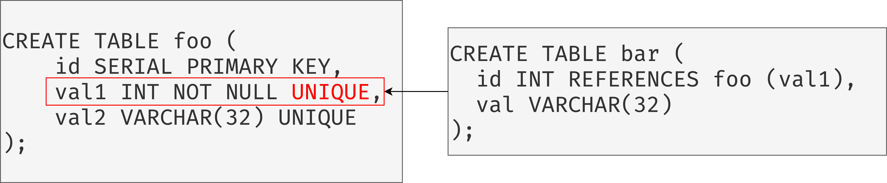

# 官方资源

[1]课程ppt : [08-trees2.pdf](notes/数据库/15445/ppt/08-trees2.pdf ':ignore')

[2]课程笔记 : [08-trees2.pdf](notes/数据库/15445/note/08-trees2.pdf ':ignore')

# Tree Indexes II

## 重复的key

### 方案1:追加 Record Id

将元组的唯一Record ID作为键的一部分，确保所有键都是唯一的。

DBMS仍然可以使用部分键来查找元组。

### 方案2:Overflow Leaf Nodes

允许叶节点溢出到包含重复key的溢出节点中。维护和修改起来比较复杂。

且查找时不能采用二分查找，应该为顺序查找。

## 隐式索引

大多数DBMS会自动创建一个索引来强制执行完整性约束。

→ Primary Keys

→Unique Constraints

但是引用约束（外键）没有。

正确做法：

## 部分索引

在整个表的子集上创建索引。 这可能会减少其大小和维护它的开销。

一种常见的用例是按日期范围对索引进行分区。

→ 每月，每年创建一个单独的索引

## 覆盖索引

如果处理查询所需的所有字段都在索引中可用，则DBMS不需要检索元组。

这样可以减少对DBMS缓冲池资源的争用。

## INDEX INCLUDE COLUMNS

在索引中嵌入其他列以支持仅索引查询。 

这些额外的列仅存储在叶节点中，而不是搜索键的一部分

## FUNCTIONAL/EXPRESSION INDEXES

列上进行了函数运算，添加常规索引是查询的时候是扫描不到的，因此需要将函数参数运算建立索引。

参考资料：[https://www.cnblogs.com/lynn919/p/10875081.html](https://www.cnblogs.com/lynn919/p/10875081.html)

## TRIE INDEX

使用key的逐个检查前缀，而不是比较整个key。

### 1-bit Span Trie

K10 -> 00000000 00001010

K25 -> 00000000 00011001

K31 -> 00000000 00011111

### Radix Tree

