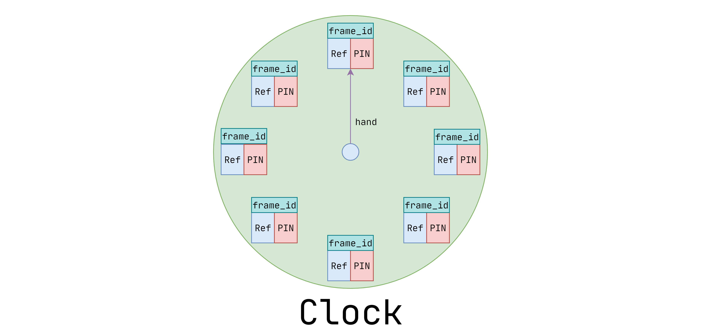
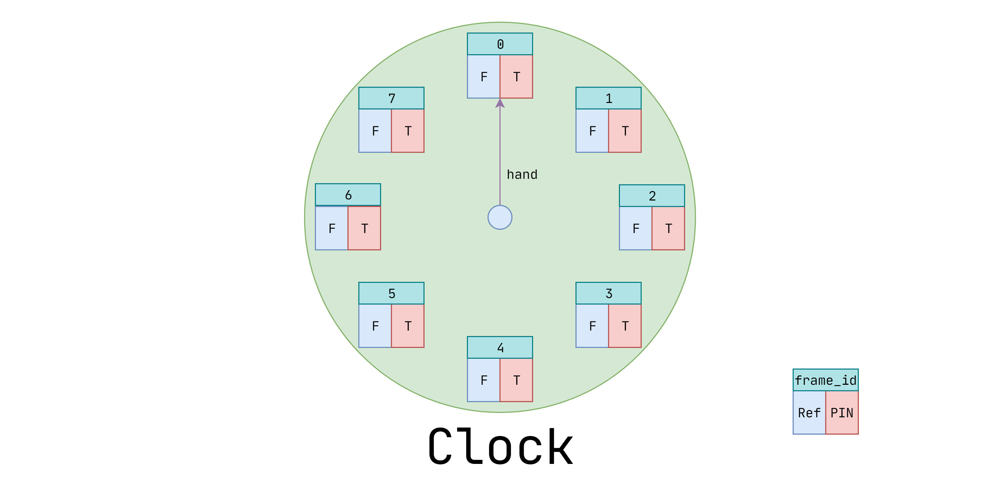
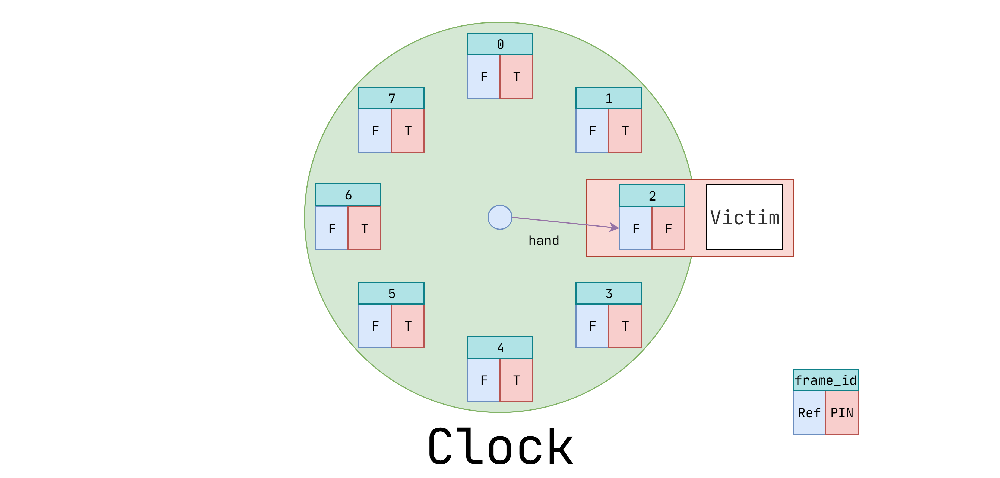
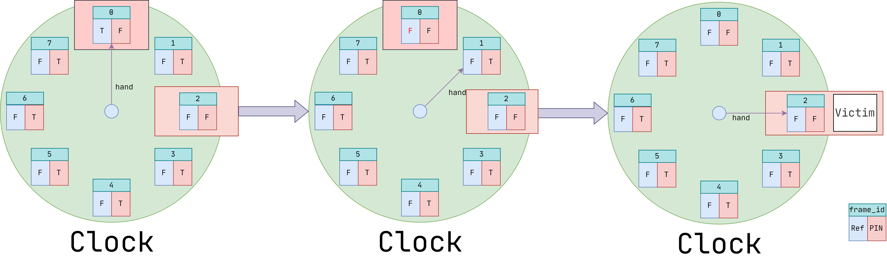
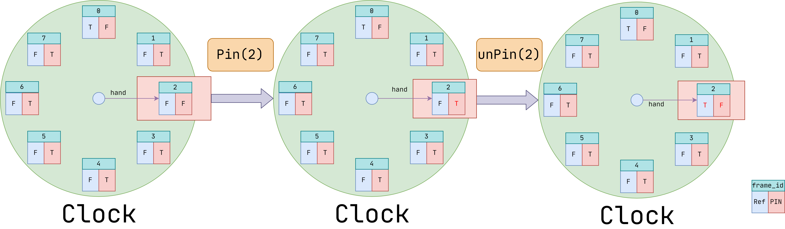
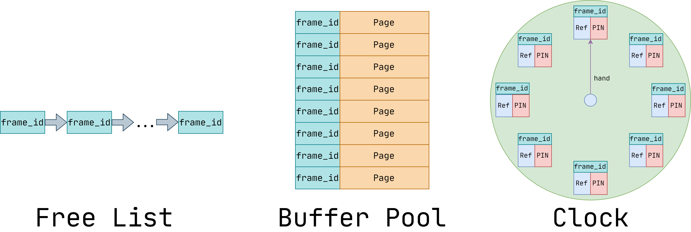
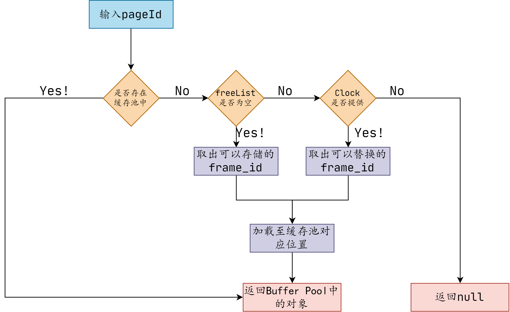
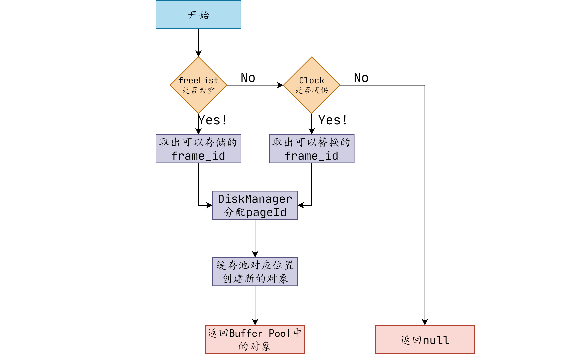
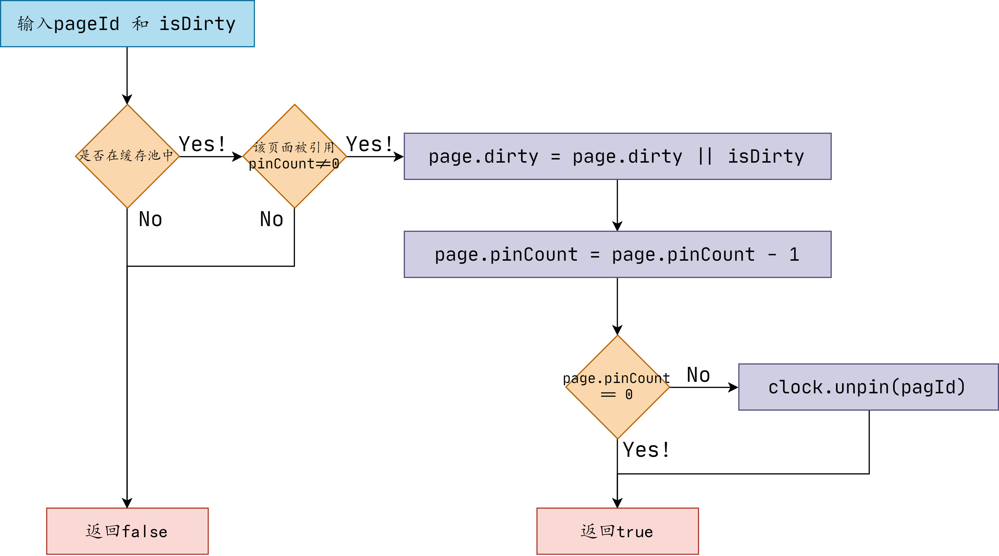

# Lab1 Buffer Pool

## 时钟更换策略

### 时钟的组成

对于单个`frame`应当有以下三部分组成：`frame_id`、`Ref`、`PIN`。

`frame_id`：唯一确定id，与buffer pool相对应。

`Ref`：该`frame`最近是否使用过。使挑选的`frame`尽量是很久之前使用的（类似与LRU）

`PIN`：该`frame`是否正在使用。

?> 注：该时钟不包含任何`page`信息，真正的`page`是存储在`buffer pool`。该时钟只是在`buffer pool`满了后，`buffer pool manager`希望加载新的`page`时，为其提供可以替换的`frame_id`。

### 时钟的初始化

`frame_id`：初始化`0`-`X-1`,`X`代表`buffer pool`中能存储`Page`的数量。

接下来两个元素的初始化，我们就要先要知道时钟使用的时机：**所有的buffer pool都加载了Page**，加载一个Page那对应的`PIN`必然是`true`，若Page的使用还未结束那么`Ref`的初始化应当为`false`。

`Ref`：上述分析，`false`

`PIN`：上述分析，`true`

### Victim

Victim(受害者)，方法名很有意思。就在`buffer pool`满了时，`buffer pool manager`希望加载新的`page`时，为其提供可以替换的`frame_id`。

首先我们要知道我们要找什么样的受害者：`PIN`为`false`、`Ref`也为`false`。代表现在不在使用，且最近未被使用。

`hand`是时钟的指针，它顺时针旋转，便可以发现可以被移除的`frame`。

如果`hand`扫描一圈发现所有的`PIN`都是`true`的话，就代表所有的`page`都在被使用，就无法加载新的`page`进`buffer pool`，便返回`false`。如Clock刚初始化的时候：

还有一个问题，就是我说的在`PIN`都是`true`时才找不到，但是我们要找的确是`PIN`和`Ref`都为`false`的情况。那是因为Ref是可以改变的，当时针扫描过一个`frame`时，若它的`PIN`是`false`，且`Ref`为true，那此时便将`Ref`变为`false`。

### PIN

PIN(固定方法)则是代表，该`frame`中存储的`page`正在使用，不能将其移除（`PIN` = `true`）。

### UNPIN

UNPIN(取消固定方法)则是代表，该`frame`中存储的`page`正在使用，可以将其移除（`PIN` = `false`），同时该`frame`刚被使用过（`Ref` = `false`）。

##  缓冲池管理器

### 管理器的组成

由三部分组成`Buffer Pool` 、` Clock `、 `Free List`。他们分别的作用：

`Buffer Pool`：用来存储`Page`

`Free List`：目前`Buffer Pool`中有那几个地方没有加载`Page` 

`Clock`：在`Free List`为空时（`Buffer Pool`加载满时），提供可以移除的受害者。

### FetchPage

FetchPage(获取page)，若在Buffer Pool中，直接返回对象。若不在，则从磁盘中加载后返回对象。

### NewPage

### Page的结构

`pageId`：`Page`唯一的唯一标识，决定其存储位置。

`pinCount`：正在被多少线程使用。

`dirty`：内容是否修改

`Data`：存储在磁盘上的数据

### UnpinPage

