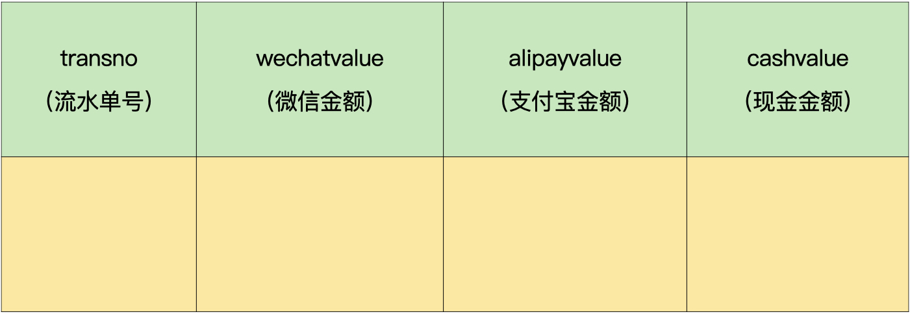

# 表太大了，如何设计才能提高性能？

你好，我是朱晓峰。

随着数据量的不断增加，表会变得越来越大，查询的速度也会越来越慢。针对这种情况，该怎么处理呢？

咱们上节课学习的优化查询语句是一种方法，不过它并不足以解决所有问题。如果表的设计不合理，会导致数据记录占用不必要的存储空间。

MySQL 在存取数据时，并不是一条条去处理的，而是会按照固定大小的页进行处理，如果数据记录占用了不必要的存储空间，就会导致一次读入的有效数据很少。那么，无论怎么改写语句，都无法提升这步操作的效率。这个时候，对表的设计进行优化，就是必不可少的了。

所以，今天，我就给你介绍一下怎么通过优化数据类型、合理增加冗余字段、拆分表和使用非空约束等方法，来改进表的设计，从而提高查询性能。

## 数据类型优化 

**在改进表的设计时，首先可以考虑优化字段的数据类型**。下面我就来讲解 2 种方法，一种是针对整数类型数据，尽量使用小的整数类型来定义；另外一种是，如果字段既可以用文本类型，也可以用整数类型，尽量使用整数类型。

**先说第一种方法，对整数类型数据进行优化。**

在[第 2 讲](第 2 讲)中，我建议你，遇到整数类型的字段可以用 INT 型。这样做的理由是，INT 型数据有足够大的取值范围，不用担心数据超出取值范围的问题。刚开始做项目的时候，首先要保证系统的稳定性，这样设计字段类型是可以的。

但是，随着你的经验越来越丰富，参与的项目越来越大，数据量也越来越多的时候，你就不能只从系统稳定性的角度来思考问题了，**还要考虑到系统整体的效率**。

这是因为，在数据量很大的时候，数据类型的定义，在很大程度上会影响到系统整体的执行效率。这个时候，你就必须同时考虑稳定性和效率。

**第 2 种优化方法，就是既可以使用文本类型也可以使用整数类型的字段，要使用整数类型，而不要用文本类型**。

跟文本类型数据相比，大整数往往占用更少的存储空间，因此，在存取和比对的时候，可以占用更少的内存。所以，遇到既可以使用文本类型，又可以使用整数类型来定义的字段，尽量使用整数类型，这样可以提高查询的效率。

接下来，我就结合超市项目的案例来讲解下具体的优化方法。

在这个项目中，我们有一个 400 万条记录的流水数据。为了方便你理解，这里我只保留 2 个字段，分别是商品编号字段 itemnumber 和流水唯一编号字段 transuniqueid。流水唯一编号用于在系统中唯一标识一条流水。

为了对比方便，我创建了 2 个表 demo.test 和 demo.test1：

- 在 demo.test 的表中，我给商品编号设定的数据类型是 INT，给流水唯一编号设定的数据类型是 TEXT；

- 在 demo.test1 中，我给商品编号设定的数据类型是 MEDIUMINT，给流水唯一编号设定的数据类型是 BIGINT。

这样设定的原因是，MEDIUMINT 类型的取值范围是“无符号数 0 – 16777215”。对于商品编号来说，其实够用了。我的 400 万条数据中没有超过这个范围的值。而流水唯一编号是一个长度为 18 位的数字，用字符串数据类型 TEXT 肯定是可以的，大整数类型 BIGINT 的取值范围是“无符号数 0 – 18446744083709551616”，有 20 位，所以，用大整数类型数据来定义流水唯一编号，也是可以的。

创建表 demo.test 和 demo.test1 的语句如下所示：

```shell
mysql> CREATE TABLE demo.test (itemnumber INT,transuniqueid TEXT);
Query OK, 0 rows affected (0.23 sec)
 
mysql> CREATE TABLE demo.test1 (itemnumber MEDIUMINT,transuniqueid BIGINT);
Query OK, 0 rows affected (0.25 sec)
```

然后，我们来对这两个表进行数据导入和查询操作，看看哪个效率更高：

```javascript
mysql> LOAD DATA INFILE 'C:\\ProgramData\\MySQL\\MySQL Server 8.0\\Uploads\\trans.txt' INTO TABLE demo.test FIELDS TERMINATED BY ',' LINES TERMINATED BY '\n';
Query OK, 4328021 rows affected (3 min 23.47 sec)
Records: 4328021 Deleted: 0 Skipped: 0 Warnings: 0
mysql> LOAD DATA INFILE 'C:\\ProgramData\\MySQL\\MySQL Server 8.0\\Uploads\\trans.txt' INTO TABLE demo.test1 FIELDS TERMINATED BY ',' LINES TERMINATED BY '\n';
Query OK, 4328021 rows affected (3 min 1.84 sec)
Records: 4328021 Deleted: 0 Skipped: 0 Warnings: 0
```

结果显示，同样导入 400 万条数据，demo.test 用时 3 分 23.47 秒，而 demo.test1 用时 3 分 1.84 秒。显然，demo.test1 的数据导入速度比 demo.test 快了将近 21 秒。

在保存相同数量的数据记录的情况下，优化过的表的查询的效率也更高一些。下面我们来验证一下：

```shell
mysql> SELECT COUNT(*)
-> FROM demo.test
-> WHERE itemnumber = 1;
+----------+
| COUNT(*) |
+----------+
| 40742 |
+----------+
1 row in set (5.18 sec)
 
mysql> SELECT COUNT(*)
-> FROM demo.test1
-> WHERE itemnumber = 1;
+----------+
| COUNT(*) |
+----------+
| 40742 |
+----------+
1 row in set (3.86 sec)
```

结果显示，这个差别更大。demo.test 用了 5.18 秒，而 demo.test1 只用了 3.86 秒，速度提升得非常明显。

这是为啥呢？我们来分析下。

原来，INT 类型占用 4 个字节存储空间，而 MEDIUMINT 类型只占用 3 个字节的存储空间，比 INT 类型节省了 25% 的存储空间。demo.test1 的第一个字段的数据类型是 MEDIUMINT，demo.test 的第一个字段的数据类型是 INT。因此，我们来对比下两个表的第一个字段  ，demo.test1 占用的存储空间就比 demo.test 节省了 25%。

再来看看这两个表的第二个字段：流水唯一编号 transuniqueid。

在 demo.test 中，这个字段的类型是 TEXT，而 TEXT 类型占用的字节数等于“实际字符串长度 + 2”，在咱们的这个场景中，流水唯一编号的长度是 18，所占用的存储空间就是 20 个字节。在 demo.test1 中，流水唯一编号的数据类型是 BIGINT，占用的存储空间就是 8 个字节。这样一来，demo.test1 在第二个字段上面占用的存储空间就比 demo.test 节省了（20-8）÷20=60%。很明显，对于流水唯一编号字段，demo.test1 比 demo.test 更加节省空间。

因此，我建议你，**遇到数据量大的项目时，一定要在充分了解业务需求的前提下，合理优化数据类型，这样才能充分发挥资源的效率，使系统达到最优**。

## 合理增加冗余字段以提高效率 

在数据量大，而且需要频繁进行连接的时候，为了提升效率，我们也可以考虑增加冗余字段来减少连接。

为了方便你理解，我举个小例子。

假如我们有 2 个表，分别是商品流水表（demo.trans）和商品信息表（demo.goodsmaster）。商品流水表里有 400 万条流水记录，商品信息表里有 2000 条商品记录。

商品流水表：


商品信息表：


可以看到，这两个表中不存在冗余数据，都是符合第三范式的要求的。但是，在我们项目的实施过程中，对流水的查询频率很高，而且为了获取商品名称，基本都会用到与商品信息表的连接查询。

假设我现在要查询一下 2020 年 04 月 11 日上午 9:00 到中午 12:00、商品编号是 355 的商品的销售数量明细，就必须要使用连接查询：

```shell
mysql> SELECT b.goodsname,a.quantity
-> FROM demo.trans AS a
-> JOIN demo.goodsmaster AS b
-> ON (a.itemnumber=b.itemnumber)
-> WHERE a.transdate>'2021-04-11 09:00:00'
-> AND a.transdate<'2021-04-11 12:00:00'
-> AND a.itemnumber = 355;
+--------------+----------+
| goodsname | quantity |
+--------------+----------+
| 贵烟（跨越） | 1.000 |
| 贵烟（跨越） | 1.000 |
| 贵烟（跨越） | 1.000 |
| 贵烟（跨越） | 1.000 |
| 贵烟（跨越） | 1.000 |
+--------------+----------+
5 rows in set (6.64 sec)
```

结果显示，一共有 5 笔销售，各卖了 1 个，商品名称是一种叫做“贵烟（跨越）”的香烟。这个查询用掉了 6.64 秒。

为了减少连接，我们可以直接把商品名称字段加到流水表里面。这样一来，我们就可以直接从流水表中获取商品名称字段了。虽然增加了冗余字段，但是避免了连接，这样对提高查询效率有没有什么影响呢？我们来验证一下。

我们给商品流水表添加一个字段：商品名称（goodsname）。新的商品流水表如下所示：


修改完表的结构之后，我们把商品名称数据填入新加的字段中，这样一来，流水表中就有了商品名称信息，不用再通过与商品信息表进行连接来获取了。

现在，如果我们要再次进行刚刚的查询，就不需要再做关联查询了，因为商品流水表里面已经有了商品名称字段：

```shell
mysql> SELECT a.goodsname,a.quantity
-> FROM demo.trans AS a
-> WHERE a.transdate>'2021-04-11 09:00:00'
-> AND a.transdate<'2021-04-11 12:00:00'
-> AND a.itemnumber = 355;
+--------------+----------+
| goodsname | quantity |
+--------------+----------+
| 贵烟（跨越） | 1.000 |
| 贵烟（跨越） | 1.000 |
| 贵烟（跨越） | 1.000 |
| 贵烟（跨越） | 1.000 |
| 贵烟（跨越） | 1.000 |
+--------------+----------+
5 rows in set (6.38 sec)
```

结果显示，卖了 5 个“贵烟（跨越）”，花费了 6.38 秒。查询的结果与之前相同，但是速度更快了。而且，这个查询变成了单表查询，语句也更加简单了。

不过，你要注意的一点是，这样一来，商品流水表中包含了一个冗余字段“商品名称”，不但存储空间变大了，而且，如果某个商品名称做了修改，一定要对应修改流水表里的商品名称。否则，就会出现两个表里的商品名称不一致的情况。

所以，在实际的工作场景中，你需要权衡增加冗余字段的利与弊。这里给你一个建议：增加冗余字段一定要符合 2 个条件，第一个是，这个冗余字段不需要经常进行修改；第二个是，这个冗余字段查询的时候不可或缺。只有满足这两个条件，才可以考虑增加冗余字段，否则就不值得增加这个冗余字段了。

除了优化数据类型与合理增加冗余字段之外，我们还可以通过对大表进行拆分的方法优化查询。

## 拆分表 

跟刚刚的在表中增加冗余字段的方法相反，拆分表的思路是，把 1 个包含很多字段的表拆分成 2 个或者多个相对较小的表。

这样做的原因是，这些表中某些字段的操作频率很高，经常要进行查询或者更新操作，而另外一些字段的使用频率却很低，如果放在一个表里面，每次查询都要读取大记录，会消耗较多的资源。

这个时候，如果把这个大表拆分开，把使用频率高的字段放在一起形成一个表，把剩下的使用频率低的字段放在一起形成一个表，这样查询操作每次读取的记录比较小，查询效率自然也就提高了。

举个小例子，比如流水单头表中包含流水单号、会员编号、收款机编号、整单折让、整单折扣、微信收款金额、支付宝收款金额、现金金额等字段。

流水单头表：


我们来分析下这个表中的字段。

在这个表中，会员编号涉及会员销售，会被经常查询。收款机信息经常用于销售统计，整单折让和整单折扣用于优惠计算，也经常要被引用。

其他信息，包括微信金额、支付宝金额和现金金额，只有在财务统计收款方式的时候，才会用到。

所以，我们可以把这个表拆分成 2 个独立的表：这个表中常用的字段，也就是会员编号、收款机编号、整单折扣和整单折让字段，加上流水单号，就是流水单头表 1，剩下的字段加上流水单号字段，就是流水单头表 2。

流水单头表 1：


流水单头表 2：



这样一来，在查询的时候，只需要访问比较小的流水单头表 1 或流水单头表 2，这就提高了查询的效率。

## 使用非空约束 

**在设计字段的时候，如果业务允许，我建议你尽量使用非空约束**。这样做的好处是，可以省去判断是否为空的开销，提高存储效率。而且，非空字段也容易创建索引。使用非空约束，甚至可以节省存储空间（每个字段 1 个比特）。

以商品信息表为例，我们可以设定所有的字段满足非空约束，如下所示：

```objectivec
mysql> DESCRIBE demo.goodsmaster;
+---------------+---------------+------+-----+---------+-------+
| Field         | Type          | Null | Key | Default | Extra |
+---------------+---------------+------+-----+---------+-------+
| itemnumber    | int           | NO   | PRI | NULL    |       |
| barcode       | text          | NO   |     | NULL    |       |
| goodsname     | text          | NO   |     | NULL    |       |
| specification | text          | NO   |     | NULL    |       |
| unit          | text          | NO   |     | NULL    |       |
| salesprice    | decimal(10,2) | NO   | UNI | 0.00    |       |
+---------------+---------------+------+-----+---------+-------+
6 rows in set (0.01 sec)
```

这样一来，我们就省去了判断空值的开销，还能够节省一些存储空间。

## 总结 

这节课，我给你介绍了几个从设计角度提升查询性能的方法：

- 修改数据类型以节省存储空间；

- 在利大于弊的情况下增加冗余字段；

- 把大表中查询频率高的字段和查询频率低的字段拆分成不同的表；

- 尽量使用非空约束。

这些都可以帮助你进一步提升系统的查询效率，让你开发的应用更加简洁高效。

但是，我要提醒你的是，这些方法都是有利有弊的，比如，修改数据类型，节省存储空间的同时，你要考虑到数据不能超过取值范围；增加冗余字段的时候，不要忘了确保数据一致性；把大表拆分，也意味着你的查询会增加新的连接，从而增加额外的开销和运维的成本。因此，你一定要结合实际的业务需求进行权衡。

## 思考题 

假设我们有一个这样的订单表，如下所示：


经过统计发现，商品信息、订货数量和交易时间这 3 个字段使用得很频繁，地址和电话这 2 个字段使用得相对比较少。针对这样的表格，你会怎么优化呢？

欢迎在留言区写下你的思考和答案，我们一起交流讨论。如果你觉得今天的内容对你有所帮助，也欢迎你分享给你的朋友或同事，我们下节课见。

