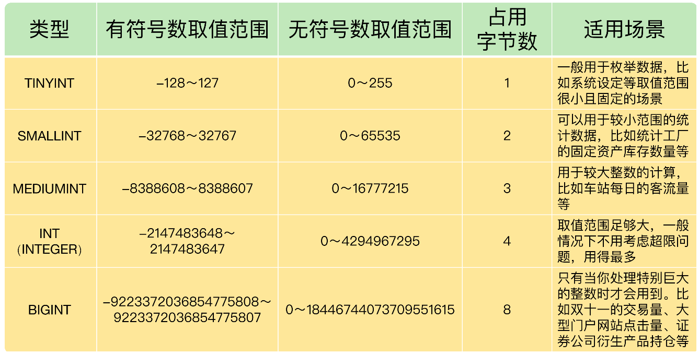
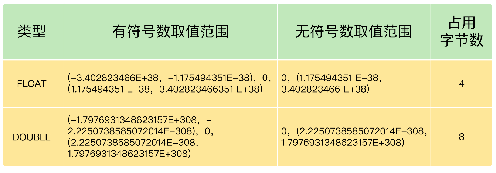
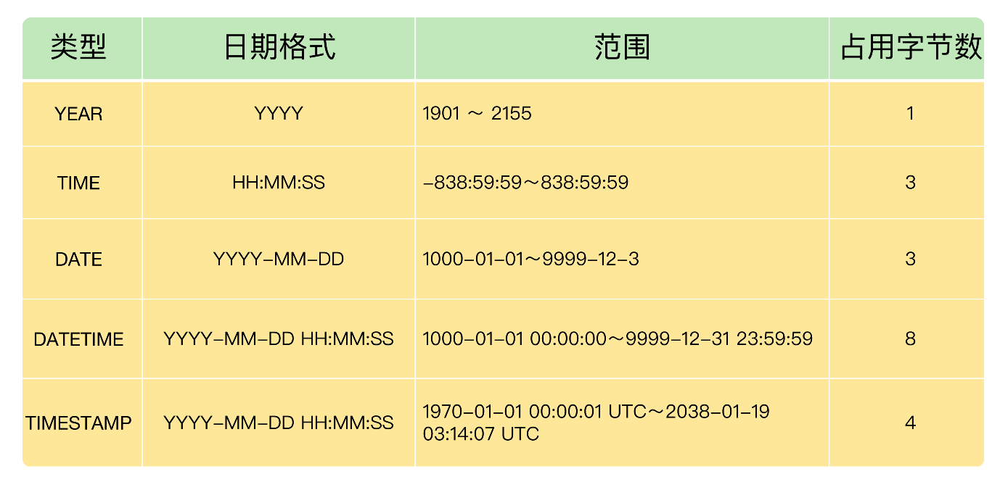

# 字段：这么多字段类型，该怎么定义？

你好，我是朱晓峰。

MySQL 中有很多字段类型，比如整数、文本、浮点数，等等。如果类型定义合理，就能节省存储空间，提升数据查询和处理的速度，相反，如果数据类型定义不合理，就有可能会导致数据超出取值范围，引发系统报错，甚至可能会出现计算错误的情况，进而影响到整个系统。

之前，我们就遇到过这样一个问题：在销售流水表中，需要定义商品销售的数量。由于有称重商品，不能用整数，我们想当然地用了浮点数，为了确保精度，我们还用了 DOUBLE 类型。结果却造成了在没有找零的情况下，客人无法结账的重大错误。经过排查，我们才发现，原来 DOUBLE 类型是不精准的，不能使用。

你看，准确地定义字段类型，不但关系到数据存储的效率，而且会影响整个信息系统的可靠性。所以，我们必须要掌握不同字段的类型，包括它们的适用场景、定义方法，这节课，我们就聊一聊这个问题。

首先，我要说的是 MySQL 中最简单的数据类型：整数类型。

## 整数类型 

整数类型一共有 5 种，包括 TINYINT、SMALLINT、MEDIUMINT、INT（INTEGER）和 BIGINT，它们的区别如下表所示：



这么多整数类型，咱们该怎么选择呢？

其实，在评估用哪种整数类型的时候，你**需要考虑存储空间和可靠性的平衡问题**：一方面，用占用字节数少的整数类型可以节省存储空间；另一方面，要是为了节省存储空间，使用的整数类型取值范围太小，一旦遇到超出取值范围的情况，就可能引起系统错误，影响可靠性。

举个例子，在我们的项目中，商品编号采用的数据类型是 INT。

我们之所以没有采用占用字节更少的 SMALLINT 类型整数，原因就在于，客户门店中流通的商品种类较多，而且，每天都有旧商品下架，新商品上架，这样不断迭代，日积月累。如果使用 SMALLINT 类型，虽然占用字节数比 INT 类型的整数少，但是却不能保证数据不会超出范围 65535。相反，使用 INT，就能确保有足够大的取值范围，不用担心数据超出范围影响可靠性的问题。

你要注意的是，在实际工作中，系统故障产生的成本远远超过增加几个字段存储空间所产生的成本。因此，我建议你首先**确保数据不会超过取值范围**，在这个前提之下，再去考虑如何节省存储空间。

接下来，我再给你介绍下浮点数类型和定点数类型。

## 浮点数类型和定点数类型 

浮点数和定点数类型的特点是可以处理小数，你可以把整数看成小数的一个特例。因此，浮点数和定点数的使用场景，就比整数大多了。

我们先来了解下 MySQL 支持的浮点数类型，分别是 FLOAT、DOUBLE、REAL。

- FLOAT 表示单精度浮点数；

- DOUBLE 表示双精度浮点数；

- REAL 默认就是 DOUBLE。如果你把 SQL 模式设定为启用“REAL_AS_FLOAT”，那么，MySQL 就认为 REAL 是 FLOAT。如果要启用“REAL_AS_FLOAT”，就可以通过以下 SQL 语句实现：

```sql
SET sql_mode = “REAL_AS_FLOAT”;
```

FLOAT 和 DOUBLE 这两种数据类型的区别是啥呢？其实就是，FLOAT 占用字节数少，取值范围小；DOUBLE 占用字节数多，取值范围也大。



看到这儿，你有没有发现一个问题：为什么浮点数类型的无符号数取值范围，只相当于有符号数取值范围的一半，也就是只相当于有符号数取值范围大于等于零的部分呢？

其实，这里的原因是，MySQL 是按照这个格式存储浮点数的：符号（S）、尾数（M）和阶码（E）。因此，无论有没有符号，MySQL 的浮点数都会存储表示符号的部分。因此，所谓的无符号数取值范围，其实就是有符号数取值范围大于等于零的部分。

不过，我要提醒你的是，**浮点数类型有个缺陷，就是不精准**。因此，在一些对精确度要求较高的项目中，千万不要使用浮点数，不然会导致结果错误，甚至是造成不可挽回的损失。下面我来重点解释一下为什么 MySQL 的浮点数不够精准。

为了方便你理解，我来借助一个实际的例子演示下。

我们先创建一个表，如下所示：

```sql
CREATE TABLE demo.goodsmaster
(
  barcode TEXT,
  goodsname TEXT,
  price DOUBLE,
  itemnumber INT PRIMARY KEY AUTO_INCREMENT
);
```

运行这个语句，我们就创建了一个表，其中的字段“price”就是浮点数类型。我们再通过下面的 SQL 语句，给这个表插入几条数据：

```sql
-- 第一条
INSERT INTO demo.goodsmaster
(
  barcode,
  goodsname,
  price
)
VALUES 
(
  '0001',
  '书',
  0.47
);
-- 第二条
INSERT INTO demo.goodsmaster
(
  barcode,
  goodsname,
  price
)
VALUES 
(
  '0002',
  '笔',
  0.44
);
-- 第三条
INSERT INTO demo.goodsmaster
(
  barcode,
  goodsname,
  price
)
VALUES 
(
  '0002',
  '胶水',
  0.19
);
```

现在，我们运行一个查询语句，看看现在表里数据的情况：

```sql
SELECT * from demo.goodsmaster;
```

这个时候，我们可以得到下面的结果：

```javascript
mysql> SELECT *
    -> FROM demo.goodsmaster;
+---------+-----------+-------+------------+
| barcode | goodsname | price | itemnumber |
+---------+-----------+-------+------------+
| 0001    | 书        |  0.47 |          1 |
| 0002    | 笔        |  0.44 |          2 |
| 0002    | 胶水      |  0.19 |          3 |
+---------+-----------+-------+------------+
3 rows in set (0.00 sec)
```

然后我们用下面的 SQL 语句，把这 3 个价格加在一起，看看得到了什么：

```sql
SELECT SUM(price)
FROM demo.goodsmaster;
```

这里我们又用到一个关键字 SUM，这是 MySQL 中的求和函数，是 MySQL 聚合函数的一种，你只要知道这个函数表示计算字段值的和就可以了。

我们期待的运行结果是：0.47 + 0.44 + 0.19 = 1.1，可是，我们得到的是：

```java
mysql> SELECT SUM(price)
    -> FROM demo.goodsmaster;
+--------------------+
| SUM(price)         |
+--------------------+
| 1.0999999999999999 |
+--------------------+
```

查询结果是 1.0999999999999999。看到了吗？虽然误差很小，但确实有误差。

你也可以尝试把数据类型改成 FLOAT，然后运行求和查询，得到的是，1.0999999940395355。显然，误差更大了。

虽然 1.10 和 1.0999999999999999 好像差不多，但是我们有时候需要以通过数值对比为条件进行查询，一旦出现误差，就查不出需要的结果了：

```sql
SELECT *
FROM demo.goodsmaster
WHERE SUM(price)=1.1
```

那么，为什么会存在这样的误差呢？问题还是**出在 MySQL 对浮点类型数据的存储方式上**。

MySQL 用 4 个字节存储 FLOAT 类型数据，用 8 个字节来存储 DOUBLE 类型数据。无论哪个，都是采用二进制的方式来进行存储的。比如 9.625，用二进制来表达，就是 1001.101，或者表达成 1.001101×2^3。看到了吗？如果尾数不是 0 或 5（比如 9.624），你就无法用一个二进制数来精确表达。怎么办呢？就只好在取值允许的范围内进行近似（四舍五入）。

现在你一定明白了，为什么数据类型是 DOUBLE 的时候，我们得到的结果误差更小一些，而数据类型是 FLOAT 的时候，误差会更大一下。原因就是，DOUBLE 有 8 位字节，精度更高。

说到这里，我想你已经彻底理解了浮点数据类型不精准的原因了。

那么，MySQL 有没有精准的数据类型呢？当然有，这就是**定点数类型：DECIMAL**。

就像浮点数类型的存储方式，决定了它不可能精准一样，DECIMAL 的存储方式决定了它一定是精准的。

浮点数类型是把十进制数转换成二进制数存储，DECIMAL 则不同，它是把十进制数的整数部分和小数部分拆开，分别转换成十六进制数，进行存储。这样，所有的数值，就都可以精准表达了，不会存在因为无法表达而损失精度的问题。

MySQL 用 DECIMAL（M,D）的方式表示高精度小数。其中，M 表示整数部分加小数部分，一共有多少位，M&lt;=65。D 表示小数部分位数，D&lt;M。

下面我们就用刚才的表 demo.goodsmaster 验证一下。

首先，我们运行下面的语句，把字段“price”的数据类型修改为 DECIMAL(5,2)：

```sql
ALTER TABLE demo.goodsmaster
MODIFY COLUMN price DECIMAL(5,2);
```

然后，我们再一次运行求和语句：

```sql
SELECT SUM(price)
FROM demo.goodsmaster;
```

这次，我们得到了完美的结果：1.10。

由于 DECIMAL 数据类型的精准性，在我们的项目中，除了极少数（比如商品编号）用到整数类型外，其他的数值都用的是 DECIMAL，原因就是这个项目所处的零售行业，要求精准，一分钱也不能差。

当然，在一些对精度要求不高的场景下，比起占用同样的字节长度的定点数，浮点数表达的数值范围可以更大一些。

简单小结下浮点数和定点数的特点：浮点类型取值范围大，但是不精准，适用于需要取值范围大，又可以容忍微小误差的科学计算场景（比如计算化学、分子建模、流体动力学等）；定点数类型取值范围相对小，但是精准，没有误差，适合于对精度要求极高的场景（比如涉及金额计算的场景）。

## 文本类型 

在实际的项目中，我们还经常遇到一种数据，就是字符串数据。比如，刚刚那个简单的表 demo.goodsmaster 中，有两个字段“barcode”和“goodsname”。它们当中存储的条码、商品名称，都是字符串数据。这两个字段的数据类型，我们都选择了 TEXT 类型。

TEXT 类型是 MySQL 支持的文本类型的一种。此外，MySQL 还支持 CHAR、VARCHAR、ENUM 和 SET 等文本类型。我们来看看它们的区别。

- CHAR(M)：固定长度字符串。CHAR(M) 类型必须预先定义字符串长度。如果太短，数据可能会超出范围；如果太长，又浪费存储空间。

- VARCHAR(M)： 可变长度字符串。VARCHAR(M) 也需要预先知道字符串的最大长度，不过只要不超过这个最大长度，具体存储的时候，是按照实际字符串长度存储的。

- TEXT：字符串。系统自动按照实际长度存储，不需要预先定义长度。

- ENUM： 枚举类型，取值必须是预先设定的一组字符串值范围之内的一个，必须要知道字符串所有可能的取值。

- SET：是一个字符串对象，取值必须是在预先设定的字符串值范围之内的 0 个或多个，也必须知道字符串所有可能的取值。

对于 ENUM 类型和 SET 类型来说，你必须知道所有可能的取值，所以只能用在某些特定场合，比如某个参数设定的取值范围只有几个固定值的场景。

因为不需要预先知道字符串的长度，系统会按照实际的数据长度进行存储，所以 TEXT 类型最为灵活方便，所以下面我们重点学习一下它。

TEXT 类型也有 4 种，它们的区别就是最大长度不同。

- TINYTEXT：255 字符（这里假设字符是 ASCII 码，一个字符占用一个字节，下同）。

- TEXT： 65535 字符。

- MEDIUMTEXT：16777215 字符。

- LONGTEXT： 4294967295 字符（相当于 4GB）。

不过，需要注意的是，TEXT 也有一个问题：**由于实际存储的长度不确定，MySQL 不允许 TEXT 类型的字段做主键。遇到这种情况，你只能采用 CHAR(M)，或者 VARCHAR(M)。**

所以，我建议你，在你的项目中，只要不是主键字段，就可以按照数据可能的最大长度，选择这几种 TEXT 类型中的的一种，作为存储字符串的数据类型。

## 日期与时间类型 

除了刚刚说的这 3 种类型，还有一类也是经常用到的，那就是日期与时间类型。

日期与时间是重要的信息，在我们的系统中，几乎所有的数据表都用得到。原因是客户需要知道数据的时间标签，从而进行数据查询、统计和处理。

**用得最多的日期时间类型，就是 DATETIME**。虽然 MySQL 也支持 YEAR（年）、TIME（时间）、DATE（日期），以及 TIMESTAMP 类型，但是**我建议你，在实际项目中，尽量用 DATETIME 类型**。因为这个数据类型包括了完整的日期和时间信息，使用起来比较方便。毕竟，如果日期时间信息分散在好几个字段，就会很不容易记，而且查询的时候，SQL 语句也会更加复杂。

这里我也给你列出了 MySQL 支持的其他日期时间类型的一些参数：



可以看到，不同数据类型表示的时间内容不同、取值范围不同，而且占用的字节数也不一样，你要根据实际需要灵活选取。

不过，我也给你一条小建议：为了确保数据的完整性和系统的稳定性，优先考虑使用 DATETIME 类型。因为虽然 DATETIME 类型占用的存储空间最多，但是它表达的时间最为完整，取值范围也最大。

另外，这里还有个问题，为什么时间类型 TIME 的取值范围不是 `-23: 59:59～23:59:59` 呢？原因是 MySQL 设计的 TIME 类型，不光表示一天之内的时间，而且可以用来表示一个时间间隔，这个时间间隔可以超过 24 小时。

时间类型的应用场景还是比较广的，后面我会单独用一节课来讲在数据库中处理时间的问题。这节课，你一定要知道 MySQL 支持哪几种时间类型，它们的区别是什么，这样在学后面的内容时，才能游刃有余。

## 总结 

今天，我给你介绍了几个常用的字段数据类型，包括整数类型、浮点数类型、定点数类型、文本类型和日期时间类型。同时，我们还清楚了为什么整数类型用得少，浮点数为什么不精准，以及常用的日期时间类型。

另外，我们还学习了几个新的 SQL 语句。尤其是第 2 条，我们在项目中会经常用到，你一定要重点牢记。

```sql
-- 修改字段类型语句
ALTER TABLE demo.goodsmaster
MODIFY COLUMN price DOUBLE;
-- 计算字段合计函数：
SELECT SUM(price)
FROM demo.goodsmaster;
```

最后，我还想再给你分享 1 个小技巧。在定义数据类型时，如果确定是整数，就用 INT；如果是小数，一定用定点数类型 DECIMAL；如果是字符串，只要不是主键，就用 TEXT；如果是日期与时间，就用 DATETIME。

- 整数：INT。

- 小数：DECIMAL。

- 字符串：TEXT。

- 日期与时间：DATETIME。

这样做的好处是，首先确保你的系统不会因为数据类型定义出错。

不过，凡事都是有两面的，可靠性好，并不意味着高效。比如，TEXT 虽然使用方便，但是效率不如 CHAR(M) 和 VARCHAR(M)。如果你有进一步优化的需求，我再给你分享一份文档，你可以对照着看下。

## 思考题 

假设用户需要一个表来记录会员信息，会员信息包括会员卡编号、会员名称、会员电话、积分值。如果要你为这些字段定义数据类型，你会如何选择呢？为什么？

欢迎在留言区写下你的思考和答案，我们一起交流讨论。如果你觉得今天的内容对你有所帮助，也欢迎你分享你的朋友或同事，我们下节课见。

