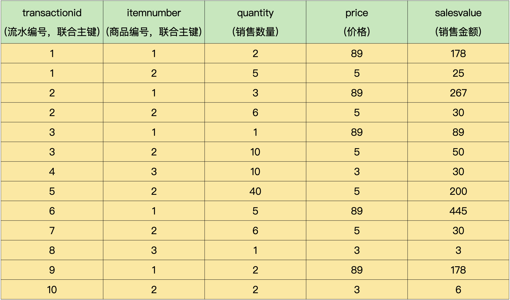
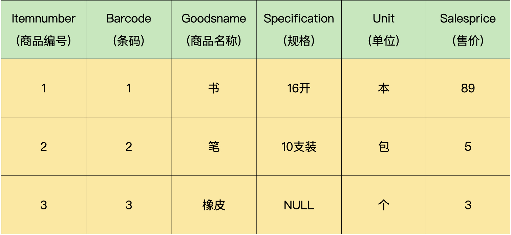
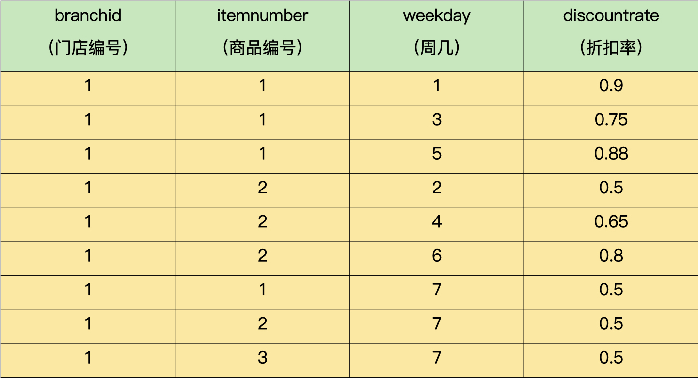

# 时间函数：时间类数据，MySQL是怎么处理的？

你好，我是朱晓峰。今天，咱们来聊一聊 MySQL 的时间函数。

顾名思义，时间函数就是用来处理时间的函数。时间，几乎可以说是各类项目中都会存在的数据，项目需求不同，我们需要的时间函数也不一样，比如：

- 如果我们要统计一天之中不同时间段的销售情况，就要获取时间值中的小时值，这就会用到函数 HOUR()；

- 要计算与去年同期相比的增长率，这就要计算去年同期的日期时间，会用到函数 DATE_ADD()；

- 要计算今天是周几、有没有优惠活动，这就要用到函数 DAYOFWEEK() 了；

- ……

这么多不同类型的时间函数，该怎么选择呢？这节课，我就结合不同的项目需求，来讲一讲不同的时间函数的使用方法，帮助你轻松地处理各类时间数据。

## 获取日期时间数据中部分信息的函数 

我先举个小例子。超市的经营者提出，他们希望通过实际的销售数据，了解到一天当中什么时间段卖得好，什么时间段卖得不好，这样他们就可以根据不同时间的销售情况，合理安排商品陈列和人员促销，以实现收益最大化。

要达到这个目标，我们就需要统计一天中每小时的销售数量和销售金额。

这里涉及 3 组数据，分别是销售单头表（demo.transactionhead)、销售单明细表 (demo.transactiondetails) 和商品信息表（demo.goodsmaster）（为了便于你理解，表的结构和表里的记录都是经过简化的）。

销售单头表包含了销售单的整体信息，包括流水单号、交易时间、收款机编号、会员编号和收银员编号等。


销售单明细表中保存的是交易明细数据，包括商品编号、销售数量、价格、销售金额等。



商品信息表主要包括商品编号、条码、商品名称、规格、单位和售价。



需要注意的是，销售单明细表通过流水编号与销售单头表关联，其中流水编号是外键。通过流水编号，销售单明细表引用销售单头表里的交易时间、会员编号等信息，同时，通过商品编号与商品信息表关联，引用商品信息表里的商品名称等信息。

首先，我们来分析一下“统计一天中每小时的销售数量和销售金额”的这个需求。

要统计一天中每小时的销售情况，实际上就是要把销售数据按照小时进行分组统计。那么，解决问题的关键，就是把交易时间的小时部分提取出来。这就要用到 MySQL 的日期时间处理函数 EXTRACT（）和 HOUR（）了。

为了获取小时的值，我们要用到 EXTRACT() 函数。**EXTRACT（type FROM date）表示从日期时间数据“date”中抽取“type”指定的部分**。

有了这个函数，我们就可以获取到交易时间的小时部分，从而完成一天中每小时的销售数量和销售金额的查询：

```javascript
mysql> SELECT
    -> EXTRACT(HOUR FROM b.transdate) AS 时段,
    -> SUM(a.quantity) AS 数量,
    -> SUM(a.salesvalue) AS 金额
    -> FROM
    -> demo.transactiondetails a
    -> JOIN
    -> demo.transactionhead b ON (a.transactionid = b.transactionid)
    -> GROUP BY EXTRACT(HOUR FROM b.transdate)
    -> ORDER BY EXTRACT(HOUR FROM b.transdate);
+------+--------+--------+
| 时段 | 数量   | 金额   |
+------+--------+--------+
|    9 | 16.000 | 500.00 |
|   10 | 11.000 | 139.00 |
|   11 | 10.000 |  30.00 |
|   12 | 40.000 | 200.00 |
|   13 |  5.000 | 445.00 |
|   15 |  6.000 |  30.00 |
|   17 |  1.000 |   3.00 |
|   18 |  2.000 | 178.00 |
|   19 |  2.000 |   6.00 |
+------+--------+--------+
9 rows in set (0.00 sec)
```

查询的过程是这样的：

1. 从交易时间中抽取小时信息：EXTRACT(HOUR FROM b.transdate)；

2. 按交易的小时信息分组；

3. 按分组统计销售数量和销售金额的和；

4. 按交易的小时信息排序。

这里我是用“HOUR”提取时间类型 DATETIME 中的小时信息，同样道理，你可以用“YEAR”获取年度信息，用“MONTH”获取月份信息，用“DAY”获取日的信息。如果你需要获取其他时间部分的信息，可以参考下[时间单位](时间单位)。

这个查询，我们也可以通过使用日期时间函数 HOUR() 来达到同样的效果。**HOUR（time）表示从日期时间“time”中，获取小时部分信息**。

需要注意的是，EXTRACT() 函数中的“HOUR”表示要获取时间的类型，而 HOUR() 是一个函数，HOUR(time) 可以单独使用，表示返回 time 的小时部分信息。

我们可以通过在代码中，把 EXTRACT 函数改成 HOUR 函数，来实现相同的功能，如下所示：

```shell
mysql> SELECT
-> HOUR(b.transdate) AS 时段, -- 改为使用HOUR函数
-> SUM(a.quantity) AS 数量,
-> SUM(a.salesvalue) AS 金额
-> FROM
-> demo.transactiondetails a
-> JOIN
-> demo.transactionhead b ON (a.transactionid = b.transactionid)
-> GROUP BY HOUR(b.transdate) -- 改写为HOUR函数
-> ORDER BY HOUR(b.transdate);-- 改写为HOUR函数
+------+--------+--------+
| 时段 | 数量   | 金额   |
+------+--------+--------+
|    9 | 16.000 | 500.00 |
|   10 | 11.000 | 139.00 |
|   11 | 10.000 |  30.00 |
|   12 | 40.000 | 200.00 |
|   13 |  5.000 | 445.00 |
|   15 |  6.000 |  30.00 |
|   17 |  1.000 |   3.00 |
|   18 |  2.000 | 178.00 |
|   19 |  2.000 |   6.00 |
+------+--------+--------+
9 rows in set (0.00 sec)
```

除了获取小时信息，我们往往还会遇到要统计年度信息、月度信息等情况，MySQL 也提供了支持的函数。

- YEAR（date）：获取 date 中的年。

- MONTH（date）：获取 date 中的月。

- DAY（date）：获取 date 中的日。

- HOUR（date）：获取 date 中的小时。

- MINUTE（date）：获取 date 中的分。

- SECOND（date）：获取 date 中的秒。

这些函数的使用方法和提取小时信息的方法一样，我就不多说了，你只要知道这些函数的含义就可以了，下面我再讲一讲计算日期时间的函数。

## 计算日期时间的函数 

我先来介绍 2 个常用的 MySQL 的日期时间计算函数。

- DATE_ADD（date, INTERVAL 表达式 type）：表示计算从时间点“date”开始，向前或者向后一段时间间隔的时间。“表达式”的值为时间间隔数，正数表示向后，负数表示向前，“type”表示时间间隔的单位（比如年、月、日等）。

- LAST_DAY（date）：表示获取日期时间“date”所在月份的最后一天的日期。

这两个函数怎么用呢？接下来，我还是借助咱们项目的实际需求，来给你讲解下。假设今天是 2020 年 12 月 10 日，超市经营者提出，他们需要计算这个月单品销售金额的统计，以及与去年同期相比的增长率。

这里的关键点是需要获取 2019 年 12 月的销售数据。因此，计算 2019 年 12 月的起始和截止时间点，就是查询的关键。这个时候，就要用到计算日期时间函数了。

下面我重点讲解一下如何通过 2 个计算日期时间函数，来计算 2019 年 12 月的起始时间和截止时间。

我们先来尝试获取 2019 年 12 月份的起始时间。

第一步，用 DATE_ADD 函数，获取到 2020 年 12 月 10 日上一年的日期：2019 年 12 月 10 日。

```javascript
mysql> SELECT DATE_ADD('2020-12-10', INTERVAL - 1 YEAR);
+-------------------------------------------+
| DATE_ADD('2020-12-10', INTERVAL - 1 YEAR) |
+-------------------------------------------+
| 2019-12-10                                |
+-------------------------------------------+
1 row in set (0.00 sec)
```

第二步，获取 2019 年 12 月 10 日这个时间节点开始上个月的日期，这样做的目的是方便获取月份的起始时间：

```javascript
mysql>  SELECT DATE_ADD(DATE_ADD('2020-12-10', INTERVAL - 1 YEAR),INTERVAL - 1 MONTH);
+------------------------------------------------------------------------+
| DATE_ADD(DATE_ADD('2020-12-10', INTERVAL - 1 YEAR),INTERVAL - 1 MONTH) |
+------------------------------------------------------------------------+
| 2019-11-10                                                             |
+------------------------------------------------------------------------+
1 row in set (0.00 sec)
```

第三步，获取 2019 年 11 月 10 日这个时间点月份的最后一天，继续接近我们的目标：2019 年 12 月 01 日。

```javascript
mysql>  SELECT LAST_DAY(DATE_ADD(DATE_ADD('2020-12-10', INTERVAL - 1 YEAR),INTERVAL - 1 MONTH));
+----------------------------------------------------------------------------------+
| LAST_DAY(DATE_ADD(DATE_ADD('2020-12-10', INTERVAL - 1 YEAR),INTERVAL - 1 MONTH)) |
+----------------------------------------------------------------------------------+
| 2019-11-30                                                                       |
+----------------------------------------------------------------------------------+
1 row in set (0.00 sec)
```

到这里，我们获得了 2019 年 11 月 30 日这个日期。你是不是觉得我们已经达到目的了呢？要是这样的话，你就错了。因为 2019 年 11 月 30 日可能会有销售的。如果用这个日期作为统计销售额的起始日期，你就多算了这一天的销售。怎么办呢？我们还要进行下一步。

第四步，计算 2019 年 11 月 30 日后一天的日期：

```javascript
mysql> SELECT DATE_ADD(LAST_DAY(DATE_ADD(DATE_ADD('2020-12-10', INTERVAL - 1 YEAR),INTERVAL - 1 MONTH)),INTERVAL 1 DAY);
+-----------------------------------------------------------------------------------------------------------+
| DATE_ADD(LAST_DAY(DATE_ADD(DATE_ADD('2020-12-10', INTERVAL - 1 YEAR),INTERVAL - 1 MONTH)),INTERVAL 1 DAY) |
+-----------------------------------------------------------------------------------------------------------+
| 2019-12-01                                                                                                |
+-----------------------------------------------------------------------------------------------------------+
1 row in set (0.00 sec)
```

你看，我们终于获得了正确的起始日期：2019 年 12 月 01 日。

同样，我们可以用下面的方法，获得截止日期：

```javascript
mysql> SELECT DATE_ADD(LAST_DAY(DATE_ADD('2020-12-10', INTERVAL - 1 YEAR)),INTERVAL 1 DAY);
+------------------------------------------------------------------------------+
| DATE_ADD(LAST_DAY(DATE_ADD('2020-12-10', INTERVAL - 1 YEAR)),INTERVAL 1 DAY) |
+------------------------------------------------------------------------------+
| 2020-01-01                                                                   |
+------------------------------------------------------------------------------+
1 row in set (0.00 sec)
```

简单小结下：我们可以用 DATE_ADD() 来计算从某个时间点开始，过去或者未来一个时间间隔的时间；通过 LAST_DAY() 函数，获得某个时间节点当月的最后一天的日期。借助它们，我们就可以获取从某个时间节点出发的指定月份的起始日期和截止日期。

除了 DATE_ADD()，ADDDATE()、DATE_SUB() 和 SUBDATE() 也能达到同样的效果。

- ADDDATE()：跟 DATE_ADD() 用法一致；

- DATE_SUB()，SUBDATE()：与 DATE_ADD() 用法类似，方向相反，执行日期的减操作。

## 其他日期时间函数 

学习了刚刚的时间函数，我们已经可以应对大部分有关时间的场景了。但是这还不够，有的时候，我们还需要其他的日期时间信息，比如：

- 今天是几月几号，星期几；

- 两个时间点之间隔了几天；

- 把时间按照一定的格式显示出来；

- ……

这时就要用到其他日期时间函数了，主要包括 CURDATE()、DAYOFWEEK()、DATE_FORMAT 和 DATEDIFF()。

我来借助一个例子，具体解释下这些函数怎么用。

超市经营者为了吸引顾客，经常要进行一些促销活动。具体来讲就是以周为单位，按照周中不同的日期进行促销，比如周一如何打折、周二如何打折、周末如何打折等。那么如何计算当天的价格呢？我们来看下单品促销信息（demo.discountrule）。



这个表中的信息表示单品打折的时间和折扣率：

- 编号是 1 的商品，周一、周三和周五打折，折扣率分别是 9 折、75 折和 88 折；

- 编号是 2 的商品，周二、周四和周六打折，折扣率分别是 5 折、65 折和 8 折。

- 周日，所有商品打 5 折。

如果我们想要查到具体的价格，我们首先要知道当前的日期，以及今天是星期几。这就要用到 2 个 MySQL 的时间函数：CURDATE（）和 DAYOFWEEK（）。

- CURDATE（）：获取当前的日期。日期格式为“YYYY-MM-DD”，也就是年月日的格式。

- DAYOFWEEK（date）：获取日期“date”是周几。1 表示周日，2 表示周一，以此类推，直到 7 表示周六。

假设今天是 2021 年 02 月 06 日，通过下面的代码，我们就可以查到今天商品的全部折后价格了：

```objectivec
mysql> SELECT
    -> CURDATE() AS 日期,
    -> CASE DAYOFWEEK(CURDATE()) - 1 WHEN 0 THEN 7 ELSE DAYOFWEEK(CURDATE()) - 1 END AS 周几,
    -> a.goodsname AS 商品名称,
    -> a.salesprice AS 价格,
    -> IFNULL(b.discountrate,1) AS 折扣率,
    -> a.salesprice * IFNULL(b.discountrate, 1) AS 折后价格
    -> FROM
    -> demo.goodsmaster a
    -> LEFT JOIN
    -> demo.discountrule b ON (a.itemnumber = b.itemnumber
    -> AND CASE DAYOFWEEK(CURDATE()) - 1 WHEN 0 THEN 7 ELSE DAYOFWEEK(CURDATE()) - 1 END = b.weekday);
+------------+------+----------+-------+--------+----------+
| 日期       | 周几 | 商品名称 | 价格  | 折扣率 | 折后价格 |
+------------+------+----------+-------+--------+----------+
| 2021-02-06 |    6 | 书       | 89.00 |   1.00 |  89.0000 |
| 2021-02-06 |    6 | 笔       |  5.00 |   0.80 |   4.0000 |
| 2021-02-06 |    6 | 橡皮     |  3.00 |   1.00 |   3.0000 |
+------------+------+----------+-------+--------+----------+
3 rows in set (0.00 sec)
```

这个查询，我们用到了 CURDATE（）函数来获取当前日期，也用到了 DAYOFWEEK（）函数来获取当前是周几的信息。由于 DAYOFWEEK() 函数，以周日为 1 开始计，周一是 2……，周六是 7，而数据表中是从周一为 1 开始计算，为了对齐，我用到了条件判断函数 CASE，我来解释下这个函数。

MySQL 中 CASE 函数的语法如下：

```sql
CASE 表达式 WHEN 值1 THEN 表达式1 [ WHEN 值2 THEN 表达式2] ELSE 表达式m END
```

在我们这个查询中，“表达式”有 7 种可能的值。通过 CASE 函数，我们可以根据 DAYOFWEEK() 函数返回的值对每个返回值进行处理，从而跟促销信息表中的字段 weekday 对应。

除了获取特定的日期，咱们还经常需要把日期按照一定的格式显示出来，这就要用到日期时间格式化的函数 **DATE_FORMAT()，它表示将日期时间“date”按照指定格式显示**。

举个小例子，张三希望用 24 小时制来查看时间，那么他就可以通过使用 DATE_FORMAT() 函数，指定格式“%T”来实现：

```javascript
mysql> SELECT DATE_FORMAT("2020-12-01 13:25:50","%T");
+-----------------------------------------+
| DATE_FORMAT("2020-12-01 13:25:50","%T") |
+-----------------------------------------+
| 13:25:50                                |
+-----------------------------------------+
1 row in set (0.00 sec)
```

李四习惯按照上下午的方式来查看时间，同样，他可以使用 DATE_FORMAT() 函数，通过指定格式“%r”来实现：

```javascript
mysql> SELECT DATE_FORMAT("2020-12-01 13:25:50","%r");
+-----------------------------------------+
| DATE_FORMAT("2020-12-01 13:25:50","%r") |
+-----------------------------------------+
| 01:25:50 PM                             |
+-----------------------------------------+
1 row in set (0.00 sec
```

另外一个重要的时间函数是 DATEDIFF（date1,date2），表示日期“date1”与日期“date2”之间差几天。假如你要计算某段时间的每天交易金额的平均值，只需要把起始日期和截止日期传给这个函数，就可以得到中间隔了几天。再用总计金额除以这个天数，就可以算出来了：

```javascript
mysql> SELECT DATEDIFF("2021-02-01","2020-12-01");
+-------------------------------------+
| DATEDIFF("2021-02-01","2020-12-01") |
+-------------------------------------+
|                                  62 |
+-------------------------------------+
1 row in set (0.00 sec)
```

## 总结 

今天，我们学习了 MySQL 的时间处理函数，包括获取日期时间类型数据中部分信息的函数、计算日期时间的函数和获取特定日期的函数，我用图片来帮你汇总了下。


最后，我还想多说一句，MySQL 中获取的时间，其实就是 MySQL 服务器计算机的系统时间。如果你的系统有一定规模，需要在多台计算机上运行，就要注意时间校准的问题。比如我们的信息系统受门店经营环境和操作人员的素质所限，有时会遇到误操作、停电等故障而导致的计算机系统时间失准问题。这对整个信息系统的可靠性影响非常大。

针对这个问题，有 2 种解决办法。

第一种方法是，可以利用 Windows 系统自带的网络同步的方式，来校准系统时间。

另一种办法就是，门店统一从总部 MySQL 服务器获取时间。由于总部的服务器的配置和运维状况一般要好于门店，所以系统时间出现误差的可能性也较小。如果采用云服务器，系统时间的可靠性会更高。

## 思考题 

假如用户想查一下今天是星期几（不能用数值，要用英文显示），你可以写一个简单的查询语句吗？

欢迎在留言区写下你的思考和答案，我们一起交流讨论。如果你觉得今天的内容对你有所帮助，欢迎你把它分享给你的朋友或同事，我们下节课见。

