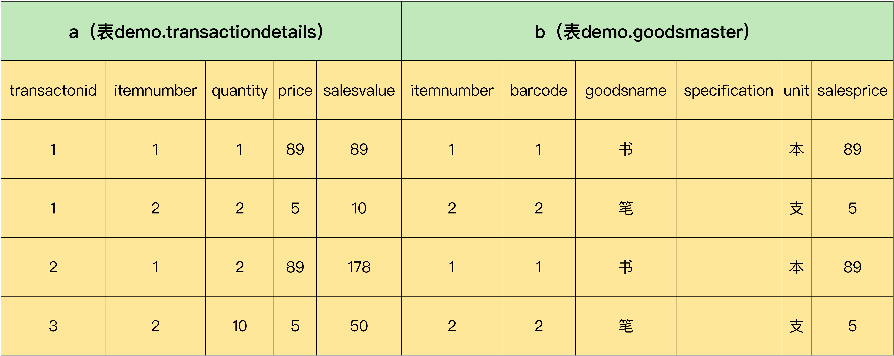
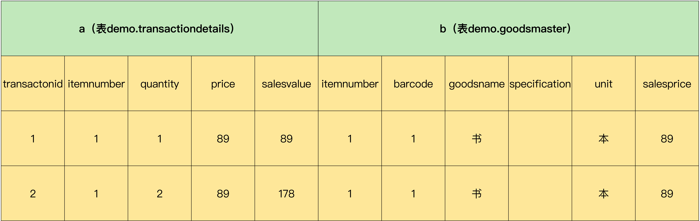
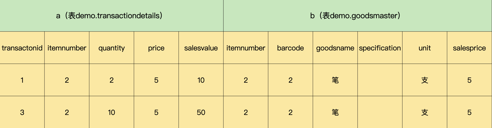
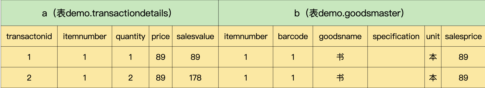

# 条件语句：WHERE 与 HAVING有什么不同?

你好，我是朱晓峰。

我们在进行查询的时候，经常需要按条件对查询结果进行筛选，这就要用到条件语句 WHERE 和 HAVING 了。

WHERE 是直接对表中的字段进行限定，来筛选结果；HAVING 则需要跟分组关键字 GROUP BY 一起使用，通过对分组字段或分组计算函数进行限定，来筛选结果。虽然它们都是对查询进行限定，却有着各自的特点和适用场景。很多时候，我们会遇到 2 个都可以用的情况。一旦用错，就很容易出现执行效率低下、查询结果错误，甚至是查询无法运行的情况。

下面我就借助项目实施过程中的实际需求，给你讲讲 WHERE 和 HAVING 分别是如何对查询结果进行筛选的，以及它们各自的优缺点，来帮助你正确地使用它们，使你的查询不仅能够得到正确的结果，还能占用更少的资源，并且速度更快。

## 一个实际查询需求 

超市的经营者提出，要查单笔销售金额超过 50 元的商品。我们来分析一下这个需求：需要查询出一个商品记录集，限定条件是单笔销售金额超过 50 元。这个时候，我们就需要用到 WHERE 和 HAVING 了。

这个问题的条件很明确，查询的结果也只有“商品”一个字段，好像很容易实现。

假设我们有一个这样的商品信息表（demo.goodsmaster），里面有 2 种商品：书和笔。

```javascript
mysql> SELECT *
    -> FROM demo.goodsmaster;
+------------+---------+-----------+---------------+------+------------+
| itemnumber | barcode | goodsname | specification | unit | salesprice |
+------------+---------+-----------+---------------+------+------------+
|          1 | 0001    | 书        |               | 本   |      89.00 |
|          2 | 0002    | 笔        |               | 支   |       5.00 |
+------------+---------+-----------+---------------+------+------------+
2 rows in set (0.00 sec)
```

同时，我们还有一个商品销售明细表（demo.transactiondetails），里面有 4 条销售记录：

```javascript
mysql> SELECT *
    -> FROM demo.transactiondetails;
+---------------+------------+----------+-------+------------+
| transactionid | itemnumber | quantity | price | salesvalue |
+---------------+------------+----------+-------+------------+
|             1 |          1 |    1.000 | 89.00 |      89.00 |
|             1 |          2 |    2.000 |  5.00 |      10.00 |
|             2 |          1 |    2.000 | 89.00 |     178.00 |
|             3 |          2 |   10.000 |  5.00 |      50.00 |
+---------------+------------+----------+-------+------------+
4 rows in set (0.01 sec)
```

接下来，我们分别用 WHERE 和 HAVING 进行查询，看看它们各自是如何查询的，是否能够得到正确的结果。

第一步，用 WHERE 关键字进行查询：

```shell
mysql> SELECT DISTINCT b.goodsname
-> FROM demo.transactiondetails AS a
-> JOIN demo.goodsmaster AS b
-> ON (a.itemnumber=b.itemnumber)
-> WHERE a.salesvalue > 50;
+-----------+
| goodsname |
+-----------+
| 书 |
+-----------+
1 row in set (0.00 sec)
```

第二步，用 HAVING 关键字进行查询：

```shell
mysql> SELECT b.goodsname
-> FROM demo.transactiondetails AS a
-> JOIN demo.goodsmaster AS b
-> ON (a.itemnumber=b.itemnumber)
-> GROUP BY b.goodsname
-> HAVING max(a.salesvalue)>50;
+-----------+
| goodsname |
+-----------+
| 书 |
+-----------+
1 row in set (0.00 sec)
```

可以发现，两次查询的结果是一样的。那么，这两种查询到底有什么区别，哪个更好呢？要弄明白这个问题，我们要先学习下 WHERE 和 HAVING 的执行过程。

## WHERE 

我们先来分析一下刚才使用 WHERE 条件的查询语句，来看看 MySQL 是如何执行这个查询的。

首先，MySQL 从数据表 demo.transactiondetails 中抽取满足条件“a.salesvalue>50”的记录：

```javascript
mysql> SELECT *
    -> FROM demo.transactiondetails AS a
    -> WHERE a.salesvalue > 50;
+---------------+------------+----------+-------+------------+
| transactionid | itemnumber | quantity | price | salesvalue |
+---------------+------------+----------+-------+------------+
|             1 |          1 |    1.000 | 89.00 |      89.00 |
|             2 |          1 |    2.000 | 89.00 |     178.00 |
+---------------+------------+----------+-------+------------+
2 rows in set (0.00 sec)
```

为了获取到销售信息所对应的商品名称，我们需要通过公共字段“itemnumber”与数据表 demo.goodsmaster 进行关联，从 demo.goodsmaster 中获取商品名称：

```javascript
mysql> SELECT
    ->     a.*, b.goodsname
    -> FROM
    ->     demo.transactiondetails a
    ->         JOIN
    ->     demo.goodsmaster b ON (a.itemnumber = b.itemnumber)
    -> WHERE
    ->     a.salesvalue > 50;
+---------------+------------+----------+-------+------------+-----------+
| transactionid | itemnumber | quantity | price | salesvalue | goodsname |
+---------------+------------+----------+-------+------------+-----------+
|             1 |          1 |    1.000 | 89.00 |      89.00 | 书        |
|             2 |          1 |    2.000 | 89.00 |     178.00 | 书        |
+---------------+------------+----------+-------+------------+-----------+
2 rows in set (0.00 sec)
```

这个时候，如果查询商品名称，就会出现两个重复的记录：

```javascript
mysql> SELECT
    ->     b.goodsname
    -> FROM
    ->     demo.transactiondetails AS a
    ->         JOIN
    ->     demo.goodsmaster AS b ON (a.itemnumber = b.itemnumber)
    -> WHERE
    ->     a.salesvalue > 50;
+-----------+
| goodsname |
+-----------+
| 书        |
| 书        |
+-----------+
2 rows in set (0.00 sec)
```

需要注意的是，为了消除重复的语句，这里我们需要用到一个关键字：DISTINCT，它的作用是返回唯一不同的值。比如，DISTINCT 字段 1，就表示返回所有字段 1 的不同的值。

下面我们尝试一下加上 DISTINCT 关键字的查询：

```javascript
mysql> SELECT
    ->     DISTINCT(b.goodsname)  -- 返回唯一不同的值
    -> FROM
    ->     demo.transactiondetails AS a
    ->         JOIN
    ->     demo.goodsmaster AS b ON (a.itemnumber = b.itemnumber)
    -> WHERE
    ->     a.salesvalue > 50;
+-----------+
| goodsname |
+-----------+
| 书        |
+-----------+
1 row in set (0.00 sec)
```

这样，我们就得到了需要的结果：单笔销售金额超过 50 元的商品就是“书”。

总之，WHERE 关键字的特点是，直接用表的字段对数据集进行筛选。如果需要通过关联查询从其他的表获取需要的信息，那么执行的时候，也是先通过 WHERE 条件进行筛选，用筛选后的比较小的数据集进行连接。这样一来，连接过程中占用的资源比较少，执行效率也比较高。

## HAVING 

讲完了 WHERE，我们再说说 HAVING 是如何执行的。不过，在这之前，我要先给你介绍一下 GROUP BY，因为 HAVING 不能单独使用，必须要跟 GROUP BY 一起使用。

我们可以把 GROUP BY 理解成对数据进行分组，方便我们对组内的数据进行统计计算。

下面我举个小例子，具体讲一讲 GROUP BY 如何使用，以及如何在分组里面进行统计计算。

假设现在有一组销售数据，我们需要从里面查询每天、每个收银员的销售数量和销售金额。我们通过下面的代码，来查看一下数据的内容：

```typescript
mysql> SELECT *
    -> FROM demo.transactionhead;
+---------------+------------------+------------+---------------------+
| transactionid | transactionno    | operatorid | transdate           |
+---------------+------------------+------------+---------------------+
|             1 | 0120201201000001 |          1 | 2020-12-10 00:00:00 |
|             2 | 0120201202000001 |          2 | 2020-12-11 00:00:00 |
|             3 | 0120201202000002 |          2 | 2020-12-12 00:00:00 |
+---------------+------------------+------------+---------------------+
3 rows in set (0.00 sec)

mysql> SELECT *
    -> FROM demo.transactiondetails;
+---------------+------------+----------+-------+------------+
| transactionid | itemnumber | quantity | price | salesvalue |
+---------------+------------+----------+-------+------------+
|             1 |          1 |    1.000 | 89.00 |      89.00 |
|             1 |          2 |    2.000 |  5.00 |      10.00 |
|             2 |          1 |    2.000 | 89.00 |     178.00 |
|             3 |          2 |   10.000 |  5.00 |      50.00 |
+---------------+------------+----------+-------+------------+
4 rows in set (0.01 sec)

mysql> SELECT *
    -> FROM demo.operator;
+------------+----------+--------+--------------+-------------+---------+--------------------+--------+
| operatorid | branchid | workno | operatorname | phone       | address | pid                | duty   |
+------------+----------+--------+--------------+-------------+---------+--------------------+--------+
|          1 |        1 | 001    | 张静         | 18612345678 | 北京    | 110392197501012332 | 店长   |
|          2 |        1 | 002    | 李强         | 13312345678 | 北京    | 110222199501012332 | 收银员 |
+------------+----------+--------+--------------+-------------+---------+--------------------+--------+
2 rows in set (0.01 sec)

mysql> SELECT
    -> a.transdate,   -- 交易时间
    -> c.operatorname,-- 操作员
    -> d.goodsname,   -- 商品名称
    -> b.quantity,    -- 销售数量
    -> b.price,       -- 价格
    -> b.salesvalue   -- 销售金额
    -> FROM
    ->   demo.transactionhead AS a
    -> JOIN
    ->   demo.transactiondetails AS b ON (a.transactionid = b.transactionid)
    -> JOIN
    ->  demo.operator AS c ON (a.operatorid = c.operatorid)
    -> JOIN
    ->  demo.goodsmaster AS d ON (b.itemnumber = d.itemnumber);
+---------------------+--------------+-----------+----------+-------+------------+
| transdate           | operatorname | goodsname | quantity | price | salesvalue |
+---------------------+--------------+-----------+----------+-------+------------+
| 2020-12-10 00:00:00 | 张静         | 书        |    1.000 | 89.00 |      89.00 |
| 2020-12-10 00:00:00 | 张静         | 笔        |    2.000 |  5.00 |      10.00 |
| 2020-12-11 00:00:00 | 李强         | 书        |    2.000 | 89.00 |     178.00 |
| 2020-12-12 00:00:00 | 李强         | 笔        |   10.000 |  5.00 |      50.00 |
+---------------------+--------------+-----------+----------+-------+------------+
4 rows in set (0.00 sec)
```

如果我想看看每天的销售数量和销售金额，可以按照一个字段“transdate”对数据进行分组和统计：

```javascript
mysql> SELECT
    -> a.transdate,
    -> SUM(b.quantity), -- 统计分组的总计销售数量
    -> SUM(b.salesvalue) -- 统计分组的总计销售金额
    -> FROM
    ->   demo.transactionhead AS a
    -> JOIN
    -> demo.transactiondetails AS b ON (a.transactionid = b.transactionid)
    -> GROUP BY a.transdate;
+---------------------+-----------------+-------------------+
| transdate           | SUM(b.quantity) | SUM(b.salesvalue) |
+---------------------+-----------------+-------------------+
| 2020-12-10 00:00:00 |           3.000 |             99.00 |
| 2020-12-11 00:00:00 |           2.000 |            178.00 |
| 2020-12-12 00:00:00 |          10.000 |             50.00 |
+---------------------+-----------------+-------------------+
3 rows in set (0.00 sec)
```

如果我想看每天、每个收银员的销售数量和销售金额，就可以按 2 个字段进行分组和统计，分别是“transdate”和“operatorname”：

```javascript
mysql>  SELECT
    ->     a.transdate,
    ->     c.operatorname,
    ->     SUM(b.quantity), -- 数量求和
    ->     SUM(b.salesvalue)-- 金额求和
    -> FROM
    ->     demo.transactionhead AS a
    ->         JOIN
    ->     demo.transactiondetails AS b ON (a.transactionid = b.transactionid)
    ->         JOIN
    ->     demo.operator AS C ON (a.operatorid = c.operatorid)
    -> GROUP BY a.transdate , c.operatorname; -- 按照交易日期和操作员分组
+---------------------+--------------+-----------------+-------------------+
| transdate           | operatorname | SUM(b.quantity) | SUM(b.salesvalue) |
+---------------------+--------------+-----------------+-------------------+
| 2020-12-10 00:00:00 | 张静         |           3.000 |             99.00 |
| 2020-12-11 00:00:00 | 李强         |           2.000 |            178.00 |
| 2020-12-12 00:00:00 | 李强         |          10.000 |             50.00 |
+---------------------+--------------+-----------------+-------------------+
3 rows in set (0.00 sec)
```

可以看到，通过对销售数据按照交易日期和收银员进行分组，再对组内数据进行求和统计，就实现了对每天、每个收银员的销售数量和销售金额的查询。

好了，知道了 GROUP BY 的使用方法，我们就来学习下 HAVING。

回到开头的超市经营者的需求：查询单笔销售金额超过 50 元的商品。现在我们来使用 HAVING 来实现，代码如下：

```javascript
mysql> SELECT b.goodsname
    -> FROM demo.transactiondetails AS a
    -> JOIN demo.goodsmaster AS b
    -> ON (a.itemnumber=b.itemnumber)
    -> GROUP BY b.goodsname
    -> HAVING max(a.salesvalue)>50;
+-----------+
| goodsname |
+-----------+
| 书        |
+-----------+
1 row in set (0.00 sec)
```

这种查询方式在 MySQL 里面是分四步实现的。

第一步，把流水明细表和商品信息表通过公共字段“itemnumber”连接起来，从 2 个表中获取数据：

```cpp
mysql> SELECT
    ->     a.*, b.*
    -> FROM
    ->     demo.transactiondetails a
    ->         JOIN
    ->     demo.goodsmaster b ON (a.itemnumber = b.itemnumber);
+---------------+------------+----------+-------+------------+------------+---------+-----------+---------------+------+------------+
| transactionid | itemnumber | quantity | price | salesvalue | itemnumber | barcode | goodsname | specification | unit | salesprice |
+---------------+------------+----------+-------+------------+------------+---------+-----------+---------------+------+------------+
|             1 |          1 |    1.000 | 89.00 |      89.00 |          1 | 0001    | 书        | NULL          | 本   |      89.00 |
|             1 |          2 |    2.000 |  5.00 |      10.00 |          2 | 0002    | 笔        | NULL          | 支   |       5.00 |
|             2 |          1 |    2.000 | 89.00 |     178.00 |          1 | 0001    | 书        | NULL          | 本   |      89.00 |
|             3 |          2 |   10.000 |  5.00 |      50.00 |          2 | 0002    | 笔        | NULL          | 支   |       5.00 |
+---------------+------------+----------+-------+------------+------------+---------+-----------+---------------+------+------------+
4 rows in set (0.00 sec)
```

查询的结果有点复杂，为了方便你理解，我对结果进行了分类，并加了注释，如下图所示：



第二步，把结果集按照商品名称分组，分组的示意图如下所示：

组 1：



组 2：



第三步，对分组后的数据集进行筛选，把组中字段“salesvalue”的最大值 >50 的组筛选出来。筛选后的结果集如下所示：



第四步，返回商品名称。这时，我们就得到了需要的结果：单笔销售金额超过 50 元的商品就是“书”。

现在我们来简单小结下使用 HAVING 的查询过程。首先，我们要把所有的信息都准备好，包括从关联表中获取需要的信息，对数据集进行分组，形成一个包含所有需要的信息的数据集合。接着，再通过 HAVING 条件的筛选，得到需要的数据。

## 怎么正确地使用 WHERE 和 HAVING？ 

现在，你已经知道了 WHERE 和 HAVING 的具体使用方法。那么，在查询时，我们怎样才能正确地使用它们呢？

首先，你要知道它们的 2 个典型区别。

第一个区别是，**如果需要通过连接从关联表中获取需要的数据，WHERE 是先筛选后连接，而 HAVING 是先连接后筛选**。

这一点，就决定了在关联查询中，WHERE 比 HAVING 更高效。因为 WHERE 可以先筛选，用一个筛选后的较小数据集和关联表进行连接，这样占用的资源比较少，执行效率也就比较高。HAVING 则需要先把结果集准备好，也就是用未被筛选的数据集进行关联，然后对这个大的数据集进行筛选，这样占用的资源就比较多，执行效率也较低。

第二个区别是，WHERE 可以直接使用表中的字段作为筛选条件，但不能使用分组中的计算函数作为筛选条件；HAVING 必须要与 GROUP BY 配合使用，可以把分组计算的函数和分组字段作为筛选条件。

这决定了，**在需要对数据进行分组统计的时候，HAVING 可以完成 WHERE 不能完成的任务**。这是因为，在查询语法结构中，WHERE 在 GROUP BY 之前，所以无法对分组结果进行筛选。HAVING 在 GROUP BY 之后，可以使用分组字段和分组中的计算函数，对分组的结果集进行筛选，这个功能是 WHERE 无法完成的。

这么说你可能不太好理解，我来举个小例子。假如超市经营者提出，要查询一下是哪个收银员、在哪天卖了 2 单商品。这种必须先分组才能筛选的查询，用 WHERE 语句实现就比较难，我们可能要分好几步，通过把中间结果存储起来，才能搞定。但是用 HAVING，则很轻松，代码如下：

```javascript
mysql> SELECT
    ->   a.transdate, c.operatorname
    -> FROM
    ->   demo.transactionhead AS a
    -> JOIN
    ->   demo.transactiondetails AS b ON (a.transactionid = b.transactionid)
    -> JOIN
    ->   demo.operator AS c ON (a.operatorid = c.operatorid)
    -> GROUP BY a.transdate,c.operatorname
    -> HAVING count(*)=2;  -- 销售了2单
+---------------------+--------------+
| transdate           | operatorname |
+---------------------+--------------+
| 2020-12-10 00:00:00 | 张静         |
+---------------------+--------------+
1 row in set (0.01 sec)
```

我汇总了 WHERE 和 HAVING 各自的优缺点，如下图所示：


不过，需要注意的是，WHERE 和 HAVING 也不是互相排斥的，我们可以在一个查询里面同时使用 WHERE 和 HAVING。

举个例子，假设现在我们有一组销售数据，包括交易时间、收银员、商品名称、销售数量、价格和销售金额等信息，超市的经营者要查询“2020-12-10”和“2020-12-11”这两天收银金额超过 100 元的销售日期、收银员名称、销售数量和销售金额。

```javascript
mysql> SELECT
    ->     a.transdate,
    ->    c.operatorname,
    ->     d.goodsname,
    ->     b.quantity,
    ->     b.price,
    ->     b.salesvalue
    -> FROM
    ->     demo.transactionhead AS a
    ->         JOIN
    ->     demo.transactiondetails AS b ON (a.transactionid = b.transactionid)
    ->        JOIN
    ->     demo.operator AS c ON (a.operatorid = c.operatorid)
    ->        JOIN
    ->    demo.goodsmaster as d on (b.itemnumber=d.itemnumber);
+---------------------+--------------+-----------+----------+-------+------------+
| transdate           | operatorname | goodsname | quantity | price | salesvalue |
+---------------------+--------------+-----------+----------+-------+------------+
| 2020-12-10 00:00:00 | 张静         | 书        |    1.000 | 89.00 |      89.00 |
| 2020-12-10 00:00:00 | 张静         | 笔        |    2.000 |  5.00 |      10.00 |
| 2020-12-11 00:00:00 | 李强         | 书        |    2.000 | 89.00 |     178.00 |
| 2020-12-12 00:00:00 | 李强         | 笔        |   10.000 |  5.00 |      50.00 |
+---------------------+--------------+-----------+----------+-------+------------+
4 rows in set (0.00 sec)
```

我们来分析一下这个需求：由于是要按照销售日期和收银员进行统计，所以，必须按照销售日期和收银员进行分组，因此，我们可以通过使用 GROUP BY 和 HAVING 进行查询：

```javascript
mysql> SELECT
    ->     a.transdate,
    ->     c.operatorname,
    ->     SUM(b.quantity), -- 销售数量求和
    ->     SUM(b.salesvalue)-- 销售金额求和
    -> FROM
    ->     demo.transactionhead AS a
    ->         JOIN
    ->     demo.transactiondetails AS b ON (a.transactionid = b.transactionid)
    ->         JOIN
    ->     demo.operator AS c ON (a.operatorid = c.operatorid)
    -> GROUP BY a.transdate , operatorname  -- 按照日期、收银员分组
    -> HAVING a.transdate IN ('2020-12-10' , '2020-12-11')
    ->     AND SUM(b.salesvalue) > 100;   -- 最后筛选数据
+---------------------+--------------+-----------------+-------------------+
| transdate           | operatorname | SUM(b.quantity) | SUM(b.salesvalue) |
+---------------------+--------------+-----------------+-------------------+
| 2020-12-11 00:00:00 | 李强         |           2.000 |            178.00 |
+---------------------+--------------+-----------------+-------------------+
1 row in set (0.00 sec) 
```

如果你仔细看 HAVING 后面的筛选条件，就会发现，条件 a.transdate IN ('2020-12-10' , '2020-12-11')，其实可以用 WHERE 来限定。我们把查询改一下试试：

```javascript
 mysql> SELECT
    ->     a.transdate,
    ->     c.operatorname,
    ->     SUM(b.quantity),
    ->     SUM(b.salesvalue)
    -> FROM
    ->     demo.transactionhead AS a
    ->         JOIN
    ->     demo.transactiondetails AS b ON (a.transactionid = b.transactionid)
    ->         JOIN
    ->     demo.operator AS c ON (a.operatorid = c.operatorid)
    -> WHERE a.transdate in ('2020-12-12','2020-12-11') -- 先按日期筛选
    -> GROUP BY a.transdate , operatorname
    -> HAVING SUM(b.salesvalue)>100;  -- 后按金额筛选
+---------------------+--------------+-----------------+-------------------+
| transdate           | operatorname | SUM(b.quantity) | SUM(b.salesvalue) |
+---------------------+--------------+-----------------+-------------------+
| 2020-12-11 00:00:00 | 李强         |           2.000 |            178.00 |
+---------------------+--------------+-----------------+-------------------+
1 row in set (0.00 sec)
```

很显然，我们同样得到了需要的结果。这是因为我们把条件拆分开，包含分组统计函数的条件用 HAVING，普通条件用 WHERE。这样，我们就既利用了 WHERE 条件的高效快速，又发挥了 HAVING 可以使用包含分组统计函数的查询条件的优点。当数据量特别大的时候，运行效率会有很大的差别。

## 总结 

今天，我给你介绍了条件语句 WHERE 和 HAVING 在 MySQL 中的执行原理。WHERE 可以先按照条件对数据进行筛选，然后进行数据连接，所以效率更高。HAVING 可以在分组之后，通过使用分组中的计算函数，实现 WHERE 难以完成的数据筛选。

了解了 WHERE 和 HAVING 各自的特点，我们就可以在查询中，充分利用它们的优势，更高效地实现我们的查询目标。

最后，我想提醒你的是，很多人刚开始学习 MySQL 的时候，不太喜欢用 HAVING，一提到条件语句，就想当然地用 WHERE。其实，HAVING 是非常有用的，特别是在做一些复杂的统计查询的时候，经常要用到分组，这个时候 HAVING 就派上用场了。

当然，你也可以不用 HAVING，而是把查询分成几步，把中间结果存起来，再用 WHERE 筛选，或者干脆把这部分筛选功能放在应用层面，用代码来实现。但是，这样做的效率很低，而且会增加工作量，加大维护成本。所以，学会使用 HAVING，对你完成复杂的查询任务非常有帮助。

## 思考题 

有这样一种说法：HAVING 后面的条件，必须是包含分组中的计算函数的条件，你觉得对吗？为什么？

欢迎在留言区写下你的思考和答案，我们一起交流讨论。如果你觉得今天的内容对你有所帮助，也欢迎你分享你的朋友或同事，我们下节课见。

