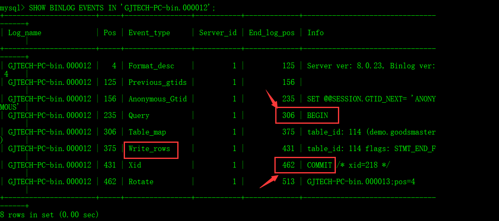
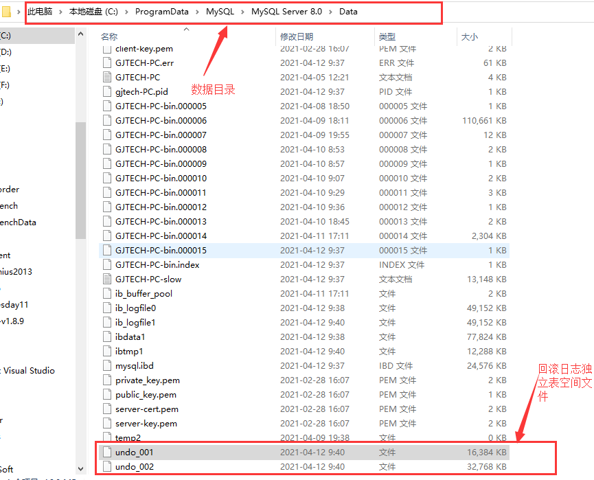

# 日志（下）：系统故障，如何恢复数据？

你好，我是朱晓峰。

上节课，咱们学习了通用查询日志、慢查询日志和错误日志，它们可以帮助我们快速定位系统问题。但实际上，日志也可以帮助我们找回由于误操作而丢失的数据，比如二进制日志（binary log）、中继日志（relay log）、回滚日志（undo log）和重做日志（redo log）。

这节课，我们就来学习下这 4 种日志。

## 二进制日志 

**二进制日志主要记录数据库的更新事件**，比如创建数据表、更新表中的数据、数据更新所花费的时长等信息。通过这些信息，我们可以再现数据更新操作的全过程。而且，由于日志的延续性和时效性，我们还可以利用日志，完成无损失的数据恢复和主从服务器之间的数据同步。

可以说，二进制日志是进行数据恢复和数据复制的利器。所以，接下来我就结合一个实际案例，重点给你讲一讲怎么操作它。

### 如何操作二进制日志？ 

操作二进制日志，主要包括查看、刷新二进制日志，用二进制日志恢复数据，以及删除二进制日志。

**1. 查看二进制日志**

查看二进制日志主要有 3 种情况，分别是查看当前正在写入的二进制日志、查看所有的二进制日志和查看二进制日志中的所有数据更新事件。

查看当前正在写入的二进制日志的 SQL 语句是：

```sql
SHOW MASTER STATUS;
```

我们可以通过这条语句，查看当前正在写入的二进制日志的名称和当前写入的位置：

```javascript
mysql> SHOW MASTER STATUS;
+----------------------+----------+--------------+------------------+-------------------+
| File | Position | Binlog_Do_DB | Binlog_Ignore_DB | Executed_Gtid_Set |
+----------------------+----------+--------------+------------------+-------------------+
| GJTECH-PC-bin.000011 | 2207 | | | |
+----------------------+----------+--------------+------------------+-------------------+   -- 当前正在写入的二进制日志是“GJTECH-PC-bin.000011”，当前的位置是2207。
1 row in set (0.00 sec)
```

查看所有的二进制日志的 SQL 语句是：

```sql
SHOW BINARY LOGS;
```

查看二进制日志中所有数据更新事件的 SQL 语句是：

```sql
SHOW BINLOG EVENTS IN 二进制文件名;
```

**2. 刷新二进制日志**

刷新二进制日志的 SQL 语句是：

```sql
FLUSH BINARY LOGS;
```

这条语句的意思是，关闭服务器正在写入的二进制日志文件，并重新打开一个新文件，文件名的后缀在现有的基础上加 1。

**3. 用二进制日志恢复数据**

我们可以用 mysqlbinlog 工具进行数据恢复：

```sql
mysqlbinlog –start-positon=xxx –end-position=yyy 二进制文件名 | mysql -u 用户 -p
```

这条命令的意思是，执行二进制日志中从位置 xxx 开始，到 yyy 截止的所有数据更新操作。这里的截止位置也可以不写，意思是从位置 xxx 开始，执行二进制文件中的所有数据更新操作。

**4. 删除二进制日志**

如果我们已经把日志文件保存到了安全的地方，就可以通过下面的 SQL 语句删除所有二进制日志文件，以释放磁盘空间：

```javascript
mysql> RESET MASTER;
Query OK, 0 rows affected (0.20 sec)
 
mysql> SHOW BINARY LOGS;
+----------------------+-----------+-----------+
| Log_name | File_size | Encrypted |
+----------------------+-----------+-----------+
| GJTECH-PC-bin.000001 | 156 | No |
+----------------------+-----------+-----------+
1 row in set (0.00 sec)
```

结果显示，所有二进制日志文件都被删除了，MySQL 从头准备了一个“.000001”为后缀的新的二进制日志文件。

我们也可以通过 SQL 语句，删除比指定二进制日志文件编号小的所有二进制日志文件：

```javascript
mysql> PURGE MASTER LOGS TO 'GJTECH-PC-bin.000005';
Query OK, 0 rows affected (0.02 sec)
```

好了，知道了二进制日志的操作方法，下面我们借助一个案例，来实操一下。我们来看看怎么通过二进制日志恢复数据，避免因故障或异常等导致数据损失。

### 案例讲解 

假设数据库 demo 中有一个商品信息表（demo.goodsmaster），我先对数据库 demo 做了一个全量备份。所谓的全量备份，就是指对数据库中存储的全部数据进行备份。备份完成之后，我又在商品信息表中插入了新数据。

这个时候，数据库 demo 出现异常，数据全部丢失。现在咱们需要把所有的数据，包括备份前的数据和备份之后新插入的数据都恢复回来。我来介绍下具体的操作步骤。

商品信息表的信息如下所示：


可以看到，表中有一条记录：编号是 1 的商品，名称是“书”，售价是 89 元。

**第一步，做数据库备份。**

你可以用 MySQL 的数据备份工具 mysqldump，来备份数据。这个工具的语法结构如下所示：

```null
mysqldump -u 用户 -p 密码 数据库 > 备份文件
```

在这个场景中，我们可以使用 mysqldump 工具，把数据库 demo 中的全部信息备份到文件“mybackup.sql”中，来完成对数据库 demo 的全量备份：

```null
H:\>mysqldump -u root -p demo > mybackup.sql
Enter password: *****
```

这个命令的意思是，把数据库 demo 中的全部数据，备份到文件 mybackup.sql 中。

**第二步，用“FLUSH BINARY LOGS;”语句刷新一下日志。**

```shell
mysql> FLUSH BINARY LOGS;
Query OK, 0 rows affected (0.06 sec)
```

这步操作的目的是：产生一个新的二进制日志文件，使这个文件只保存数据备份之后的数据更新事件，这样可以方便我们查看文件的内容。

**第三步，给商品信息表插入一条新的数据记录“笔”。**

```shell
mysql> INSERT INTO demo.goodsmaster
-> (
-> itemnumber,
-> barcode,
-> goodsname,
-> salesprice
-> )
-> VALUES
-> (
-> 2,
-> '0002',
-> '笔',
-> 3
-> );
Query OK, 1 row affected (0.03 sec)
```

这样我们就增加了一个新的商品“笔”。

现在，我们来查看一下数据表里的内容：

```javascript
mysql> SELECT * FROM demo.goodsmaster;
+------------+---------+-----------+------------+
| itemnumber | barcode | goodsname | salesprice |
+------------+---------+-----------+------------+
| 1 | 0001 | 书 | 89.00 |
| 2 | 0002 | 笔 | 3.00 |
+------------+---------+-----------+------------+
2 rows in set (0.00 sec)
```

结果显示，我们有了 2 条记录，分别是“书”和“笔”。

假设这个时候，系统突然宕机，数据库无法启动，为了使系统恢复正常，我们重启机器，重新创建数据库，并且需要进行数据恢复。

**第四步，准备从备份文件恢复数据。**

每当服务器启动、刷新二进制日志或者二进制日志大小超过系统变量 max_binlog_size 指定的值时，系统就会生成一个新的二进制日志文件。

我们先查看一下机器上的二进制日志文件，以确定哪个文件是我们正在使用的。

```javascript
mysql> SHOW BINARY LOGS;
+----------------------+-----------+-----------+
| Log_name | File_size | Encrypted |
+----------------------+-----------+-----------+
| GJTECH-PC-bin.000005 | 179 | No |
| GJTECH-PC-bin.000006 | 113316452 | No |
| GJTECH-PC-bin.000007 | 12125 | No |
| GJTECH-PC-bin.000008 | 1544 | No |
| GJTECH-PC-bin.000009 | 207 | No |
| GJTECH-PC-bin.000010 | 1758 | No |
| GJTECH-PC-bin.000011 | 2207 | No |
| GJTECH-PC-bin.000012 | 462 | No |
+----------------------+-----------+-----------+
12 rows in set (0.01 sec)
```

结果显示，最新的，也就是记录了数据插入操作的二进制日志文件是“GJTECH-PC-bin.000012”，这就是接下来我们要用的日志文件。

接着，我们来刷新一下二进制日志文件，这样做的目的是防止后面数据恢复的事件全都被写入这个二进制日志文件，妨碍我们理解文件的内容。

```shell
mysql> FLUSH BINARY LOGS;
Query OK, 0 rows affected (0.08 sec)
```

现在，我们查看一下当前正在写入的二进制文件和位置，确认一下系统是否创建了新的二进制日志文件：

```javascript
mysql> SHOW MASTER STATUS;
+----------------------+----------+--------------+------------------+-------------------+
| File | Position | Binlog_Do_DB | Binlog_Ignore_DB | Executed_Gtid_Set |
+----------------------+----------+--------------+------------------+-------------------+
| GJTECH-PC-bin.000013 | 156 | | | |
+----------------------+----------+--------------+------------------+-------------------+
1 row in set (0.00 sec)
```

结果显示，当前在使用的二进制日志文件是“GJTECH-PC-bin.000013”，这样保存增量数据的二进制日志文件就不会受到后面操作的影响了。

下面我来删除并重建一个数据库 demo，给你演示一下如何使用二进制日志恢复数据。

```shell
mysql> DROP DATABASE demo;
Query OK, 1 row affected (0.07 sec)
 
mysql> CREATE DATABASE demo;
Query OK, 1 row affected (0.01 sec)
```

通过上面的操作，就有了一个空数据库 demo。接下来，就可以恢复数据了。

**第五步，从备份恢复数据。**

可以通过 mysql 命令来恢复数据，语法结构如下：

```null
mysql -u 用户 -p 密码 数据库名称 < 备份文件
```

现在我用刚才的备份文件，通过下面的指令来恢复数据：

```null
H:\>mysql -u root -p demo<mybackup.sql
Enter password: *****
```

这个指令的意思是，在数据库 demo 中执行备份文件“mybackup.sql”中的所有 SQL 操作，这样就可以把 demo 中的数据恢复到备份时的状态了。

我们，来看一下现在商品信息表中的数据：

```javascript
mysql> SELECT * FROM demo.goodsmaster;
+------------+---------+-----------+------------+
| itemnumber | barcode | goodsname | salesprice |
+------------+---------+-----------+------------+
| 1 | 0001 | 书 | 89.00 |
+------------+---------+-----------+------------+
1 row in set (0.00 sec)
```

结果显示，只有一条数据记录“书”，那么，怎么才能把我们备份之后插入的那条数据“笔”给找回呢？这个时候，就要进入下一步，使用二进制日志了。

**第六步，从保存增量信息的二进制日志文件“GJTECH-PC-bin.000012”中恢复增量数据。**



通过查看二进制日志中的事件，你会发现，写入第二条记录的时候，MySQL 使用了一个事务操作，起始位置是 306，截止位置是 462。这样，就可以用 mysqlbinlog 工具进行数据恢复了。日志名称是“C:\ProgramData\MySQL\MySQL Server 8.0\Data\GJTECH-PC-bin.000012”，读取日志的起始位置是 306。

```javascript
H:\>mysqlbinlog --start-position=306 "C:\ProgramData\MySQL\MySQL Server 8.0\Data\GJTECH-PC-bin.000012" | mysql -u root -p
Enter password: *****
```

现在我们查看一下商品信息表，确认一下备份之后插入的商品数据记录是不是恢复回来了。

```javascript
mysql> SELECT * FROM demo.goodsmaster;
+------------+---------+-----------+------------+
| itemnumber | barcode | goodsname | salesprice |
+------------+---------+-----------+------------+
| 1 | 0001 | 书 | 89.00 |
| 2 | 0002 | 笔 | 3.00 |
+------------+---------+-----------+------------+
2 rows in set (0.00 sec)
```

结果显示，备份之后插入的记录“笔”也找回来了。

到这里，二进制日志恢复数据的功能我就介绍完了。需要提醒你注意的是，在实际工作中，用二进制日志文件找回数据时经常会遇到问题，主要就是不容易找准起始位置或者截止位置。找早了，会导致数据冲突、重复；找晚了，又会丢失数据。所以，我建议你在数据备份结束之后，把当前的二进制日志位置记录下来，存放在一个安全的地方，这关系到数据恢复的完整性，一定不要怕麻烦。

二进制日志还有一个重要的功能，就是在主从服务器的架构中，把主服务器的操作复制到从服务器。而这个操作要借助中继日志一起完成。

## 中继日志 

**中继日志只在主从服务器架构的从服务器上存在**。从服务器为了与主服务器保持一致，要从主服务器读取二进制日志的内容，并且把读取到的信息写入本地的日志文件中，这个从服务器本地的日志文件就叫中继日志。然后，从服务器读取中继日志，并根据中继日志的内容对从服务器的数据进行更新，完成主从服务器的数据同步。

搭建好主从服务器之后，中继日志默认会保存在从服务器的数据目录（C:\ProgramData\MySQL\MySQL Server 8.0\Data）下，文件名的格式是：从服务器名 -relay-bin. 序号。

中继日志还有一个索引文件：从服务器名 -relay-bin.index，用来定位当前正在使用的中继日志。

中继日志与二进制日志的格式相同，可以用 mysqlbinlog 工具进行查看。下面是中继日志的一个片段：

```sql
SET TIMESTAMP=1618558728/*!*/;
BEGIN
/*!*/;
# at 950
#210416 15:38:48 server id 1  end_log_pos 832 CRC32 0xcc16d651   Table_map: `demo`.`test` mapped to number 91
# at 1000
#210416 15:38:48 server id 1  end_log_pos 872 CRC32 0x07e4047c   Delete_rows: table id 91 flags: STMT_END_F   -- server id 1 是主服务器，意思是主服务器删了一行数据

BINLOG '
CD95YBMBAAAAMgAAAEADAAAAAFsAAAAAAAEABGRlbW8ABHRlc3QAAQMAAQEBAFHWFsw=
CD95YCABAAAAKAAAAGgDAAAAAFsAAAAAAAEAAgAB/wABAAAAfATkBw==
'/*!*/;
# at 1040
```

这一段的意思是，主服务器（“server id 1”）对表 demo.test 进行了 2 步操作：

1. 定位到表 demo.test 编号是 91 的记录，日志位置是 832；

2. 删除编号是 91 的记录，日志位置是 872。

关于中继日志，有一个很容易踩到的坑。如果从服务器宕机，有的时候为了系统恢复，你要重装操作系统，这样就可能会导致你的服务器名称与之前不同。而中继日志的名称里面是包含从服务器名的。因此，在这种情况下，就可能导致你恢复从服务器的时候，无法从宕机前的中继日志里读取数据，以为是日志文件损坏了，其实是文件名不对了。解决的方法也很简单，只要把从服务器的名称改回之前的名称就可以了。

下面我再介绍一下回滚日志。

## 回滚日志 

**回滚日志的作用是进行事务回滚**。

当事务执行的时候，回滚日志中记录了事务中每次数据更新前的状态。当事务需要回滚的时候，可以通过读取回滚日志，恢复到指定的位置。另一方面，回滚日志也可以让其他的事务读取到这个事务对数据更改之前的值，从而确保了其他事务可以不受这个事务修改数据的影响。

回滚日志的设置是啥样的呢？我们来学习下相关变量值，包括文件大小、所在的文件夹、是否加密、是否自动截断回收以及是否有独立的表空间等。这些都是我们了解事务回滚的机制的关键。

```javascript
mysql> SHOW VARIABLES LIKE '%innodb_max_undo_log_size%';
+--------------------------+------------+
| Variable_name | Value |
+--------------------------+------------+
| innodb_max_undo_log_size | 1073741824 |
+--------------------------+------------+
1 row in set, 1 warning (0.00 sec)
```

变量“innodb_max_undo_log_size”的意思是，单个回滚日志最大可占用 1G 字节存储空间。

下面几个变量定义了回滚日志所在的文件夹、是否加密、是否自动截断回收空间和是否有独立的表空间等。

```javascript
mysql> SHOW VARIABLES LIKE '%innodb_undo%';
+--------------------------+-------+
| Variable_name | Value |
+--------------------------+-------+
| innodb_undo_directory | .\ |  -- 表示回滚日志的存储目录是数据目录。 
| innodb_undo_log_encrypt | OFF | -- 表示回滚日志不加密。
| innodb_undo_log_truncate | ON | -- 表示回滚日志是否自动截断回收，前提是设置了独立表空间。
| innodb_undo_tablespaces | 2 |  -- 表示回滚日志有自己的独立表空间，而不是在共享表空间ibdata文件中。
+--------------------------+-------+
4 rows in set, 1 warning (0.00 sec)
```

这里的结果显示了这 4 个变量的默认值。下面我来分别解释一下。

- innodb_undo_directory=.\ ，表示回滚日志的存储目录是数据目录，数据目录的位置可以通过查询变量“datadir”来查看。

- innodb_undo_log_encrypt = OFF，表示回滚日志不加密。

- innodb_undo_log_truncate = ON，表示回滚日志是否自动截断回收，这个变量有效的前提是设置了独立表空间。

- innodb_undo_tablespaces = 2，表示回滚日志有自己的独立表空间，而不是在共享表空间 ibdata 文件中。

下面的截图显示了回滚日志的存储目录，以及在文件夹中的名称等信息：



最后，我来介绍一下 MySQL 的重做日志。

## 重做日志 

重做日志是存储在磁盘上的一种日志文件，主要有 2 个作用。

1. 在系统遇到故障的恢复过程中，可以修复被未完成的事务修改的数据。

2. MySQL 为了提高数据存取的效率，减少磁盘操作的频率，对数据的更新操作不会立即写到磁盘上，而是把数据更新先保存在内存中，积累到一定程度，再集中进行磁盘读写操作。这样就存在一个问题：一旦出现宕机或者停电等异常情况，内存中保存的数据更新操作可能会丢失。这个时候就可以通过读取重做日志中记录的数据更新操作，把没来得及写到磁盘上的数据更新写到磁盘上，确保数据的完整性。

我们可以通过系统变量的值，了解重做日志所在的文件夹和文件的数量。这些是我们进一步了解系统运行机制的必要条件，有助于我们开发出高效的数据库应用。

```javascript
mysql> SHOW VARIABLES LIKE '%innodb_log_files_in_group%';
+---------------------------+-------+
| Variable_name | Value |
+---------------------------+-------+
| innodb_log_files_in_group | 2 |
+---------------------------+-------+
1 row in set, 1 warning (0.00 sec)
```

结果显示，变量 innodb_log_files_in_group 值是 2，表示有 2 个重做日志文件。

需要注意的是，变量 innodb_log_files_in_group 值的取值范围是 1~4，这四个文件分别用于记录不同的操作.

1. 用户创建表的插入操作；

2. 用户创建表的更新和删除操作；

3. 临时表的插入操作；

4. 临时表的更新和删除操作。

那么，为什么在我的电脑上，变量 innodb_log_files_in_group 值是 2 呢？其实这是因为，我只执行了对用户创建表的插入操作和更新删除操作，所以，只用到了 2 个文件。如果我还执行了临时表的插入和更新删除的操作，那么这个变量的值就会变成 4，也就是会有 4 个重做日志文件了。

## 总结 

这节课，我们学习了二进制日志、中继日志、回滚日志和重做日志。

1. 二进制日志：主要用于主从服务器之间的数据同步，以及服务器遇到故障时数据的无损失恢复。

2. 中继日志：就是主从服务器架构中，从服务器用来存放主服务器二进制日志内容的一个中间文件。从服务器通过读取中继日志的内容，来同步主服务器上的操作。

3. 回滚日志：用来存储事务中数据更新前的状态，以便回滚和保持其他事务的数据一致性。

4. 重做日志：是为了确保数值持久性、防止数据更新丢失的一种日志。

在这几种日志中，你一定要格外注意二进制日志的用法。有了它，我们就可以通过数据库的全量备份和二进制日志中保存的增量信息，完成数据库的无损失恢复。不过，我要提醒你的是，如果你遇到数据量大、数据库和数据表很多（比如分库分表的应用）的场景，用二进制日志进行数据恢复，是很有挑战性的，因为起止位置不容易管理。

在这种情况下，一个有效的解决办法是配置主从数据库服务器，甚至是一主多从的架构，把二进制日志文件的内容通过中继日志，同步到从数据库服务器中，这样就可以有效避免数据库故障导致的数据异常等问题。

## 思考题 

下面是一段二进制日志中事件的内容：

```java
mysql> SHOW BINLOG EVENTS IN 'GJTECH-PC-bin.000013';
+----------------------+------+----------------+-----------+-------------+--------------------------------------+
| Log_name             | Pos  | Event_type     | Server_id | End_log_pos | Info                                 |
+----------------------+------+----------------+-----------+-------------+--------------------------------------+
| GJTECH-PC-bin.000013 |  556 | Query          |         1 |         627 | BEGIN                                |
| GJTECH-PC-bin.000013 |  627 | Table_map      |         1 |         696 | table_id: 114 (demo.goodsmaster)     |
| GJTECH-PC-bin.000013 |  696 | Delete_rows    |         1 |         773 | table_id: 114 flags: STMT_END_F      |
| GJTECH-PC-bin.000013 |  773 | Xid            |         1 |         804 | COMMIT /* xid=253 */                 |
| GJTECH-PC-bin.000013 |  804 | Anonymous_Gtid |         1 |         894 | SET @@SESSION.GTID_NEXT= 'ANONYMOUS' |
| GJTECH-PC-bin.000013 |  894 | Query          |         1 |         969 | BEGIN                                |
| GJTECH-PC-bin.000013 |  969 | Table_map      |         1 |        1038 | table_id: 114 (demo.goodsmaster)     |
| GJTECH-PC-bin.000013 | 1038 | Write_rows     |         1 |        1094 | table_id: 114 flags: STMT_END_F      |
| GJTECH-PC-bin.000013 | 1094 | Xid            |         1 |        1125 | COMMIT /* xid=259 */                 |
```

观察一下，其中包括了哪几个 SQL 数据操作呢？为了从二进制日志中恢复这些操作，我们应该如何设置起始位置和截止位置呢？

欢迎在留言区写下你的思考和答案，我们一起交流讨论。如果你觉得今天的内容对你有所帮助，也欢迎你分享给你的朋友或同事，我们下节课见。

