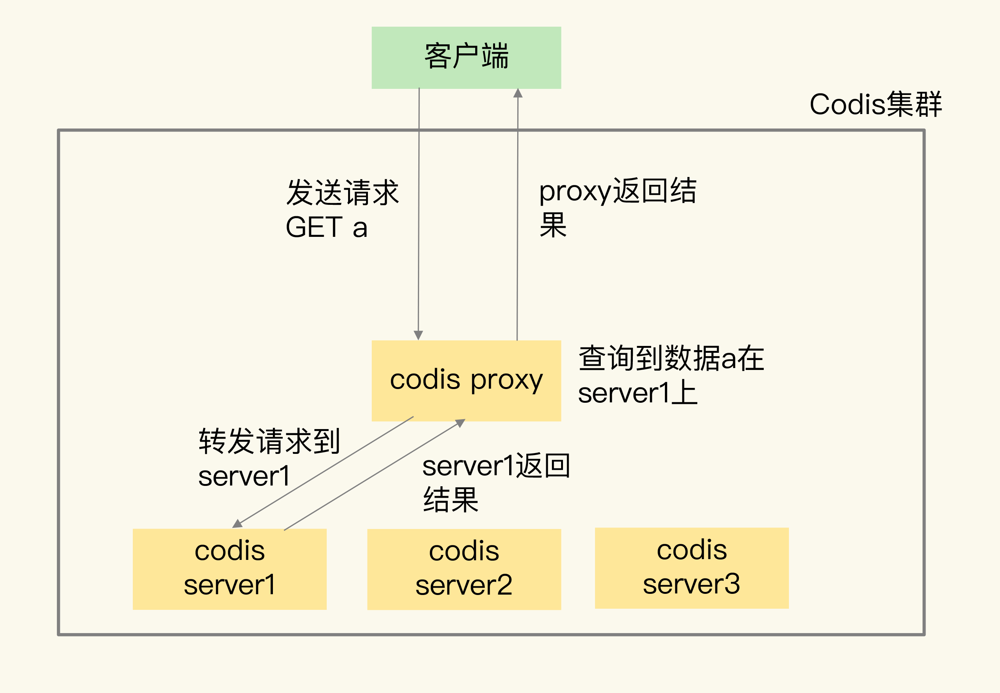
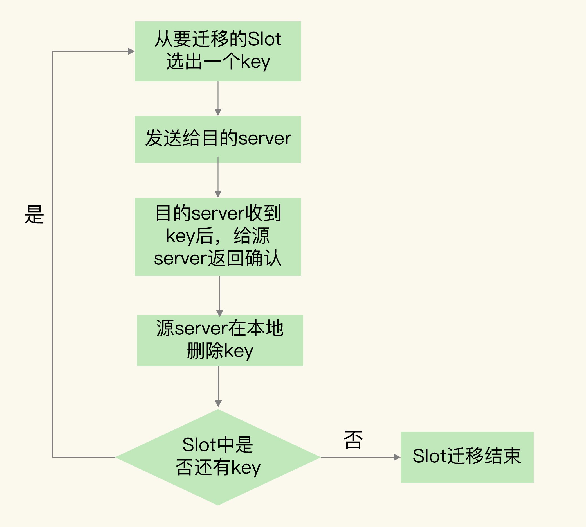
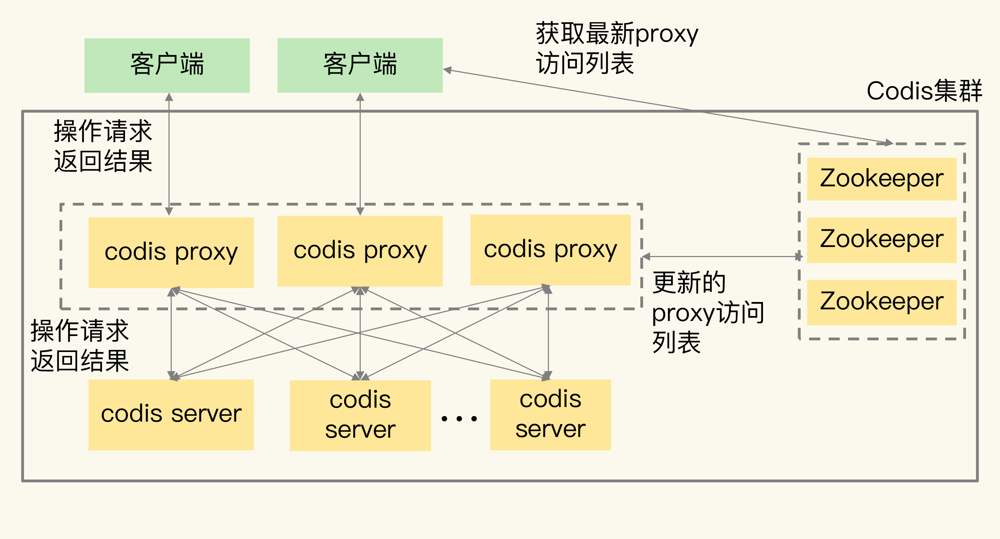
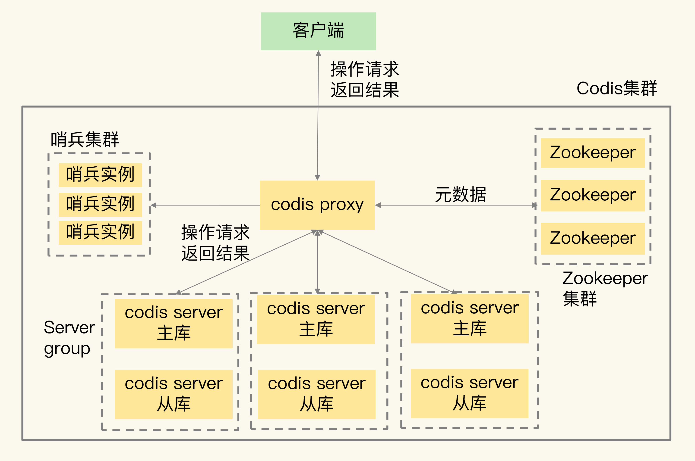

# Codis VS Redis Cluster：我该选择哪一个集群方案？

你好，我是蒋德钧。

Redis 的切片集群使用多个实例保存数据，能够很好地应对大数据量的场景。在[第 8 讲](第 8 讲)中，我们学习了 Redis 官方提供的切片集群方案 Redis Cluster，这为你掌握切片集群打下了基础。今天，我再来带你进阶一下，我们来学习下 Redis Cluster 方案正式发布前，业界已经广泛使用的 Codis。

我会具体讲解 Codis 的关键技术实现原理，同时将 Codis 和 Redis Cluster 进行对比，帮你选出最佳的集群方案。

好了，话不多说，我们先来学习下 Codis 的整体架构和流程。

## Codis 的整体架构和基本流程 

Codis 集群中包含了 4 类关键组件。

- codis server：这是进行了二次开发的 Redis 实例，其中增加了额外的数据结构，支持数据迁移操作，主要负责处理具体的数据读写请求。

- codis proxy：接收客户端请求，并把请求转发给 codis server。

- Zookeeper 集群：保存集群元数据，例如数据位置信息和 codis proxy 信息。

- codis dashboard 和 codis fe：共同组成了集群管理工具。其中，codis dashboard 负责执行集群管理工作，包括增删 codis server、codis proxy 和进行数据迁移。而 codis fe 负责提供 dashboard 的 Web 操作界面，便于我们直接在 Web 界面上进行集群管理。

我用一张图来展示下 Codis 集群的架构和关键组件。

我来给你具体解释一下 Codis 是如何处理请求的。

首先，为了让集群能接收并处理请求，我们要先使用 codis dashboard 设置 codis server 和 codis proxy 的访问地址，完成设置后，codis server 和 codis proxy 才会开始接收连接。

然后，当客户端要读写数据时，客户端直接和 codis proxy 建立连接。你可能会担心，既然客户端连接的是 proxy，是不是需要修改客户端，才能访问 proxy？其实，你不用担心，codis proxy 本身支持 Redis 的 RESP 交互协议，所以，客户端访问 codis  proxy 时，和访问原生的 Redis 实例没有什么区别，这样一来，原本连接单实例的客户端就可以轻松地和 Codis 集群建立起连接了。

最后，codis proxy 接收到请求，就会查询请求数据和 codis server 的映射关系，并把请求转发给相应的 codis server 进行处理。当 codis server 处理完请求后，会把结果返回给 codis proxy，proxy 再把数据返回给客户端。

我来用一张图展示这个处理流程：

好了，了解了 Codis 集群架构和基本流程后，接下来，我就围绕影响切片集群使用效果的 4 方面技术因素：数据分布、集群扩容和数据迁移、客户端兼容性、可靠性保证，来和你聊聊它们的具体设计选择和原理，帮你掌握 Codis 的具体用法。

## Codis 的关键技术原理 

一旦我们使用了切片集群，面临的第一个问题就是，**数据是怎么在多个实例上分布的**。

### 数据如何在集群里分布？ 

在 Codis 集群中，一个数据应该保存在哪个 codis server 上，这是通过逻辑槽（Slot）映射来完成的，具体来说，总共分成两步。

第一步，Codis 集群一共有 1024 个 Slot，编号依次是 0 到 1023。我们可以把这些 Slot 手动分配给 codis server，每个 server 上包含一部分 Slot。当然，我们也可以让 codis dashboard 进行自动分配，例如，dashboard 把 1024 个 Slot 在所有 server 上均分。

第二步，当客户端要读写数据时，会使用 CRC32 算法计算数据 key 的哈希值，并把这个哈希值对 1024 取模。而取模后的值，则对应 Slot 的编号。此时，根据第一步分配的 Slot 和 server 对应关系，我们就可以知道数据保存在哪个 server 上了。

我来举个例子。下图显示的就是数据、Slot 和 codis server 的映射保存关系。其中，Slot 0 和 1 被分配到了 server1，Slot 2 分配到 server2，Slot 1022 和 1023 被分配到 server8。当客户端访问 key 1 和 key 2 时，这两个数据的 CRC32 值对 1024 取模后，分别是 1 和 1022。因此，它们会被保存在 Slot  1 和 Slot  1022 上，而 Slot  1 和 Slot  1022 已经被分配到 codis server 1 和 8 上了。这样一来，key 1 和 key 2 的保存位置就很清楚了。

数据 key 和 Slot 的映射关系是客户端在读写数据前直接通过 CRC32 计算得到的，而 Slot 和 codis server 的映射关系是通过分配完成的，所以就需要用一个存储系统保存下来，否则，如果集群有故障了，映射关系就会丢失。

我们把 Slot 和 codis server 的映射关系称为数据路由表（简称路由表）。我们在 codis dashboard 上分配好路由表后，dashboard 会把路由表发送给 codis proxy，同时，dashboard 也会把路由表保存在 Zookeeper 中。codis-proxy 会把路由表缓存在本地，当它接收到客户端请求后，直接查询本地的路由表，就可以完成正确的请求转发了。

你可以看下这张图，它显示了路由表的分配和使用过程。

在数据分布的实现方法上，Codis 和 Redis Cluster 很相似，都采用了 key 映射到 Slot、Slot 再分配到实例上的机制。

但是，这里有一个明显的区别，我来解释一下。

Codis 中的路由表是我们通过 codis dashboard 分配和修改的，并被保存在 Zookeeper 集群中。一旦数据位置发生变化（例如有实例增减），路由表被修改了，codis dashbaord 就会把修改后的路由表发送给 codis proxy，proxy 就可以根据最新的路由信息转发请求了。

在 Redis Cluster 中，数据路由表是通过每个实例相互间的通信传递的，最后会在每个实例上保存一份。当数据路由信息发生变化时，就需要在所有实例间通过网络消息进行传递。所以，如果实例数量较多的话，就会消耗较多的集群网络资源。

数据分布解决了新数据写入时该保存在哪个 server 的问题，但是，当业务数据增加后，如果集群中的现有实例不足以保存所有数据，我们就需要对集群进行扩容。接下来，我们再来学习下 Codis 针对集群扩容的关键技术设计。

### 集群扩容和数据迁移如何进行? 

Codis 集群扩容包括了两方面：增加 codis server 和增加 codis proxy。

我们先来看增加 codis server，这个过程主要涉及到两步操作：

1. 启动新的 codis server，将它加入集群；

2. 把部分数据迁移到新的 server。

需要注意的是，这里的数据迁移是一个重要的机制，接下来我来重点介绍下。

Codis 集群按照 Slot 的粒度进行数据迁移，我们来看下迁移的基本流程。

1. 在源 server 上，Codis 从要迁移的 Slot 中随机选择一个数据，发送给目的 server。

2. 目的 server 确认收到数据后，会给源 server 返回确认消息。这时，源 server 会在本地将刚才迁移的数据删除。

3. 第一步和第二步就是单个数据的迁移过程。Codis 会不断重复这个迁移过程，直到要迁移的 Slot 中的数据全部迁移完成。

我画了下面这张图，显示了数据迁移的流程，你可以看下加深理解。

针对刚才介绍的单个数据的迁移过程，Codis 实现了两种迁移模式，分别是同步迁移和异步迁移，我们来具体看下。

同步迁移是指，在数据从源 server 发送给目的 server 的过程中，源 server 是阻塞的，无法处理新的请求操作。这种模式很容易实现，但是迁移过程中会涉及多个操作（包括数据在源 server 序列化、网络传输、在目的 server 反序列化，以及在源 server 删除），如果迁移的数据是一个 bigkey，源 server 就会阻塞较长时间，无法及时处理用户请求。

为了避免数据迁移阻塞源 server，Codis 实现的第二种迁移模式就是异步迁移。异步迁移的关键特点有两个。

第一个特点是，当源 server 把数据发送给目的 server 后，就可以处理其他请求操作了，不用等到目的 server 的命令执行完。而目的 server 会在收到数据并反序列化保存到本地后，给源 server 发送一个 ACK 消息，表明迁移完成。此时，源 server 在本地把刚才迁移的数据删除。

在这个过程中，迁移的数据会被设置为只读，所以，源 server 上的数据步会被修改，自然也就不会出现“和目的 server 上的数据不一致”问题了。

第二个特点是，对于 bigkey，异步迁移采用了拆分指令的方式进行迁移。具体来说就是，对 bigkey 中每个元素，用一条指令进行迁移，而不是把整个 bigkey 进行序列化后再整体传输。这种化整为零的方式，就避免了 bigkey 迁移时，因为要序列化大量数据而阻塞源 server 的问题。

此外，当 bigkey 迁移了一部分数据后，如果 Codis 发生故障，就会导致 bigkey 的一部分元素在源 server，而另一部分元素在目的 server，这就破坏了迁移的原子性。

所以，Codis 会在目标 server 上，给 bigkey 的元素设置一个临时过期时间。如果迁移过程中发生故障，那么，目标 server 上的 key 会在过期后被删除，不会影响迁移的原子性。当正常完成迁移后，bigkey 元素的临时过期时间会被删除。

我给你举个例子，假如我们要迁移一个有 1 万个元素的 List 类型数据，当使用异步迁移时，源 server 就会给目的 server 传输 1 万条 RPUSH 命令，每条命令对应了 List 中一个元素的插入。在目的 server 上，这 1 万条命令再被依次执行，就可以完成数据迁移。

这里，有个地方需要你注意下，为了提升迁移的效率，Codis 在异步迁移 Slot 时，允许每次迁移多个 key。**你可以通过异步迁移命令 SLOTSMGRTTAGSLOT-ASYNC 的参数 numkeys 设置每次迁移的 key 数量**。

刚刚我们学习的是 codis server 的扩容和数据迁移机制，其实，在 Codis 集群中，除了增加 codis server，有时还需要增加 codis proxy。

因为在 Codis 集群中，客户端是和 codis proxy 直接连接的，所以，当客户端增加时，一个 proxy 无法支撑大量的请求操作，此时，我们就需要增加 proxy。

增加 proxy 比较容易，我们直接启动 proxy，再通过 codis dashboard 把 proxy 加入集群就行。

此时，codis proxy 的访问连接信息都会保存在 Zookeeper 上。所以，当新增了 proxy 后，Zookeeper 上会有最新的访问列表，客户端也就可以从 Zookeeper 上读取 proxy 访问列表，把请求发送给新增的 proxy。这样一来，客户端的访问压力就可以在多个 proxy 上分担处理了，如下图所示：

好了，到这里，我们就了解了 Codis 集群中的数据分布、集群扩容和数据迁移的方法，这都是切片集群中的关键机制。

不过，因为集群提供的功能和单实例提供的功能不同，所以，我们在应用集群时，不仅要关注切片集群中的关键机制，还需要关注客户端的使用。这里就有一个问题了：业务应用采用的客户端能否直接和集群交互呢？接下来，我们就来聊下这个问题。

### 集群客户端需要重新开发吗? 

使用 Redis 单实例时，客户端只要符合 RESP 协议，就可以和实例进行交互和读写数据。但是，在使用切片集群时，有些功能是和单实例不一样的，比如集群中的数据迁移操作，在单实例上是没有的，而且迁移过程中，数据访问请求可能要被重定向（例如 Redis Cluster 中的 MOVE 命令）。

所以，客户端需要增加和集群功能相关的命令操作的支持。如果原来使用单实例客户端，想要扩容使用集群，就需要使用新客户端，这对于业务应用的兼容性来说，并不是特别友好。

Codis 集群在设计时，就充分考虑了对现有单实例客户端的兼容性。

Codis 使用 codis  proxy 直接和客户端连接，codis proxy 是和单实例客户端兼容的。而和集群相关的管理工作（例如请求转发、数据迁移等），都由 codis proxy、codis dashboard 这些组件来完成，不需要客户端参与。

这样一来，业务应用使用 Codis 集群时，就不用修改客户端了，可以复用和单实例连接的客户端，既能利用集群读写大容量数据，又避免了修改客户端增加复杂的操作逻辑，保证了业务代码的稳定性和兼容性。

最后，我们再来看下集群可靠性的问题。可靠性是实际业务应用的一个核心要求。**对于一个分布式系统来说，它的可靠性和系统中的组件个数有关：组件越多，潜在的风险点也就越多**。和 Redis Cluster 只包含 Redis 实例不一样，Codis 集群包含的组件有 4 类。那你就会问了，这么多组件会降低 Codis 集群的可靠性吗？

### 怎么保证集群可靠性？ 

我们来分别看下 Codis 不同组件的可靠性保证方法。

首先是 codis server。

codis server 其实就是 Redis 实例，只不过增加了和集群操作相关的命令。Redis 的主从复制机制和哨兵机制在 codis server 上都是可以使用的，所以，Codis 就使用主从集群来保证 codis server 的可靠性。简单来说就是，Codis 给每个 server 配置从库，并使用哨兵机制进行监控，当发生故障时，主从库可以进行切换，从而保证了 server 的可靠性。

在这种配置情况下，每个 server 就成为了一个 server group，每个 group 中是一主多从的 server。数据分布使用的 Slot，也是按照 group 的粒度进行分配的。同时，codis proxy 在转发请求时，也是按照数据所在的 Slot 和 group 的对应关系，把写请求发到相应 group 的主库，读请求发到 group 中的主库或从库上。

下图展示的是配置了 server group 的 Codis 集群架构。在 Codis 集群中，我们通过部署 server group 和哨兵集群，实现 codis server 的主从切换，提升集群可靠性。

因为 codis proxy 和 Zookeeper 这两个组件是搭配在一起使用的，所以，接下来，我们再来看下这两个组件的可靠性。

在 Codis 集群设计时，proxy 上的信息源头都是来自 Zookeeper（例如路由表）。而 Zookeeper 集群使用多个实例来保存数据，只要有超过半数的 Zookeeper 实例可以正常工作， Zookeeper 集群就可以提供服务，也可以保证这些数据的可靠性。

所以，codis proxy 使用 Zookeeper 集群保存路由表，可以充分利用 Zookeeper 的高可靠性保证来确保 codis proxy 的可靠性，不用再做额外的工作了。当 codis proxy 发生故障后，直接重启 proxy 就行。重启后的 proxy，可以通过 codis dashboard 从 Zookeeper 集群上获取路由表，然后，就可以接收客户端请求进行转发了。这样的设计，也降低了 Codis 集群本身的开发复杂度。

对于 codis dashboard 和 codis fe 来说，它们主要提供配置管理和管理员手工操作，负载压力不大，所以，它们的可靠性可以不用额外进行保证了。

## 切片集群方案选择建议 

到这里，Codis 和 Redis Cluster 这两种切片集群方案我们就学完了，我把它们的区别总结在了一张表里，你可以对比看下。

最后，在实际应用的时候，对于这两种方案，我们该怎么选择呢？我再给你提 4 条建议。

1. 从稳定性和成熟度来看，Codis 应用得比较早，在业界已经有了成熟的生产部署。虽然 Codis 引入了 proxy 和 Zookeeper，增加了集群复杂度，但是，proxy 的无状态设计和 Zookeeper 自身的稳定性，也给 Codis 的稳定使用提供了保证。而 Redis Cluster 的推出时间晚于 Codis，相对来说，成熟度要弱于 Codis，如果你想选择一个成熟稳定的方案，Codis 更加合适些。

2. 从业务应用客户端兼容性来看，连接单实例的客户端可以直接连接 codis proxy，而原本连接单实例的客户端要想连接 Redis Cluster 的话，就需要开发新功能。所以，如果你的业务应用中大量使用了单实例的客户端，而现在想应用切片集群的话，建议你选择 Codis，这样可以避免修改业务应用中的客户端。

3. 从使用 Redis 新命令和新特性来看，Codis server 是基于开源的 Redis 3.2.8 开发的，所以，Codis 并不支持 Redis 后续的开源版本中的新增命令和数据类型。另外，Codis 并没有实现开源 Redis 版本的所有命令，比如 BITOP、BLPOP、BRPOP，以及和与事务相关的 MUTLI、EXEC 等命令。[Codis 官网](Codis 官网)上列出了不被支持的命令列表，你在使用时记得去核查一下。所以，如果你想使用开源 Redis 版本的新特性，Redis Cluster 是一个合适的选择。

4. 从数据迁移性能维度来看，Codis 能支持异步迁移，异步迁移对集群处理正常请求的性能影响要比使用同步迁移的小。所以，如果你在应用集群时，数据迁移比较频繁的话，Codis 是个更合适的选择。

## 小结 

这节课，我们学习了 Redis 切片集群的 Codis 方案。Codis 集群包含 codis server、codis proxy、Zookeeper、codis dashboard 和 codis fe 这四大类组件。我们再来回顾下它们的主要功能。

- codis proxy 和 codis server 负责处理数据读写请求，其中，codis proxy 和客户端连接，接收请求，并转发请求给 codis server，而 codis server 负责具体处理请求。

- codis dashboard 和 codis fe 负责集群管理，其中，codis dashboard 执行管理操作，而 codis fe 提供 Web 管理界面。

- Zookeeper 集群负责保存集群的所有元数据信息，包括路由表、proxy 实例信息等。这里，有个地方需要你注意，除了使用 Zookeeper，Codis 还可以使用 etcd 或本地文件系统保存元数据信息。

关于 Codis 和 Redis Cluster 的选型考虑，我从稳定性成熟度、客户端兼容性、Redis 新特性使用以及数据迁移性能四个方面给你提供了建议，希望能帮助到你。

最后，我再给你提供一个 Codis 使用上的小建议：当你有多条业务线要使用 Codis 时，可以启动多个 codis dashboard，每个 dashboard 管理一部分 codis server，同时，再用一个 dashboard 对应负责一个业务线的集群管理，这样，就可以做到用一个 Codis 集群实现多条业务线的隔离管理了。

## 每课一问 

按照惯例，我会给你提个小问题。假设 Codis 集群中保存的 80% 的键值对都是 Hash 类型，每个 Hash 集合的元素数量在 10 万～20 万个，每个集合元素的大小是 2KB。你觉得，迁移一个这样的 Hash 集合数据，会对 Codis 的性能造成影响吗？

欢迎在留言区写下你的思考和答案，我们一起交流讨论。如果你觉得今天的内容对你有所帮助，也欢迎你分享给你的朋友或同事。我们下节课见。

