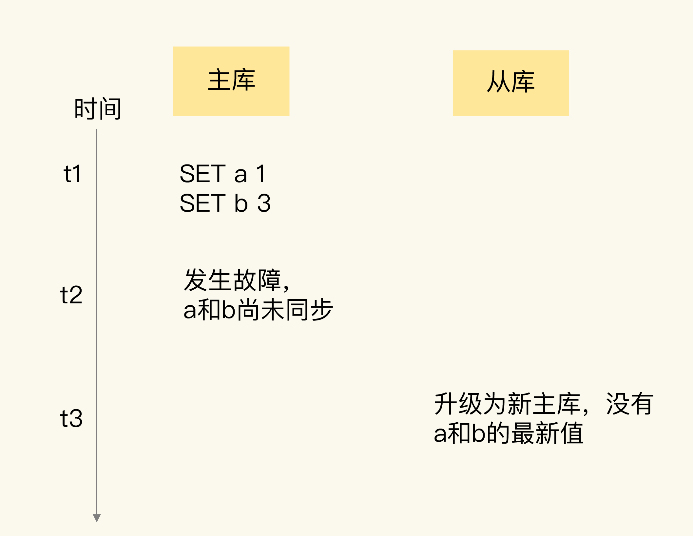
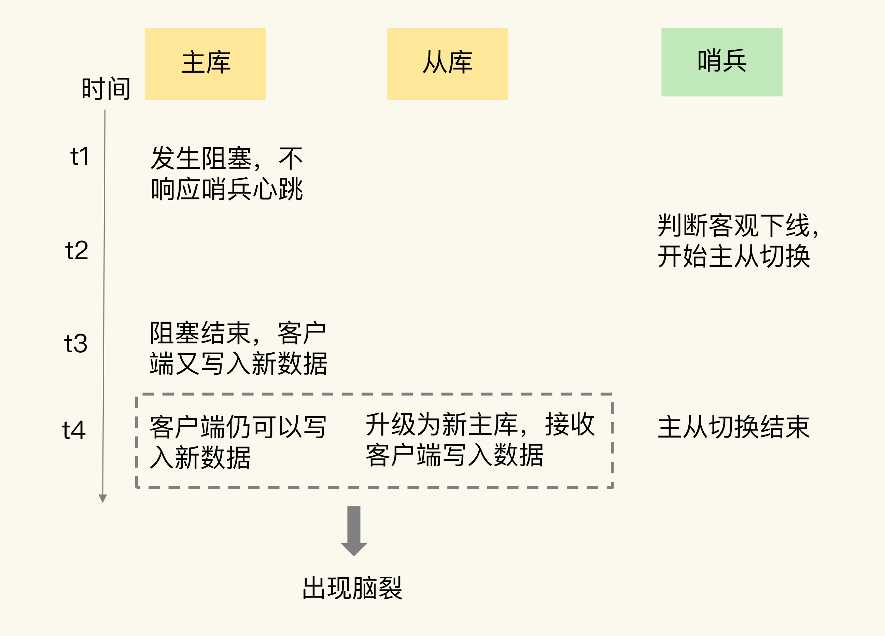
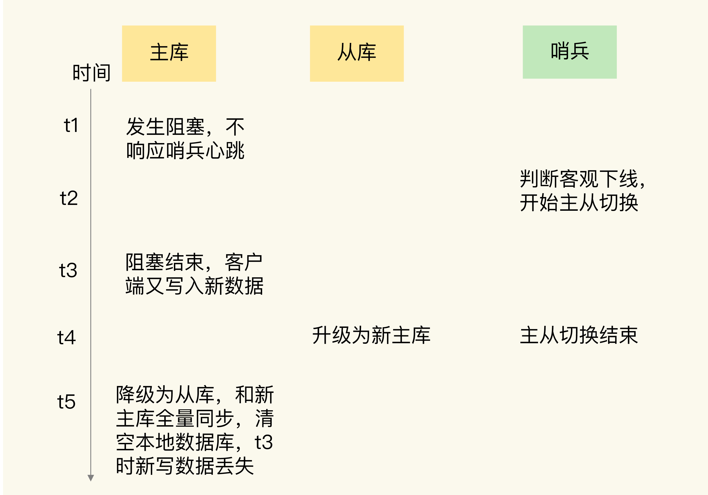

# 脑裂：一次奇怪的数据丢失

你好，我是蒋德钧。

在使用主从集群时，我曾遇到过这样一个问题：我们的主从集群有 1 个主库、5 个从库和 3 个哨兵实例，在使用的过程中，我们发现客户端发送的一些数据丢失了，这直接影响到了业务层的数据可靠性。

通过一系列的问题排查，我们才知道，这其实是主从集群中的脑裂问题导致的。

所谓的脑裂，就是指在主从集群中，同时有两个主节点，它们都能接收写请求。而脑裂最直接的影响，就是客户端不知道应该往哪个主节点写入数据，结果就是不同的客户端会往不同的主节点上写入数据。而且，严重的话，脑裂会进一步导致数据丢失。

那么，主从集群中为什么会发生脑裂？脑裂为什么又会导致数据丢失呢？我们该如何避免脑裂的发生呢？这节课，我就结合我遇见的这个真实问题，带你一起分析和定位问题，帮助你掌握脑裂的成因、后果和应对方法。

## 为什么会发生脑裂？ 

刚才我提到，我最初发现的问题是，在主从集群中，客户端发送的数据丢失了。所以，我们首先要弄明白，为什么数据会丢失？是不是数据同步出了问题？

### 第一步：确认是不是数据同步出现了问题 

在主从集群中发生数据丢失，最常见的原因就是**主库的数据还没有同步到从库，结果主库发生了故障，等从库升级为主库后，未同步的数据就丢失了。**

如下图所示，新写入主库的数据 a:1、b:3，就因为在主库故障前未同步到从库而丢失了。

如果是这种情况的数据丢失，我们可以通过比对主从库上的复制进度差值来进行判断，也就是计算 master_repl_offset 和 slave_repl_offset 的差值。如果从库上的 slave_repl_offset 小于原主库的 master_repl_offset，那么，我们就可以认定数据丢失是由数据同步未完成导致的。

我们在部署主从集群时，也监测了主库上的 master_repl_offset，以及从库上的 slave_repl_offset。但是，当我们发现数据丢失后，我们检查了新主库升级前的 slave_repl_offset，以及原主库的 master_repl_offset，它们是一致的，也就是说，这个升级为新主库的从库，在升级时已经和原主库的数据保持一致了。那么，为什么还会出现客户端发送的数据丢失呢？

分析到这里，我们的第一个设想就被推翻了。这时，我们想到，所有的数据操作都是从客户端发送给 Redis 实例的，那么，是不是可以从客户端操作日志中发现问题呢？紧接着，我们就把目光转到了客户端。

### 第二步：排查客户端的操作日志，发现脑裂现象 

在排查客户端的操作日志时，我们发现，在主从切换后的一段时间内，有一个客户端仍然在和原主库通信，并没有和升级的新主库进行交互。这就相当于主从集群中同时有了两个主库。根据这个迹象，我们就想到了在分布式主从集群发生故障时会出现的一个问题：脑裂。

但是，不同客户端给两个主库发送数据写操作，按道理来说，只会导致新数据会分布在不同的主库上，并不会造成数据丢失。那么，为什么我们的数据仍然丢失了呢？

到这里，我们的排查思路又一次中断了。不过，在分析问题时，我们一直认为“从原理出发是追本溯源的好方法”。脑裂是发生在主从切换的过程中，我们猜测，肯定是漏掉了主从集群切换过程中的某个环节，所以，我们把研究的焦点投向了主从切换的执行过程。

### 第三步：发现是原主库假故障导致的脑裂 

我们是采用哨兵机制进行主从切换的，当主从切换发生时，一定是有超过预设数量（quorum 配置项）的哨兵实例和主库的心跳都超时了，才会把主库判断为客观下线，然后，哨兵开始执行切换操作。哨兵切换完成后，客户端会和新主库进行通信，发送请求操作。

但是，在切换过程中，既然客户端仍然和原主库通信，这就表明，**原主库并没有真的发生故障**（例如主库进程挂掉）。我们猜测，主库是由于某些原因无法处理请求，也没有响应哨兵的心跳，才被哨兵错误地判断为客观下线的。结果，在被判断下线之后，原主库又重新开始处理请求了，而此时，哨兵还没有完成主从切换，客户端仍然可以和原主库通信，客户端发送的写操作就会在原主库上写入数据了。

为了验证原主库只是“假故障”，我们也查看了原主库所在服务器的资源使用监控记录。

的确，我们看到原主库所在的机器有一段时间的 CPU 利用率突然特别高，这是我们在机器上部署的一个数据采集程序导致的。因为这个程序基本把机器的 CPU 都用满了，导致 Redis 主库无法响应心跳了，在这个期间内，哨兵就把主库判断为客观下线，开始主从切换了。不过，这个数据采集程序很快恢复正常，CPU 的使用率也降下来了。此时，原主库又开始正常服务请求了。

正因为原主库并没有真的发生故障，我们在客户端操作日志中就看到了和原主库的通信记录。等到从库被升级为新主库后，主从集群里就有两个主库了，到这里，我们就把脑裂发生的原因摸清楚了。

为了帮助你加深理解，我再画一张图，展示一下脑裂的发生过程。

弄清楚了脑裂发生的原因后，我们又结合主从切换的原理过程进行了分析，很快就找到数据丢失的原因了。

## 为什么脑裂会导致数据丢失？ 

主从切换后，从库一旦升级为新主库，哨兵就会让原主库执行 slave of 命令，和新主库重新进行全量同步。而在全量同步执行的最后阶段，原主库需要清空本地的数据，加载新主库发送的 RDB 文件，这样一来，原主库在主从切换期间保存的新写数据就丢失了。

下面这张图直观地展示了原主库数据丢失的过程。

到这里，我们就完全弄明白了这个问题的发生过程和原因。

在主从切换的过程中，如果原主库只是“假故障”，它会触发哨兵启动主从切换，一旦等它从假故障中恢复后，又开始处理请求，这样一来，就会和新主库同时存在，形成脑裂。等到哨兵让原主库和新主库做全量同步后，原主库在切换期间保存的数据就丢失了。

看到这里，你肯定会很关心，我们该怎么应对脑裂造成的数据丢失问题呢？

## 如何应对脑裂问题？ 

刚刚说了，主从集群中的数据丢失事件，归根结底是因为发生了脑裂。所以，我们必须要找到应对脑裂问题的策略。

既然问题是出在原主库发生假故障后仍然能接收请求上，我们就开始在主从集群机制的配置项中查找是否有限制主库接收请求的设置。

通过查找，我们发现，Redis 已经提供了两个配置项来限制主库的请求处理，分别是 min-slaves-to-write 和 min-slaves-max-lag。

- min-slaves-to-write：这个配置项设置了主库能进行数据同步的最少从库数量；

- min-slaves-max-lag：这个配置项设置了主从库间进行数据复制时，从库给主库发送 ACK 消息的最大延迟（以秒为单位）。

有了这两个配置项后，我们就可以轻松地应对脑裂问题了。具体咋做呢？

我们可以把 min-slaves-to-write 和 min-slaves-max-lag 这两个配置项搭配起来使用，分别给它们设置一定的阈值，假设为 N 和 T。这两个配置项组合后的要求是，主库连接的从库中至少有 N 个从库，和主库进行数据复制时的 ACK 消息延迟不能超过 T 秒，否则，主库就不会再接收客户端的请求了。

即使原主库是假故障，它在假故障期间也无法响应哨兵心跳，也不能和从库进行同步，自然也就无法和从库进行 ACK 确认了。这样一来，min-slaves-to-write 和 min-slaves-max-lag 的组合要求就无法得到满足，原主库就会被限制接收客户端请求，客户端也就不能在原主库中写入新数据了。

等到新主库上线时，就只有新主库能接收和处理客户端请求，此时，新写的数据会被直接写到新主库中。而原主库会被哨兵降为从库，即使它的数据被清空了，也不会有新数据丢失。

我再来给你举个例子。

假设我们将 min-slaves-to-write 设置为 1，把 min-slaves-max-lag 设置为 12s，把哨兵的 down-after-milliseconds 设置为 10s，主库因为某些原因卡住了 15s，导致哨兵判断主库客观下线，开始进行主从切换。同时，因为原主库卡住了 15s，没有一个从库能和原主库在 12s 内进行数据复制，原主库也无法接收客户端请求了。这样一来，主从切换完成后，也只有新主库能接收请求，不会发生脑裂，也就不会发生数据丢失的问题了。

## 小结 

这节课，我们学习了主从切换时可能遇到的脑裂问题。脑裂是指在主从集群中，同时有两个主库都能接收写请求。在 Redis 的主从切换过程中，如果发生了脑裂，客户端数据就会写入到原主库，如果原主库被降为从库，这些新写入的数据就丢失了。

脑裂发生的原因主要是原主库发生了假故障，我们来总结下假故障的两个原因。

1. 和主库部署在同一台服务器上的其他程序临时占用了大量资源（例如 CPU 资源），导致主库资源使用受限，短时间内无法响应心跳。其它程序不再使用资源时，主库又恢复正常。

2. 主库自身遇到了阻塞的情况，例如，处理 bigkey 或是发生内存 swap（你可以复习下[第 19 讲](第 19 讲)中总结的导致实例阻塞的原因），短时间内无法响应心跳，等主库阻塞解除后，又恢复正常的请求处理了。

为了应对脑裂，你可以在主从集群部署时，通过合理地配置参数 min-slaves-to-write 和 min-slaves-max-lag，来预防脑裂的发生。

在实际应用中，可能会因为网络暂时拥塞导致从库暂时和主库的 ACK 消息超时。在这种情况下，并不是主库假故障，我们也不用禁止主库接收请求。

所以，我给你的建议是，假设从库有 K 个，可以将 min-slaves-to-write 设置为 K/2+1（如果 K 等于 1，就设为 1），将 min-slaves-max-lag 设置为十几秒（例如 10～20s），在这个配置下，如果有一半以上的从库和主库进行的 ACK 消息延迟超过十几秒，我们就禁止主库接收客户端写请求。

这样一来，我们可以避免脑裂带来数据丢失的情况，而且，也不会因为只有少数几个从库因为网络阻塞连不上主库，就禁止主库接收请求，增加了系统的鲁棒性。

## 每课一问 

按照惯例，我给你提个小问题，假设我们将 min-slaves-to-write 设置为 1，min-slaves-max-lag 设置为 15s，哨兵的 down-after-milliseconds 设置为 10s，哨兵主从切换需要 5s。主库因为某些原因卡住了 12s，此时，还会发生脑裂吗？主从切换完成后，数据会丢失吗？

欢迎在留言区写下你的思考和答案，我们一起交流讨论。如果你觉得今天的内容对你有所帮助，也欢迎你分享给你的朋友或同事。我们下节课见。

