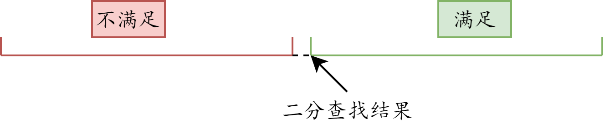
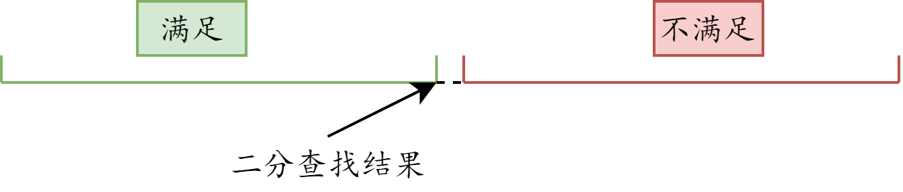
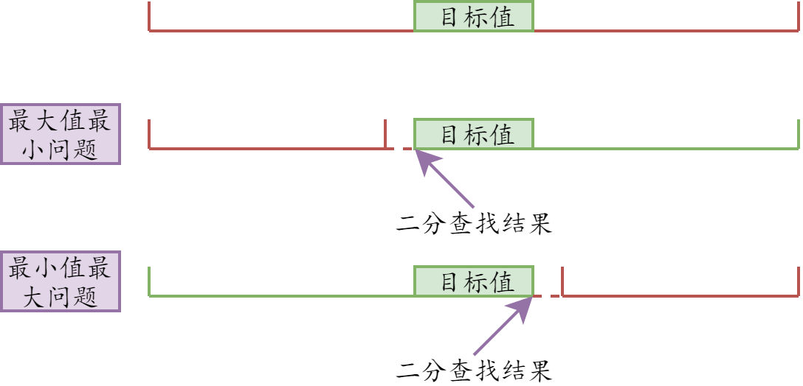

# 整数二分

所谓的整数二分，就是以下两类问题：

- **最大值最小问题**
    
- **最小值最大问题**
    

二分模板一共有两个，分别适用于不同情况。
算法思路：假设目标值在闭区间[l, r]中， 每次将区间长度缩小一半，当l = r时，我们就找到了目标值。

## 最大值最小问题

 

当区间[l, r]的更新操作是r = mid; l = mid + 1;时，计算mid时不需要加1。

```java
int bsearch_1(int l, int r)
{
    while (l < r)
    {
        int mid = l + r >> 1;
        if (check(mid)) r = mid;
        else l = mid + 1;
    }
    return l;
}
```

以上二分模板用来解**最大值最小问题**。

## 最小值最大问题


当区间[l, r]的更新操作是r = mid - 1; l = mid;时，计算mid时需要加1。

```java
int bsearch_2(int l, int r)
{
    while (l < r)
    {
        int mid = l + r + 1 >> 1;
        if (check(mid)) l = mid;
        else r = mid - 1;
    }
    return l;
}
```

以上二分模板用来解**最小值最大问题**。

## 例题 - 数的范围

【例题】：[Acwing789 数的范围](https://www.acwing.com/problem/content/791/)

### 思路



有了上图的思路，在把check函数完成，是一道**模板题**。

### 类似题

【例题】：[Acwing790 三次方根](https://www.acwing.com/problem/content/792/)

该题非整数二分，仅仅是普通二分查找，故更新条件为`r=mid`和`l=mid`。

【例题】：[Acwing730 机器人跳跃问题](https://www.acwing.com/problem/content/732/)

该题就是最大值最小问题，借助模板即可。😊

【例题】：[Acwing1221 四平方和](https://www.acwing.com/problem/content/1223/)

这道题与leetcode上面一道题目类似:[四数相加2](https://leetcode-cn.com/problems/4sum-ii/)

【例题】：[Acwing1227 分巧克力](https://www.acwing.com/problem/content/1229/)

这是一道可以用最小值最大的二分求解。