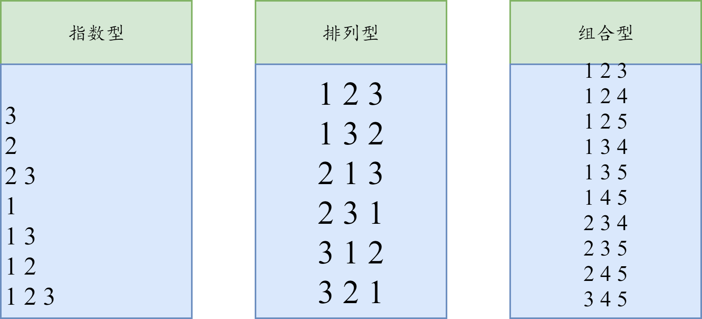
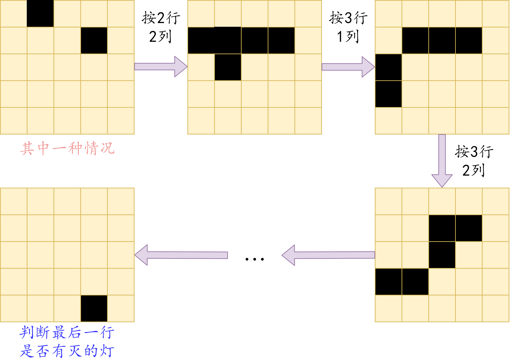

# 递归与递推

&#160;&#160;&#160;&#160;该类题目主要有三类：
- 递归实现指数型枚举
- 递归实现排列型枚举
- 递归实现组合型枚举

  

## 递归实现指数型枚举

【例题】：[Acwing92 递归实现指数型枚举](https://www.acwing.com/problem/content/94/)

```java
/*
 * 用二进制状态压缩。也就是用二进制上的位来记录数有没有被用过。
 */
// m是当前枚举到的数 k是二进制数记录哪些数被选
public static void dfs(int m, int k) {
    if (m == n) {
        for (int i = 0; i < n; i++) {
             //判断第i位是不是1，即有没有被选，如果被选就输出
            if (((k >> i) & 1) == 1) {
                 //因为题目是从1开始的，所以要加1
                System.out.print((i + 1) + " ");
            }
        }
        System.out.println();
        return;
    }
    //不用这个数，不进行操作
    dfs(m + 1, k);
    //用这个数，把第u位变成1
    dfs(m + 1, k | (1 << m));
}
```

## 递归实现排列型枚举

这正是蓝桥杯常考的全排列。即 `n!`个可能性，也就是
```math
 A ^{n-1}_{n}
```

【例题】：[Acwing94 递归实现排列型枚举](https://www.acwing.com/problem/content/96/)

```java
public static void dfs(int i) throws IOException {
    if (i == n) {
        for (int j = 0; j < n; j++) {
            bufferedWriter.write(map[j] + " ");
        }
        bufferedWriter.write("\n");
        return;
    }
    for (int j = 0; j < n; j++) {
        if (!st[j]) {
            st[j] = true;
            map[i] = j + 1;
            dfs(i + 1);
            st[j] = false;
        }
    }
}
```

## 递归实现组合型枚举

即 `n!/(n-m)!`，也就是：

```math
 C ^{m}_{n}
```

【例题】：[Acwing93 递归实现组合型枚举](https://www.acwing.com/problem/content/95/)

```java
private static void dfs(int x, int start) throws IOException {
    if (x == m) {
        for (int i = 0; i < m; i++) {
            bufferedWriter.write(map[i] + " ");
        }
        bufferedWriter.write("\n");
        return;
    }
    for (int i = start; i < n; i++) {
        map[x] = i + 1;
        dfs(x + 1, i + 1);
    }
}
```

## 全排列 - 例题

【例题】 [Acwing1209 带分数](https://www.acwing.com/problem/content/1211/)


## 费解的开关 - 例题 

【例题】 [Acwing95 费解的开关](https://www.acwing.com/problem/content/97/)



### 开关灯的技巧

```java
static int[] x = {-1, 0, 1, 0, 0};
static int[] y = {0, 0, 0, -1, 1};
private static void trun(int i, int j) {
    for (int k = 0; k < 5; k++) {
        int a = i + x[k];
        int b = j + y[k];
        if (a < 0 || a == 5 || b < 0 || b == 5) {
            continue;
        }
        map[a][b] ^= 1;
    }
}
```
【类似】 [Acwing1208 翻硬币](https://www.acwing.com/problem/content/1210/)

【类似】 [Acwing116 飞行员兄弟](https://www.acwing.com/problem/content/118/)