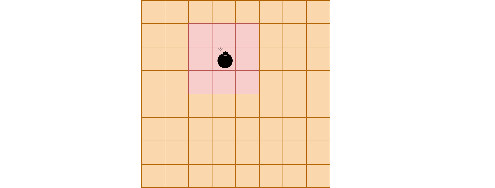

# 前缀和

## 一维前缀和

对应数组`a[n]`,他的前缀和用`b[n]`表式的话有：

```java
b[i] = a[i] + a[i-1]...a[2] + a[1]
b[l,r] = b[r] - b[l-1]
```

## 二维前缀和

S[i, j] = 第i行j列格子左上部分所有元素的和以(x1, y1)为左上角，(x2,y2)为右下角的子矩阵的和为 `S[x2, y2] - S[x1 - 1, y2] - S[x2, y1 - 1] + S[x1- 1, y1 - 1]`


## 一维前缀和 - 例题

【例题】: [acwing 795 前缀和](https://www.acwing.com/problem/content/797/)

### 类似题

【例题】 ： [acwing 1230 K倍区间](https://www.acwing.com/problem/content/1232/)

### O(n^2)解法

```java
for (int i = 1; i <= n; i++) {
    for (int j = (i - 1); j >= 0 ; j--) {
        if ((map[i]- map[j]) % k == 0 ){
            res++;
        }
    }
}
```

### 优化

发现`(map[i]- map[j]) % k == 0`就等于`map[i] % k - map[j] % k = 0`。即我们可以统计该数的`余数`在之前出现的次数，以实现O(n)时间复杂度的优化。

```java
 for (int i = 1; i <= N; i++) {
    String[] s = in.readLine().split(" ");
    sum[i] = (sum[i-1] + Integer.parseInt(s[0]))%K;
    //count 作为统计当前数出现的个数
    //如果当前数在前面已经出现过k次，那么现在有一个同样的数，答案的个数就会新增k+1个数
    ans += count[sum[i]];
    //当前数出现的个数+1
    count[sum[i]]++;
}
//如果一个区间的和为k的倍数，那么(sum[k] - sum[j])%k==0
//可以推出来 sum[k] % k = sum[j] % k
System.out.println(ans);
```

## 二维前缀和 - 例题

【例题】: [acwing 796 子矩阵的和](https://www.acwing.com/problem/content/798/)

### 类似题

【例题】 ： [acwing 99 激光炸弹](https://www.acwing.com/problem/content/101/)



如图所示，其实就是求[x-1,y-1]到[x+1,y+1]的前缀和。