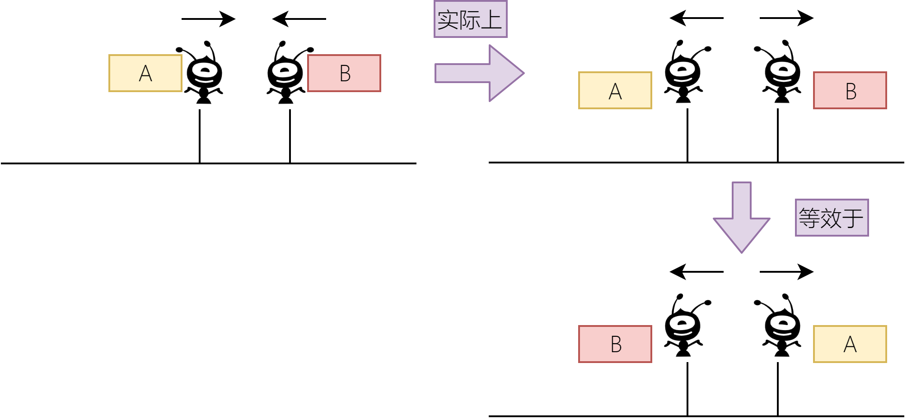

# 数学

这一部分需要不断的积累，多做题才行。且没有方法可言！

## 买不到的数目

【例题】 [acwing1205 买不到的数目](https://www.acwing.com/problem/content/1207/)

### 结论
**对于n和m两个互质的数**

满足最大不能组合数为 **n\*m-n-m**；

所有不能表示的数的个数为 **（n-1）\*（m-1）/2**；

## 饮料换购

【例题】 [acwing1216 饮料换购](https://www.acwing.com/problem/content/1218/)

这道题似乎只是一道`while()`循环结构的题目

```java
package acwing;

import java.util.Scanner;

public class Main1216 {

    public static void main(String[] args) {
        Scanner scanner = new Scanner(System.in);
        int n = scanner.nextInt();
        int res = n;
        while (n > 2) {
            res += n / 3;
            n = n / 3 + n % 3;
        }
        System.out.println(res);
    }

}
```

但是y总上课提到A/B**上取整**的公式如下：

```tex
\frac{A}{B} = \frac{A+B-1}{B} 
```

## 蚂蚁感冒

【例题】 [acwing1211 蚂蚁感冒](https://www.acwing.com/problem/content/1213/)



[参考题解](https://www.acwing.com/solution/AcWing/content/7077/)

首先我们必须要明白两只蚂蚁相撞掉头可以看作时一只蚂蚁穿过了另一只蚂蚁，因为相撞之后两只蚂蚁都感冒了，掉不掉头其实无所谓，毕竟都感冒了，这样的话这题就简单多了。我们先不考虑特殊情况，先来看看一般情况：

第一只蚂蚁不管方向朝哪里，只要它右边的蚂蚁向左走就可能碰撞感染，同样，第一只蚂蚁左边的蚂蚁只要朝右边走也可能被感染，这样就很容易得到ans=right+left+1。这里left表示左边蚂蚁向右走的数量，right表示右边蚂蚁向左走的数量，11是指第一只蚂蚁本身。

还有一种特殊情况，就是当第一只蚂蚁向左走的时候，如果第一只蚂蚁左边没有向右爬行的蚂蚁，由于爬行速度相同，所以不管第一只蚂蚁右边有多少向左爬行的，其右边的蚂蚁永远不可能被感染。同理，当第一只蚂蚁向右走的时候，如果第一只蚂蚁右边没有向左爬行的蚂蚁，其左边也永远不可能感染。