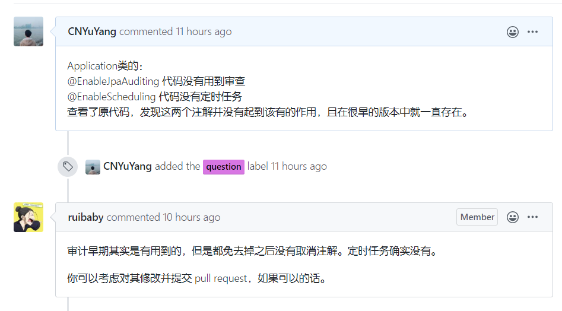

# 前言

最早看到这个博客的源码的时候是通过B站up主-[**CodeSheep**](https://space.bilibili.com/384068749)的一个视频：[Java企业级开源项目推荐，帮助大家从学习走向实践](https://www.bilibili.com/video/av49644128)，奈何当时自己知识有限，没有仔细的阅读源码。近日Halo也推出了正式版，我也就抱着学习的心态拜读一下。

首先打开工程，看到整个工程有以下两个明显的变化：

- 配置文件由properties变为yaml

可以明显的看到，在处理层级关系的时候，properties需要使用大量的路径来描述层级（或者属性），比如environments.dev.url和environments.dev.name。其次，对于较为复杂的结构，比如数组（my.servers），写起来更为复杂。而对应的YAML格式文件就简单很多：

- 构建工具由Meavn变为Gradle

因为此前有过Android的开发经验，所以这一改变对我的影响并不大😄。Gradle逐渐替代meavn应该是目前的趋势，由于目前大部分教学和企业采用的还是以Meavn为主，所以此前我也未曾尝试过采用Gradle构建项目。由此看出Halo还是很Fashion的👍。

# Application

首先打开``Application.java``文件，看看有什么学习的地方🤤。

```java
@SpringBootApplication
@EnableJpaAuditing
@EnableScheduling
@EnableAsync
@EnableJpaRepositories(basePackages = "run.halo.app.repository", repositoryBaseClass = BaseRepositoryImpl.class)
public class Application extends SpringBootServletInitializer {

    private static ConfigurableApplicationContext CONTEXT;

    public static void main(String[] args) {
        // Customize the spring config location
        System.setProperty("spring.config.additional-location", "file:${user.home}/.halo/,file:${user.home}/halo-dev/");

        // Run application
        CONTEXT = SpringApplication.run(Application.class, args);

    }

    /**
     * Restart Application.
     */
    public static void restart() {
        ApplicationArguments args = CONTEXT.getBean(ApplicationArguments.class);

        Thread thread = new Thread(() -> {
            CONTEXT.close();
            CONTEXT = SpringApplication.run(Application.class, args.getSourceArgs());
        });

        thread.setDaemon(false);
        thread.start();
    }

    @Override
    protected SpringApplicationBuilder configure(SpringApplicationBuilder application) {
        System.setProperty("spring.config.additional-location", "file:${user.home}/.halo/,file:${user.home}/halo-dev/");
        return application.sources(Application.class);
    }
}

```

# 注解

处处留心皆学问，该类一共打上了5个注解：

```java
@SpringBootApplication
@EnableJpaAuditing
@EnableScheduling
@EnableAsync
@EnableJpaRepositories(basePackages = "run.halo.app.repository", repositoryBaseClass = BaseRepositoryImpl.class)
```

## @SpringBootApplication

@SpringBootApplication = (默认属性)@Configuration + @EnableAutoConfiguration + @ComponentScan

这个注解大家应该比较熟悉

## @EnableJpaAuditing

审计功能：[https://blog.csdn.net/niceyoo/article/details/90452669](https://blog.csdn.net/niceyoo/article/details/90452669)

但是审计功能在现在的`Halo`中不再使用，所以改注解可以删除。

## @EnableScheduling

定时任务：[https://www.jianshu.com/p/9d18039c0f08](https://www.jianshu.com/p/9d18039c0f08)

但是定时任务功能在现在的`Halo`中也不再使用，所以改注解可以删除。

已向作者求证:



## @EnableAsync

开启多线程、异步任务：[https://blog.csdn.net/hy_coming/article/details/93885115](https://blog.csdn.net/hy_coming/article/details/93885115)

Halo为许多的`EventListener`都开启了异步方法：

```java
    @Async
    @EventListener
    public void handleCommentNewEvent(CommentNewEvent newEvent) {
        Boolean newCommentNotice = optionService.getByPropertyOrDefault(CommentProperties.NEW_NOTICE, Boolean.class, false);

        if (!newCommentNotice) {
            // Skip mailing
            return;
        }
        ...
```

## @EnableJpaRepositories

主要是配置`repositoryBaseClass`：[https://www.cnblogs.com/blog5277/p/10661441.html](https://www.cnblogs.com/blog5277/p/10661441.html)

实现Repositories的进一步抽象，具体的分析，等到Repositories章节。

# 继承

继承了`SpringBootServletInitializer`，字面意思就是Servlet的初始化，但是Spring Boot默认是不支持Servlet的，为了方便用户打包成war包而继承`SpringBootServletInitializer`，从而实现`configure`方法。

```java
@Override
protected SpringApplicationBuilder configure(SpringApplicationBuilder application) {
    System.setProperty("spring.config.additional-location", "file:${user.home}/.halo/,file:${user.home}/halo-dev/");
    return application.sources(Application.class);
}
```

# 方法

## 重启

```java
/**
 * Restart Application.
 */
public static void restart() {
    ApplicationArguments args = CONTEXT.getBean(ApplicationArguments.class);

    Thread thread = new Thread(() -> {
        CONTEXT.close();
        CONTEXT = SpringApplication.run(Application.class, args.getSourceArgs());
    });

    thread.setDaemon(false);
    thread.start();
}
```

**不在新线程中执行是否可行？**

不可行，CONTEXT.close()执行后，程序便结束;

**新线程不设置setDaemon(false)是否可行？线程本身便是用户线程？**

不行，线程类的init方法中有一句代码 `this.daemon = parent.isDaemon(); `应该是当前线程，如果没有设置，则 daemon 继承自父线程。 你在Main函数中创建线程，那么父线程就是 Main 主线程。 你在GetMapping中创建线程，那么父线程是 处理请求的线程池 中的线程。（可能是线程池中的线程，就是个守护线程，所以。它创建的线程。默认也是守护线程。）

参考阅读：

[https://segmentfault.com/a/1190000018858017](https://segmentfault.com/a/1190000018858017)

[http://www.spring4all.com/article/1830](http://www.spring4all.com/article/1830)

[https://springboot.io/t/topic/1917](https://springboot.io/t/topic/1917)

# 细节

**System.setProperty("spring.config.additional-location", "...");**

开发者给了以下注释：`Customize the spring config location`（定制spring配置文件的位置）

存在以下三个疑问：

1、System.setProperty有何用？

setProperty (String prop, String value); 

- 设置指定键对值的系统属性，其中prop：系统属性的名称，value：系统属性的值。注：这里的system，系统指的是 JRE (runtime)system，不是指 OS。 
- System.setProperty相当于一个静态变量，存在内存里面，可以在项目的任何一个地方，通过System.getProperty("变量")来获得

2、为何要设定这个变量？

加载外部配置文件。打包jar运行也不方便修改jar内部数据，通过设置环境变量spring.config.location。因为博客中也有很多配置选项，所以猜想需要从外部读取某些会改变的配置，需要继续阅读源码验证猜想。

3、${user.home}从何而来？

如前所示user.home应该是一个静态变量，尝试打印：

```java
System.out.println(System.getProperty("user.home"));
//打印出：C:\Users\74472 验证猜想成功
```


| 变量 | 含义 |
| ---- | ---- |
| java.version | Java 运行时环境版本 |
| java.vendor | Java 运行时环境供应商|
|java.vendor.url|Java 供应商的 URL|
|java.home|Java 安装目录|
|java.vm.specification.version|Java 虚拟机规范版本|
|java.vm.specification.vendor|Java 虚拟机规范供应商|
|java.vm.specification.name|Java 虚拟机规范名称|
|java.vm.version|Java 虚拟机实现版本|
|java.vm.vendor|Java 虚拟机实现供应商|
|java.vm.name|Java 虚拟机实现名称|
|java.specification.version|Java 运行时环境规范版本|
|java.specification.vendor|Java 运行时环境规范供应商|
|java.specification.name|Java 运行时环境规范名称|
|java.class.version|Java 类格式版本号|
|java.class.path|Java 类路径|
|java.library.path|加载库时搜索的路径列表|
|java.io.tmpdir|默认的临时文件路径|
|java.compiler|要使用的 JIT 编译器的名称|
|java.ext.dirs|一个或多个扩展目录的路径|
|os.name|操作系统的名称|
|os.arch|操作系统的架构|
|os.version|操作系统的版本|
|file.separator|文件分隔符（在 UNIX 系统中是“/”）|
|path.separator|路径分隔符（在 UNIX 系统中是“:”）|
|line.separator|行分隔符（在 UNIX 系统中是“/n”）|
|user.name|用户的账户名称|
|user.home|用户的主目录|
|user.dir|用户的当前工作目录|

# 演示代码

代码下载 : [demo-01](notes/源码阅读/Halo/code/demo-01.zip ':ignore') 

