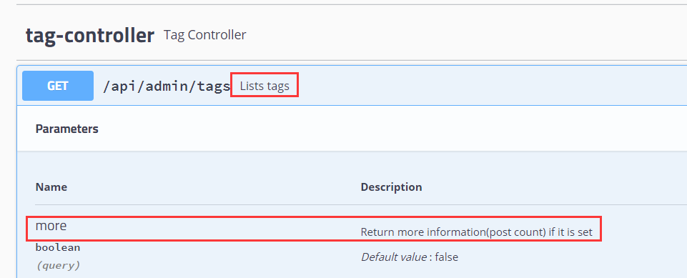

# Controller - Admin

这个包下面只有一个`api`一个包，`api`中处理的多是ajax请求，就是不涉及View视图层，以json格式进行数据传递。

且`xxxController`类处理的都是`/api/admin/xxx`请求。

且这些类的逻辑都是类似的，通过构造器将一个一个的`Service`注入进来，对于每一个请求，就调用相对应`Service`的方法。

# 构造器注入

Halo中所有的Service都是通过构造器进行注入的，这也是官方推荐的方式。

阅读资料：

[https://www.cnblogs.com/ydymz/p/10396201.html](https://www.cnblogs.com/ydymz/p/10396201.html)

# Swagger

Halo会为每一个请求，编写简单的Api文档，通过`@ApiOperation`和`@ApiParam`。

如：

```java
@GetMapping
@ApiOperation("Lists tags")
public List<? extends TagDTO> listTags(@SortDefault(sort = "createTime", direction = Sort.Direction.DESC) Sort sort,
                                       @ApiParam("Return more information(post count) if it is set")
                                       @RequestParam(name = "more", required = false, defaultValue = "false") Boolean more) {
    if (more) {
        return postTagService.listTagWithCountDtos(sort);
    }
    return tagService.convertTo(tagService.listAll(sort));
}
```

效果如图：



# 通过正则匹配URL

如：

```java
@GetMapping("{tagId:\\d+}")
```

Halo中的ID请求，都是通过正则匹配完成的，可以避免用户请求字符等情况。

# 参数传递

阅读资料：

[https://blog.csdn.net/u010775025/article/details/80198291](https://blog.csdn.net/u010775025/article/details/80198291)

## 传递方式

Halo中大部分的请求还是采用RESTFul，值的传递也是通过@PathVariable进行传递。

## @Valid

阅读材料：

[https://blog.csdn.net/weixin_38118016/article/details/80977207](https://blog.csdn.net/weixin_38118016/article/details/80977207)

## @RequestPart

阅读材料：

[https://blog.csdn.net/wd2014610/article/details/79727061](https://blog.csdn.net/wd2014610/article/details/79727061)

## @PageableDefault @SortDefault

当用户没有传递相关页面、排序信息时，设置默认信息。

阅读材料：

[https://www.jianshu.com/p/e0316e89a2db](https://www.jianshu.com/p/e0316e89a2db)

# 其他

在代码的组织过程中，还会用到`@CacheLock()`、`@DisableOnCondition`这两个自写的注解，这两个注解的功能分析就等到阅读注解的时候再分析。

