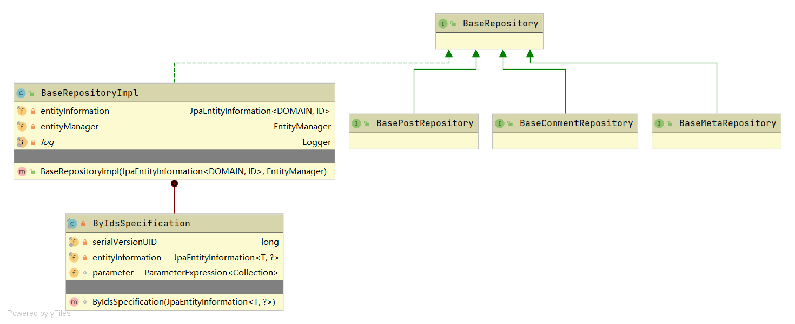

# Repository

这就是Spring-Data-Jpa的实践，建议大家可以阅读这个系列的文章 [http://www.spring4all.com/article/500](http://www.spring4all.com/article/500)。像`@Modifying`、`@Query`这样基础的注解，在这篇文章中都有介绍。

# 查询关键字

Spring Data JPA使用方法名可解决大部分的查询问题，但是也存在不能解决所有问题，以下是方法名中支持的关键字：

| Keyword             | Sample                                      | JPQL snippet                                                 |
| :------------------ | :------------------------------------------ | :----------------------------------------------------------- |
| `And`               | `findByLastnameAndFirstname`                | `… where x.lastname = ?1 and x.firstname = ?2`               |
| `Or`                | `findByLastnameOrFirstname`                 | `… where x.lastname = ?1 or x.firstname = ?2`                |
| `Is,Equals`         | `findByFirstnameIs`,`findByFirstnameEquals` | `… where x.firstname = ?1`                                   |
| `Between`           | `findByStartDateBetween`                    | `… where x.startDate between ?1 and ?2`                      |
| `LessThan`          | `findByAgeLessThan`                         | `… where x.age < ?1`                                         |
| `LessThanEqual`     | `findByAgeLessThanEqual`                    | `… where x.age <= ?1`                                        |
| `GreaterThan`       | `findByAgeGreaterThan`                      | `… where x.age > ?1`                                         |
| `GreaterThanEqual`  | `findByAgeGreaterThanEqual`                 | `… where x.age >= ?1`                                        |
| `After`             | `findByStartDateAfter`                      | `… where x.startDate > ?1`                                   |
| `Before`            | `findByStartDateBefore`                     | `… where x.startDate < ?1`                                   |
| `IsNull`            | `findByAgeIsNull`                           | `… where x.age is null`                                      |
| `IsNotNull,NotNull` | `findByAge(Is)NotNull`                      | `… where x.age not null`                                     |
| `Like`              | `findByFirstnameLike`                       | `… where x.firstname like ?1`                                |
| `NotLike`           | `findByFirstnameNotLike`                    | `… where x.firstname not like ?1`                            |
| `StartingWith`      | `findByFirstnameStartingWith`               | `… where x.firstname like ?1` (parameter bound with appended `%`) |
| `EndingWith`        | `findByFirstnameEndingWith`                 | `… where x.firstname like ?1` (parameter bound with prepended `%`) |
| `Containing`        | `findByFirstnameContaining`                 | `… where x.firstname like ?1` (parameter bound wrapped in `%`) |
| `OrderBy`           | `findByAgeOrderByLastnameDesc`              | `… where x.age = ?1 order by x.lastname desc`                |
| `Not`               | `findByLastnameNot`                         | `… where x.lastname <> ?1`                                   |
| `In`                | `findByAgeIn(Collection<Age> ages)`         | `… where x.age in ?1`                                        |
| `NotIn`             | `findByAgeNotIn(Collection<Age> ages)`      | `… where x.age not in ?1`                                    |
| `True`              | `findByActiveTrue()`                        | `… where x.active = true`                                    |
| `False`             | `findByActiveFalse()`                       | `… where x.active = false`                                   |
| `IgnoreCase`        | `findByFirstnameIgnoreCase`                 | `… where UPPER(x.firstame) = UPPER(?1)`                      |

按照上述的命名规则，Jpa会自动帮我们实现SQL的编辑。

# 接口的抽象

我们先看一下base包的UML结构：



`Halo`中抽象出`BaseRepository`中定义了3个方法：

- `List<DOMAIN> findAllByIdIn(@NonNull Collection<ID> ids, @NonNull Sort sort);`
- `Page<DOMAIN> findAllByIdIn(@NonNull Collection<ID> ids, @NonNull Pageable pageable);`
- `long deleteByIdIn(@NonNull Collection<ID> ids);`

都是与批量操作有关的。

在`BaseRepository`的基础上Halo还抽象出`BasePostRepository`、`BaseCommentRepository`和`BaseMetaRepository`。

## BaseRepository的实现

对于`List<DOMAIN> findAllByIdIn(@NonNull Collection<ID> ids, @NonNull Sort sort)`的实现：

```java
@Override
public List<DOMAIN> findAllByIdIn(Collection<ID> ids, Sort sort) {
    Assert.notNull(ids, "The given Collection of Id's must not be null!");
    Assert.notNull(sort, "Sort info must nto be null");

    log.debug("Customized findAllById method was invoked");

    if (!ids.iterator().hasNext()) {
        return Collections.emptyList();
    }

    if (entityInformation.hasCompositeId()) {
        List<DOMAIN> results = new ArrayList<>();
        ids.forEach(id -> super.findById(id).ifPresent(results::add));
        return results;
    }

    ByIdsSpecification<DOMAIN> specification = new ByIdsSpecification<>(entityInformation);
    TypedQuery<DOMAIN> query = super.getQuery(specification, sort);
    return query.setParameter(specification.parameter, ids).getResultList();
}
```

如果是复合ID，就遍历ID参数。挨个的 `findById`检索。

如果不是复合ID的话，就直接用 `WHERE ID IN (..)` 这种方式来检索，省事儿。不用遍历。

?> 对于不是复合ID的情况，采用Criteria的方式，目前还未完全弄懂

# Optional

Optional对于NPE(NullPointerException)的处理十分的优雅。

阅读材料：

[https://www.jianshu.com/p/d81a5f7c9c4e](https://www.jianshu.com/p/d81a5f7c9c4e)