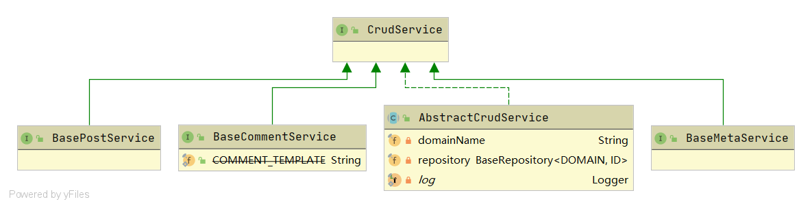

# Service

`Service`和`Repository`是相互对应的，同样的也有四个基类，以及他们的实现。他们的实现都做为抽象类，不会实例化，仅仅做为其他impl的父类。



?>主要的逻辑处理都是在`Service`中进行的。有很多处理的比较好的地方，都是值得学习的地方。比如说 登入、鉴权、文件的处理。这些都在后面介绍。

# 获取泛型名字

`AbstractCrudService`中的一个函数，获取的类型仅用作log输出。

```java
/**
 * Gets actual generic type.
 *
 * @param index generic type index
 * @return real generic type will be returned
 */
private Type fetchType(int index) {
    Assert.isTrue(index >= 0 && index <= 1, "type index must be between 0 to 1");

    return ((ParameterizedType) this.getClass().getGenericSuperclass()).getActualTypeArguments()[index];
}
```

调用：

```java
Class<DOMAIN> domainClass = (Class<DOMAIN>) fetchType(0);
domainName = domainClass.getSimpleName();
```

# 判空

在进行逻辑操作之前，Halo都会对传进来的参数进行一次判空：

```java
Assert.notNull(domain, domainName + " data must not be null");
```

# @Transactional

- 异常在A方法内抛出，则A方法就得加注解
- 多个方法嵌套调用，如果都有 @Transactional 注解，则产生事务传递，需要 Propagation.REQUIRED
- 如果注解上只写 @Transactional 默认只对 RuntimeException 回滚，而非 Exception 进行回滚
- 如果要对 checked Exceptions 进行回滚，则需要 @Transactional(rollbackFor = Exception.class)

# Optional

因为`Repository`会将数据封装进`Optional`，所以在`Serive`中就可以有以下操作：

```java
postOptional.orElseThrow(() -> new NotFoundException("查询不到该文章的信息").setErrorData(slug))
```

# Specification

动态SQL，避免大量的if-else 的出现，比如说下面的`AttachmentQuery`，就可以根据其字段的取值做拼接。

```java
@NonNull
private Specification<Attachment> buildSpecByQuery(@NonNull AttachmentQuery attachmentQuery) {
    Assert.notNull(attachmentQuery, "Attachment query must not be null");

    return (Specification<Attachment>) (root, query, criteriaBuilder) -> {
        List<Predicate> predicates = new LinkedList<>();

        if (attachmentQuery.getMediaType() != null) {
            predicates.add(criteriaBuilder.equal(root.get("mediaType"), attachmentQuery.getMediaType()));
        }

        if (attachmentQuery.getAttachmentType() != null) {
            predicates.add(criteriaBuilder.equal(root.get("type"), attachmentQuery.getAttachmentType()));
        }

        if (attachmentQuery.getKeyword() != null) {

            String likeCondition = String.format("%%%s%%", StringUtils.strip(attachmentQuery.getKeyword()));

            Predicate nameLike = criteriaBuilder.like(root.get("name"), likeCondition);

            predicates.add(criteriaBuilder.or(nameLike));
        }

        return query.where(predicates.toArray(new Predicate[0])).getRestriction();
    };
}
```

