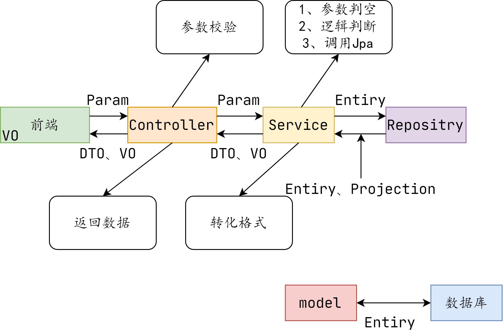

# Model

`Halo`对数据的类型有很严格的区分，该文件夹下有：`dto`、`entity`、`enums`、`params`、`projection`、`properties`、`support`、`vo`八个文件夹。

# 关系



1、与数据库表结构一一对应的是`Entiry`

2、前端发送的数据对应Param，如登入请求：

```java
@Data
@ToString
public class LoginParam {

    @NotBlank(message = "用户名或邮箱不能为空")
    @Size(max = 255, message = "用户名或邮箱的字符长度不能超过 {max}")
    private String username;

    @NotBlank(message = "登录密码不能为空")
    @Size(max = 100, message = "用户密码字符长度不能超过 {max}")
    private String password;

    @Size(min = 6, max = 6, message = "两步验证码应为 {max} 位")
    private String authcode;

}
```

2、Controller会对Param进行校验，如上制定一定的数据规范

3、Service则会对传进来的参数，做真正的逻辑处理。并调用对应的Jpa方法。

4、最后将获得的数据，做一步转化再返回前端。

# entity

`entity` 里的每一个字段，与数据库相对应。

## BaseEntity

```java
@Data
@ToString
@MappedSuperclass
@EqualsAndHashCode
public class BaseEntity {

    /**
     * Create time.
     */
    @Column(name = "create_time")
    @Temporal(TemporalType.TIMESTAMP)
    private Date createTime;

    /**
     * Update time.
     */
    @Column(name = "update_time")
    @Temporal(TemporalType.TIMESTAMP)
    private Date updateTime;

    @PrePersist
    protected void prePersist() {
        Date now = DateUtils.now();
        if (createTime == null) {
            createTime = now;
        }

        if (updateTime == null) {
            updateTime = now;
        }
    }

    @PreUpdate
    protected void preUpdate() {
        updateTime = new Date();
    }

    @PreRemove
    protected void preRemove() {
        updateTime = new Date();
    }

}
```

### @MappedSuperclass

1.`@MappedSuperclass`注解使用在父类上面，是用来标识父类的；

2.`@MappedSuperclass`标识的类表示其不能映射到数据库表，因为其不是一个完整的实体类，但是它所拥有的属性能够在其子类对用的数据库表中；

3.`@MappedSuperclass`标识的父类不能再有`@Entity`或`Table`注解，但其子类可以有`@Entity`或`@Table`注解，来映射到数据库中的表。

### @Temporal

数据库的字段类型有`date`、`time`、`datetime`，而`Temporal`注解的作用就是帮`java`的`Date`类型进行格式化，一共有三种注解值：

第一种：`@Temporal(TemporalType.DATE)`—>实体类会封装成日期`yyyy-MM-dd`的 Date类型。

第二种：`@Temporal(TemporalType.TIME)`—>实体类会封装成时间`hh-MM-ss`的 Date类型。

第三种：`@Temporal(TemporalType.TIMESTAMP)`—>实体类会封装成完整的时间`yyyy-MM-dd hh:MM:ss`的 Date类型。

### @PreUpdate @PreRemove @PrePersist

更新修改时间，创建时间。

## CustomIdGenerator

`Halo`在项目中的Id生成是使用自己写的ID生成器

```java
public class CustomIdGenerator extends IdentityGenerator {
    @Override
    public Serializable generate(SharedSessionContractImplementor session, Object object) {
        Object id = ReflectionUtils.getFieldValue("id", object);
        if (id != null) {
            return (Serializable) id;
        }
        return super.generate(session, object);
    }
}
```

## @ Lob

[https://www.cnblogs.com/lifuhei/p/10412983.html](https://www.cnblogs.com/lifuhei/p/10412983.html)

## @DiscriminatorColumn

# Projection

在JPA的查询中，有一个不方便的地方，@Query注解，如果查询直接是

```sql
Select C from Customer c
```

,这时候，查询的返回对象就是Customer这个完整的对象，包含所有字段，对于我们的示例并没有什么问题，但是对于比较庞大的domain类，这个查询时就比较要命，并不是所有的字段都能用到，比较头疼。另外，如果定义

```sql
select c.firstName as firstName,c.lastName as lastName from Customer c
```

这个查询结果，返回的对象是Object类型，而且无法直接转换成Customer对象，这样用起来就不是很方便。