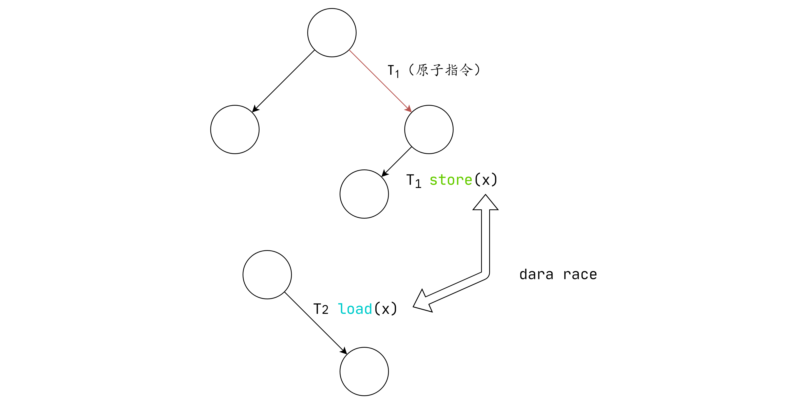

# 线程的互斥

## 互斥：直观理解

理解并发的另一个工具：`把线程想象成人、把共享内存想象成物理世界`

物理世界是天生并发的，在小范围宏观意义上，所有部分的空间“同时”沿着时间方向前进）

- 物理世界=共享内存
- 我们（根据想法执行物理世界动作）=线程（根据程序局部状态访问共享状态）

线程（我）想不被别人打断地做一件事，一旦某个人已经开始，其他人就必须等待。

## 共享内存的互斥：问题定义

互斥（mutual exclusion），“互相排斥”

- 实现lock_t数据结构和lock/unlock API：

  ```c
  typedef struct{
      
  }lock_t；
  void 1ock（lock_t*lk）；//试图获得锁的独占访问，成功获得后返回
  void unlock（lock_t*lk）；//释放锁的独占访问
  ```

- 一把“排他性”的锁——对于锁对象lk.在任何线程调度（线程执行的顺序）下

  若某个线程持有锁（lock(lk)返回且未释放）则任何其他线程的lock(lk)都不能返回

- 状态机的视角
  
  - lock返回会进入“locked”状态；unlock会清除该状态
  
  - 初始状态S不能到达两个线程都进入locked的状态

## 实现互斥：自旋锁


```c
typedef struct {
    intptr_t locked;
} spinlock_t

void lock(spinlock_t* lk) {
    while(_atomic_xchg(&lk->locked, 1));
}

void unlock(spinlock_t* lk) {
    _atomic_xchg(&lk->locked, 0);
}
```
+ safety似乎没有问题
+ liveness没有问题
+ 但是fairness出现问题：一段时间内几乎总是同一个线程获得锁
  + 原因在于，外部中断不一定总是在unlock的时候到来，更大概率在printf到来，就算切换到别的线程，也只能spin，无法进入临界区

## 数据竞争

数据竞争：两个不同的线程的两个操作访问同一段内存，且至少有一个是store，其中没有原子操作间隔，两个内存访问在“赛跑”（sum），“跑赢”的操作先执行（导致不确定性）。



## 并发编程的简单准则

如果你是讨厌并发编程的程序员，想用最少的代价保证并发程序的正确性

- 数据竞争=undefined behavior
  - sum++的循环
  - Peterson算法
  - 锁没有正确保护的sum++，统统都是UB（算出任何结果都不足为奇），我们都要避免。
- 编程时应该彻底避免数据竞争
  - 充分条件：使所有线程间共享的变量都被同一把互斥锁保护

