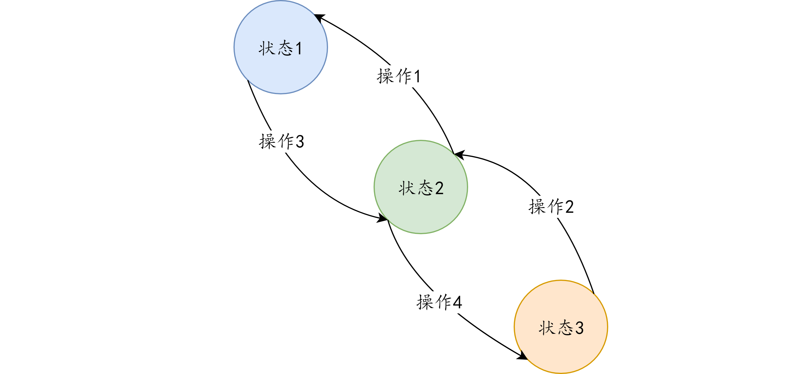
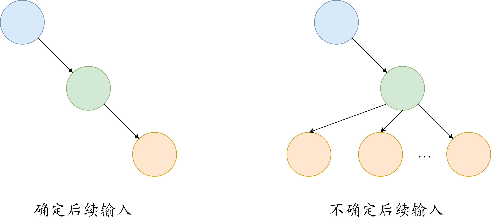
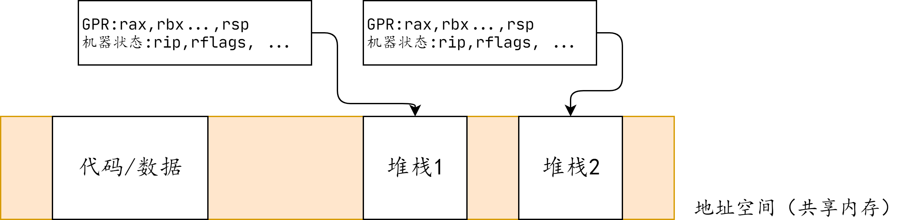
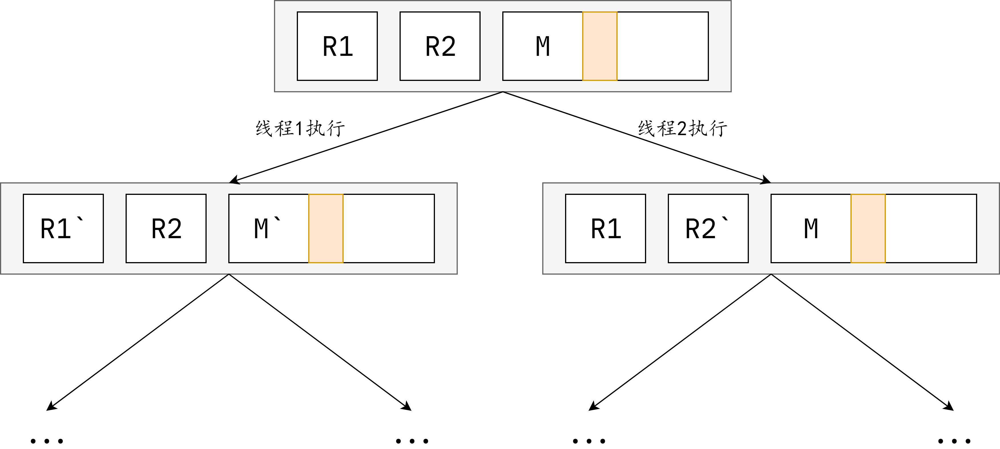

?>该笔记主要内容为，从状态机模型出发，分析

# 状态机视角下的程序执行

## 有限状态机

有向图G（V , E）

- 节点V代表某一“状态”
- 边E代表是“状态的转换”
- 边上有label代表执行某个动作
  - 一个事件
  - 一条指令
  - 一条语句
  - ...



## 程序 = 有限状态机

### （操作系统上的）程序执行时，状态是有限的

- 寄存器（包括PC指针）

- 内存：代码、数据、堆栈（暂时假设内存静态分配）构造有限状态机

所有单个存储器的状态仅0和1，因为PC机上的存储器的个数是有限的，所以状态的个数也是有限的，只是这个个数会很大很大。

### 构造有限状态机

- 每个不同的configuration（内存/寄存器）都是状态机的节点

	- s=（M，R）EV，代表某个时刻程序内存/寄存器的快照
	- 16MiB内存就有2^(2^24)种不同的状态

- s=（M，R）的下一个状态是执行M[R[%rip]]处的指令得到s\`=（M\`，R`）
  - 取出PC指针处的指令、译码、执行、写回数据

### 确定后续状态

大部分状态s有唯一的后续状态（deterministic），比如说对堆栈的操作：`pushq %rsp`。目前大多数算法都是该类情况，即输入一定，输出也是确定的。

### 不确定后续状态

不确定（non-deterministic）的指令可能有多个后续状态

- （时间）rdtsc/rdtscp
  - 获取处理器的“时间戳”用于精确定时
  - （机器状态）rdrand
- 处理器自身提供的“真”随机数指令（since lvy Bridge，2013）
    - rdrand.c （从传感器读取噪声生成随机数）
- （系统调用）syscall·一般应用唯一不确定性的来源
    - 例子：read（fd，buf，size）
    -  返回值不确定（-1，0，1，2…）
    - buf中的数据不确定（例如从键盘输入）



?> 不确定输入，只是后续状态较多，但还是有限的。

## 状态机模型：应用

### 硬件

在计算机硬件上的应用：高性能处理器实现

超标量（superscalar）处理器，insight：允许在状态机上“跳跃”。

?> 因为当后续输入确定时，如上所示，给定输入则有唯一输出与之对应。所以中间的状态是不重要的，于是有了这样的概念。

### 软件

在计算机系统上的应用：程序分析技术

- 静态分析：根据程序代码推导出状态机的性质
- 动态分析：检查运行时观测到状态机的执行

## 并发程序的状态机模型

**线程共享什么？独享什么？**

共享代码和数据

拥有独立的寄存器和堆栈

堆栈也位于同一个地址空间中

允许把局部变量的指针（&local_var）传递给另一个线程，实际用到的场景几乎没有。



系统中有n个线程，则并发程序的状态

- s=（M，1，R2，…，Rn）
- 并发系统执行指令的顺序是`不确定`的
  - 每个（M，R1），（M，R2），…，（M，Rn）都可以看成是一个`串行程序`
  - 在任意状态，都可以选择任意一个线程执行一条指令: s =（M，R）执行M[R[%rip]]处的指令得到s\`=（ M\`，R\`）



## Peterson 算法 

### 实现两人互斥

想上厕所的人：

（1）首先举起有自己名字的旗子

（2）挂上有对方名字的牌子；后挂的牌子会覆盖先前的

（3）环顾四周，当对方没有举旗或牌子上是自己名字的时候，进入WC

（4）出WC时放下旗子

### 代码

```c
int turn = T1, x = 0, y = 0;

void thread1() {
    x = 1; turn = T2;
    while (y==1 && turn==T2) ;
    // critical section
    x = 0;
}

void thread2() {
    y = 1; turn = T1;
    while (x==1 && turn==T1) ;
    //critical section
    y = 0;
}
```
+ 思考：只有旗子的话会出现死锁，即T1先挂旗，T2后挂旗，T1观察，T2观察重复
+ 只有牌子也是不行的
+ 旗子的作用是表明自己想要占用资源的**意愿**，牌子的作用是表明先请对方占用资源
  + 只有旗子时，如果两方都想占用资源，就会产生冲突
  + 只有牌子时，如果牌子为T1，表明先请T1占用资源，但是T1不一定想要占用该资源

### 正确性

+ safety `坏事永远不会发生`：

  状态机永远不会进入到不该出现的状态中

+ liveness `好事永远发生`：

  状态机必将在有限的步数内进入到某一个critical section