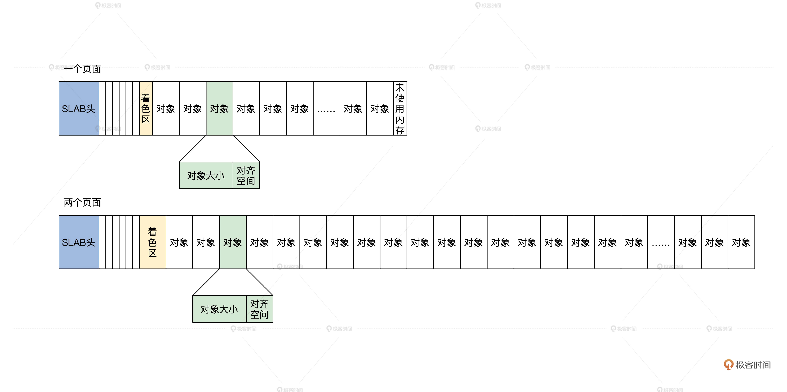
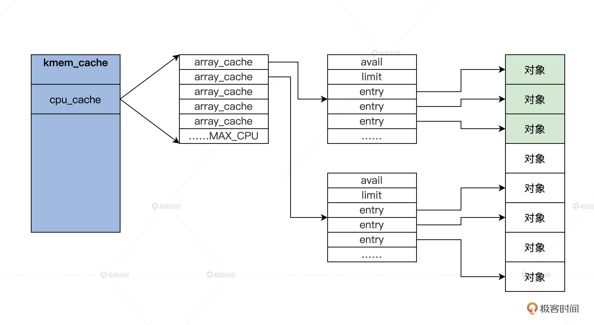
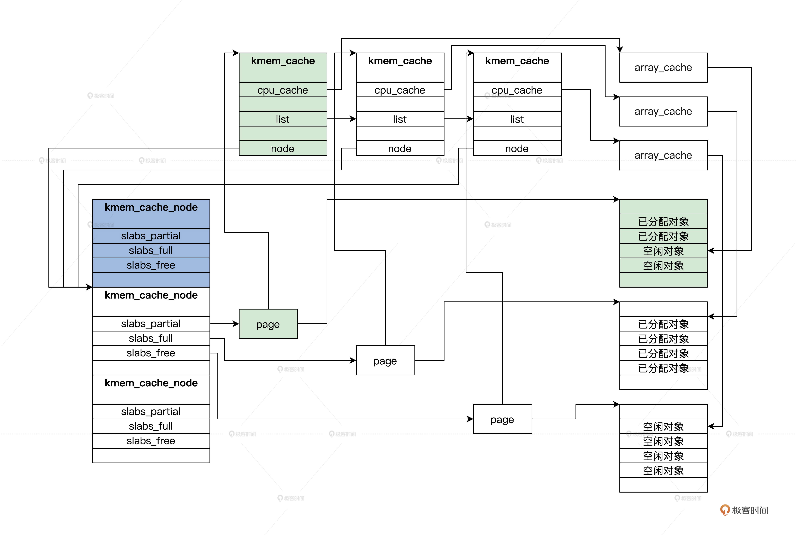
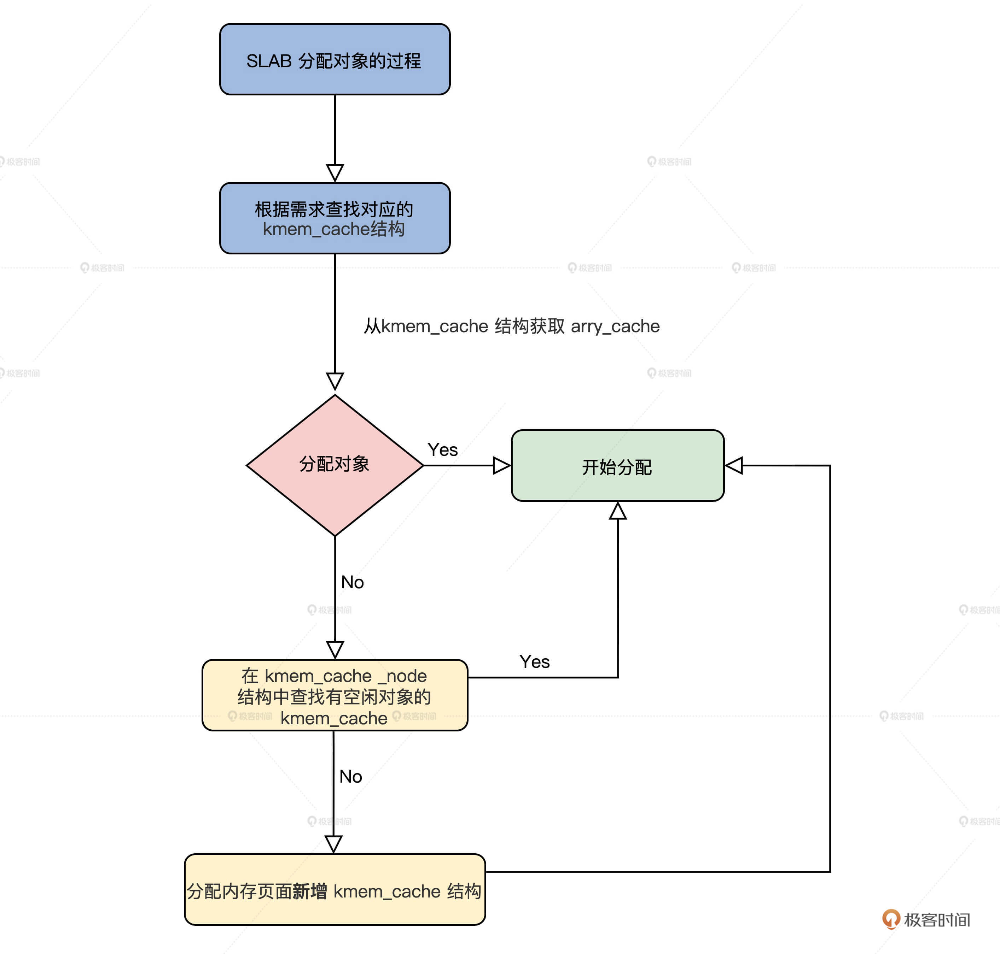

# 瞧一瞧Linux：SLAB如何分配内存？

你好，我是 LMOS。

上节课我们学习了伙伴系统，了解了它是怎样管理物理内存页面的。那么你自然会想到这个问题：Linux 系统中，比页更小的内存对象要怎样分配呢？

带着这个问题，我们来一起看看 **SLAB 分配器的原理和实现。**在学习过程中，你也可以对照一下我们 Cosmos 的内存管理组件，看看两者的内存管理有哪些异同。

## SLAB 

与 Cosmos 物理内存页面管理器一样，Linux 中的伙伴系统是以页面为最小单位分配的，现实更多要以内核对象为单位分配内存，其实更具体一点说，就是根据内核对象的实例变量大小来申请和释放内存空间，这些数据结构实例变量的大小通常从几十字节到几百字节不等，远远小于一个页面的大小。

如果一个几十字节大小的数据结构实例变量，就要为此分配一个页面，这无疑是对宝贵物理内存的一种巨大浪费，因此一个更好的技术方案应运而生，就是 **Slab 分配器**（由 Sun 公司的雇员 Jeff Bonwick 在 Solaris 2.4 中设计并实现）。

由于作者公开了实现方法，后来被 Linux 所借鉴，用于实现内核中更小粒度的内存分配。看看吧，你以为 Linux 很强大，真的强大吗？不过是站在巨人的肩膀上飞翔的。

### 走进 SLAB 对象 

何为 SLAB 对象？在 SLAB 分配器中，它把一个内存页面或者一组连续的内存页面，划分成大小相同的块，其中这一个小的内存块就是 SLAB 对象，但是这一组连续的内存页面中不只是 SLAB 对象，还有 SLAB 管理头和着色区。

我画个图你就明白了，如下所示。



上图中有一个内存页面和两个内存页面的 SLAB，你可能对着色区有点陌生，我来给你讲解一下。

这个着色区也是一块动态的内存块，建立 SLAB 时才会设置它的大小，目的是为了错开不同 SLAB 中的对象地址，降低硬件 Cache 行中的地址争用，以免导致 Cache 抖动效应，整个系统性能下降。

SLAB 头其实是一个数据结构，但是它不一定放在保存对象内存页面的开始。通常会有一个保存 SLAB 管理头的 SLAB，在 Linux 中，SLAB 管理头用 kmem_cache 结构来表示，代码如下。

```cpp
struct array_cache {
    unsigned int avail;
    unsigned int limit;
    void *entry[]; 
};
struct kmem_cache {
    //是每个CPU一个array_cache类型的变量，cpu_cache是用于管理空闲对象的 
    struct array_cache __percpu *cpu_cache;
    unsigned int size; //cache大小
    slab_flags_t flags;//slab标志
    unsigned int num;//对象个数
    unsigned int gfporder;//分配内存页面的order
    gfp_t allocflags;
    size_t colour;//着色区大小
    unsigned int colour_off;//着色区的开始偏移
    const char *name;//本SLAB的名字
    struct list_head list;//所有的SLAB都要链接起来
    int refcount;//引用计数
    int object_size;//对象大小
    int align;//对齐大小
    struct kmem_cache_node *node[MAX_NUMNODES];//指向管理kmemcache的上层结构
};
```

上述代码中，有多少个 CPU，就会有多少个 array_cache 类型的变量。这种为每个 CPU 构造一个变量副本的同步机制，就是**每 CPU 变量**（per-cpu-variable）。array_cache 结构中"entry[]"表示了一个遵循 LIFO 顺序的数组，"avail"和"limit"分别指定了当前可用对象的数目和允许容纳对象的最大数目。



### 第一个 kmem_cache 

第一个 kmem_cache 是哪里来的呢？其实它是静态定义在代码中的，如下所示。

```objectivec
static struct kmem_cache kmem_cache_boot = {
    .batchcount = 1,
    .limit = BOOT_CPUCACHE_ENTRIES,
    .shared = 1,
    .size = sizeof(struct kmem_cache),
    .name = "kmem_cache",
};
void __init kmem_cache_init(void)
{
    int i;
    //指向静态定义的kmem_cache_boot
    kmem_cache = &kmem_cache_boot;
    for (i = 0; i < NUM_INIT_LISTS; i++)
        kmem_cache_node_init(&init_kmem_cache_node[i]);
    //建立保存kmem_cache结构的kmem_cache
    create_boot_cache(kmem_cache, "kmem_cache",
        offsetof(struct kmem_cache, node) +
                  nr_node_ids * sizeof(struct kmem_cache_node *),
                  SLAB_HWCACHE_ALIGN, 0, 0);
    //加入全局slab_caches链表中
    list_add(&kmem_cache->list, &slab_caches);
    {
        int nid;
        for_each_online_node(nid) {
            init_list(kmem_cache, &init_kmem_cache_node[CACHE_CACHE + nid], nid);
            init_list(kmalloc_caches[KMALLOC_NORMAL][INDEX_NODE],                      &init_kmem_cache_node[SIZE_NODE + nid], nid);
        }
    }
    //建立kmalloc函数使用的的kmem_cache
    create_kmalloc_caches(ARCH_KMALLOC_FLAGS);
}
```

### 管理 kmem_cache 

我们建好了第一个 kmem_cache，以后 kmem_cache 越来越多，而且我们并没有看到 kmem_cache 结构中有任何指向内存页面的字段，但在 kmem_cache 结构中有个保存 kmem_cache_node 结构的指针数组。

kmem_cache_node 结构是每个内存节点对应一个，它就是用来管理 kmem_cache 结构的，它开始是静态定义的，初始化时建立了第一个 kmem_cache 结构之后，init_list 函数负责一个个分配内存空间，代码如下所示。

```cpp
#define NUM_INIT_LISTS (2 * MAX_NUMNODES)
//定义的kmem_cache_node结构数组
static struct kmem_cache_node __initdata init_kmem_cache_node[NUM_INIT_LISTS];
struct kmem_cache_node {
    spinlock_t list_lock;//自旋锁
    struct list_head slabs_partial;//有一部分空闲对象的kmem_cache结构
    struct list_head slabs_full;//没有空闲对象的kmem_cache结构
    struct list_head slabs_free;//对象全部空闲kmem_cache结构
    unsigned long total_slabs; //一共多少kmem_cache结构
    unsigned long free_slabs;  //空闲的kmem_cache结构
    unsigned long free_objects;//空闲的对象
    unsigned int free_limit;
};
static void __init init_list(struct kmem_cache *cachep, struct kmem_cache_node *list,
                int nodeid)
{
    struct kmem_cache_node *ptr;
    //分配新的 kmem_cache_node 结构的空间
    ptr = kmalloc_node(sizeof(struct kmem_cache_node), GFP_NOWAIT, nodeid);
    BUG_ON(!ptr);
    //复制初始时的静态kmem_cache_node结构
    memcpy(ptr, list, sizeof(struct kmem_cache_node));
    spin_lock_init(&ptr->list_lock);
    MAKE_ALL_LISTS(cachep, ptr, nodeid);
    //设置kmem_cache_node的地址
    cachep->node[nodeid] = ptr;
}
```

我们第一次分配对象时，肯定没有对应的内存页面存放对象，那么 SLAB 模块就会调用 **cache_grow_begin 函数**获取内存页面，然后用获取的页面来存放对象，我们一起来看看代码。

```cpp
static void slab_map_pages(struct kmem_cache *cache, struct page *page,void *freelist)
{
    //页面结构指向kmem_cache结构
    page->slab_cache = cache;
    //指向空闲对象的链表
    page->freelist = freelist;
}
static struct page *cache_grow_begin(struct kmem_cache *cachep,
                gfp_t flags, int nodeid)
{
    void *freelist;
    size_t offset;
    gfp_t local_flags;
    int page_node;
    struct kmem_cache_node *n;
    struct page *page;
    WARN_ON_ONCE(cachep->ctor && (flags & __GFP_ZERO));
    local_flags = flags & (GFP_CONSTRAINT_MASK|GFP_RECLAIM_MASK);
    //获取页面
    page = kmem_getpages(cachep, local_flags, nodeid);
    //获取页面所在的内存节点号
    page_node = page_to_nid(page);
    //根据内存节点获取对应kmem_cache_node结构
    n = get_node(cachep, page_node);
    //分配管理空闲对象的数据结构
    freelist = alloc_slabmgmt(cachep, page, offset,
            local_flags & ~GFP_CONSTRAINT_MASK, page_node);
    //让页面中相关的字段指向kmem_cache和空闲对象
    slab_map_pages(cachep, page, freelist);
    //初始化空闲对象管理数据
    cache_init_objs(cachep, page);
    return page;
}
static void cache_grow_end(struct kmem_cache *cachep, struct page *page)
{
    struct kmem_cache_node *n;
    void *list = NULL;
    if (!page)
        return;
    //初始化结page构的slab_list链表
    INIT_LIST_HEAD(&page->slab_list);
    //根据内存节点获取对应kmem_cache_node结构.
    n = get_node(cachep, page_to_nid(page));
    spin_lock(&n->list_lock);
    //slab计数增加
    n->total_slabs++;
    if (!page->active) {
        //把这个page结构加入到kmem_cache_node结构的空闲链表中
        list_add_tail(&page->slab_list, &n->slabs_free);
        n->free_slabs++;
    } 
    spin_unlock(&n->list_lock);
}
```

上述代码中的注释已经很清楚了，cache_grow_begin 函数会为 kmem_cache 结构分配用来存放对象的页面，随后会调用与之对应的 cache_grow_end 函数，把这页面挂载到 kmem_cache_node 结构的链表中，并让页面指向 kmem_cache 结构。

这样 kmem_cache_node，kmem_cache，page 这三者之间就联系起来了。你再看一下后面的图，就更加清楚了。



上图中 page 可能是一组连续的 pages，但是只会把第一个 page 挂载到 kmem_cache_node 中，同时，在 slab_map_pages 函数中又让 page 指向了 kmem_cache。

但你要特别留意 kmem_cache_node 中的三个链表，它们分别挂载的 pages，有一部分是空闲对象的 page、还有对象全部都已经分配的 page，以及全部都为空闲对象的 page。这是为了提高分配时查找 kmem_cache 的性能。

## SLAB 分配对象的过程 

有了前面对 SLAB 数据结构的了解，SLAB 分配对象的过程你自己也能推导出来，无非是根据请求分配对象的大小，查找对应的 kmem_cache 结构，接着从这个结构中获取 arry_cache 结构，然后分配对象。

如果没有空闲对象了，就需要在 kmem_cache 对应的 kmem_cache_node 结构中查找有空闲对象的 kmem_cache。如果还是没找到，最后就要分配内存页面新增 kmem_cache 结构了。



下面我们从接口开始了解这些过程。

### SLAB 分配接口 

其实在 Linux 内核中，用的最多的是 kmalloc 函数，经常用于分配小的缓冲区，或者数据结构分配实例空间，这个函数就是 SLAB 分配接口，它是用来分配对象的，这个对象就是一小块内存空间。

下面一起来看看代码。

```cpp
static __always_inline void *__do_kmalloc(size_t size, gfp_t flags,unsigned long caller)
{
    struct kmem_cache *cachep;
    void *ret;
    if (unlikely(size > KMALLOC_MAX_CACHE_SIZE))
        return NULL;
    //查找size对应的kmem_cache
    cachep = kmalloc_slab(size, flags);
    if (unlikely(ZERO_OR_NULL_PTR(cachep)))
        return cachep;
    //分配对象
    ret = slab_alloc(cachep, flags, caller);
    return ret;
}
void *__kmalloc(size_t size, gfp_t flags)
{
    return __do_kmalloc(size, flags, _RET_IP_);
}
static __always_inline void *kmalloc(size_t size, gfp_t flags)
{
    return __kmalloc(size, flags);
}
```

上面代码的流程很简单，就是在 __do_kmalloc 函数中，查找出分配大小对应的 kmem_cache 结构，然后调用 slab_alloc 函数进行分配。可以说，slab_alloc 函数才是 SLAB 的接口函数，但是它的参数中**必须要有 kmem_cache 结构**。

具体是如何查找的呢？我们这就来看看。

### 如何查找 kmem_cache 结构 

由于 SLAB 的接口函数 slab_alloc，它的参数中必须要有 kmem_cache 结构指针，指定从哪个 kmem_cache 结构分配对象，所以在调用 slab_alloc 函数之前必须给出 kmem_cache 结构。

我们怎么查找到它呢？这就需要调用 kmalloc_slab 函数了，代码如下所示。

```cpp
enum kmalloc_cache_type {
    KMALLOC_NORMAL = 0,
    KMALLOC_RECLAIM,
#ifdef CONFIG_ZONE_DMA
    KMALLOC_DMA,
#endif
    NR_KMALLOC_TYPES
};
struct kmem_cache *kmalloc_caches[NR_KMALLOC_TYPES][KMALLOC_SHIFT_HIGH + 1] __ro_after_init ={ static u8 size_index[24] __ro_after_init = {
    3,  /* 8 */
    4,  /* 16 */
    5,  /* 24 */
    5,  /* 32 */
    6,  /* 40 */
    6,  /* 48 */
    6,  /* 56 */
    6,  /* 64 */
    1,  /* 72 */
    1,  /* 80 */
    1,  /* 88 */
    1,  /* 96 */
    7,  /* 104 */
    7,  /* 112 */
    7,  /* 120 */
    7,  /* 128 */
    2,  /* 136 */
    2,  /* 144 */
    2,  /* 152 */
    2,  /* 160 */
    2,  /* 168 */
    2,  /* 176 */
    2,  /* 184 */
    2   /* 192 */
};
//根据分配标志返回枚举类型，其实是0、1、2其中之一
static __always_inline enum kmalloc_cache_type kmalloc_type(gfp_t flags)
{
#ifdef CONFIG_ZONE_DMA
    if (likely((flags & (__GFP_DMA | __GFP_RECLAIMABLE)) == 0))
        return KMALLOC_NORMAL;
    return flags & __GFP_DMA ? KMALLOC_DMA : KMALLOC_RECLAIM;
#else
    return flags & __GFP_RECLAIMABLE ? KMALLOC_RECLAIM : KMALLOC_NORMAL;
#endif
}
struct kmem_cache *kmalloc_slab(size_t size, gfp_t flags)
{
    unsigned int index;
    //计算出index
    if (size <= 192) {
        if (!size)
            return ZERO_SIZE_PTR;
        index = size_index[size_index_elem(size)];
    } else {
        if (WARN_ON_ONCE(size > KMALLOC_MAX_CACHE_SIZE))
            return NULL;
        index = fls(size - 1);
    }
    return kmalloc_caches[kmalloc_type(flags)][index];
}
```

从上述代码，不难发现 kmalloc_caches 就是个全局的二维数组，kmalloc_slab 函数只是根据分配大小和分配标志计算出了数组下标，最后取出其中 kmem_cache 结构指针。

那么 kmalloc_caches 中的 kmem_cache，它又是谁建立的呢？我们还是接着看代码。

```go
struct kmem_cache *__init create_kmalloc_cache(const char *name,
        unsigned int size, slab_flags_t flags,
        unsigned int useroffset, unsigned int usersize)
{
    //从第一个kmem_cache中分配一个对象放kmem_cache
    struct kmem_cache *s = kmem_cache_zalloc(kmem_cache, GFP_NOWAIT);
    if (!s)
        panic("Out of memory when creating slab %s\n", name);
    //设置s的对齐参数，处理s的freelist就是arr_cache
    create_boot_cache(s, name, size, flags, useroffset, usersize);
    list_add(&s->list, &slab_caches);
    s->refcount = 1;
    return s;
}
//新建一个kmem_cache
static void __init new_kmalloc_cache(int idx, enum kmalloc_cache_type type, slab_flags_t flags)
{
    if (type == KMALLOC_RECLAIM)
        flags |= SLAB_RECLAIM_ACCOUNT;
        //根据kmalloc_info中信息建立一个kmem_cache
    kmalloc_caches[type][idx] = create_kmalloc_cache(
                    kmalloc_info[idx].name[type],
                    kmalloc_info[idx].size, flags, 0,
                    kmalloc_info[idx].size);
}
//建立所有的kmalloc_caches中的kmem_cache
void __init create_kmalloc_caches(slab_flags_t flags)
{
    int i;
    enum kmalloc_cache_type type;
    for (type = KMALLOC_NORMAL; type <= KMALLOC_RECLAIM; type++) {
        for (i = KMALLOC_SHIFT_LOW; i <= KMALLOC_SHIFT_HIGH; i++) {
            if (!kmalloc_caches[type][i])
                //建立一个新的kmem_cache
                new_kmalloc_cache(i, type, flags);
            if (KMALLOC_MIN_SIZE <= 32 && i == 6 &&
                    !kmalloc_caches[type][1])
                new_kmalloc_cache(1, type, flags);
            if (KMALLOC_MIN_SIZE <= 64 && i == 7 &&
                    !kmalloc_caches[type][2])
                new_kmalloc_cache(2, type, flags);
        }
    }
}
```

到这里，__do_kmalloc 函数中根据分配对象大小查找的所有 kmem_cache 结构，我们就建立好了，保存在 kmalloc_caches 数组中。下面我们再去看看对象是如何分配的。

### 分配对象 

下面我们从 slab_alloc 函数开始探索对象的分配过程，slab_alloc 函数的第一个参数就 kmem_cache 结构的指针，表示从该 kmem_cache 结构中分配对象。

```cpp
static __always_inline void *slab_alloc(struct kmem_cache *cachep, gfp_t flags, unsigned long caller)
{
    unsigned long save_flags;
    void *objp;
    //关中断
    local_irq_save(save_flags);
    //分配对象
    objp = __do_cache_alloc(cachep, flags);
    //恢复中断
    local_irq_restore(save_flags);
    return objp;
}
```

接口函数总是简单的，真正干活的是 __do_cache_alloc 函数，下面我们就来看看这个函数。

```objectivec
static inline void *____cache_alloc(struct kmem_cache *cachep, gfp_t flags)
{
    void *objp;
    struct array_cache *ac;
    //获取当前cpu在cachep结构中的array_cache结构的指针
    ac = cpu_cache_get(cachep);
    //如果ac中的avail不为0,说明当前kmem_cache结构中freelist是有空闲对象
    if (likely(ac->avail)) {
        ac->touched = 1;
        //空间对象的地址保存在ac->entry
        objp = ac->entry[--ac->avail];
        goto out;
    }
    objp = cache_alloc_refill(cachep, flags);
out:
    return objp;
}
static __always_inline void *__do_cache_alloc(struct kmem_cache *cachep, gfp_t flags)
{
    return ____cache_alloc(cachep, flags);
}
```

上述代码中真正做事的函数是 **____cache_alloc 函数**，它首先获取了当前 kmem_cache 结构中指向 array_cache 结构的指针，找到它里面空闲对象的地址（如果你不懂 array_cache 结构，请回到 SLAB 对象那一小节复习），然后在 array_cache 结构中取出一个空闲对象地址返回，这样就分配成功了。

这个速度是很快的，如果 array_cache 结构中没有空闲对象了，就会调用 cache_alloc_refill 函数。那这个函数又干了什么呢？我们接着往下看。代码如下所示。

```cpp
static struct page *get_first_slab(struct kmem_cache_node *n, bool pfmemalloc)
{
    struct page *page;
    assert_spin_locked(&n->list_lock);
    //首先从kmem_cache_node结构中的slabs_partial链表上查看有没有page
    page = list_first_entry_or_null(&n->slabs_partial, struct page,slab_list);
    if (!page) {
    //如果没有
        n->free_touched = 1;
    //从kmem_cache_node结构中的slabs_free链表上查看有没有page
        page = list_first_entry_or_null(&n->slabs_free, struct page,slab_list);
        if (page)
            n->free_slabs--; //空闲slab计数减一
    }
    //返回page
    return page;
}
static void *cache_alloc_refill(struct kmem_cache *cachep, gfp_t flags)
{
    int batchcount;
    struct kmem_cache_node *n;
    struct array_cache *ac, *shared;
    int node;
    void *list = NULL;
    struct page *page;
    //获取内存节点
    node = numa_mem_id();
    ac = cpu_cache_get(cachep);
    batchcount = ac->batchcount;
    //获取cachep所属的kmem_cache_node
    n = get_node(cachep, node);
    shared = READ_ONCE(n->shared);
    if (!n->free_objects && (!shared || !shared->avail))
        goto direct_grow;
    while (batchcount > 0) {
        //获取kmem_cache_node结构中其它kmem_cache,返回的是page，而page会指向kmem_cache
        page = get_first_slab(n, false);
        if (!page)
            goto must_grow;
        batchcount = alloc_block(cachep, ac, page, batchcount);
    }
must_grow:
    n->free_objects -= ac->avail;
direct_grow:
    if (unlikely(!ac->avail)) {
        //分配新的kmem_cache并初始化
        page = cache_grow_begin(cachep, gfp_exact_node(flags), node);
        ac = cpu_cache_get(cachep);
        if (!ac->avail && page)
            alloc_block(cachep, ac, page, batchcount);
        //让page挂载到kmem_cache_node结构的slabs_list链表上
        cache_grow_end(cachep, page);
        if (!ac->avail)
            return NULL;
    }
    ac->touched = 1;
    //重新分配
    return ac->entry[--ac->avail];
}
```

调用 cache_alloc_refill 函数的过程，主要的工作都有哪些呢？我给你梳理一下。

首先，获取了 cachep 所属的 kmem_cache_node。

然后调用 get_first_slab，获取 kmem_cache_node 结构还有没有包含空闲对象的 kmem_cache。但是请注意，这里返回的是 page，因为 page 会指向 kmem_cache 结构，page 所代表的物理内存页面，也保存着 kmem_cache 结构中的对象。

最后，如果 kmem_cache_node 结构没有包含空闲对象的 kmem_cache 了，就必须调用 cache_grow_begin 函数，找伙伴系统分配新的内存页面，而且还要找第一个 kmem_cache 分配新的对象，来存放 kmem_cache 结构的实例变量，并进行必要的初始化。

这些步骤完成之后，再调用 cache_grow_end 函数，把刚刚分配的 page 挂载到 kmem_cache_node 结构的 slabs_list 链表上。因为 cache_grow_begin 和 cache_grow_end 函数在前面已经分析过了，这里不再赘述。

## 重点回顾 

今天的内容讲完了，我来帮你梳理一下本课程的重点。

1. 为了分配小于 1 个 page 的小块内存，Linux 实现了 SLAB，用 kmem_cache 结构管理 page 对应内存页面上小块内存对象，然后让该 page 指向 kmem_cache，由 kmem_cache_node 结构管理多个 page。

2. 我们从 Linux 内核中使用的 kmalloc 函数入手，了解了 SLAB 下整个内存对象的分配过程。

到此为止，我们对 SLAB 的研究就告一段落了，是不是感觉和 Cosmos 内存管理有些相像而又不同呢？甚至我们 Cosmos 内存管理要更为简洁和高效。

## 思考题 

Linux 的 SLAB，使用 kmalloc 函数能分配多大的内存对象呢？

欢迎你在留言区跟我交流互动，也欢迎你把这节课分享给你的同事、朋友，跟他一起研究 SLAB 相关的内容。

我是 LMOS，我们下节课见！

