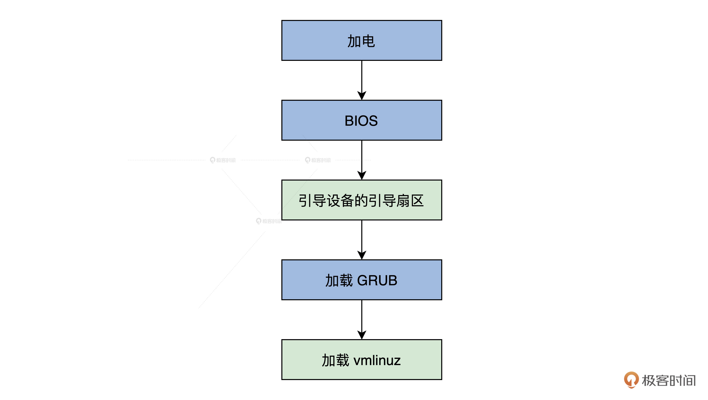
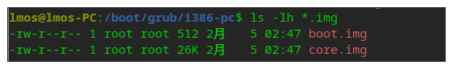
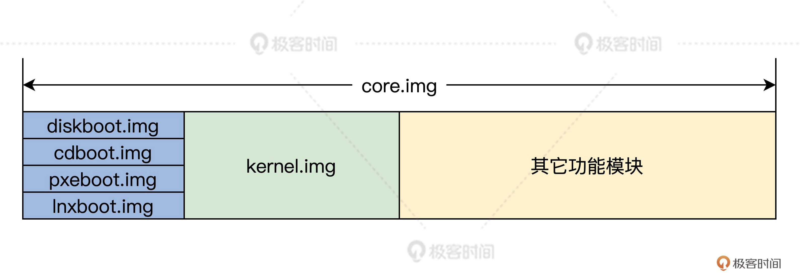
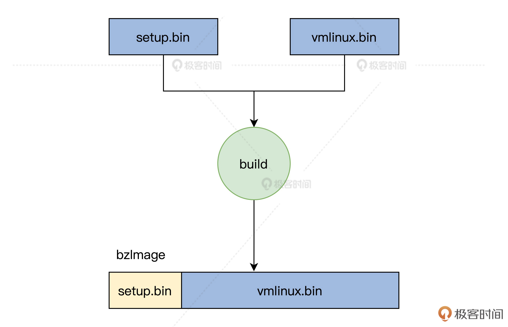

# Linux初始化（上）：GRUB与vmlinuz的结构

你好，我是 LMOS。

在前面的课程中，我们建好了二级引导器，启动了我们的 Cosmos，并进行了我们 Cosmos 的 Hal 层初始化。

我会用两节课带你领会 Linux 怎样做初始化。虽然我们自己具体实现过了初始化，不过我们也不妨看看 Linux 的初始化流程，借鉴一下 Linux 开发者的玩法。

这节课，我会先为你梳理启动的整体流程，重点为你解读 Linux 上 GRUB 是怎样启动，以及内核里的“实权人物”——vmlinuz 内核文件是如何产生和运转的。下节课，我们从 setup.bin 文件的 _start 函数入手，研究 Linux 初始化流程。

好，接下来我们从全局流程讲起，正式进入今天的学习。

## 全局流程 

x86 平台的启动流程，是非常复杂的。为了帮助你理解，我们先从全局粗略地看一看整体流程，然后一步步细化。

在机器加电后，BIOS 会进行自检，然后由 BIOS 加载引导设备中引导扇区。在安装有 Linux 操作系统的情况下，在引导扇区里，通常是安装的 GRUB 的一小段程序（安装 windows 的情况则不同）。最后，GRUB 会加载 Linux 的内核映像 vmlinuz，如下图所示。



上图中的引导设备通常是机器中的硬盘，但也可以是 U 盘或者光盘甚至是软盘。BIOS 会自动读取保存在 CMOS 中的引导设备信息。

## 从 BIOS 到 GRUB 

从前面的课程我们已经知道，CPU 被设计成只能运行内存中的程序，没有办法直接运行储存在硬盘或者 U 盘中的操作系统程序。

如果想要运行硬盘或者 U 盘中的程序，就必须要先加载到内存（RAM）中才能运行。这是因为硬盘、U 盘（外部储存器）并不和 CPU 直接相连，它们的访问机制和寻址方式与内存截然不同。

内存在断电后就没法保存数据了，那 BIOS 又是如何启动的呢？硬件工程师设计 CPU 时，硬性地规定在加电的瞬间，强制将 CS 寄存器的值设置为 0XF000，IP 寄存器的值设置为 0XFFF0。

这样一来，CS:IP 就指向了 0XFFFF0 这个物理地址。在这个物理地址上连接了主板上的一块小的 ROM 芯片。这种芯片的访问机制和寻址方式和内存一样，只是它在断电时不会丢失数据，在常规下也不能往这里写入数据，它是一种**只读内存**，BIOS 程序就被固化在该 ROM 芯片里。

现在，CS:IP 指向了 0XFFFF0 这个位置，正是 BIOS 程序的入口地址。这意味着 BIOS 正式开始启动。

BIOS 一开始会初始化 CPU，接着检查并初始化内存，然后将自己的一部分复制到内存，最后跳转到内存中运行。BIOS 的下一步就是枚举本地设备进行初始化，并进行相关的检查，检查硬件是否损坏，这期间 BIOS 会调用其它设备上的固件程序，如显卡、网卡等设备上的固件程序。

当设备初始化和检查步骤完成之后，**BIOS 会在内存中建立中断表和中断服务程序**，这是启动 Linux 至关重要的工作，因为 Linux 会用到它们。

具体是怎么操作的呢？BIOS 会从内存地址（0x00000）开始用 1KB 的内存空间（0x00000~0x003FF）构建中断表，在紧接着中断表的位置，用 256KB 的内存空间构建 BIOS 数据区（0x00400~0x004FF），并在 0x0e05b 的地址加载了 8KB 大小的与中断表对应的中断服务程序。

中断表中有 256 个条目，每个条目占用 4 个字节，其中两个字节是 CS 寄存器的值，两个字节是 IP 寄存器的值。每个条目都指向一个具体的中断服务程序。

为了启动外部储存器中的程序，BIOS 会搜索可引导的设备，搜索的顺序是由 CMOS 中的设置信息决定的（这也是我们平时讲的，所谓的在 BIOS 中设置的启动设备顺序）。一个是软驱，一个是光驱，一个是硬盘上，还可以是网络上的设备甚至是一个 usb 接口的 U 盘，都可以作为一个启动设备。

当然，Linux 通常是从硬盘中启动的。硬盘上的第 1 个扇区（每个扇区 512 字节空间），被称为 **MBR（主启动记录）**，其中包含有基本的 GRUB 启动程序和分区表，安装 GRUB 时会自动写入到这个扇区，当 MBR 被 BIOS 装载到 0x7c00 地址开始的内存空间中后，BIOS 就会将控制权转交给了 MBR。在当前的情况下，其实是交给了 GRUB。

到这里，BIOS 到 GRUB 的过程结束。

## GRUB 是如何启动的 

根据前面内容可以发现，BIOS 只会加载硬盘上的第 1 个扇区。不过这个扇区仅有 512 字节，这 512 字节中还有 64 字节的分区表加 2 字节的启动标志，很显然，剩下 446 字节的空间，是装不下 GRUB 这种大型通用引导器的。

于是，GRUB 的加载分成了多个步骤，同时 GRUB 也分成了多个文件，其中有两个**重要的文件 boot.img 和 core.img**，如下所示：



其中，boot.img 被 GRUB 的安装程序写入到硬盘的 MBR 中，同时在 boot.img 文件中的一个位置写入 core.img 文件占用的第一个扇区的扇区号。

而 core.img 文件是由 GRUB 安装程序根据安装时环境信息，用其它 GRUB 的模块文件动态生成。如下图所示：



如果是从硬盘启动的话，core.img 中的第一个扇区的内容就是 diskboot.img 文件。diskboot.img 文件的作用是，**读取 core.img 中剩余的部分到内存中。**

由于这时 diskboot.img 文件还不识别文件系统，所以我们将 core.img 文件的全部位置，都用文件块列表的方式保存到 diskboot.img 文件中。这样就能确保 diskboot.img 文件找到 core.img 文件的剩余内容，最后将控制权交给 kernel.img 文件。

因为这时 core.img 文件中嵌入了足够多的功能模块，所以可以保证 GRUB 识别出硬盘分区上文件系统，能够访问 /boot/grub 目录，并且可以加载相关的配置文件和功能模块，来实现相关的功能，例如加载启动菜单、加载目标操作系统等。

正因为 GRUB2 大量使用了动态加载功能模块，这使得 core.img 文件的体积变得足够小。而 GRUB 的 core.img 文件一旦开始工作，就可以加载 Linux 系统的 vmlinuz 内核文件了。

## 详解 vmlinuz 文件结构 

我们在 /boot 目录下会发现 vmlinuz 文件，这个文件是怎么来的呢？

其实它是由 Linux 编译生成的 bzImage 文件复制而来的，你自己可以下载最新的 Linux 代码.

我们一致把 Linux 源码解压到一个 linux 目录中，也就是说我们后面查找 Linux 源代码文件总是从 linux 目录开始的，切换到代码目录执行 make ARCH=x86_64，再执行 make install，就会产生 vmlinuz 文件，你可以参考后面的 makefile 代码。

```typescript
#linux/arch/x86/boot/Makefile
install:    sh $(srctree)/$(src)/install.sh $(KERNELRELEASE) $(obj)/bzImage \        System.map "$(INSTALL_PATH)"
```

install.sh 脚本文件只是完成复制的功能，所以我们只要搞懂了 bzImage 文件结构，就等同于理解了 vmlinuz 文件结构。

那么 bzImage 文件又是怎么来的呢？我们只要研究 bzImage 文件在 Makefile 中的生成规则，就会恍然大悟，代码如下 ：

```typescript
#linux/arch/x86/boot/Makefile
$(obj)/bzImage: $(obj)/setup.bin $(obj)/vmlinux.bin $(obj)/tools/build FORCE    $(call if_changed,image)    @$(kecho) 'Kernel: $@ is ready' ' (#'`cat .version`')'
```

从前面的代码可以知道，生成 bzImage 文件需要三个依赖文件：setup.bin、vmlinux.bin，linux/arch/x86/boot/tools 目录下的 build。让我们挨个来分析一下。

其实，build 只是一个 HOSTOS（正在使用的 Linux）下的应用程序，它的作用就是将 setup.bin、vmlinux.bin 两个文件拼接成一个 bzImage 文件，如下图所示：



剩下的就是搞清楚 setup.bin、vmlinux.bin 这两个文件的的结构，先来看看 setup.bin 文件，setup.bin 文件是由 objcopy 命令根据 setup.elf 生成的。

setup.elf 文件又怎么生成的呢？我们结合后面的代码来看看。

```typescript
#这些目标文件正是由/arch/x86/boot/目录下对应的程序源代码文件编译产生
setup-y     += a20.o bioscall.o cmdline.o copy.o cpu.o cpuflags.o cpucheck.o
setup-y     += early_serial_console.o edd.o header.o main.o memory.o
setup-y     += pm.o pmjump.o printf.o regs.o string.o tty.o video.o
setup-y     += video-mode.o version.o
#……
SETUP_OBJS = $(addprefix $(obj)/,$(setup-y))
#……
LDFLAGS_setup.elf   := -m elf_i386 -T$(obj)/setup.elf: $(src)/setup.ld $(SETUP_OBJS) FORCE    $(call if_changed,ld)
#……
OBJCOPYFLAGS_setup.bin  := -O binary$(obj)/setup.bin: $(obj)/setup.elf FORCE    $(call if_changed,objcopy)
```

根据这段代码，不难发现 setup.bin 文件正是由 /arch/x86/boot/ 目录下一系列对应的程序源代码文件编译链接产生，其中的 **head.S 文件**和 **main.c 文件**格外重要，别急，这个我之后会讲。

下面我们先看看 vmlinux.bin 是怎么产生的，构建 vmlinux.bin 的规则依然在 linux/arch/x86/boot/ 目录下的 Makefile 文件中，如下所示：

```typescript
#linux/arch/x86/boot/Makefile
OBJCOPYFLAGS_vmlinux.bin := -O binary -R .note -R .comment -S$(obj)/vmlinux.bin: $(obj)/compressed/vmlinux FORCE    $(call if_changed,objcopy)
```

这段代码的意思是，vmlinux.bin 文件依赖于 linux/arch/x86/boot/compressed/ 目录下的 vmlinux 目标，下面让我们切换到 linux/arch/x86/boot/compressed/ 目录下继续追踪。打开该目录下的 Makefile，会看到如下代码。

```typescript
#linux/arch/x86/boot/compressed/Makefile
#……
#这些目标文件正是由/arch/x86/boot/compressed/目录下对应的程序源代码文件编译产生$(BITS)取值32或者64
vmlinux-objs-y := $(obj)/vmlinux.lds $(obj)/kernel_info.o $(obj)/head_$(BITS).o \    $(obj)/misc.o $(obj)/string.o $(obj)/cmdline.o $(obj)/error.o \    $(obj)/piggy.o $(obj)/cpuflags.o
vmlinux-objs-$(CONFIG_EARLY_PRINTK) += $(obj)/early_serial_console.o
vmlinux-objs-$(CONFIG_RANDOMIZE_BASE) += $(obj)/kaslr.o
ifdef CONFIG_X86_64    
vmlinux-objs-y += $(obj)/ident_map_64.o    
vmlinux-objs-y += $(obj)/idt_64.o $(obj)/idt_handlers_64.o    vmlinux-objs-y += $(obj)/mem_encrypt.o    
vmlinux-objs-y += $(obj)/pgtable_64.o    
vmlinux-objs-$(CONFIG_AMD_MEM_ENCRYPT) += $(obj)/sev-es.o
endif
#……
$(obj)/vmlinux: $(vmlinux-objs-y) $(efi-obj-y) FORCE  
$(call if_changed,ld)
```

结合这段代码我们发现，linux/arch/x86/boot/compressed 目录下的 vmlinux 是由该目录下的 head_32.o 或者 head_64.o、cpuflags.o、error.o、kernel.o、misc.o、string.o 、cmdline.o 、early_serial_console.o 等文件以及 piggy.o 链接而成的。

其中，vmlinux.lds 是链接脚本文件。在没做任何编译动作前，前面依赖列表中任何一个目标文件的源文件（除了 piggy.o 源码），我们几乎都可以在 Linux 内核源码里找到。

比如说，head_64.o 对应源文件 head_64.S、string.o 对应源文件 string.c、misc.o 对应源文件 misc.c 等。

那么问题来了，为啥找不到 piggy.o 对应的源文件，比如 piggy.c、piggy.S 或其他文件呢？你需要在 Makefile 文件仔细观察一下，才能发现有个创建文件 piggy.S 的规则，代码如下所示：

```typescript
#linux/arch/x86/boot/compressed/Makefile
#……
quiet_cmd_mkpiggy = MKPIGGY $@      
cmd_mkpiggy = $(obj)/mkpiggy $< > $@
targets += piggy.S
$(obj)/piggy.S: $(obj)/vmlinux.bin.$(suffix-y) $(obj)/mkpiggy FORCE    $(call if_changed,mkpiggy)
```

看到上面的规则，我们豁然开朗，原来 piggy.o 是由 piggy.S 汇编代码生成而来，而 piggy.S 是编译 Linux 内核时由 mkpiggy 工作（HOST OS 下的应用程序）动态创建的，这就是我们找不到它的原因。

piggy.S 的第一个依赖文件 vmlinux.bin.$(suffix-y) 中的 suffix-y，它表示内核压缩方式对应的后缀。

```typescript
#linux/arch/x86/boot/compressed/Makefile
#……
vmlinux.bin.all-y := $(obj)/vmlinux.bin
vmlinux.bin.all-$(CONFIG_X86_NEED_RELOCS) += $(obj)/vmlinux.relocs
$(obj)/vmlinux.bin.gz: $(vmlinux.bin.all-y) FORCE    
$(call if_changed,gzip)
$(obj)/vmlinux.bin.bz2: $(vmlinux.bin.all-y) FORCE    
$(call if_changed,bzip2)
$(obj)/vmlinux.bin.lzma: $(vmlinux.bin.all-y) FORCE    
$(call if_changed,lzma)
$(obj)/vmlinux.bin.xz: $(vmlinux.bin.all-y) FORCE   
$(call if_changed,xzkern)
$(obj)/vmlinux.bin.lzo: $(vmlinux.bin.all-y) FORCE    
$(call if_changed,lzo)
$(obj)/vmlinux.bin.lz4: $(vmlinux.bin.all-y) FORCE    
$(call if_changed,lz4)
$(obj)/vmlinux.bin.zst: $(vmlinux.bin.all-y) FORCE    
$(call if_changed,zstd22)
suffix-$(CONFIG_KERNEL_GZIP)    := gz
suffix-$(CONFIG_KERNEL_BZIP2)   := bz2
suffix-$(CONFIG_KERNEL_LZMA)    := lzma
suffix-$(CONFIG_KERNEL_XZ)  := xz
suffix-$(CONFIG_KERNEL_LZO)     := lzo
suffix-$(CONFIG_KERNEL_LZ4)     := lz4
suffix-$(CONFIG_KERNEL_ZSTD)    := zst
```

由前面内容可以发现，Linux 内核可以被压缩成多种格式。虽然现在我们依然没有搞清楚 vmlinux.bin 文件是怎么来的，但是我们可以发现，linux/arch/x86/boot/compressed 目录下的 Makefile 文件中，有下面这样的代码。

```shell
#linux/arch/x86/boot/compressed/Makefile
#……
OBJCOPYFLAGS_vmlinux.bin :=  -R .comment -S
$(obj)/vmlinux.bin: vmlinux FORCE 
$(call if_changed,objcopy)
```

也就是说，arch/x86/boot/compressed 目录下的 vmlinux.bin，它是由 objcopy 工具通过 vmlinux 目标生成。而 vmlinux 目标没有任何修饰前缀和依赖的目标，这说明它就是**最顶层目录下的一个 vmlinux 文件**。

我们继续深究一步就会发现，objcopy 工具在处理过程中只是删除了 vmlinux 文件中“.comment”段，以及符号表和重定位表（通过参数 -S 指定），而 vmlinux 文件的格式依然是 ELF 格式的，如果不需要使用 ELF 格式的内核，这里添加“-O binary”选项就可以了。

我们现在来梳理一下，vmlinux 文件是如何创建的。

其实，vmlinux 文件就是编译整个 Linux 内核源代码文件生成的，Linux 的代码分布在各个代码目录下，这些目录之下又存在目录，Linux 的 kbuild（内核编译）系统，会递归进入到每个目录，由该目录下的 Makefile 决定要编译哪些文件。

在编译完具体文件之后，就会在该目录下，把已经编译了的文件链接成一个该目录下的 built-in.o 文件，这个 built-in.o 文件也会与上层目录的 built-in.o 文件链接在一起。

再然后，层层目录返回到顶层目录，所有的 built-in.o 文件会链接生成一个 vmlinux 文件，这个 vmlinux 文件会通过前面的方法转换成 vmlinux.bin 文件。但是请注意，vmlinux.bin 文件它依然是 ELF 格式的文件。

最后，工具软件会压缩成 vmlinux.bin.gz 文件，这里我们以 gzip 方式压缩。

让我们再次回到 mkpiggy 命令，其中 mkpiggy 是内核自带的一个工具程序，它把输出方式重定向到文件，从而产生 piggy.S 汇编文件，源码如下：

```cpp
int main(int argc, char *argv[]){ 
    uint32_t olen;    
    long ilen;    
    FILE *f = NULL;    
    int retval = 1;
    f = fopen(argv[1], "r");    
    if (!f) {        
        perror(argv[1]);        
        goto bail;    
    }
    //……为节约篇幅略去部分代码
    printf(".section \".rodata..compressed\",\"a\",@progbits\n");
    printf(".globl z_input_len\n");    
    printf("z_input_len = %lu\n", ilen);    
    printf(".globl z_output_len\n");    
    printf("z_output_len = %lu\n", (unsigned long)olen);
    printf(".globl input_data, input_data_end\n");
    printf("input_data:\n");    
    printf(".incbin \"%s\"\n", argv[1]);    
    printf("input_data_end:\n");
    printf(".section \".rodata\",\"a\",@progbits\n");
    printf(".globl input_len\n");    
    printf("input_len:\n\t.long %lu\n", ilen);    
    printf(".globl output_len\n");    
    printf("output_len:\n\t.long %lu\n", (unsigned long)olen);
    retval = 0;
bail:    
    if (f)        
        fclose(f);    
    return retval;
}
//由上mkpiggy程序“写的”一个汇编程序piggy.S。
.section ".rodata..compressed","a",@progbits 
.globl z_input_len
 z_input_len = 1921557 
.globl z_output_len 
z_output_len = 3421472 
.globl input_data,input_data_end
.incbin "arch/x86/boot/compressed/vmlinux.bin.gz" 
input_data_end:
.section ".rodata","a",@progbits
.globl input_len
input_len:4421472
.globl output_len
output_len:4424772
```

根据上述代码不难发现，这个 piggy.S 非常简单，使用汇编指令 incbin 将压缩的 vmlinux.bin.gz 毫无修改地包含进来。

除了包含了压缩的 vmlinux.bin.gz 内核映像文件外，piggy.S 中还定义了解压 vmlinux.bin.gz 时需要的各种信息，包括压缩内核映像的长度、解压后的长度等信息。

**这些信息和 vmlinux.bin.gz 文件，它们一起生成了 piggy.o 文件，然后 piggy.o 文件和****$****(vmlinux-objs-y)****$****(efi-obj-y) 中的目标文件一起链接生成，最终生成了 linux/arch/x86/boot/compressed 目录下的 vmlinux。**

说到这里，你是不是感觉，这和 Linux 的启动流程无关呢？有这种想法就大错特错了，要想搞明白 Linux 的启动流程，首先得搞懂它 vmlinuz 的文件结构。有了这些基础，才能知其然同时知其所以然。

## 重点回顾 

又到了课程尾声，这节课的学习我们就告一段落了，我来给你做个总结。

今天我们首先从全局梳理了一遍 x86 平台的启动流程，掌握了 BIOS 加载 GRUB 的过程，又一起学习了 BIOS 是如何启动的，它又是如何加载引导设备的。

接着我们研究了 GRUB 的启动流程，BIOS 加载了 GRUB 的第一个部分，这一部分加载了 GRUB 的其余部分。

最后，我们详细了解了 Linux 内核的启动文件 vmlinuz 的结构，搞清楚了它的生成过程。

## 思考题 

请问，为什么要用 C 代码 mkpiggy 程序生成 piggy.S 文件，并包含 vmlinux.bin.gz 文件呢？

欢迎你在留言区记录你的收获和疑问，也欢迎你把这节课分享给有需要的朋友，跟他一起学习进步。

好，我是 LMOS，我们下节课见！

