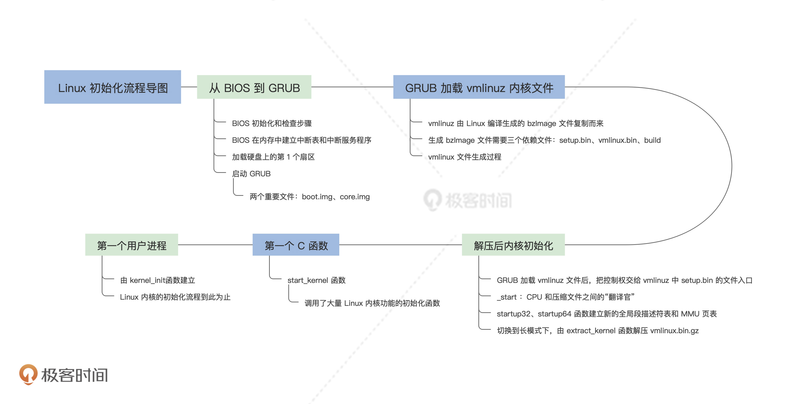

# Linux初始化（下）：从_start到第一个进程

你好，我是 LMOS。

今天我们继续来研究 Linux 的初始化流程，为你讲解如何解压内核，然后讲解 Linux 内核第一个 C 函数。最后，我们会用 Linux 的第一个用户进程的建立来收尾。

如果用你上手去玩一款新游戏做类比的话，那么上节课只是新手教程，而这节课就是更深入的实战了。后面你会看到很多熟悉的“面孔”，像是我们前面讲过的 CPU 工作模式、MMU 页表等等基础知识，这节课都会得到运用。

## 解压后内核初始化 

下面，我们先从 setup.bin 文件的入口 _start 开始，了解启动信息结构，接着由 16 位 main 函数切换 CPU 到保护模式，然后跳入 vmlinux.bin 文件中的 startup_32 函数重新加载段描述符。

如果是 64 位的系统，就要进入 startup_64 函数，切换到 CPU 到长模式，最后调用 extract_kernel 函数解压 Linux 内核，并进入内核的 startup_64 函数，由此 Linux 内核开始运行。

### 为何要从 _start 开始 

通过上节课对 vmlinuz 文件结构的研究，我们已经搞清楚了其中的 vmlinux.bin 是如何产生的，它是由 linux/arch/x86/boot/compressed 目录下的一些目标文件，以及 piggy.S 包含的一个 vmlinux.bin.gz 的压缩文件一起生成的。

vmlinux.bin.gz 文件则是由编译的 Linux 内核所生成的 elf 格式的 vmlinux 文件，去掉了文件的符号信息和重定位信息后，压缩得到的。

CPU 是无法识别压缩文件中的指令直接运行的，必须先进行解压后，然后解析 elf 格式的文件，把其中的指令段和数据段加载到指定的内存空间中，才能由 CPU 执行。

这就需要用到前面的 setup.bin 文件了，_start 正是 setup.bin 文件的入口，在 head.S 文件中定义，代码如下。

```python
#linux/arch/x86/boot/head.S
  .code16
  .section ".bstext", "ax"
  .global bootsect_start
bootsect_start:
  ljmp  $BOOTSEG, $start2
start2:
#……
#这里的512字段bootsector对于硬盘启动是用不到的
#……
  .globl  _start
_start:
    .byte  0xeb    # short (2-byte) jump
    .byte  start_of_setup-1f #这指令是用.byte定义出来的，跳转start_of_setup-1f
#……
#这里是一个庞大的数据结构，没展示出来，与linux/arch/x86/include/uapi/asm/bootparam.h文件中的struct setup_header一一对应。这个数据结构定义了启动时所需的默认参数
#……
start_of_setup:
  movw  %ds, %ax
  movw  %ax, %es   #ds = es
  cld               #主要指定si、di寄存器的自增方向，即si++ di++
  movw  %ss, %dx
  cmpw  %ax, %dx  # ds 是否等于 ss
  movw  %sp, %dx     
  je  2f    
  # 如果ss为空则建立新栈
  movw  $_end, %dx
  testb  $CAN_USE_HEAP, loadflags
  jz  1f
  movw  heap_end_ptr, %dx
1:  addw  $STACK_SIZE, %dx
  jnc  2f
  xorw  %dx, %dx  
2:
  andw  $~3, %dx
  jnz  3f
  movw  $0xfffc, %dx  
3:  movw  %ax, %ss
  movzwl  %dx, %esp  
  sti      # 栈已经初始化好，开中断
  pushw  %ds
  pushw  $6f
  lretw      # cs=ds ip=6：跳转到标号6处
6:
  cmpl  $0x5a5aaa55, setup_sig #检查setup标记
  jne  setup_bad
  movw  $__bss_start, %di
  movw  $_end+3, %cx
  xorl  %eax, %eax
  subw  %di, %cx
  shrw  $2, %cx
  rep; stosl          #清空setup程序的bss段
  calll  main  #调用C语言main函数 
```

### setup_header 结构 

下面我们重点研究一下 setup_header 结构，这对我们后面的流程很关键。它定义在 linux/arch/x86/include/uapi/asm/bootparam.h 文件中，如下所示。

```cpp
struct setup_header {    
__u8    setup_sects;        //setup大小
__u16   root_flags;         //根标志   
__u32   syssize;            //系统文件大小
__u16   ram_size;           //内存大小
__u16   vid_mode;    
__u16   root_dev;           //根设备号
__u16   boot_flag;          //引导标志
//……
__u32   realmode_swtch;     //切换回实模式的函数地址     
__u16   start_sys_seg;    
__u16   kernel_version;     //内核版本    
__u8    type_of_loader;     //引导器类型 我们这里是GRUB
__u8    loadflags;          //加载内核的标志 
__u16   setup_move_size;    //移动setup的大小
__u32   code32_start;       //将要跳转到32位模式下的地址 
__u32   ramdisk_image;      //初始化内存盘映像地址，里面有内核驱动模块 
__u32   ramdisk_size;       //初始化内存盘映像大小
//……
} __attribute__((packed));
```

前面提到过，硬盘中 MBR 是由 GRUB 写入的 boot.img，因此这里的 linux/arch/x86/boot/head.S 中的 bootsector 对于硬盘启动是无用的。

GRUB 将 vmlinuz 的 setup.bin 部分读到内存地址 0x90000 处，然后跳转到 0x90200 开始执行，恰好跳过了前面 512 字节的 bootsector，从 _start 开始。

### 16 位的 main 函数 

我们通常用 C 编译器编译的代码，是 32 位保护模式下的或者是 64 位长模式的，却很少编译成 16 位实模式下的，其实 setup.bin 大部分代码都是 16 位实模式下的。

从前面的代码里，我们能够看到在 linux/arch/x86/boot/head.S 中调用了 main 函数，该函数在 linux/arch/x86/boot/main.c 文件中，代码如下 。

```cpp
//定义boot_params变量
struct boot_params boot_params __attribute__((aligned(16)));
char *HEAP = _end;
char *heap_end = _end; 
//……
void main(void){
    //把先前setup_header结构复制到boot_params结构中的hdr变量中，在linux/arch/x86/include/uapi/asm/bootparam.h文件中你会发现boot_params结构中的hdr的类型正是setup_header结构  
    copy_boot_params();
    //初始化早期引导所用的console    
    console_init();    
    //初始化堆 
    init_heap();
    //检查CPU是否支持运行Linux    
    if (validate_cpu()) {        
        puts("Unable to boot - please use a kernel appropriate "             "for your CPU.\n");        
        die();    
    }
    //告诉BIOS我们打算在什么CPU模式下运行它
    set_bios_mode();
    //查看物理内存空间布局    
    detect_memory();
    //初始化键盘
    keyboard_init();
    //查询Intel的(IST)信息。    
    query_ist();
    /*查询APM BIOS电源管理信息。*/
    #if defined(CONFIG_APM) || defined(CONFIG_APM_MODULE)   
    query_apm_bios();
    #endif
    //查询EDD BIOS扩展数据区域的信息
    #if defined(CONFIG_EDD) || defined(CONFIG_EDD_MODULE) 
    query_edd();
    #endif
    //设置显卡的图形模式    
    set_video();
    //进入CPU保护模式，不会返回了       
    go_to_protected_mode();
}
```

上面这些函数都在 linux/arch/x86/boot/ 目录对应的文件中，都是调用 BIOS 中断完成的，具体细节，你可以自行查看。

我这里列出的代码只是帮助你理清流程，我们继续看看 go_to_protected_mode() 函数，在 linux/arch/x86/boot/pm.c 中，代码如下。

```cpp
//linux/arch/x86/boot/pm.c
void go_to_protected_mode(void){    
    //安装切换实模式的函数
    realmode_switch_hook();
    //开启a20地址线，是为了能访问1MB以上的内存空间
    if (enable_a20()) {        
        puts("A20 gate not responding, unable to boot...\n");
        die();    
    }
    //重置协处理器，早期x86上的浮点运算单元是以协处理器的方式存在的    
    reset_coprocessor();
    //屏蔽8259所示的中断源   
    mask_all_interrupts();
    //安装中断描述符表和全局描述符表，    
    setup_idt();    
    setup_gdt();
    //保护模式下长跳转到boot_params.hdr.code32_start
    protected_mode_jump(boot_params.hdr.code32_start,                (u32)&boot_params + (ds() << 4));
}
```

protected_mode_jump 是个汇编函数，在 linux/arch/x86/boot/pmjump.S 文件中。代码逻辑和我们前面（[第 5 节课](第 5 节课)）学到的保护模式切换是一样的。只是多了**处理参数的逻辑**，即跳转到 boot_params.hdr.code32_start 中的地址。

这个地址在 linux/arch/x86/boot/head.S 文件中设为 0x100000，如下所示。

```java
code32_start:
long  0x100000
```

**需要注意的是，GRUB 会把 vmlinuz 中的 vmlinux.bin 部分，放在 1MB 开始的内存空间中。通过这一跳转，正式进入 vmlinux.bin 中。**

### startup_32 函数 

startup_32 中需要重新加载段描述符，之后计算 vmlinux.bin 文件的编译生成的地址和实际加载地址的偏移，然后重新设置内核栈，检测 CPU 是否支持长模式，接着再次计算 vmlinux.bin 加载地址的偏移，来确定对其中 vmlinux.bin.gz 解压缩的地址。

如果 CPU 支持长模式的话，就要设置 64 位的全局描述表，开启 CPU 的 PAE 物理地址扩展特性。再设置最初的 MMU 页表，最后开启分页并进入长模式，跳转到 startup_64，代码如下。

```sql
  .code32
SYM_FUNC_START(startup_32)
  cld
  cli
  leal  (BP_scratch+4)(%esi), %esp
  call  1f
1:  popl  %ebp
  subl  $ rva(1b), %ebp
    #重新加载全局段描述符表
  leal  rva(gdt)(%ebp), %eax
  movl  %eax, 2(%eax)
  lgdt  (%eax)
    #……篇幅所限未全部展示代码
    #重新设置栈
  leal  rva(boot_stack_end)(%ebp), %esp
    #检测CPU是否支持长模式
  call  verify_cpu
  testl  %eax, %eax
  jnz  .Lno_longmode
    #……计算偏移的代码略过
    #开启PAE
    movl  %cr4, %eax
  orl  $X86_CR4_PAE, %eax
  movl  %eax, %cr4
    #……建立MMU页表的代码略过
    #开启长模式
    movl  $MSR_EFER, %ecx
  rdmsr
  btsl  $_EFER_LME, %eax
    #获取startup_64的地址
    leal  rva(startup_64)(%ebp), %eax
    #……篇幅所限未全部展示代码
    #内核代码段描述符索和startup_64的地址引压入栈
    pushl  $__KERNEL_CS
  pushl  %eax
    #开启分页和保护模式
  movl  $(X86_CR0_PG | X86_CR0_PE), %eax 
  movl  %eax, %cr0
    #弹出刚刚栈中压入的内核代码段描述符和startup_64的地址到CS和RIP中，实现跳转，真正进入长模式。
  lret
SYM_FUNC_END(startup_32）
```

### startup_64 函数 

现在，我们终于开启了 CPU 长模式，从 startup_64 开始真正进入了 64 位的时代，可喜可贺。

startup_64 函数同样也是在 linux/arch/x86/boot/compressed/head64.S 文件中定义的。

startup_64 函数中，初始化长模式下数据段寄存器，确定最终解压缩地址，然后拷贝压缩 vmlinux.bin 到该地址，跳转到 decompress_kernel 地址处，开始解压 vmlinux.bin.gz，代码如下。

```python
  .code64
  .org 0x200
SYM_CODE_START(startup_64)
  cld
  cli
  #初始化长模式下数据段寄存器
  xorl  %eax, %eax
  movl  %eax, %ds
  movl  %eax, %es
  movl  %eax, %ss
  movl  %eax, %fs
  movl  %eax, %gs
    #……重新确定内核映像加载地址的代码略过
    #重新初始化64位长模式下的栈
    leaq  rva(boot_stack_end)(%rbx), %rsp
    #……建立最新5级MMU页表的代码略过
    #确定最终解压缩地址，然后拷贝压缩vmlinux.bin到该地址
    pushq  %rsi
  leaq  (_bss-8)(%rip), %rsi
  leaq  rva(_bss-8)(%rbx), %rdi
  movl  $(_bss - startup_32), %ecx
  shrl  $3, %ecx
  std
  rep  movsq
  cld
  popq  %rsi
    #跳转到重定位的Lrelocated处
    leaq  rva(.Lrelocated)(%rbx), %rax
  jmp  *%rax
SYM_CODE_END(startup_64)
  .text
SYM_FUNC_START_LOCAL_NOALIGN(.Lrelocated)
    #清理程序文件中需要的BSS段
  xorl  %eax, %eax
  leaq    _bss(%rip), %rdi
  leaq    _ebss(%rip), %rcx
  subq  %rdi, %rcx
  shrq  $3, %rcx
  rep  stosq
    #……省略无关代码
  pushq  %rsi      
  movq  %rsi, %rdi    
  leaq  boot_heap(%rip), %rsi
    #准备参数：被解压数据的开始地址   
  leaq  input_data(%rip), %rdx
    #准备参数：被解压数据的长度   
  movl  input_len(%rip), %ecx
    #准备参数：解压数据后的开始地址     
  movq  %rbp, %r8
    #准备参数：解压数据后的长度
  movl  output_len(%rip), %r9d
    #调用解压函数解压vmlinux.bin.gz，返回入口地址
    call  extract_kernel
  popq  %rsi
    #跳转到内核入口地址 
  jmp  *%rax
SYM_FUNC_END(.Lrelocated)
```

上述代码中最后到了 extract_kernel 函数，它就是解压内核的函数，下面我们就来研究它。

### extract_kernel 函数 

从 startup_32 函数到 startup_64 函数，其间经过了保护模式、长模式，最终到达了 extract_kernel 函数，extract_kernel 函数根据 piggy.o 中的信息从 vmlinux.bin.gz 中解压出 vmlinux。

根据前面的知识点，我们知道 vmlinux 正是编译出 Linux 内核 elf 格式的文件，只不过它被去掉了符号信息。所以，extract_kernel 函数不仅仅是解压，还需要解析 elf 格式。

extract_kernel 函数是在 linux/arch/x86/boot/compressed/misc.c 文件中定义的。

```cpp
asmlinkage __visible void *extract_kernel(
                                void *rmode, memptr heap,
                                unsigned char *input_data,
                                unsigned long input_len,
                                unsigned char *output,
                                unsigned long output_len
                                ){    
    const unsigned long kernel_total_size = VO__end - VO__text;
    unsigned long virt_addr = LOAD_PHYSICAL_ADDR;    
    unsigned long needed_size;
    //省略了无关性代码
    debug_putstr("\nDecompressing Linux... ");    
    //调用具体的解压缩算法解压
    __decompress(input_data, input_len, NULL, NULL, output, output_len,            NULL, error);
    //解压出的vmlinux是elf格式，所以要解析出里面的指令数据段和常规数据段
    //返回vmlinux的入口点即Linux内核程序的开始地址  
    parse_elf(output); 
    handle_relocations(output, output_len, virt_addr);    debug_putstr("done.\nBooting the kernel.\n");
    return output;
}
```

正如上面代码所示，extract_kernel 函数调用 __decompress 函数，对 vmlinux.bin.gz 使用特定的解压算法进行解压。解压算法是编译内核的配置选项决定的。

但是，__decompress 函数解压出来的是 vmlinux 文件是 elf 格式的，所以还要调用 parse_elf 函数进一步解析 elf 格式，把 vmlinux 中的指令段、数据段、BSS 段，根据 elf 中信息和要求放入特定的内存空间，返回指令段的入口地址。

请你注意，在 Lrelocated 函数的最后一条指令：jmp *rax，其中的 rax 中就是保存的 extract_kernel 函数返回的入口点，就是从这里开始进入了 Linux 内核。

### Linux 内核的 startup_64 

**这里我提醒你留意，此时的 startup_64 函数并不是之前的 startup_64 函数，也不参与前面的链接工作。**

这个 startup_64 函数定义在 linux/arch/x86/kernel/head_64.S 文件中，它是内核的入口函数，如下所示。

```python
#linux/arch/x86/kernel/head_64.S  
    .code64
SYM_CODE_START_NOALIGN(startup_64)
  #切换栈
    leaq  (__end_init_task - SIZEOF_PTREGS)(%rip), %rsp
  #跳转到.Lon_kernel_cs:
    pushq  $__KERNEL_CS
  leaq  .Lon_kernel_cs(%rip), %rax
  pushq  %rax
  lretq
.Lon_kernel_cs:
    #对于第一个CPU，则会跳转secondary_startup_64函数中1标号处
  jmp 1f
SYM_CODE_END(startup_64)
```

上述代码中省略了和流程无关的代码，对于 SMP 系统加电之后，总线仲裁机制会选出多个 CPU 中的一个 CPU，称为 BSP，也叫第一个 CPU。它负责让 BSP CPU 先启动，其它 CPU 则等待 BSP CPU 的唤醒。

这里我来分情况给你说说。对于第一个启动的 CPU，会跳转 secondary_startup_64 函数中 1 标号处，对于其它被唤醒的 CPU 则会直接执行 secondary_startup_64 函数。

接下来，我给你快速过一遍 secondary_startup_64 函数，后面的代码我省略了这个函数对更多 CPU 特性（设置 GDT、IDT，处理了 MMU 页表等）的检查，因为这些工作我们早已很熟悉了，代码如下所示。

```python
SYM_CODE_START(secondary_startup_64)
    #省略了大量无关性代码
1:
  movl  $(X86_CR4_PAE | X86_CR4_PGE), %ecx
#ifdef CONFIG_X86_5LEVEL
  testl  $1, __pgtable_l5_enabled(%rip)
  jz  1f
  orl  $X86_CR4_LA57, %ecx
1:
#endif
    #省略了大量无关性代码
.Ljump_to_C_code:
  pushq  $.Lafter_lret  
  xorl  %ebp, %ebp
    #获取x86_64_start_kernel函数地址赋给rax  
  movq  initial_code(%rip), %rax
  pushq  $__KERNEL_CS  
    #将x86_64_start_kernel函数地址压入栈中
  pushq  %rax
    #弹出__KERNEL_CS  和x86_64_start_kernel函数地址到CS：RIP完成调用  
    lretq
.Lafter_lret:
SYM_CODE_END(secondary_startup_64)
#保存了x86_64_start_kernel函数地址
SYM_DATA(initial_code,  .quad x86_64_start_kernel)
```

在 secondary_startup_64 函数一切准备就绪之后，最后就会调用 x86_64_start_kernel 函数，看它的名字好像是内核的开始函数，但真的是这样吗，我们一起看看才知道。

## Linux 内核的第一个 C 函数 

若不是经历了前面的分析讲解。要是我问你 Linux 内核的第一个 C 函数是什么，你可能无从说起，就算一通百度之后，仍然无法确定。

但是，只要我们跟着代码的执行流程，就会发现**在 secondary_startup_64 函数的最后，调用的 x86_64_start_kernel 函数是用 C 语言写的，那么它一定就是 Linux 内核的第一个 C 函数。**它在 linux/arch/x86/kernel/head64.c 文件中被定义，这个文件名你甚至都能猜出来，如下所示。

```java
asmlinkage __visible void __init x86_64_start_kernel(char * real_mode_data){    
    //重新设置早期页表
    reset_early_page_tables();
    //清理BSS段
    clear_bss();
    //清理之前的顶层页目录
    clear_page(init_top_pgt);
    //复制引导信息
    copy_bootdata(__va(real_mode_data));
    //加载BSP CPU的微码
    load_ucode_bsp();
    //让顶层页目录指向重新设置早期页表
    init_top_pgt[511] = early_top_pgt[511];
    x86_64_start_reservations(real_mode_data);
}
void __init x86_64_start_reservations(char *real_mode_data){  
   //略过无关的代码
    start_kernel();
}
```

x86_64_start_kernel 函数中又一次处理了页表，处理页表就是处理 Linux 内核虚拟地址空间，Linux 虚拟地址空间是一步步完善的。

然后，x86_64_start_kernel 函数复制了引导信息，即 struct boot_params 结构体。最后调用了 x86_64_start_reservations 函数，其中处理了平台固件相关的东西，就是调用了大名鼎鼎的 start_kernel 函数。

## 有名的 start_kernel 函数 

start_kernel 函数之所以有名，这是因为在互联网上，在各大 Linux 名著之中，都会大量宣传它 Linux 内核中的地位和作用，正如其名字表达的含意，这是内核的开始。

但是问题来了。我们一路走来，发现 start_kernel 函数之前有大量的代码执行，那这些代码算不算内核的开始呢？当然也可以说那就是内核的开始，也可以说是前期工作。

其实，start_kernel 函数中调用了大量 Linux 内核功能的初始化函数，它定义在 /linux/init/main.c 文件中。

```java
void start_kernel(void){    
    char *command_line;    
    char *after_dashes;
    //CPU组早期初始化
    cgroup_init_early();
    //关中断
    local_irq_disable();
    //ARCH层初始化
    setup_arch(&command_line);
    //日志初始化      
    setup_log_buf(0);    
    sort_main_extable();
    //陷阱门初始化    
    trap_init();
    //内存初始化    
    mm_init();
    ftrace_init();
    //调度器初始化
    sched_init();
    //工作队列初始化
    workqueue_init_early();
    //RCU锁初始化
    rcu_init();
    //IRQ 中断请求初始化
    early_irq_init();    
    init_IRQ();    
    tick_init();    
    rcu_init_nohz();
    //定时器初始化 
    init_timers();    
    hrtimers_init();
    //软中断初始化    
    softirq_init();    
    timekeeping_init();
    mem_encrypt_init();
    //每个cpu页面集初始化
    setup_per_cpu_pageset();    
    //fork初始化建立进程的 
    fork_init();    
    proc_caches_init();    
    uts_ns_init();
    //内核缓冲区初始化    
    buffer_init();    
    key_init();    
    //安全相关的初始化
    security_init();  
    //VFS数据结构内存池初始化  
    vfs_caches_init();
    //页缓存初始化    
    pagecache_init();
    //进程信号初始化    
    signals_init();    
    //运行第一个进程 
    arch_call_rest_init();
}
```

start_kernel 函数我如果不做精简，会有 200 多行，全部都是初始化函数，我只留下几个主要的初始化函数，这些函数的实现细节我们无需关心。

可以看到，Linux 内核所有功能的初始化函数都是在 start_kernel 函数中调用的，这也是它如此出名，如此重要的原因。

一旦 start_kernel 函数执行完成，Linux 内核就具备了向应用程序提供一系列功能服务的能力。这里对我们而言，我们只关注一个 arch_call_rest_init 函数。下面我们就来研究它。 如下所示。

```java
void __init __weak arch_call_rest_init(void){    
    rest_init();
}
```

这个函数其实非常简单，它是一个**包装函数**，其中只是直接调用了 rest_init 函数。

rest_init 函数的重要功能就是建立了两个 Linux 内核线程，我们看看精简后的 rest_init 函数：

```objectivec
noinline void __ref rest_init(void){    struct task_struct *tsk;
    int pid;
    //建立kernel_init线程
    pid = kernel_thread(kernel_init, NULL, CLONE_FS);   
    //建立khreadd线程 
    pid = kernel_thread(kthreadd, NULL, CLONE_FS | CLONE_FILES);
}
```

Linux 内核线程可以执行一个内核函数， 只不过这个函数有独立的线程上下文，可以被 Linux 的进程调度器调度，对于 kernel_init 线程来说，执行的就是 kernel_init 函数。

## Linux 的第一个用户进程 

当我们可以建立第一个用户进程的时候，就代表 Linux 内核的初始流程已经基本完成。

经历了“长途跋涉”，我们也终于走到了这里**。Linux 内核的第一个用户态进程是在 kernel_init 线程建立的，而 kernel_init 线程执行的就是 kernel_init 函数。**那 kernel_init 函数到底做了什么呢？

```java
static int __ref kernel_init(void *unused){   
     int ret;
     if (ramdisk_execute_command) {       
         ret = run_init_process(ramdisk_execute_command);        
         if (!ret)            
             return 0;        
         pr_err("Failed to execute %s (error %d)\n",ramdisk_execute_command, ret);    
     }
     if (execute_command) {        
         ret = run_init_process(execute_command);        
         if (!ret)            
         return 0;        
         panic("Requested init %s failed (error %d).",              execute_command, ret);    
     }
    if (!try_to_run_init_process("/sbin/init") ||                    !try_to_run_init_process("/etc/init") ||        !try_to_run_init_process("/bin/init") ||        !try_to_run_init_process("/bin/sh"))        
    return 0;
panic("No working init found.  Try passing init= option to kernel. "          "See Linux Documentation/admin-guide/init.rst for guidance.");
}
```

结合上述代码，可以发现 ramdisk_execute_command 和 execute_command 都是内核启动时传递的参数，它们可以在 GRUB 启动选项中设置。

比方说，通常引导内核时向 command line 传递的参数都是 init=xxx ，而对于 initrd 则是传递 rdinit=xxx 。

但是，通常我们不会传递参数，所以这个函数会执行到上述代码的 15 行，依次尝试以 /sbin/init、/etc/init、/bin/init、/bin/sh 这些文件为可执行文件建立进程，但是只要其中之一成功就行了。

try_to_run_init_process 和 run_init_process 函数的核心都是调用 sys_fork 函数建立进程的，这里我们不用关注它的实现细节。

到这里，Linux 内核已经建立了第一个进程，Linux 内核的初始化流程也到此为止了。

## 重点回顾 

又到了课程尾声，Linux 初始化流程的学习我们就告一段落了，我来给你做个总结。

今天我们讲得内容有点多，我们从 _start 开始到 startup32、startup64 函数 ，到 extract_kernel 函数解压出真正的 Linux 内核文件 vmlinux 开始，然后从 Linux 内核的入口函数 startup_64 到 Linux 内核第一个 C 函数，最后接着从 Linux 内核 start_kernel 函数的建立 ，说到了第一个用户进程。

一起来回顾一下这节课的重点：

1.GRUB 加载 vmlinuz 文件之后，会把控制权交给 vmlinuz 文件的 setup.bin 的部分中 _start，它会设置好栈，清空 bss，设置好 setup_header 结构，调用 16 位 main 切换到保护模式，最后跳转到 1MB 处的 vmlinux.bin 文件中。

2. 从 vmlinux.bin 文件中 startup32、startup64 函数开始建立新的全局段描述符表和 MMU 页表，切换到长模式下解压 vmlinux.bin.gz。释放出 vmlinux 文件之后，由解析 elf 格式的函数进行解析，释放 vmlinux 中的代码段和数据段到指定的内存。然后调用其中的 startup_64 函数，在这个函数的最后调用 Linux 内核的第一个 C 函数。

3.Linux 内核第一个 C 函数重新设置 MMU 页表，随后便调用了最有名的 start_kernel 函数， start_kernel 函数中调用了大多数 Linux 内核功能性初始化函数，在最后调用 rest_init 函数建立了两个内核线程，在其中的 kernel_init 线程建立了第一个用户态进程。



不知道你感觉到没有，Linux 的启动流程相比于我们的 Cosmos 启动流程复杂得多。

Linux 之所以如此复杂，是因为它把完成各种功能的模块组装了一起，而我们 Cosmos 则把内核之前的初始化工作，分离出来，形成二级引导器，二级引导器也是由多文件模块组成的，最后用我们的映像工具把它们封装在一起。

对比之下，你就可以明白，**软件工程模块化**是多么重要了。

## 思考题 

你能指出上文中 Linux 初始化流程里，主要函数都被链接到哪些对应的二进制文件中了？

欢迎你在留言区跟我交流互动，也欢迎你把这节课分享给同事、朋友。

我是 LMOS，我们下节课见！

