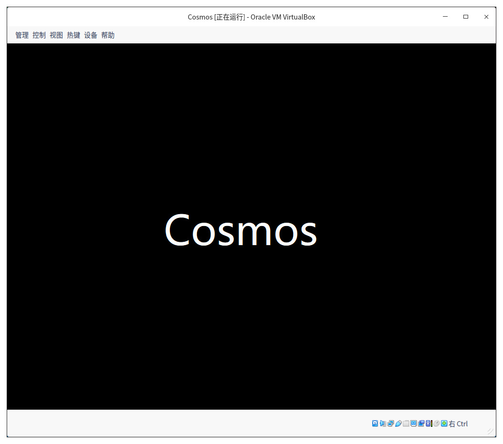

# 设置工作模式与环境（下）：探查和收集信息

你好，我是 LMOS。

上节课我们动手实现了自己的二级引导器。今天这节课我们将进入二级引导器，完成具体工作的环节。

在二级引导器中，我们要检查 CPU 是否支持 64 位的工作模式、收集内存布局信息，看看是不是合乎我们操作系统的最低运行要求，还要设置操作系统需要的 MMU 页表、设置显卡模式、释放中文字体文件。

今天课程的配套代码，你可以点击[这里](这里)，自行下载。

## 检查与收集机器信息 

如果 ldrkrl_entry() 函数是总裁，那么 init_bstartparm() 函数则是经理，它负责管理检查 CPU 模式、收集内存信息，设置内核栈，设置内核字体、建立内核 MMU 页表数据。

为了使代码更加清晰，我们并不直接在 ldrkrl_entry() 函数中搞事情，而是准备在另一个 bstartparm.c 文件中实现一个 init_bstartparm()。

下面我们就来动手实现它，如下所示。

```cpp
//初始化machbstart_t结构体，清0,并设置一个标志
void machbstart_t_init(machbstart_t* initp)
{
    memset(initp,0,sizeof(machbstart_t));
    initp->mb_migc=MBS_MIGC;
    return;
}
void init_bstartparm()
{
    machbstart_t* mbsp = MBSPADR;//1MB的内存地址
    machbstart_t_init(mbsp);
    return;
}
```

目前我们的经理 init_bstartparm() 函数只是调用了一个 machbstart_t_init() 函数，在 1MB 内存地址处初始化了一个机器信息结构 machbstart_t，后面随着干活越来越多，还会调用更多的函数的。

### 检查 CPU 

首先要检查我们的 CPU，因为它是执行程序的关键。我们要搞清楚它能执行什么形式的代码，支持 64 位长模式吗？

这个工作我们交给 init_chkcpu() 函数来干，由于我们要 CPUID 指令来检查 CPU 是否支持 64 位长模式，所以这个函数中需要找两个帮工：**chk_cpuid、chk_cpu_longmode** 来干两件事，一个是检查 CPU 否支持 CPUID 指令，然后另一个用 CPUID 指令检查 CPU 支持 64 位长模式。

下面我们去写好它们，如下所示。

```cpp
//通过改写Eflags寄存器的第21位，观察其位的变化判断是否支持CPUID
int chk_cpuid()
{
    int rets = 0;
    __asm__ __volatile__(
        "pushfl \n\t"
        "popl %%eax \n\t"
        "movl %%eax,%%ebx \n\t"
        "xorl $0x0200000,%%eax \n\t"
        "pushl %%eax \n\t"
        "popfl \n\t"
        "pushfl \n\t"
        "popl %%eax \n\t"
        "xorl %%ebx,%%eax \n\t"
        "jz 1f \n\t"
        "movl $1,%0 \n\t"
        "jmp 2f \n\t"
        "1: movl $0,%0 \n\t"
        "2: \n\t"
        : "=c"(rets)
        :
        :);
    return rets;
}
//检查CPU是否支持长模式
int chk_cpu_longmode()
{
    int rets = 0;
    __asm__ __volatile__(
        "movl $0x80000000,%%eax \n\t"
        "cpuid \n\t" //把eax中放入0x80000000调用CPUID指令
        "cmpl $0x80000001,%%eax \n\t"//看eax中返回结果
        "setnb %%al \n\t" //不为0x80000001,则不支持0x80000001号功能
        "jb 1f \n\t"
        "movl $0x80000001,%%eax \n\t"
        "cpuid \n\t"//把eax中放入0x800000001调用CPUID指令，检查edx中的返回数据
        "bt $29,%%edx  \n\t" //长模式 支持位  是否为1
        "setcb %%al \n\t"
        "1: \n\t"
        "movzx %%al,%%eax \n\t"
        : "=a"(rets)
        :
        :);
    return rets;
}
//检查CPU主函数
void init_chkcpu(machbstart_t *mbsp)
{
    if (!chk_cpuid())
    {
        kerror("Your CPU is not support CPUID sys is die!");
        CLI_HALT();
    }
    if (!chk_cpu_longmode())
    {
        kerror("Your CPU is not support 64bits mode sys is die!");
        CLI_HALT();
    }
    mbsp->mb_cpumode = 0x40;//如果成功则设置机器信息结构的cpu模式为64位
    return;
}
```

上述代码中，检查 CPU 是否支持 CPUID 指令和检查 CPU 是否支持长模式，只要其中一步检查失败，我们就打印一条相应的提示信息，然后主动死机。**这里需要你留意的是，最后设置机器信息结构中的 mb_cpumode 字段为 64,mbsp 正是传递进来的机器信息 machbstart_t 结构体的指针。**

### 获取内存布局 

好了，CPU 已经检查完成 ，合乎我们的要求。下面就要获取内存布局信息了，物理内存在物理地址空间中是一段一段的，描述一段内存有一个数据结构，如下所示。

```cpp
#define RAM_USABLE 1 //可用内存
#define RAM_RESERV 2 //保留内存不可使用
#define RAM_ACPIREC 3 //ACPI表相关的
#define RAM_ACPINVS 4 //ACPI NVS空间
#define RAM_AREACON 5 //包含坏内存
typedef struct s_e820{
    u64_t saddr;    /* 内存开始地址 */
    u64_t lsize;    /* 内存大小 */
    u32_t type;    /* 内存类型 */
}e820map_t;
```

获取内存布局信息就是获取这个结构体的数组，这个工作我们交给 init_mem 函数来干，这个函数需要完成两件事：一是获取上述这个结构体数组，二是检查内存大小，因为我们的内核对内存容量有要求，不能太小。

下面我们来动手实现这个 init_mem 函数。

```cpp
#define ETYBAK_ADR 0x2000
#define PM32_EIP_OFF (ETYBAK_ADR)
#define PM32_ESP_OFF (ETYBAK_ADR+4)
#define E80MAP_NR (ETYBAK_ADR+64)//保存e820map_t结构数组元素个数的地址
#define E80MAP_ADRADR (ETYBAK_ADR+68) //保存e820map_t结构数组的开始地址
void init_mem(machbstart_t *mbsp)
{
    e820map_t *retemp;
    u32_t retemnr = 0;
    mmap(&retemp, &retemnr);
    if (retemnr == 0)
    {
        kerror("no e820map\n");
    }
    //根据e820map_t结构数据检查内存大小
    if (chk_memsize(retemp, retemnr, 0x100000, 0x8000000) == NULL)
    {
        kerror("Your computer is low on memory, the memory cannot be less than 128MB!");
    }
    mbsp->mb_e820padr = (u64_t)((u32_t)(retemp));//把e820map_t结构数组的首地址传给mbsp->mb_e820padr 
    mbsp->mb_e820nr = (u64_t)retemnr;//把e820map_t结构数组元素个数传给mbsp->mb_e820nr 
    mbsp->mb_e820sz = retemnr * (sizeof(e820map_t));//把e820map_t结构数组大小传给mbsp->mb_e820sz 
    mbsp->mb_memsz = get_memsize(retemp, retemnr);//根据e820map_t结构数据计算内存大小。
    return;
}
```

上面最难写的是 mmap 函数。不过，我们还是有办法破解的。如果你理解了前面调用 BIOS 的机制，就会发现，**只要调用了 BIOS 中断，就能获取 e820map 结构数组**。

为了验证这个结论，我们来看一下 mmap 的函数调用关系：

```cpp
void mmap(e820map_t **retemp, u32_t *retemnr)
{
    realadr_call_entry(RLINTNR(0), 0, 0);
    *retemnr = *((u32_t *)(E80MAP_NR));
    *retemp = (e820map_t *)(*((u32_t *)(E80MAP_ADRADR)));
    return;
}
```

可以看到，mmap 函数正是通过前面讲的 **realadr_call_entry 函数**，来调用实模式下的 _getmmap 函数的，并且在 _getmmap 函数中调用 BIOS 中断的。

```java
_getmmap:
  push ds
  push es
  push ss
  mov esi,0
  mov dword[E80MAP_NR],esi
  mov dword[E80MAP_ADRADR],E80MAP_ADR ;e820map结构体开始地址
  xor ebx,ebx
  mov edi,E80MAP_ADR
loop:
  mov eax,0e820h ;获取e820map结构参数
  mov ecx,20    ;e820map结构大小
  mov edx,0534d4150h ;获取e820map结构参数必须是这个数据
  int 15h  ;BIOS的15h中断
  jc .1
  add edi,20
  cmp edi,E80MAP_ADR+0x1000
  jg .1
  inc esi
  cmp ebx,0
  jne loop ;循环获取e820map结构
  jmp .2
.1:
  mov esi,0    ;出错处理，e820map结构数组元素个数为0
.2:
  mov dword[E80MAP_NR],esi ;e820map结构数组元素个数
  pop ss
  pop es
  pop ds
  ret
```

如果你不明白上面代码的原理，请回到“Cache 与内存：程序放在哪儿”[那节课](那节课)，看一下获取内存视图相关的知识点。

init_mem 函数在调用 mmap 函数后，就会得到 e820map 结构数组，其首地址和数组元素个数由 retemp，retemnr 两个变量分别提供。

### 初始化内核栈 

因为我们的操作系统是 C 语言写的，所以需要有栈，下面我们就来给即将运行的内核初始化一个栈。这个操作非常简单，就是在机器信息结构 machbstart_t 中，记录一下栈地址和栈大小，供内核在启动时使用。

不过，就算操作再简单，我们也要封装成函数来使用。让我们动手来写出这个函数吧，如下所示。

```cpp
#define IKSTACK_PHYADR (0x90000-0x10)
#define IKSTACK_SIZE 0x1000
//初始化内核栈
void init_krlinitstack(machbstart_t *mbsp)
{
    if (1 > move_krlimg(mbsp, (u64_t)(0x8f000), 0x1001))
    {
        kerror("iks_moveimg err");
    }
    mbsp->mb_krlinitstack = IKSTACK_PHYADR;//栈顶地址
    mbsp->mb_krlitstacksz = IKSTACK_SIZE; //栈大小是4KB
    return;
}
```

init_krlinitstack 函数非常简单，但是其中调用了一个 move_krlimg 函数你要注意，这个我已经帮你写好啦，它主要负责判断一个地址空间是否和内存中存放的内容有冲突。

因为我们的内存中已经放置了机器信息结构、内存视图结构数组、二级引导器、内核映像文件，所以在处理内存空间时不能和内存中已经存在的他们冲突，否则就要覆盖他们的数据。0x8f000～（0x8f000+0x1001），正是我们的内核栈空间，我们需要检测它是否和其它空间有冲突。

### 放置内核文件与字库文件 

放置内核文件和字库文件这一步，也非常简单，甚至放置其它文件也一样。

因为我们的内核已经编译成了一个独立的二进制程序，和其它文件一起被打包到映像文件中了。所以我们必须要从映像中把它解包出来，将其放在特定的物理内存空间中才可以，放置字库文件和放置内核文件的原理一样，所以我们来一起实现。

```cpp
//放置内核文件
void init_krlfile(machbstart_t *mbsp)
{
//在映像中查找相应的文件，并复制到对应的地址，并返回文件的大小，这里是查找kernel.bin文件
    u64_t sz = r_file_to_padr(mbsp, IMGKRNL_PHYADR, "kernel.bin");
    if (0 == sz)
    {
        kerror("r_file_to_padr err");
    }
    //放置完成后更新机器信息结构中的数据
    mbsp->mb_krlimgpadr = IMGKRNL_PHYADR;
    mbsp->mb_krlsz = sz;
    //mbsp->mb_nextwtpadr始终要保持指向下一段空闲内存的首地址 
    mbsp->mb_nextwtpadr = P4K_ALIGN(mbsp->mb_krlimgpadr + mbsp->mb_krlsz);
    mbsp->mb_kalldendpadr = mbsp->mb_krlimgpadr + mbsp->mb_krlsz;
    return;
}
//放置字库文件
void init_defutfont(machbstart_t *mbsp)
{
    u64_t sz = 0;
    //获取下一段空闲内存空间的首地址 
    u32_t dfadr = (u32_t)mbsp->mb_nextwtpadr;
//在映像中查找相应的文件，并复制到对应的地址，并返回文件的大小，这里是查找font.fnt文件
    sz = r_file_to_padr(mbsp, dfadr, "font.fnt");
    if (0 == sz)
    {
        kerror("r_file_to_padr err");
    }
    //放置完成后更新机器信息结构中的数据
    mbsp->mb_bfontpadr = (u64_t)(dfadr);
    mbsp->mb_bfontsz = sz;
    //更新机器信息结构中下一段空闲内存的首地址  
    mbsp->mb_nextwtpadr = P4K_ALIGN((u32_t)(dfadr) + sz);
    mbsp->mb_kalldendpadr = mbsp->mb_bfontpadr + mbsp->mb_bfontsz;
    return;
}
```

以上代码的注释已经很清楚了，都是调用 r_file_to_padr 函数在映像中查找 kernel.bin 和 font.fnt 文件，并复制到对应的空闲内存空间中。

请注意，由于内核是代码数据，所以必须要复制到指定的内存空间中。r_file_to_padr 函数我已经帮你写好了，其中的原理在前面的内容里已经做了说明，这里不再展开。

### 建立 MMU 页表数据 

前面解决了文件放置问题，我们还要解决另一个问题——建立 MMU 页表。

我们在二级引导器中建立 MMU 页表数据，目的就是要在内核加载运行之初开启长模式时，MMU 需要的页表数据已经准备好了。

由于我们的内核虚拟地址空间从 0xffff800000000000 开始，所以我们这个虚拟地址映射到从物理地址 0 开始，大小都是 0x400000000 即 16GB，也就是说我们要虚拟地址空间：0xffff800000000000～0xffff800400000000 映射到物理地址空间 0～0x400000000。

我们为了简化编程，使用**长模式下的 2MB 分页方式**，下面我们用代码实现它，如下所示。

```cpp
#define KINITPAGE_PHYADR 0x1000000
void init_bstartpages(machbstart_t *mbsp)
{
    //顶级页目录
    u64_t *p = (u64_t *)(KINITPAGE_PHYADR);//16MB地址处
    //页目录指针
    u64_t *pdpte = (u64_t *)(KINITPAGE_PHYADR + 0x1000);
    //页目录
    u64_t *pde = (u64_t *)(KINITPAGE_PHYADR + 0x2000);
    //物理地址从0开始
    u64_t adr = 0;
    if (1 > move_krlimg(mbsp, (u64_t)(KINITPAGE_PHYADR), (0x1000 * 16 + 0x2000)))
    {
        kerror("move_krlimg err");
    }
    //将顶级页目录、页目录指针的空间清0
    for (uint_t mi = 0; mi < PGENTY_SIZE; mi++)
    {
        p[mi] = 0;
        pdpte[mi] = 0;
    }
    //映射
    for (uint_t pdei = 0; pdei < 16; pdei++)
    {
        pdpte[pdei] = (u64_t)((u32_t)pde | KPDPTE_RW | KPDPTE_P);
        for (uint_t pdeii = 0; pdeii < PGENTY_SIZE; pdeii++)
        {//大页KPDE_PS 2MB，可读写KPDE_RW，存在KPDE_P
            pde[pdeii] = 0 | adr | KPDE_PS | KPDE_RW | KPDE_P;
            adr += 0x200000;
        }
        pde = (u64_t *)((u32_t)pde + 0x1000);
    }
    //让顶级页目录中第0项和第((KRNL_VIRTUAL_ADDRESS_START) >> KPML4_SHIFT) & 0x1ff项，指向同一个页目录指针页  
    p[((KRNL_VIRTUAL_ADDRESS_START) >> KPML4_SHIFT) & 0x1ff] = (u64_t)((u32_t)pdpte | KPML4_RW | KPML4_P);
    p[0] = (u64_t)((u32_t)pdpte | KPML4_RW | KPML4_P);
    //把页表首地址保存在机器信息结构中
    mbsp->mb_pml4padr = (u64_t)(KINITPAGE_PHYADR);
    mbsp->mb_subpageslen = (u64_t)(0x1000 * 16 + 0x2000);
    mbsp->mb_kpmapphymemsz = (u64_t)(0x400000000);
    return;
}
```

这个函数的代码写得非常简单，**映射的核心逻辑由两重循环控制**，外层循环控制页目录指针顶，只有 16 项，其中每一项都指向一个页目录，每个页目录中有 512 个物理页地址。

物理地址每次增加 2MB，这是由 26～30 行的内层循环控制，每执行一次外层循环就要执行 512 次内层循环。

最后，顶级页目录中第 0 项和第 ((KRNL_VIRTUAL_ADDRESS_START) &gt;&gt; KPML4_SHIFT) &amp; 0x1ff 项，指向同一个页目录指针页，这样的话就能让虚拟地址：0xffff800000000000～0xffff800400000000 和虚拟地址：0～0x400000000，访问到同一个物理地址空间 0～0x400000000，这样做是有目的，**内核在启动初期，虚拟地址和物理地址要保持相同。**

### 设置图形模式 

在计算机加电启动时，计算机上显卡会自动进入文本模式，文本模式只能显示 ASCII 字符，不能显示汉字和图形，所以我们要让显卡切换到图形模式。

切换显卡模式依然要用 BIOS 中断，这个调用原理我们前面已经了如指掌。在实模式切换显卡模式的汇编代码，我已经帮你写好了，下面我们只要写个 C 函数调用它们就好了，代码如下所示。

```cpp
void init_graph(machbstart_t* mbsp)
{
    //初始化图形数据结构
    graph_t_init(&mbsp->mb_ghparm);
    //获取VBE模式，通过BIOS中断
    get_vbemode(mbsp);
    //获取一个具体VBE模式的信息，通过BIOS中断
    get_vbemodeinfo(mbsp);
    //设置VBE模式，通过BIOS中断
    set_vbemodeinfo();
    return;
}
```

上面 init_graph 函数中的这些处理 VBE 模式的代码，我已经帮你写好，你可以自己在 graph.c 文件查看。

什么？你不懂 VBE，其实我开始也不懂，后来通过搜寻资料才知道。

其实 VBE 是显卡的一个图形规范标准，它定义了显卡的几种图形模式，每个模式包括屏幕分辨率，像素格式与大小，显存大小。调用 BIOS 10h 中断可以返回这些数据结构。[如果你实在对 VBE 感兴趣，可以自行阅读其规范](如果你实在对 VBE 感兴趣，可以自行阅读其规范) 。

这里我们选择使用了 VBE 的 118h 模式，该模式下屏幕分辨率为 1024x768，显存大小是 16.8MB。显存开始地址一般为 0xe0000000。

屏幕分辨率为 1024x768，即把屏幕分成 768 行，每行 1024 个像素点，但每个像素点占用显存的 32 位数据（4 字节，红、绿、蓝、透明各占 8 位）。我们只要往对应的显存地址写入相应的像素数据，屏幕对应的位置就能显示了。

每个像素点，我们可以用如下数据结构表示：

```cpp
typedef struct s_PIXCL
{
    u8_t cl_b; //蓝
    u8_t cl_g; //绿
    u8_t cl_r; //红
    u8_t cl_a; //透明
}__attribute__((packed)) pixcl_t;
#define BGRA(r,g,b) ((0|(r<<16)|(g<<8)|b))
//通常情况下用pixl_t 和 BGRA宏
typedef u32_t pixl_t;
```

我们再来看看屏幕像素点和显存位置对应的计算方式：

```cpp
u32_t* dispmem = (u32_t*)mbsp->mb_ghparm.gh_framphyadr;
dispmem[x + (y * 1024)] = pix;
//x，y是像素的位置
```

### 串联 

好了，所有的实施工作的函数已经完成了，现在我们需要在 init_bstartparm() 函数中把它们串联起来，即按照事情的先后顺序，依次调用它们完成相应的工作，实现检查、收集机器信息，设置工作环境。

```cpp
void init_bstartparm()
{
    machbstart_t *mbsp = MBSPADR;
    machbstart_t_init(mbsp);
    //检查CPU
    init_chkcpu(mbsp);
    //获取内存布局
    init_mem(mbsp);
    //初始化内核栈
    init_krlinitstack(mbsp);
    //放置内核文件
    init_krlfile(mbsp);
    //放置字库文件
    init_defutfont(mbsp);
    init_meme820(mbsp);
    //建立MMU页表
    init_bstartpages(mbsp);
    //设置图形模式
    init_graph(mbsp);
    return;
}
```

到这里，init_bstartparm() 函数就成功完成了它的使命。

## 显示 Logo 

前面我们已经设置了图形模式，也应该要展示一下了，检查一下工作成果。

我们来显示一下我们内核的 logo。其实在二级引导器中，我已经帮你写好了显示 logo 函数，而 logo 文件是个 **24 位的位图文件**，目前为了简单起见，我们**只支持这种格式的图片文件**。下面我们去调用这个函数。

```cpp
void logo(machbstart_t* mbsp)
{
    u32_t retadr=0,sz=0;
    //在映像文件中获取logo.bmp文件
    get_file_rpadrandsz("logo.bmp",mbsp,&retadr,&sz);
    if(0==retadr)
    {
        kerror("logo getfilerpadrsz err");
    }
    //显示logo文件中的图像数据
    bmp_print((void*)retadr,mbsp);
    return;
}
void init_graph(machbstart_t* mbsp)
{    
    //……前面代码省略
    //显示
    logo(mbsp);
    return;
}
```

在图格式的文件中，除了文件头的数据就是图形像素点的数据，只不过 24 位的位图每个像素占用 3 字节，并且位置是倒排的，即第一个像素的数据是在文件的最后，依次类推。我们只要依次将位图文件的数据，按照倒排次序写入显存中，这样就可以显示了。

我们需要把二级引导器的文件和 logo 文件打包成映像文件，然后放在虚拟硬盘中。

复制文件到虚拟硬盘中得先 mount，然后复制，最后转换成 VDI 格式的虚拟硬盘，再挂载到虚拟机上启动就行了。这也是为什么要手动建立硬盘的原因，打包命令如下。

```null
lmoskrlimg -m k -lhf initldrimh.bin -o Cosmos.eki -f initldrsve.bin initldrkrl.bin font.fnt logo.bmp
```

如果手动打命令对你来说还是比较难，也别担心，我已经帮你写好了 make 脚本，你只需要进入代码目录中 make vboxtest 就行了，运行结果如下 。



啊哈！终于显示了 logo。是不是挺有成就感的？这至少证明我们辛苦写的代码是正确的。

但是目前我们的代码执行流还在二级引导器中，我们的目的是开发自己的操作系统，不，我们是要开发 Cosmos。

**后面，我们正式用 Cosmos 命名我们的操作系统。**Cosmos 可以翻译成宇宙，尽管它刚刚诞生，但我对它充满期待，所以用了这样一个能够“包括万物，包罗万象”的名字。

## 进入 Cosmos 

我们在调用 Cosmos 第一个 C 函数之前，我们依然要写一小段汇编代码，切换 CPU 到长模式，初始化 CPU 寄存器和 C 语言要用的栈。因为目前代码执行流在二级引导器中，进入到 Cosmos 中这样在二级引导器中初始过的东西都不能用了。

因为 CPU 进入了长模式，寄存器的位宽都变了，所以需要重新初始化。让我们一起来写这段汇编代码吧，我们先在 Cosmos/hal/x86/ 下建立一个 init_entry.asm 文件，写上后面这段代码。

```sql
[section .start.text]
[BITS 32]
_start:
    cli
    mov ax,0x10
    mov ds,ax
    mov es,ax
    mov ss,ax
    mov fs,ax
    mov gs,ax
    lgdt [eGdtPtr]        
    ;开启 PAE
    mov eax, cr4
    bts eax, 5                      ; CR4.PAE = 1
    mov cr4, eax
    mov eax, PML4T_BADR             ;加载MMU顶级页目录
    mov cr3, eax  
    ;开启 64bits long-mode
    mov ecx, IA32_EFER
    rdmsr
    bts eax, 8                      ; IA32_EFER.LME =1
    wrmsr
    ;开启 PE 和 paging
    mov eax, cr0
    bts eax, 0                      ; CR0.PE =1
    bts eax, 31
    ;开启 CACHE       
    btr eax,29                    ; CR0.NW=0
    btr eax,30                    ; CR0.CD=0  CACHE
    mov cr0, eax                    ; IA32_EFER.LMA = 1
    jmp 08:entry64
[BITS 64]
entry64:
    mov ax,0x10
    mov ds,ax
    mov es,ax
    mov ss,ax
    mov fs,ax
    mov gs,ax
    xor rax,rax
    xor rbx,rbx
    xor rbp,rbp
    xor rcx,rcx
    xor rdx,rdx
    xor rdi,rdi
    xor rsi,rsi
    xor r8,r8
    xor r9,r9
    xor r10,r10
    xor r11,r11
    xor r12,r12
    xor r13,r13
    xor r14,r14
    xor r15,r15
    mov rbx,MBSP_ADR
    mov rax,KRLVIRADR
    mov rcx,[rbx+KINITSTACK_OFF]
    add rax,rcx
    xor rcx,rcx
    xor rbx,rbx
    mov rsp,rax
    push 0
    push 0x8
    mov rax,hal_start                 ;调用内核主函数
    push rax
    dw 0xcb48
    jmp $
[section .start.data]
[BITS 32]
x64_GDT:
enull_x64_dsc:  dq 0  
ekrnl_c64_dsc:  dq 0x0020980000000000   ; 64-bit 内核代码段
ekrnl_d64_dsc:  dq 0x0000920000000000   ; 64-bit 内核数据段
euser_c64_dsc:  dq 0x0020f80000000000   ; 64-bit 用户代码段
euser_d64_dsc:  dq 0x0000f20000000000   ; 64-bit 用户数据段
eGdtLen      equ  $ - enull_x64_dsc   ; GDT长度
eGdtPtr:    dw eGdtLen - 1      ; GDT界限
        dq ex64_GDT
```

上述代码中，1～11 行表示加载 70～75 行的 GDT，13～17 行是设置 MMU 并加载在二级引导器中准备好的 MMU 页表，19～30 行是开启长模式并打开 Cache，34～54 行则是初始化长模式下的寄存器，55～61 行是读取二级引导器准备的机器信息结构中的栈地址，并用这个数据设置 RSP 寄存器。

最关键的是 63～66 行，它开始把 8 和 hal_start 函数的地址压入栈中。dw 0xcb48 是直接写一条指令的机器码——0xcb48，这是一条返回指令。这个返回指令有点特殊，它会把栈中的数据分别弹出到 RIP，CS 寄存器，这正是为了调用我们 Cosmos 的**第一个 C 函数 hal_start**。

## 重点回顾 

这是我们设置工作模式与环境的最后一课，到此为止我们的二级引导器已经建立起来了，成功从 GRUB 手中接过了权柄，开始了它自己的一系列工作，二级引导器完成的工作不算少，我来帮你梳理一下，重点如下。

1. 二级引导器彻底摆脱了 GRUB 的控制之后，就开始检查 CPU，获取内存布局信息，确认是不是我们要求的 CPU 和内存大小，接着初始化内核栈、放置好内核文件和字库文件，建立 MMU 页表数据和设置好图形模式，为后面运行内核做好准备。

2. 当二级引导器完成了上述功能后，就会显示我们操作系统的 logo，这标志着二级引导器所有的工作一切正常。

3. 进入 Cosmos，我们的二级引导器通过跳转到 Cosmos 的入口，结束了自己光荣使命，Cosmos 的入口是一小段汇编代码，主要是开启 CPU 的长模式，最后调用了 Cosmos 的第一个 C 函数 hal_start。

你想过吗？我们的二级引导器还可以做更多的事情，其实还可以在二级引导器中获取 ACPI 表，进而获取 CPU 数量和其它设备信息，期待你的实现。

## 思考题 

请你想一下，init_bstartparm() 函数中的 init_mem820() 函数，这个函数到底干了什么？

欢迎你在留言区跟我互动。如果你身边有朋友对手写操作系统有热情，也欢迎你把这节课转发给他。

