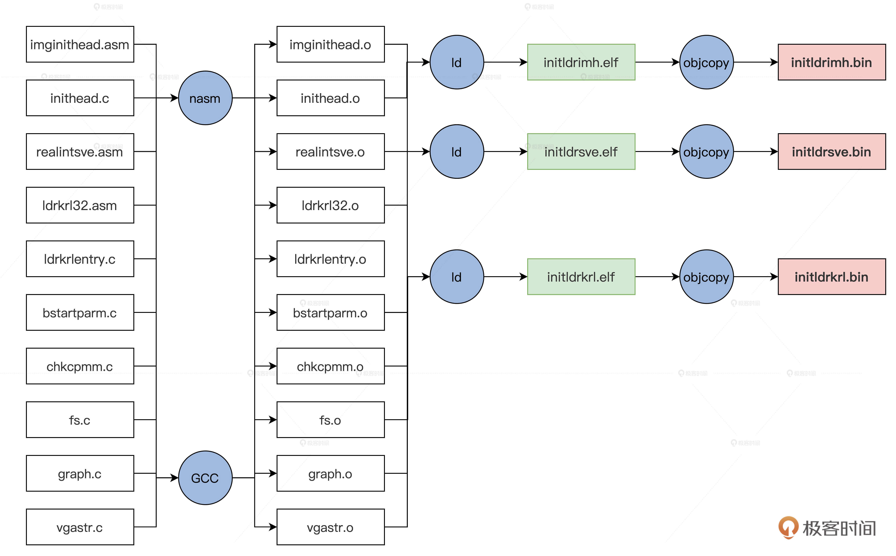

# 设置工作模式与环境（中）：建造二级引导器

你好，我是 LMOS。

上节课，我们建造了属于我们的“计算机”，并且在上面安装好了 GRUB。这节课我会带你一起实现二级引导器这个关键组件。

看到这儿你可能会问，GRUB 不是已经把我们的操作系统加载到内存中了吗？我们有了 GRUB，我们为什么还要实现二级引导器呢？

这里我要给你说说我的观点，二级引导器作为操作系统的先驱，它需要**收集机器信息**，确定这个计算机能不能运行我们的操作系统，对 CPU、内存、显卡进行一些初级的配置，放置好内核相关的文件。

因为我们二级引导器不是执行具体的加载任务的，而是解析内核文件、收集机器环境信息，它具体收集哪些信息，我会在下节课详细展开。

## 设计机器信息结构 

二级引导器收集的信息，需要地点存放，我们需要设计一个数据结构。信息放在这个数据结构中，这个结构放在内存 1MB 的地方，方便以后传给我们的操作系统。

为了让你抓住重点，我选取了这个数据结构的**关键代码**，这里并没有列出该结构的所有字段（Cosmos/initldr/include/ldrtype.h），这个结构如下所示。

```cpp
typedef struct s_MACHBSTART
{
    u64_t   mb_krlinitstack;//内核栈地址
    u64_t   mb_krlitstacksz;//内核栈大小
    u64_t   mb_imgpadr;//操作系统映像
    u64_t   mb_imgsz;//操作系统映像大小
    u64_t   mb_bfontpadr;//操作系统字体地址
    u64_t   mb_bfontsz;//操作系统字体大小
    u64_t   mb_fvrmphyadr;//机器显存地址
    u64_t   mb_fvrmsz;//机器显存大小
    u64_t   mb_cpumode;//机器CPU工作模式
    u64_t   mb_memsz;//机器内存大小
    u64_t   mb_e820padr;//机器e820数组地址
    u64_t   mb_e820nr;//机器e820数组元素个数
    u64_t   mb_e820sz;//机器e820数组大小
    //……
    u64_t   mb_pml4padr;//机器页表数据地址
    u64_t   mb_subpageslen;//机器页表个数
    u64_t   mb_kpmapphymemsz;//操作系统映射空间大小
    //……
    graph_t mb_ghparm;//图形信息
}__attribute__((packed)) machbstart_t;
```

## 规划二级引导器 

在开始写代码之前，我们先来从整体划分一下二级引导器的功能模块，从全局了解下功能应该怎么划分，这里我特意为你梳理了一个表格。


前面表格里的这些文件，我都放在了课程配套源码中了，你可以从[这里](这里)下载。

上述这些文件都在 lesson10～11/Cosmos/initldr/ldrkrl 目录中，它们在编译之后会形成三个文件，编译脚本我已经写好了，下面我们用一幅图来展示这个编译过程。



这最后三个文件用我们前面说的映像工具打包成映像文件，其指令如下。

```null
lmoskrlimg -m k -lhf initldrimh.bin -o Cosmos.eki -f initldrkrl.bin initldrsve.bin
```

## 实现 GRUB 头 

我们的 GRUB 头有两个文件组成，**一个 imginithead.asm 汇编文件**，它有两个功能，既能让 GRUB 识别，又能设置 C 语言运行环境，用于调用 C 函数；**第二就是 inithead.c 文件**，它的主要功能是查找二级引导器的核心文件——initldrkrl.bin，然后把它放置到特定的内存地址上。

我们先来实现 imginithead.asm，它主要工作是初始化 CPU 的寄存器，加载 GDT，切换到 CPU 的保护模式，我们一步一步来实现。

首先是 GRUB1 和 GRUB2 需要的两个头结构，代码如下。

```python
MBT_HDR_FLAGS  EQU 0x00010003
MBT_HDR_MAGIC  EQU 0x1BADB002
MBT2_MAGIC  EQU 0xe85250d6
global _start
extern inithead_entry
[section .text]
[bits 32]
_start:
  jmp _entry
align 4
mbt_hdr:
  dd MBT_HDR_MAGIC
  dd MBT_HDR_FLAGS
  dd -(MBT_HDR_MAGIC+MBT_HDR_FLAGS)
  dd mbt_hdr
  dd _start
  dd 0
  dd 0
  dd _entry
ALIGN 8
mbhdr:
  DD  0xE85250D6
  DD  0
  DD  mhdrend - mbhdr
  DD  -(0xE85250D6 + 0 + (mhdrend - mbhdr))
  DW  2, 0
  DD  24
  DD  mbhdr
  DD  _start
  DD  0
  DD  0
  DW  3, 0
  DD  12
  DD  _entry 
  DD  0  
  DW  0, 0
  DD  8
mhdrend:
```

然后是关中断并加载 GDT，代码如下所示。

```python
_entry:
  cli           ；关中断
  in al, 0x70 
  or al, 0x80  
  out 0x70,al  ；关掉不可屏蔽中断   
  lgdt [GDT_PTR] ；加载GDT地址到GDTR寄存器
  jmp dword 0x8 :_32bits_mode ；长跳转刷新CS影子寄存器
  ;………………
;GDT全局段描述符表
GDT_START:
knull_dsc: dq 0
kcode_dsc: dq 0x00cf9e000000ffff
kdata_dsc: dq 0x00cf92000000ffff
k16cd_dsc: dq 0x00009e000000ffff ；16位代码段描述符
k16da_dsc: dq 0x000092000000ffff ；16位数据段描述符
GDT_END:
GDT_PTR:
GDTLEN  dw GDT_END-GDT_START-1  ;GDT界限
GDTBASE  dd GDT_ST  
```

最后是初始化段寄存器和通用寄存器、栈寄存器，这是为了给调用 inithead_entry 这个 C 函数做准备，代码如下所示。

```sql
_32bits_mode：
  mov ax, 0x10
  mov ds, ax
  mov ss, ax
  mov es, ax
  mov fs, ax
  mov gs, ax
  xor eax,eax
  xor ebx,ebx
  xor ecx,ecx
  xor edx,edx
  xor edi,edi
  xor esi,esi
  xor ebp,ebp
  xor esp,esp
  mov esp,0x7c00 ；设置栈顶为0x7c00
  call inithead_entry ；调用inithead_entry函数在inithead.c中实现
  jmp 0x200000  ；跳转到0x200000地址
```

上述代码的最后调用了 inithead_entry 函数，这个函数我们需要另外在 inithead.c 中实现，我们这就来实现它，如下所示。

```cpp
#define MDC_ENDGIC 0xaaffaaffaaffaaff
#define MDC_RVGIC 0xffaaffaaffaaffaa
#define REALDRV_PHYADR 0x1000
#define IMGFILE_PHYADR 0x4000000
#define IMGKRNL_PHYADR 0x2000000
#define LDRFILEADR IMGFILE_PHYADR
#define MLOSDSC_OFF (0x1000)
#define MRDDSC_ADR (mlosrddsc_t*)(LDRFILEADR+0x1000)
void inithead_entry()
{
    write_realintsvefile();
    write_ldrkrlfile();
    return;
}
//写initldrsve.bin文件到特定的内存中
void write_realintsvefile()
{
    fhdsc_t *fhdscstart = find_file("initldrsve.bin");
    if (fhdscstart == NULL)
    {
        error("not file initldrsve.bin");
    }
    m2mcopy((void *)((u32_t)(fhdscstart->fhd_intsfsoff) + LDRFILEADR),
            (void *)REALDRV_PHYADR, (sint_t)fhdscstart->fhd_frealsz);
    return;
}
//写initldrkrl.bin文件到特定的内存中
void write_ldrkrlfile()
{
    fhdsc_t *fhdscstart = find_file("initldrkrl.bin");
    if (fhdscstart == NULL)
    {
        error("not file initldrkrl.bin");
    }
    m2mcopy((void *)((u32_t)(fhdscstart->fhd_intsfsoff) + LDRFILEADR),
            (void *)ILDRKRL_PHYADR, (sint_t)fhdscstart->fhd_frealsz);
    return;
}
//在映像文件中查找对应的文件
fhdsc_t *find_file(char_t *fname)
{
    mlosrddsc_t *mrddadrs = MRDDSC_ADR;
    if (mrddadrs->mdc_endgic != MDC_ENDGIC ||
        mrddadrs->mdc_rv != MDC_RVGIC ||
        mrddadrs->mdc_fhdnr < 2 ||
        mrddadrs->mdc_filnr < 2)
    {
        error("no mrddsc");
    }
    s64_t rethn = -1;
    fhdsc_t *fhdscstart = (fhdsc_t *)((u32_t)(mrddadrs->mdc_fhdbk_s) + LDRFILEADR);
    for (u64_t i = 0; i < mrddadrs->mdc_fhdnr; i++)
    {
        if (strcmpl(fname, fhdscstart[i].fhd_name) == 0)
        {
            rethn = (s64_t)i;
            goto ok_l;
        }
    }
    rethn = -1;
ok_l:
    if (rethn < 0)
    {
        error("not find file");
    }
    return &fhdscstart[rethn];
}
```

我们实现了 inithead_entry 函数，它主要干了两件事，即分别调用 write_realintsvefile();、write_ldrkrlfile() 函数，把映像文件中的 initldrsve.bin 文件和 initldrkrl.bin 文件写入到特定的内存地址空间中，具体地址在上面代码中的宏有详细定义。

这两个函数分别依赖于 find_file 和 m2mcopy 函数。

正如其名，find_file 函数负责扫描映像文件中的文件头描述符，对比其中的文件名，然后返回对应的文件头描述符的地址，这样就可以得到文件在映像文件中的位置和大小了。

find_file 函数的接力队友就是 m2mcopy 函数，因为查找对比之后，最后就是 m2mcopy 函数负责把映像文件复制到具体的内存空间里。

代码中的其它函数我就不展开了，感兴趣的同学请自行研究，或者自己改写。

## 进入二级引导器 

你应该还有印象，刚才说的实现 GRUB 头这个部分，在 imghead.asm 汇编文件代码中，我们的最后一条指令是“**jmp 0x200000**”，即跳转到物理内存的 0x200000 地址处。

请你注意，这时地址还是物理地址，这个地址正是在 inithead.c 中由 write_ldrkrlfile() 函数放置的 initldrkrl.bin 文件，这一跳就进入了二级引导器的主模块了。

由于模块的改变，我们还需要写一小段汇编代码，建立下面这个 initldr32.asm 文件，并写上如下代码。

```sql
_entry:
  cli
  lgdt [GDT_PTR]；加载GDT地址到GDTR寄存器
  lidt [IDT_PTR]；加载IDT地址到IDTR寄存器
  jmp dword 0x8 :_32bits_mode；长跳转刷新CS影子寄存器
_32bits_mode:
  mov ax, 0x10  ; 数据段选择子(目的)
  mov ds, ax
  mov ss, ax
  mov es, ax
  mov fs, ax
  mov gs, ax
  xor eax,eax
  xor ebx,ebx
  xor ecx,ecx
  xor edx,edx
  xor edi,edi
  xor esi,esi
  xor ebp,ebp
  xor esp,esp
  mov esp,0x90000 ；使得栈底指向了0x90000
  call ldrkrl_entry ；调用ldrkrl_entry函数
  xor ebx,ebx
  jmp 0x2000000 ；跳转到0x2000000的内存地址
  jmp $
GDT_START:
knull_dsc: dq 0
kcode_dsc: dq 0x00cf9a000000ffff ;a-e
kdata_dsc: dq 0x00cf92000000ffff
k16cd_dsc: dq 0x00009a000000ffff ；16位代码段描述符
k16da_dsc: dq 0x000092000000ffff ；16位数据段描述符
GDT_END:
GDT_PTR:
GDTLEN  dw GDT_END-GDT_START-1  ;GDT界限
GDTBASE  dd GDT_START
IDT_PTR:
IDTLEN  dw 0x3ff
IDTBAS  dd 0  ；这是BIOS中断表的地址和长度
```

我来给你做个解读，代码的 1～4 行是在加载 GDTR 和 IDTR 寄存器，然后初始化 CPU 相关的寄存器。

和先前一样，因为代码模块的改变，所以我们要把 GDT、IDT，寄存器这些东西重新初始化，最后再去调用二级引导器的主函数 ldrkrl_entry。

## 巧妙调用 BIOS 中断 

我们不要急着去写 ldrkrl_entry 函数，因为在后面我们要获得内存布局信息，要设置显卡图形模式，而这些功能依赖于 BIOS 提供中断服务。

可是，要在 C 函数中调用 BIOS 中断是不可能的，因为 C 语言代码工作在 32 位保护模式下，BIOS 中断工作在 16 位的实模式。

所以，C 语言环境下调用 BIOS 中断，需要处理的问题如下：

1. 保存 C 语言环境下的 CPU 上下文 ，即保护模式下的所有通用寄存器、段寄存器、程序指针寄存器，栈寄存器，把它们都保存在内存中。

2. 切换回实模式，调用 BIOS 中断，把 BIOS 中断返回的相关结果，保存在内存中。

3. 切换回保护模式，重新加载第 1 步中保存的寄存器。这样 C 语言代码才能重新恢复执行。

要完成上面的功能，必须要写一个汇编函数才能完成，我们就把它写在 initldr32.asm 文件中，如下所示 。

```sql
realadr_call_entry:
  pushad     ;保存通用寄存器
  push    ds
  push    es
  push    fs ;保存4个段寄存器
  push    gs
  call save_eip_jmp ；调用save_eip_jmp 
  pop  gs
  pop  fs
  pop  es      ;恢复4个段寄存器
  pop  ds
  popad       ;恢复通用寄存器
  ret
save_eip_jmp:
  pop esi  ；弹出call save_eip_jmp时保存的eip到esi寄存器中， 
  mov [PM32_EIP_OFF],esi ；把eip保存到特定的内存空间中
  mov [PM32_ESP_OFF],esp ；把esp保存到特定的内存空间中
  jmp dword far [cpmty_mode]；长跳转这里表示把cpmty_mode处的第一个4字节装入eip，把其后的2字节装入cs
cpmty_mode:
  dd 0x1000
  dw 0x18
  jmp $
```

上面的代码我列了详细注释，你一看就能明白。不过这里唯一不好懂的是 **jmp dword far [cpmty_mode]指令**，别担心，听我给你解读一下。

其实这个指令是一个**长跳转**，表示把[cpmty_mode]处的数据装入 CS：EIP，也就是把 0x18：0x1000 装入到 CS：EIP 中。

这个 0x18 就是段描述索引（这个知识点不熟悉的话，你可以回看我们[第五节课](第五节课)），它正是指向 GDT 中的 16 位代码段描述符；0x1000 代表段内的偏移地址，所以在这个地址上，我们必须放一段代码指令，不然 CPU 跳转到这里将没指令可以执行，那样就会发生错误。

因为这是一个 16 位代码，所以我们需要新建立一个文件 realintsve.asm，如下所示。

```sql
[bits 16]
_start:
_16_mode:
  mov  bp,0x20 ;0x20是指向GDT中的16位数据段描述符 
  mov  ds, bp
  mov  es, bp
  mov  ss, bp
  mov  ebp, cr0
  and  ebp, 0xfffffffe
  mov  cr0, ebp ；CR0.P=0 关闭保护模式
  jmp  0:real_entry ；刷新CS影子寄存器，真正进入实模式
real_entry:
  mov bp, cs
  mov ds, bp
  mov es, bp
  mov ss, bp ；重新设置实模式下的段寄存器 都是CS中值，即为0 
  mov sp, 08000h ；设置栈
  mov bp,func_table
  add bp,ax
  call [bp] ；调用函数表中的汇编函数，ax是C函数中传递进来的
  cli
  call disable_nmi
  mov  ebp, cr0
  or  ebp, 1
  mov  cr0, ebp ；CR0.P=1 开启保护模式
  jmp dword 0x8 :_32bits_mode
[BITS 32]
_32bits_mode:
  mov bp, 0x10
  mov ds, bp
  mov ss, bp；重新设置保护模式下的段寄存器0x10是32位数据段描述符的索引
  mov esi,[PM32_EIP_OFF]；加载先前保存的EIP
  mov esp,[PM32_ESP_OFF]；加载先前保存的ESP
  jmp esi ；eip=esi 回到了realadr_call_entry函数中
func_table:  ;函数表
  dw _getmmap ；获取内存布局视图的函数
  dw _read ；读取硬盘的函数
    dw _getvbemode ；获取显卡VBE模式 
    dw _getvbeonemodeinfo ；获取显卡VBE模式的数据
    dw _setvbemode ；设置显卡VBE模式
```

上面的代码我们只要将它编译成 16 位的二进制的文件，并把它放在 0x1000 开始的内存空间中就可以了。这样在 realadr_call_entry 函数的最后，就运行到这段代码中来了。

上述的代码的流程是这样的：首先从 _16_mode: 标号处进入实模式，然后根据传递进来（由 ax 寄存器传入）的函数号，到函数表中调用对应的函数，里面的函数执行完成后，再次进入保护模式，加载 EIP 和 ESP 寄存器从而回到 realadr_call_entry 函数中。GDT 还是 imghead.asm 汇编代码文件中的 GDT，这没有变，因为它是由 GDTR 寄存器指向的。

说到这里，相信你会立刻明白，之前 write_realintsvefile() 函数的功能与意义了。它会把**映像文件中的 initldrsve.bin 文件写入到特定的内存地址空间中**，而 initldrsve.bin 正是由上面的 realintsve.asm 文件编译而成的。

## 二级引导器主函数 

好，现在我们准备得差不多了，从二级引导器的主函数开始，这个函数我们要用 C 来写，估计你也感受到了写汇编语言的压力，所以不能老是写汇编。

我们先建立一个 C 文件 ldrkrlentry.c，在其中写上一个主函数，代码如下。

```java
void ldrkrl_entry()
{
    init_bstartparm();
    return;
}
```

上述代码中的 ldrkrl_entry() 函数在 initldr32.asm 文件中被调用，从那条 call ldrkrl_entry 指令开始进入了 ldrkrl_entry() 函数，在其中调用了 **init_bstartparm() 函数**，这个函数我们还没有实现，但通过名字我们不难推测，它是负责处理开始参数的。

你还记不记得，我们建造二级引导器的目的，就是要收集机器环境信息。我们要把这些信息形成一个有结构的参数，传递给我们的操作系统内核以备后续使用。

由此，我们能够确定，**init_bstartparm() 函数成了收集机器环境信息的主函数**，下节课我们就会去实现它。

## 重点回顾 

今天我们开始实现二级引导器了，但是我们还没有完全实现，我们下一节课再接着继续这项工作。

现在，我们来梳理一下这节课的内容，回顾一下我们今天的成果。

1. 我们设计了机器信息结构，用于存放后面二级引导器收集到的机器信息。

2. 对二级引导器代码模块进行了规划，确定各模块的主要功能。

3. 实现了 GRUB 规定的 GRUB 头，以便被 GRUB 识别，在 GRUB 头中初始化了 CPU 寄存器，并且跳转到物理内存的 0x200000 地址处，真正进入到二级引导器中开始运行。

4. 为了二级引导器能够调用 BIOS 中断服务程序，我们实现了专门用来完成调用 BIOS 中断服务程序的 realintsve.asm 模块。

5. 最后，我们实现了二级引导器的主函数，由它调用完成其它功能的函数。

这里我还想聊聊，为什么我们要花这么多功夫，去设计二级引导器这个组件呢？

我们把这些处理操作系统运行环境的工作独立出来，交给二级引导器来做，这会**大大降低后面开发操作系统的难度，也能增加操作系统的通用性。**而且，针对不同的硬件平台，我们只要开发不同的二级引导器就好了。

## 思考题 

请问 GRUB 头中为什么需要 _entry 标号和 _start 标号的地址？

欢迎你在留言区跟我交流活动。如果你身边的同事、朋友，对二级引导器的建立有兴趣，也欢迎你把这节课分享给他。

好，我是 LMOS，我们下节课见！

