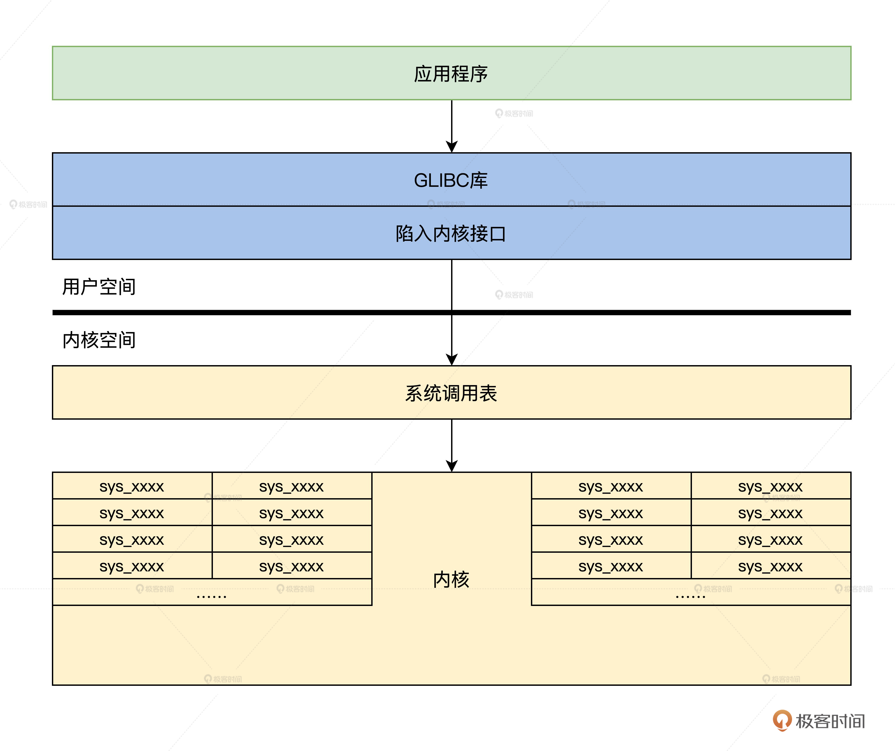
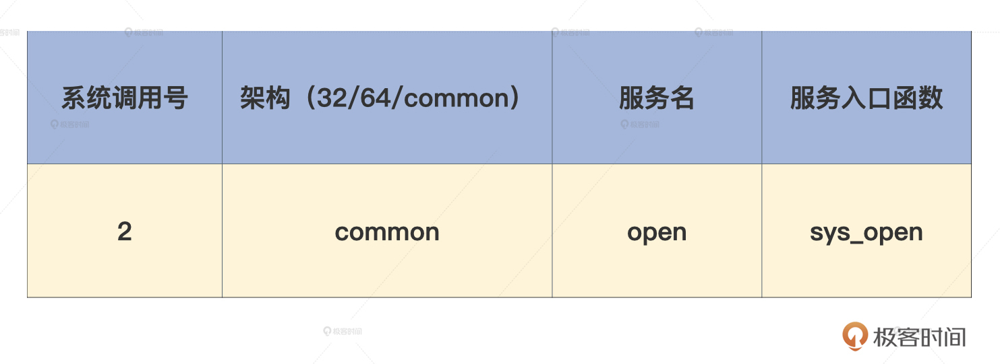
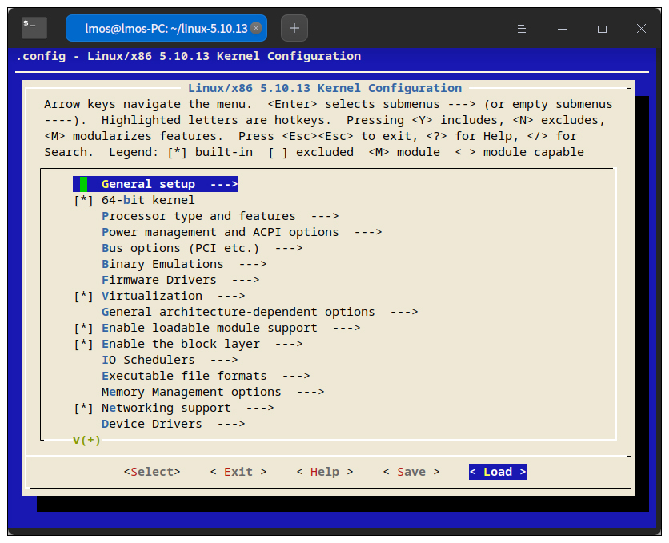

# 瞧一瞧Linux：如何实现系统API？

你好，我是 LMOS。

上节课，我们通过实现一个获取时间的系统服务，学习了 Cosmos 里如何建立一个系统服务接口。Cosmos 为应用程序提供服务的过程大致是这样的：应用程序先设置服务参数，然后通过 int 指令进入内核，由 Cosmos 内核运行相应的服务函数，最后为应用程序提供所需服务。

不知道你是否好奇过业内成熟的 Linux 内核，又是怎样为应用程序提供服务的呢？

这节课我们就来看看 Linux 内核是如何实现这一过程的，我们首先了解一下 Linux 内核有多少 API 接口，然后了解一下 Linux 内核 API 接口的架构，最后，我们动手为 Linux 内核增加一个全新的 API，并实现相应的功能。

下面让我们开始吧！这节课的配套代码你可以从[这里](这里)下载。

## Linux 内核 API 接口的架构 

在上节课中，我们已经熟悉了我们自己的 Cosmos 内核服务接口的架构，由应用程序调用库函数，再由库函数调用 API 入口函数，进入内核函数执行系统服务。

其实对于 Linux 内核也是一样，应用程序会调用库函数，在库函数中调用 API 入口函数，触发中断进入 Linux 内核执行系统调用，完成相应的功能服务。

在 Linux 内核之上，使用最广泛的 C 库是 glibc，其中包括 C 标准库的实现，也包括所有和系统 API 对应的库接口函数。几乎所有 C 程序都要调用 glibc 的库函数，所以 **glibc 是 Linux 内核上 C 程序运行的基础。**

下面我们以 open 库函数为例分析一下，看看 open 是如何进入 Linux 内核调用相关的系统调用的。glibc 虽然开源了，但是并没有在 Linux 内核代码之中，你需要从[这里](这里)下载并解压，open 函数代码如下所示。

```objectivec
//glibc/intl/loadmsgcat.c
#ifdef _LIBC
# define open(name, flags)  __open_nocancel (name, flags)
# define close(fd)      __close_nocancel_nostatus (fd)
#endif
//glibc/sysdeps/unix/sysv/linux/open_nocancel.c
int __open_nocancel (const char *file, int oflag, ...)
{
  int mode = 0;
  if (__OPEN_NEEDS_MODE (oflag))
    {
      va_list arg;
      va_start (arg, oflag);//解决可变参数
      mode = va_arg (arg, int);
      va_end (arg);
    }
  return INLINE_SYSCALL_CALL (openat, AT_FDCWD, file, oflag, mode);
}
//glibc/sysdeps/unix/sysdep.h
//这是为了解决不同参数数量的问题
#define __INLINE_SYSCALL0(name) \
  INLINE_SYSCALL (name, 0)
#define __INLINE_SYSCALL1(name, a1) \
  INLINE_SYSCALL (name, 1, a1)
#define __INLINE_SYSCALL2(name, a1, a2) \
  INLINE_SYSCALL (name, 2, a1, a2)
#define __INLINE_SYSCALL3(name, a1, a2, a3) \
  INLINE_SYSCALL (name, 3, a1, a2, a3)
#define __INLINE_SYSCALL_NARGS_X(a,b,c,d,e,f,g,h,n,...) n
#define __INLINE_SYSCALL_NARGS(...) \
  __INLINE_SYSCALL_NARGS_X (__VA_ARGS__,7,6,5,4,3,2,1,0,)
#define __INLINE_SYSCALL_DISP(b,...) \
  __SYSCALL_CONCAT (b,__INLINE_SYSCALL_NARGS(__VA_ARGS__))(__VA_ARGS__)
#define INLINE_SYSCALL_CALL(...) \
  __INLINE_SYSCALL_DISP (__INLINE_SYSCALL, __VA_ARGS__)
//glibc/sysdeps/unix/sysv/linux/sysdep.h
//关键是这个宏
#define INLINE_SYSCALL(name, nr, args...)       \
  ({                  \
    long int sc_ret = INTERNAL_SYSCALL (name, nr, args);    \
    __glibc_unlikely (INTERNAL_SYSCALL_ERROR_P (sc_ret))    \
    ? SYSCALL_ERROR_LABEL (INTERNAL_SYSCALL_ERRNO (sc_ret))   \
    : sc_ret;               \
  })
#define INTERNAL_SYSCALL(name, nr, args...)       \
  internal_syscall##nr (SYS_ify (name), args)
#define INTERNAL_SYSCALL_NCS(number, nr, args...)     \
  internal_syscall##nr (number, args)
//这是需要6个参数的宏
#define internal_syscall6(number, arg1, arg2, arg3, arg4, arg5, arg6) \
({                  \
    unsigned long int resultvar;          \
    TYPEFY (arg6, __arg6) = ARGIFY (arg6);        \
    TYPEFY (arg5, __arg5) = ARGIFY (arg5);        \
    TYPEFY (arg4, __arg4) = ARGIFY (arg4);        \
    TYPEFY (arg3, __arg3) = ARGIFY (arg3);        \
    TYPEFY (arg2, __arg2) = ARGIFY (arg2);        \
    TYPEFY (arg1, __arg1) = ARGIFY (arg1);        \
    register TYPEFY (arg6, _a6) asm ("r9") = __arg6;      \
    register TYPEFY (arg5, _a5) asm ("r8") = __arg5;      \
    register TYPEFY (arg4, _a4) asm ("r10") = __arg4;     \
    register TYPEFY (arg3, _a3) asm ("rdx") = __arg3;     \
    register TYPEFY (arg2, _a2) asm ("rsi") = __arg2;     \
    register TYPEFY (arg1, _a1) asm ("rdi") = __arg1;     \
    asm volatile (              \
    "syscall\n\t"             \
    : "=a" (resultvar)              \
    : "0" (number), "r" (_a1), "r" (_a2), "r" (_a3), "r" (_a4),   \
      "r" (_a5), "r" (_a6)            \
    : "memory", REGISTERS_CLOBBERED_BY_SYSCALL);      \
    (long int) resultvar;           \
})
```

上述代码中，我们可以清楚地看到，open 只是宏，实际工作的是 __open_nocancel 函数，其中会用 INLINE_SYSCALL_CALL 宏经过一系列替换，最终根据参数的个数替换成相应的 internal_syscall##nr 宏。

比如有 6 个参数，就会替换成 internal_syscall6。其中 number 是系统调用号，参数通过寄存器传递的。但是这里我们没有发现 int 指令，这是因为这里用到的指令是最新处理器为其设计的系统调用指令 syscall。这个指令和 int 指令一样，都可以让 CPU 跳转到特定的地址上，只不过不经过中断门，系统调用返回时要用 sysexit 指令。

好了，我们已经了解了这个 open 函数的调用流程，如果用一幅图来展示 Linux 内核 API 的架构，就会呈现后面这个样子。



有了前面代码流程分析和结构示意图，我想你会对 Linux 内核 API 的框架结构加深了解。上图中的系统调用表和许多 sys_xxxx 函数你可能不太明白，别担心，我们后面就会讲到。

那么 Linux 系统有多少个 API 呢？我们一起去看看吧。

## Linux 内核有多少 API 接口 

Linux 作为比较成熟的操作系统，功能完善，它以众多 API 接口的方式向应用程序提供文件、网络、进程、时间等待服务，并且完美执行了国际 posix 标准。

Linux 从最初几十个 API 接口，现在已经发展到了几百个 API 接口，从这里你可以预见到 Linux 内核功能增加的速度与数量。那么现在的 Linux 内核究竟有多少个 API 接口呢？我们还是要来看看最新发布的 Linux 内核版本，才能准确知道。

具体我们需要对 Linux 代码进行编译，在编译的过程中，根据 syscall_32.tbl 和 syscall_64.tbl 生成自己的 syscalls_32.h 和 syscalls_64.h 文件。

生成方式在 arch/x86/entry/syscalls/Makefile 文件中。这里面会使用两个脚本，即 syscallhdr.sh、syscalltbl.sh，它们最终生成的 syscalls_32.h 和 syscalls_64.h 两个文件中就保存了**系统调用号和系统调用实现函数之间的对应关系**，在里面可以看到 Linux 内核的系统调用号，即 API 号，代码如下所示。

```cpp
//linux/arch/x86/include/generated/asm/syscalls_64.h
__SYSCALL_COMMON(0, sys_read)
__SYSCALL_COMMON(1, sys_write)
__SYSCALL_COMMON(2, sys_open)
__SYSCALL_COMMON(3, sys_close)
__SYSCALL_COMMON(4, sys_newstat)
__SYSCALL_COMMON(5, sys_newfstat)
__SYSCALL_COMMON(6, sys_newlstat)
__SYSCALL_COMMON(7, sys_poll)
__SYSCALL_COMMON(8, sys_lseek)
//……
__SYSCALL_COMMON(435, sys_clone3)
__SYSCALL_COMMON(436, sys_close_range)
__SYSCALL_COMMON(437, sys_openat2)
__SYSCALL_COMMON(438, sys_pidfd_getfd)
__SYSCALL_COMMON(439, sys_faccessat2)
__SYSCALL_COMMON(440, sys_process_madvise)
//linux/arch/x86/include/generated/uapi/asm/unistd_64.h
#define __NR_read 0
#define __NR_write 1
#define __NR_open 2
#define __NR_close 3
#define __NR_stat 4
#define __NR_fstat 5
#define __NR_lstat 6
#define __NR_poll 7
#define __NR_lseek 8
//……
#define __NR_clone3 435
#define __NR_close_range 436
#define __NR_openat2 437
#define __NR_pidfd_getfd 438
#define __NR_faccessat2 439
#define __NR_process_madvise 440
#ifdef __KERNEL__
#define __NR_syscall_max 440
#endif
```

上述代码中，已经定义了 __NR_syscall_max 为 440，这说明 Linux 内核一共有 441 个系统调用，而系统调用号从 0 开始到 440 结束，所以最后一个系统调用是 sys_process_madvise。

其实，__SYSCALL_COMMON 除了表示系统调用号和系统调用函数之间的关系，还会在 Linux 内核的系统调用表中进行相应的展开，究竟展开成什么样子呢？我们一起接着看一看 Linux 内核的系统调用表。

### Linux 系统调用表 

Linux 内核有 400 多个系统调用，它使用了一个函数指针数组，存放所有的系统调用函数的地址，通过数组下标就能索引到相应的系统调用。这个数组叫 sys_call_table，即 Linux 系统调用表。

sys_call_table 到底长什么样？我们来看一看代码才知道，同时也解答一下前面留下的疑问，这里还是要说明一下，__SYSCALL_COMMON 首先会替换成 __SYSCALL_64，因为我们编译的 Linux 内核是 x86_64 架构的，如下所示。

```cpp
#define __SYSCALL_COMMON(nr, sym) __SYSCALL_64(nr, sym)
//第一次定义__SYSCALL_64
#define __SYSCALL_64(nr, sym) extern asmlinkage long sym(unsigned long, unsigned long, unsigned long, unsigned long, unsigned long, unsigned long) ;
#include <asm/syscalls_64.h>//第一次包含syscalls_64.h文件，其中的宏会被展开一次，例如__SYSCALL_COMMON(2, sys_open)会被展开成：
extern asmlinkage long sys_open(unsigned long, unsigned long, unsigned long, unsigned long, unsigned long, unsigned long) ;
这表示申明
//取消__SYSCALL_64定义
#undef __SYSCALL_64
//第二次重新定义__SYSCALL_64
#define __SYSCALL_64(nr, sym) [ nr ] = sym,
extern asmlinkage long sys_ni_syscall(unsigned long, unsigned long, unsigned long, unsigned long, unsigned long, unsigned long);
const sys_call_ptr_t sys_call_table[] ____cacheline_aligned = {
    [0 ... __NR_syscall_max] = &sys_ni_syscall,//默认系统调用函数，什么都不干
#include <asm/syscalls_64.h>//包含前面生成文件
//第二次包含syscalls_64.h文件，其中的宏会被再展开一次，例如__SYSCALL_COMMON(2, sys_open)会被展开成：
[2] = sys_open, 用于初始化这个数组，即表示数组的第二个元素填入sys_open
};
int syscall_table_size = sizeof(sys_call_table);//系统调用表的大小
```

上述代码中，通过两次包含 syscalls_64.h 文件，并在其中分别定义不同的 __SYSCALL_64 宏，完成了系统调用函数的申明和系统调用表的初始化，不得不说这是一个非常巧妙的方式。

sys_call_table 数组，第一次全部初始化为默认系统调用函数 sys_ni_syscall，这个函数什么都不干，这是为了**防止数组有些元素中没有函数地址，从而导致调用失败。**这在内核中是非常危险的。我单独提示你这点，其实也是希望你留意这种编程技巧，这在内核编码中并不罕见，考虑到内核编程代码的安全性，加一道防线可以有备无患。

## Linux 系统调用实现 

前面我们已经了解了 Linux 系统调用的架构和 Linux 系统调用表，也清楚了 Linux 系统调用的个数和定义一个 Linux 系统调用的方式。

为了让你更好地理解 Linux 系统是如何工作的，我们为现有的 Linux 写一个系统调用。这个系统调用的功能并不复杂，就是返回你机器的 CPU 数量，即你的机器是多少核心的处理器。

为 Linux 增加一个系统调用，其实有很多步骤，不过也别慌，下面我将一步一步为你讲解。

### 下载 Linux 源码 

想为 Linux 系统增加一个系统调用，首先你得有 Linux 内核源代码，如果你机器上没有 Linux 内核源代码，你就要去[内核官网](内核官网)下载，或者你也可以到 GitHub 上 git clone 一份内核代码。

如果你使用了 git clone 的方式，可以用如下方式操作。

```javascript
git clone git://git.kernel.org/pub/scm/linux/kernel/git/stable/linux-stable.git/
```

如果你想尽量保持与我的 Linux 内核版本相同，降低出现各种未知问题的概率，那么请你使用 **5.10.13 版本**的内核。另外别忘了，如果你下载的 Linux 内核是压缩包，请记得先解压到一个可以访问的目录下。

### 申明系统调用 

根据前面的知识点，可以得知 Linux 内核的系统调用的申明文件和信息，具体实现是这样的：由一个 makefile 在编译 Linux 系统内核时调用了一个脚本，这个脚本文件会读取另一个叫 syscall_64.tbl 文件，根据其中信息生成相应的文件 syscall_64.h。

请注意，我这里是以 x86_64 架构为例进行说明的，这里我们并不关注 syscall_64.h 的生成原理，只关注 syscall_64.tbl 文件中的内容。下面我们还是结合代码看一下吧。

```go
//linux-5.10.13/arch/x86/entry/syscalls/syscall_64.tbl
0  common  read      sys_read
1  common  write      sys_write
2  common  open      sys_open
3  common  close      sys_close
4  common  stat      sys_newstat
5  common  fstat      sys_newfstat
6  common  lstat      sys_newlstat
7  common  poll      sys_poll
8  common  lseek      sys_lseek
9  common  mmap      sys_mmap
10  common  mprotect    sys_mprotect
11  common  munmap      sys_munmap
12  common  brk          sys_brk
//……
435  common  clone3      sys_clone3
436  common  close_range    sys_close_range
437  common  openat2      sys_openat2
438  common  pidfd_getfd    sys_pidfd_getfd
439  common  faccessat2    sys_faccessat2
440  common  process_madvise    sys_process_madvise
```

上面这些代码可以分成四列，分别是系统调用号、架构、服务名，以及其相对应的服务入口函数。例如系统调用 open 的结构，如下表所示。



那我们要如何申明自己的系统调用呢？第一步就需要在 syscall_64.tbl 文件中增加一项，如下所示。

```null
441  common  get_cpus    sys_get_cpus
```

我们自己的系统调用的系统调用号是 441，架构是 common ，服务名称是 get_cpus，服务入口函数则是 sys_get_cpus。请注意系统调用号要唯一，不能和其它系统调用号冲突。

写好这个，我们还需要把 sys_get_cpus 函数在 syscalls.h 文件中申明一下，供其它内核模块引用。具体代码如下所示。

```java
//linux-5.10.13/include/linux/syscalls.h
asmlinkage long sys_get_cpus(void);
```

这一步做好之后，我们就完成了一个 Linux 系统调用的所有申明工作。下面我们就去定义这个系统调用的服务入口函数。

### 定义系统调用 

我们现在来定义自己的第一个 Linux 系统调用，为了降低工程复杂度，我们不打算新建一个 C 模块文件，而是直接在 Linux 内核代码目录下挑一个已经存在的 C 模块文件，并在其中定义我们自己的系统调用函数。

定义一个系统调用函数，需要使用专门的宏。根据参数不同选用不同的宏，这个宏的细节我们无须关注。对于我们这个无参数的系统调用函数，应该使用 SYSCALL_DEFINE0 宏来定义，代码如下所示。

```objectivec
//linux-5.10.13/include/linux/syscalls.h
#ifndef SYSCALL_DEFINE0
#define SYSCALL_DEFINE0(sname)                  \
    SYSCALL_METADATA(_##sname, 0);              \
    asmlinkage long sys_##sname(void);          \
    ALLOW_ERROR_INJECTION(sys_##sname, ERRNO);      \
    asmlinkage long sys_##sname(void)
#endif /* SYSCALL_DEFINE0 */
//linux-5.10.13/kernel/sys.c
SYSCALL_DEFINE0(get_cpus)
{
    return num_present_cpus();//获取系统中有多少CPU
}
```

上述代码中 SYSCALL_DEFINE0 会将 get_cpus 转换成 sys_get_cpus 函数。这个函数中，调用了一个 Linux 内核中另一个函数 num_present_cpus，从名字就能推断出作用了，它负责返回系统 CPU 的数量。 这正是我们要达到的结果。这个结果最终会返回给调用这个系统调用的应用程序。

### 编译 Linux 内核 

现在我们的 Linux 系统调用的代码，已经写好了，不过这跟编写内核模块还是不一样的。编写内核模块，我们只需要把内核模块动态加载到内核中，就可以直接使用了。系统调用发生在内核中，与内核是一体的，它无法独立成为可以加载的内核模块。所以我们需要重新编译内核，然后使用我们新编译的内核。

要编译内核首先是要配置内核，内核的配置操作非常简单，我们只需要源代码目录下执行“make menuconfig”指令，就会出现如下所示的界面。



图中这些菜单都可以进入子菜单或者手动选择。

但是手动选择配置项非常麻烦且危险，**如果不是资深的内核玩家，不建议手动配置！**但是我们可以选择加载一个已经存在的配置文件，这个配置文件可以加载你机器上 boot 目录下的 config 开头的文件，加载之后选择 Save，就能保存配置并退出以上界面。

然后输入如下指令，就可以喝点茶、听听音乐，等待机器自行完成编译，编译的时间取决于机器的性能，快则十几分钟，慢则几个小时。

```go
make -j8 bzImage && make -j8 modules
```

上述代码指令干了哪些事儿呢？我来说一说，首先要编译内核，然后再编译内核模块，j8 表示开启 8 线程并行编译，这个你可以根据自己的机器 CPU 核心数量进行调整。

编译过程结束之后就可以开始安装新内核了，你只需要在源代码目录下，执行如下指令。

```go
sudo make modules_install && sudo make install
```

上述代码指令先安装好内核模块，然后再安装内核，最后会调用 update-grub，自动生成启动选项，重启计算机就可以选择启动我们自己修改的 Linux 内核了。

### 编写应用测试 

相信经过上述过程，你应该已经成功启动了修改过的新内核。不过我们还不确定我们增加的系统调用是不是正常的，所以我们还要写个应用程序测试一下，其实就是去调用一下我们增加的系统调用，看看结果是不是预期的。

我们应用程序代码如下所示。

```cpp
#include <stdio.h>
#include <unistd.h>
#include <sys/syscall.h>
int main(int argc, char const *argv[])
{
    //syscall就是根据系统调用号调用相应的系统调用
    long cpus = syscall(441);
    printf("cpu num is:%d\n", cpus);//输出结果
    return 0;
}
```

对上述代码我们使用 gcc main.c -o cpus 指令进行编译，运行之后就可以看到结果了，但是我们没有写库代码，而是直接使用 syscall 函数。这个函数可以根据系统调用号触发系统调用，根据上面定义，441 正是对应咱们的 sys_get_cpus 系统调用。

至此，在 Linux 系统上增加自己的系统调用这个实验，我们就完成了。

## 重点回顾 

今天我们从了解 Linux 系统的 API 架构开始，最后在 Linux 系统上实现了一个自己的系统调用，虽然增加一个系统调用步骤不少，但你只要紧跟着我的思路一定可以拿下。

下面我来为你梳理一下课程的重点。

1. 从 Linux 系统的 API 架构开始，我们了解了 glibc 库，这个库是大部分应用程序的基础，我们以其中的 open 函数为例，分析了库函数如何通过寄存器传递参数，最后执行 syscall 指令进入 Linux 内核，执行系统调用，最后还归纳出一幅 Linux 系统 API 框架图。

2. 然后, 我们了解 Linux 系统中有多少个 API，它们都放在系统调用表中，同时也知道了 Linux 系统调用表的生成方式。

3. 最后，为了验证我们了解的知识是否正确，我们从申明系统调用、定义系统调用到编译内核、编写应用测试，在现有的 Linux 代码中增加了一个属于我们自己的系统调用。

好了，我们通过这节课搞清楚了 Linux 内核系统调用的实现原理。你是否感觉这和我们的 Cosmos 的系统服务有些相似，又有些不同？

相似的是我们都使用寄存器来传递参数，不同的是 Cosmos 使用了中断门进入内核，而 Linux 内核使用了更新的 syscall 指令。有了这些知识储备，我也非常期待你能动手拓展，挑战一下在 Cosmos 上实现使用 syscall 触发系统调用。

## 思考题 

请说说 syscall 指令和 int 指令的区别，是什么？

欢迎你在留言区跟我交流互动，也推荐你把这节课分享给有需要的朋友，一起实现操作系统里的各种功能。

我是 LMOS，我们下节课见。

