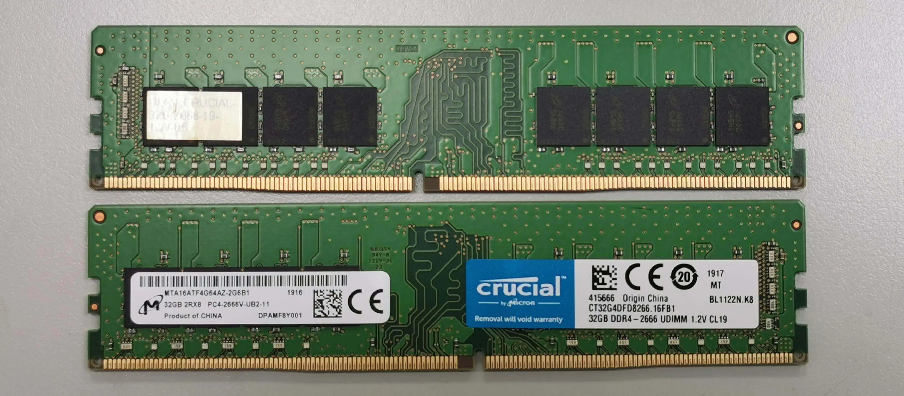
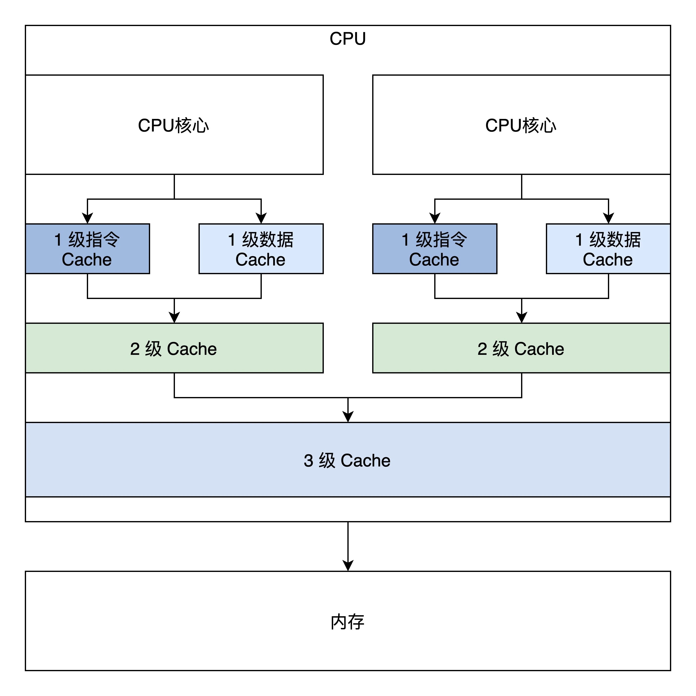
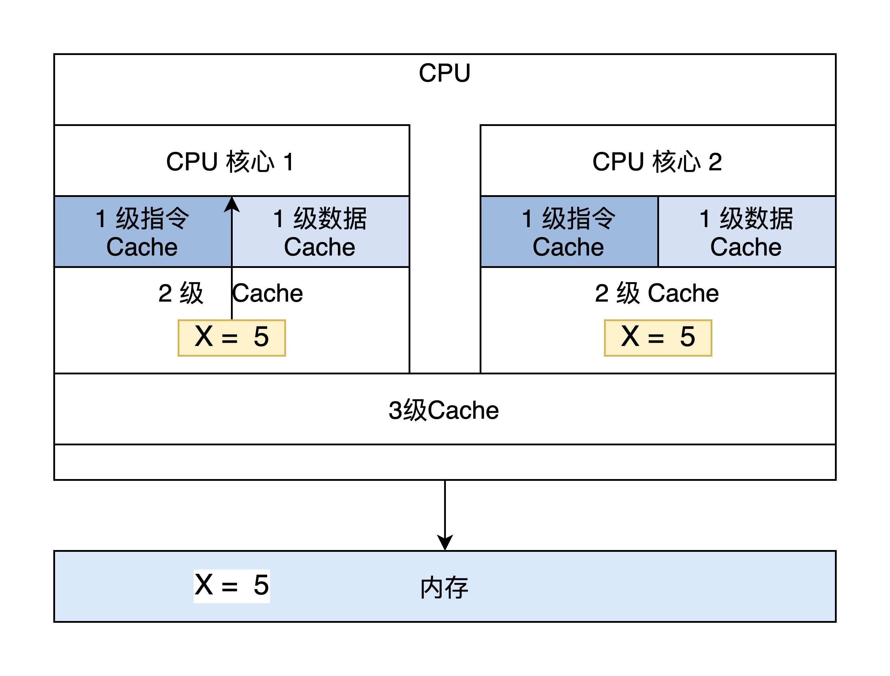

# Cache与内存：程序放在哪儿？

你好，我是 LMOS。

在前面的课程里，我们已经知道了 CPU 是如何执行程序的，也研究了程序的地址空间，这里我们终于到了程序的存放地点——内存。

你知道什么是 Cache 吗？在你心中，真实的内存又是什么样子呢？今天我们就来重新认识一下 Cache 和内存，这对我们利用 Cache 写出高性能的程序代码和实现操作系统管理内存，有着巨大的帮助。

通过这节课的内容，我们一起来看看内存到底是啥，它有什么特性。有了这个认识，你就能更加深入地理解我们看似熟悉的局部性原理，从而搞清楚，为啥 Cache 是解决内存瓶颈的神来之笔。最后，我还会带你分析 x86 平台上的 Cache，规避 Cache 引发的一致性问题，并让你掌握获取内存视图的方法。

那话不多说，带着刚才的问题，我们正式进入今天的学习吧！

## 从一段“经典”代码看局部性原理 

不知道，你还记不记得 C 语言打印九九乘法表的代码，想不起来也没关系，下面我把它贴出来，代码很短，也很简单，就算你自己写一个也用不了一分钟，如下所示。

```cpp
#include <stdio.h>
int main(){
    int i,j;
    for(i=1;i<=9;i++){        
        for(j=1;j<=i;j++){
            printf("%d*%d=%2d  ",i,j,i*j);
        }
        printf("\n");
    }
    return 0;
}
```

我们当然不是为了研究代码本身，这个代码非常简单，这里我们主要是观察这个结构，代码的结构主要是**顺序、分支、循环**，这三种结构可以写出现存所有算法的程序。

我们常规情况下写的代码是顺序和循环结构居多。上面的代码中有两重循环，内层循环的次数受到外层循环变量的影响。就是这么简单，但是越简单的东西越容易看到本质。

可以看到，这个代码大数时间在执行一个乘法计算和调用一个 printf 函数，而程序一旦编译装载进内存中，它的地址就确定了。也就是说，CPU 大多数时间在访问相同或者与此相邻的地址，换句话说就是：CPU 大多数时间在执行相同的指令或者与此相邻的指令。这就是大名鼎鼎的**程序局部性原理**。

## 内存 

明白了程序的局部性原理之后，我们再来看看内存。你或许感觉这跨越有点大，但是只有明白了内存的结构和特性，你才能明白程序局部性原理的应用场景和它的重要性。

内存也可称为主存，不管硬盘多大、里面存放了多少程序和数据，只要程序运行或者数据要进行计算处理，就必须先将它们装入内存。我们先来看看内存长什么样（你也可以上网自行搜索），如下图所示。



从上图可以看到在 PCB 板上有内存颗粒芯片，主要是用来存放数据的。SPD 芯片用于存放内存自身的容量、频率、厂商等信息。还有最显眼的金手指，用于连接数据总线和地址总线，电源等。

其实从专业角度讲，内存应该叫 **DRAM**，即动态随机存储器。内存储存颗粒芯片中的存储单元是由电容和相关元件做成的，电容存储电荷的多、少代表数字信号 0 和 1。

而随着时间的流逝，电容存在漏电现象，这导致电荷不足，就会让存储单元的数据出错，所以 DRAM 需要周期性刷新，以保持电荷状态。DRAM 结构较简单且集成度很高，通常用于制造内存条中的储存颗粒芯片。

虽然内存技术标准不断更新，但是储存颗粒的内部结构没有本质改变，还是电容存放电荷，标准看似更多，实际上只是提升了位宽、工作频率，以及传输时预取的数据位数。

比如 DDR SDRAM，即双倍速率同步动态随机存储器，它使用 2.5V 的工作电压，数据位宽为 64 位，核心频率最高为 166MHz。下面简称 DDR 内存，它表示每一个时钟脉冲传输两次数据，分别在时钟脉冲的上升沿和下降沿各传输一次数据，因此称为双倍速率的 SDRAM。

后来的 DDR2、DDR3、DDR4 也都在核心频率和预取位数上做了提升。最新的 DDR4 采用 1.2V 工作电压，数据位宽为 64 位，预取 16 位数据。DDR4 取消了双通道机制，一条内存即为一条通道，工作频率最高可达 4266MHz，单根 DDR4 内存的数据传输带宽最高为 34GB/s。

其实我们无需过多关注内存硬件层面的技术规格标准，重点需要关注的是，**内存的速度还有逻辑上内存和系统的连接方式和结构**，这样你就能意识到内存有多慢，还有是什么原因导致内存慢的。

我们还是画幅图说明吧，如下图所示。


结合图片我们看到，控制内存刷新和内存读写的是内存控制器，而内存控制器集成在北桥芯片中。传统方式下，北桥芯片存在于系统主板上，而现在由于芯片制造工艺的升级，芯片集成度越来越高，所以北桥芯片被就集成到 CPU 芯片中了，同时这也大大提升了 CPU 访问内存的性能。

而作为软件开发人员，从逻辑上我们只需要把内存看成一个巨大的字节数组就可以，而内存地址就是这个数组的下标。

## CPU 到内存的性能瓶颈 

尽管 CPU 和内存是同时代发展的，但 CPU 所使用技术工艺的材料和内存是不同的，侧重点也不同，价格也不同。如果内存使用 CPU 的工艺和材料制造，那内存条的昂贵程度会超乎想象，没有多少人能买得起。

由于这些不同，导致了 CPU 和内存条的数据吞吐量天差地别。尽管最新的 DDR4 内存条带宽高达 34GB/s，然而这相比 CPU 的数据吞吐量要慢上几个数量级。再加上多核心 CPU 同时访问内存，会导致总线争用问题，数据吞吐量会进一步下降。

CPU 要数据，内存一时给不了怎么办？CPU 就得等，通常 CPU 会让总线插入等待时钟周期，直到内存准备好，到这里你就会发现，无论 CPU 的性能多高都没用，而**内存才是决定系统整体性能的关键**。显然依靠目前的理论直接提升内存性能，达到 CPU 的同等水平，这是不可行的，得想其它的办法。

## Cache 

让我们重新回到前面的场景中，回到程序的局部性原理，它告诉我们：CPU 大多数时间在访问相同或者与此相邻的地址。那么，我们立马就可以想到用一块**小而快**的储存器，放在 CPU 和内存之间，就可以利用程序的局部性原理来缓解 CPU 和内存之间的性能瓶颈。这块**小而快**的储存器就是 Cache，即高速缓存。

Cache 中存放了内存中的一部分数据，CPU 在访问内存时要先访问 Cache，若 Cache 中有需要的数据就直接从 Cache 中取出，若没有则需要从内存中读取数据，并同时把这块数据放入 Cache 中。但是由于程序的局部性原理，在一段时间内，CPU 总是能从 Cache 中读取到自己想要的数据。

Cache 可以集成在 CPU 内部，也可以做成独立的芯片放在总线上，现在 x86 CPU 和 ARM CPU 都是集成在 CPU 内部的。其逻辑结构如下图所示。


Cache 主要由高速的静态储存器、地址转换模块和 Cache 行替换模块组成。

Cache 会把自己的高速静态储存器和内存分成大小相同的行，一行大小通常为 32 字节或者 64 字节。Cache 和内存交换数据的最小单位是一行，为方便管理，在 Cache 内部的高速储存器中，多个行又会形成一组。

除了正常的数据空间外，Cache 行中还有一些标志位，如脏位、回写位，访问位等，这些位会被 Cache 的替换模块所使用。

Cache 大致的逻辑工作流程如下。

1.CPU 发出的地址由 Cache 的地址转换模块分成 3 段：组号，行号，行内偏移。

2.Cache 会根据组号、行号查找高速静态储存器中对应的行。如果找到即命中，用行内偏移读取并返回数据给 CPU，否则就分配一个新行并访问内存，把内存中对应的数据加载到 Cache 行并返回给 CPU。写入操作则比较直接，分为回写和直通写，回写是写入对应的 Cache 行就结束了，直通写则是在写入 Cache 行的同时写入内存。

3. 如果没有新行了，就要进入行替换逻辑，即找出一个 Cache 行写回内存，腾出空间，替换行有相关的算法，**替换算法是为了让替换的代价最小化**。例如，找出一个没有修改的 Cache 行，这样就不用把它其中的数据回写到内存中了，还有找出存在时间最久远的那个 Cache 行，因为它大概率不会再访问了。

以上这些逻辑都由 Cache 硬件独立实现，软件不用做任何工作，对软件是透明的。

## Cache 带来的问题 

Cache 虽然带来性能方面的提升，但同时也给和硬件和软件开发带来了问题，那就是数据一致性问题。

为了搞清楚这个问题，我们必须先搞清楚 Cache 在硬件层面的结构，下面我画了 x86 CPU 的 Cache 结构图：



这是一颗最简单的双核心 CPU，它有三级 Cache，第一级 Cache 是指令和数据分开的，第二级 Cache 是独立于 CPU 核心的，第三级 Cache 是所有 CPU 核心共享的。

下面来看看 Cache 的一致性问题，主要包括这三个方面.

1. 一个 CPU 核心中的指令 Cache 和数据 Cache 的一致性问题。

2. 多个 CPU 核心各自的 2 级 Cache 的一致性问题。

3.CPU 的 3 级 Cache 与设备内存，如 DMA、网卡帧储存，显存之间的一致性问题。这里我们不需要关注这个问题。

我们先来看看 CPU 核心中的指令 Cache 和数据 Cache 的一致性问题，对于程序代码运行而言，指令都是经过指令 Cache，而指令中涉及到的数据则会经过数据 Cache。

所以，对自修改的代码（即修改运行中代码指令数据，变成新的程序）而言，比如我们修改了内存地址 A 这个位置的代码（典型的情况是 Java 运行时编译器），这个时候我们是通过储存的方式去写的地址 A，所以新的指令会进入数据 Cache。

但是我们接下来去执行地址 A 处的指令的时候，指令 Cache 里面可能命中的是修改之前的指令。所以，这个时候软件需要把数据 Cache 中的数据写入到内存中，然后让指令 Cache 无效，重新加载内存中的数据。

再来看看多个 CPU 核心各自的 2 级 Cache 的一致性问题。从上图中可以发现，两个 CPU 核心共享了一个 3 级 Cache。比如第一个 CPU 核心读取了一个 A 地址处的变量，第二个 CPU 也读取 A 地址处的变量，那么第二个 CPU 核心是不是需要从内存里面经过第 3、2、1 级 Cache 再读一遍，这个显然是没有必要的。

在硬件上 Cache 相关的控制单元，可以把第一个 CPU 核心的 A 地址处 Cache 内容直接复制到第二个 CPU 的第 2、1 级 Cache，这样两个 CPU 核心都得到了 A 地址的数据。不过如果这时第一个 CPU 核心改写了 A 地址处的数据，而第二个 CPU 核心的 2 级 Cache 里面还是原来的值，数据显然就不一致了。

为了解决这些问题，硬件工程师们开发了多种协议，典型的多核心 Cache 数据同步协议有 MESI 和 MOESI。MOESI 和 MESI 大同小异，下面我们就去研究一下 MESI 协议。

## Cache 的 MESI 协议 

MESI 协议定义了 4 种基本状态：M、E、S、I，即修改（Modified）、独占（Exclusive）、共享（Shared）和无效（Invalid）。下面我结合示意图，给你解释一下这四种状态。

1.M 修改（Modified）：当前 Cache 的内容有效，数据已经被修改而且与内存中的数据不一致，数据只在当前 Cache 里存在。比如说，内存里面 X=5，而 CPU 核心 1 的 Cache 中 X=2，Cache 与内存不一致，CPU 核心 2 中没有 X。


1. E 独占（Exclusive）：当前 Cache 中的内容有效，数据与内存中的数据一致，数据只在当前 Cache 里存在；类似 RAM 里面 X=5，同样 CPU 核心 1 的 Cache 中 X=5（Cache 和内存中的数据一致），CPU 核心 2 中没有 X。


1. S 共享（Shared）：当前 Cache 中的内容有效，Cache 中的数据与内存中的数据一致，数据在多个 CPU 核心中的 Cache 里面存在。例如在 CPU 核心 1、CPU 核心 2 里面 Cache 中的 X=5，而内存中也是 X=5 保持一致。



1. 无效（Invalid）：当前 Cache 无效。前面三幅图 Cache 中没有数据的那些，都属于这个情况。

最后还要说一下 Cache 硬件，它会监控所有 CPU 上 Cache 的操作，根据相应的操作使得 Cache 里的数据行在上面这些状态之间切换。Cache 硬件通过这些状态的变化，就能安全地控制各 Cache 间、各 Cache 与内存之间的数据一致性了。

这里不再深入探讨 MESI 协议了，感兴趣的话你可以自行拓展学习。这里只是为了让你明白，有了 Cache 虽然提升了系统性能，却也带来了很多问题，好在这些问题都由硬件自动完成，对软件而言是透明的。

不过看似对软件透明，这却是有代价的，因为硬件需要耗费时间来处理这些问题。如果我们编程的时候不注意，不能很好地规避这些问题，就会引起硬件去维护大量的 Cache 数据同步，这就会使程序运行的效能大大下降。

## 开启 Cache 

前面我们研究了大量的 Cache 底层细节和问题，就是为了使用 Cache，目前 Cache 已经成为了现代计算机的标配，但是 x86 CPU 上默认是关闭 Cache 的，需要在 CPU 初始化时将其开启。

在 x86 CPU 上开启 Cache 非常简单，只需要将 CR0 寄存器中 CD、NW 位同时清 0 即可。CD=1 时表示 Cache 关闭，NW=1 时 CPU 不维护内存数据一致性。所以 **CD=0、NW=0 的组合**才是开启 Cache 的正确方法。

开启 Cache 只需要用四行汇编代码，代码如下：

```sql
mov eax, cr0
;开启 CACHE    
btr eax,29 ;CR0.NW=0
btr eax,30  ;CR0.CD=0
mov cr0, eax
```

## 获取内存视图 

作为系统软件开发人员，与其了解内存内部构造原理，不如了解系统内存有多大。这个作用更大。

根据前面课程所讲，给出一个物理地址并不能准确地定位到内存空间，内存空间只是映射物理地址空间中的一个子集，物理地址空间中可能有空洞，有 ROM，有内存，有显存，有 I/O 寄存器，所以获取内存有多大没用，关键是**要获取哪些物理地址空间是可以读写的内存**。

物理地址空间是由北桥芯片控制管理的，那我们是不是要找北桥要内存的地址空间呢？当然不是，在 x86 平台上还有更方便简单的办法，那就是 BIOS 提供的实模式下中断服务，就是 int 指令后面跟着一个常数的形式。

由于 PC 机上电后由 BIOS 执行硬件初始化，中断向量表是 BIOS 设置的，所以执行中断自然执行 BIOS 服务。这个中断服务是 int 15h，但是它需要一些参数，就是在执行 int 15h 之前，对特定寄存器设置一些值，代码如下。

```java
_getmemmap:
  xor ebx,ebx ;ebx设为0
  mov edi,E80MAP_ADR ;edi设为存放输出结果的1MB内的物理内存地址
loop:
  mov eax,0e820h ;eax必须为0e820h
  mov ecx,20 ;输出结果数据项的大小为20字节：8字节内存基地址，8字节内存长度，4字节内存类型
  mov edx,0534d4150h ;edx必须为0534d4150h
  int 15h ;执行中断
  jc error ;如果flags寄存器的C位置1，则表示出错
  add edi,20;更新下一次输出结果的地址
  cmp ebx,0 ;如ebx为0，则表示循环迭代结束
  jne loop  ;还有结果项，继续迭代
    ret
error:;出错处理
```

上面的代码是在迭代中执行中断，每次中断都输出一个 20 字节大小数据项，最后会形成一个该数据项（结构体）的数组，可以用 C 语言结构表示，如下。

```cpp
#define RAM_USABLE 1 //可用内存
#define RAM_RESERV 2 //保留内存不可使用
#define RAM_ACPIREC 3 //ACPI表相关的
#define RAM_ACPINVS 4 //ACPI NVS空间
#define RAM_AREACON 5 //包含坏内存
typedef struct s_e820{
    u64_t saddr;    /* 内存开始地址 */
    u64_t lsize;    /* 内存大小 */
    u32_t type;    /* 内存类型 */
}e820map_t;
```

## 重点回顾 

又到了课程尾声，内存和 Cache 的学习就告一段落了。今天我们主要讲了四部分内容，局部性原理、内存结构特性、Cache 工作原理和 x86 上的应用。我们一起来回顾一下这节课的重点。

首先从一个场景开始，我们了解了程序通常的结构。通过观察这种结构，我们发现 CPU 大多数时间在访问相同或者与此相邻的地址，执行相同的指令或者与此相邻的指令。这种现象就是程序**局部性原理**。

然后，我们研究了内存的结构和特性。了解它的工艺标准和内部原理，知道内存容量相对可以做得较大，程序和数据都要放在其中才能被 CPU 执行和处理。但是内存的速度却远远赶不上 CPU 的速度。

因为内存和 CPU 之间性能瓶颈和程序局部性原理，所以才开发出了 Cache（即高速缓存），它由高速静态储存器和相应的控制逻辑组成。

Cache 容量比内存小，速度却比内存高，它在 CPU 和内存之间，CPU 访问内存首先会访问 Cache，如果访问命中则会大大提升性能，然而它却带来了问题，那就是**数据的一致性问题**，为了解决这个问题，工程师又开发了 Cache**一致性协议 MESI**。这个协议由 Cache 硬件执行，对软件透明。

最后，我们掌握了 x86 平台上开启 Cache 和获取物理内存视图的方法。

因为这节课也是我们硬件模块的最后一节，可以说**没有硬件平台知识，写操作系统就如同空中建楼**，通过这个部分的学习，就算是为写操作系统打好了地基。为了让你更系统地认识这个模块，我给你整理了这三节课的知识导图。


## 思考题 

请你思考一下，如何写出让 CPU 跑得更快的代码？由于 Cache 比内存快几个数量级，所以这个问题也可以转换成：如何写出提高 Cache 命中率的代码？

