# 从单排到团战：详解操作系统的宏观网络架构

你好，我是 LMOS。

上节课我们学习了单机状态下网络数据在内核中流转的全过程，并且带你一起梳理了网络栈移植的关键步骤。

这节课我会带你看看，现实世界中网络请求是如何穿过重重网络设备，实现大规模组网的。同时，我还会给你讲解网络架构的过去、现在，并展望一下将来的发展趋势。最后我会带你动手搭建一个现代互联网实验环境，通过实际的组网实践加深对网络架构的理解。

## 从传统网络架构聊起 

你是否好奇过，我们目前用的互联网是如何做到互联互通的呢？

让我们先来看看传统的三层网络架构，著名的通信设备厂商思科把这种架构叫做分级的互联网络模型（Hierarchical Inter-networking Model）。这种架构的优点是，可以把复杂的网络设计问题抽象为几个层面来解决，每个层面又聚焦于某些特定的功能。这样就能把复杂而庞大的网络问题拆解成比较好解决的子问题。

如下图所示，三层网络架构设计主要包括**核心层、汇聚层、接入层**这三个层。下面我分别给你说一说。

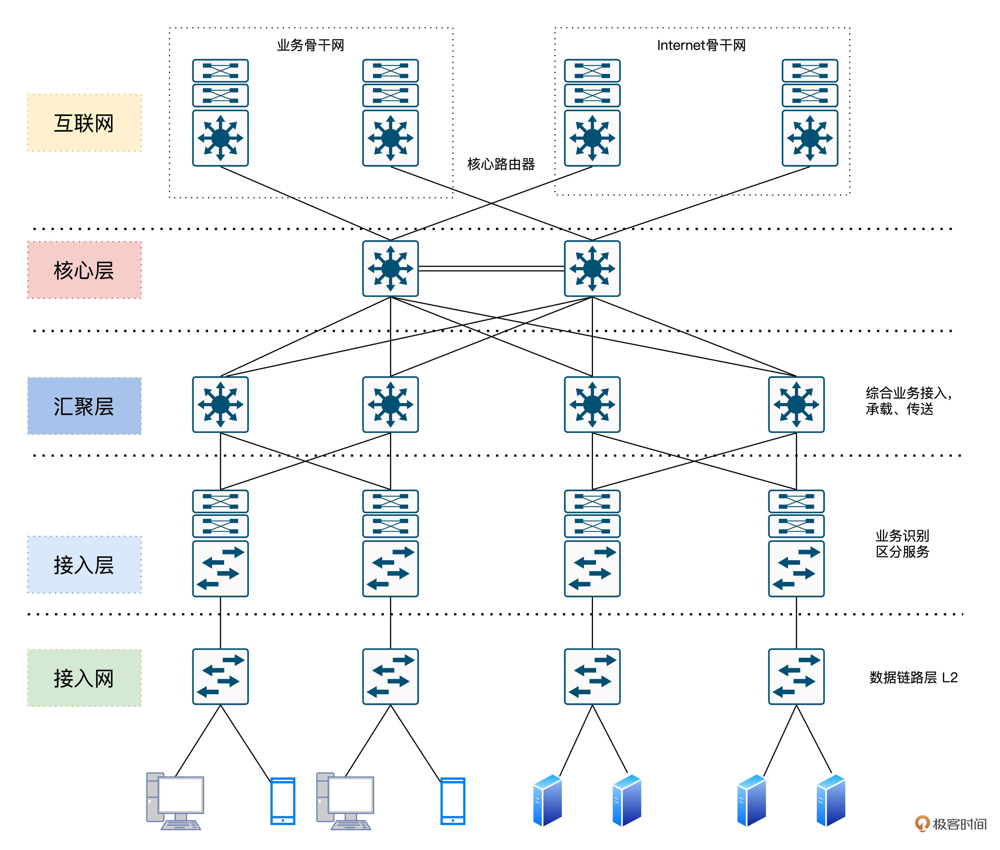

首先是核心层。交换层的核心交换机为进出数据中心的数据包提供高速转发的功能，为多个汇聚层提供连通性，同时也为整个网络提供灵活的 L3 路由网络。

然后是汇聚层。汇聚交换机与接入交换机相连，提供防火墙、SSL 卸载、入侵检测、网络分析等其他服务。

最后我们来看接入层。接入交换机通常位于机架的顶部，因此它们也被称为 ToR 交换机，并且它们与服务器物理连接。

当然，观察这个架构我们可以发现，核心层和汇聚层这种骨干网络需要承担的流量是蛮大的，流量大意味着对交换性能、效率有更高的要求。所以为了解决性能、效率等问题，我们需要在 OSI 的 1、2、3 层上分别做优化。

这里要说到传统网络架构的不足之处，我们发现经典的 IP 网络是逐跳转发数据的。转发数据时，每台路由器都要根据包头的目的地址查询路由表，以获得下一跳的出口。这个过程显然是繁琐低效的。

另外，转发路径也不够灵活，为了加以改善，我们在第二层之上、第三层之下引入一个 2.5 层的技术方案，即多协议标签交换（MPLS）技术。

### 优化与迭代：MPLS 技术 

目前 MPLS 技术在国内应用广泛，无论是 BAT 等互联网巨头，还是运营商建设骨干网都在应用这种技术。MPLS 的核心结构如下。


MPLS 通过 LDP 标签分发协议。我来举个例子吧，这相当于把快递标签“贴在”了快递盒子上了，后续只需要读取标签，就能知道这个数据要转发到哪里去了。这样就避免了传统路由网络中每路过一个经手人（每一跳），都要把快递盒子打开看一看的额外开销。

而路径计算元素协议（RSVP-TE）最大的优点是**收集整个网络的拓扑和链路状态信息**。通过扩展的资源预留协议，可以实现灵活的转发路径选择和规划。这就好比双十一了，物流公司根据物流大数据收集到的路网和拥堵状态等信息，自动规划出性价比最高的路径，显然快递配送效率会得到很大提升。

当然，只在 OSI 的 2、3 层之间做优化是远远不够的，为了满足动辄数百 G 传输需求，物理层也经历了从 DWDM（Dense Wavelength Division Multiplexing）波分复用系统这种波分复用技术到 OTN（Iptical Transport Network，光传送网）的技术演进。感兴趣的同学可以搜索光传送网和波分复用相关的资料，这里我就不展开了。

根据前面的讲解我们发现，传统网络基础架构确实可以解决不少问题，但这样真的完美了么？其实不然，比如前面的 MPLS 技术虽然也解决了问题，但也加重了耦合，并且存在资源利用率低、复杂度高、价格昂贵等缺点。

所以后来 SR（Segment Routing）技术又应运而生，而随着 IPv6 的演进，我们用 SRv6 替代 MPLS 技术也是大势所趋。

另外，我们还要注意到业务需求的变化。比如随着云与 5G 等移动通信的发展，流量除了以前客户端和服务端的南北向通信之外，服务端分布式服务之间也会引入了大量的通信流量。甚至随着云与容器的演进，服务端会存在大量的虚拟机迁移等动作。这些对传统网络中 STP 拓扑变化、收敛以及网络规模都带来了巨大的挑战。

那么如何解决传统三层网络架构带来的挑战呢？答案其实在贝尔实验室的 Charles Clos 博士在 1953 年的《无阻塞交换网络研究》之中。论文中提到的核心思想是：**用多个小规模、低成本的单元，构建复杂、大规模的网络。**

论文中提到的简单的 CLOW 网络是包含输入级别、中间级别和输出级别的三级互连体系结构。

下图中的矩形表示规模较小的转发单元，其成本显然也相对较低。CLOS 的本质可以简单理解为是一种多级交换的架构思想，并且这种架构很适合在输入和输出持续增加的情况下将中间交叉数降至最低。

下图中，m 是每个子模块的输入端口数，n 是每个子模块的输出端口数，r 是每一级的子模块数，经过合理的重排，只要满足公式：

```null
r2≥max(m1,n3)
```

那么，对于任意的输入到输出，总是能找到一条无阻塞的通路。


直到 1990 年代，CLOS 架构被应用到 Switch Fabric。应用 CLOS 架构的交换机的开关密度，与交换机端口数量 N 的关系如下。

```null
O(N^(3/2))
```

可以看到，在 N 较大时，CLOS 模型能降低交换机内部的开关密度。由此可见，越来越多的人发现了传统三层网络架构下的痛点，于是一种叫做胖树的网络架构应运而生（感兴趣的同学可以在搜索《A Scalable, Commodity Data Center Network Architecture》这篇论文）。

而借鉴 Fattree 和 CLOS 模型的思想，目前业界衍生出了叶脊（Spine-Leaf）网络架构。目前通过 FaceBook、Google 等公司大量实践的事实已经证明，Spine-Leaf 网络架构可以提供高带宽、低延迟、非阻塞、可扩展的服务器到服务器连接。

这种新一代架构在工程实践中的代表之一，则正是 Google 的 B4 网络，接下来就让我们一起看一下 Google B4 网络的架构。

## 谈谈 Google B4 

Google 的研究员 Amin Vahdat 曾经说过：“如果没有软件定义网络，那 Google 就不会是今天的 Google。”

为了实现实现数据中心的互联互通，谷歌设计并搭建了 B4 网络，实现了数据在各个公司园区之间的实时复制。

B4 网络的核心架构由 Google 设计的控制软件和白盒交换机构成。谷歌的目标是建立一个类似于广域网的镜像网络，随着网络规模的不断扩展，目前谷歌的大部分业务都已经运行在 B4 上了。

接下来让我们来看一下 Google Google B4 的架构图（下面 4 张图出自[Google B4 网络论文](Google B4 网络论文)）：

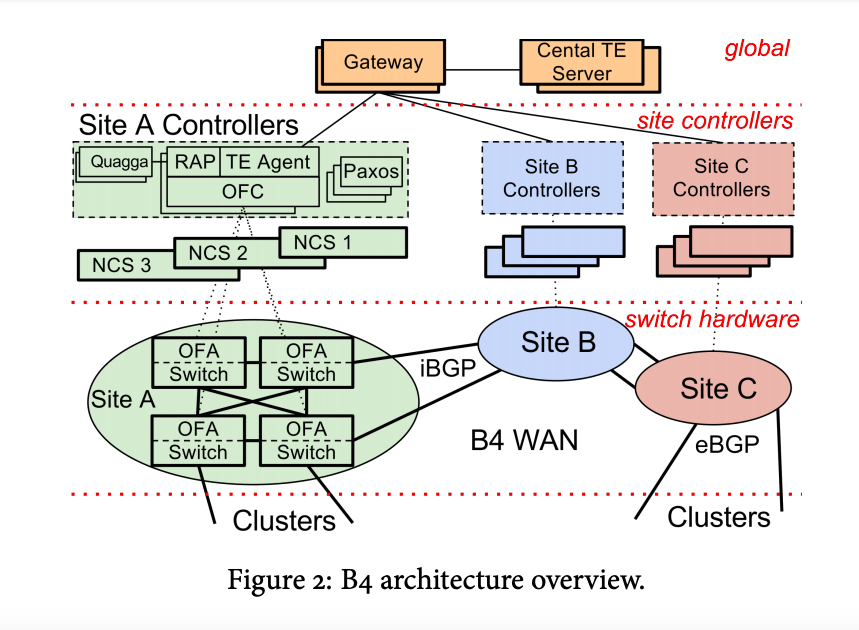

B4 网络的其实也是由三层构成，但这个和传统网络的“三层架构”又不太一样。这里指的是物理设备层（Switch Hardware）、局部网络控制层（Site Controllers）和全局控制层（Global）。

全局控制层中的 SDN 网关和 TE 服务器会在全局进行统一控制，而每个数据中心（Site）则会通过 Site Controller 来控制物理交换机，从而实现将网络的控制面和数据面分离的效果。

### 第一层：物理设备层 

我们首先来看第一层的物理交换设备，它是 Google 自研并请 ODM 厂商代工的白盒交换机。这个自研的交换机使用了 24 颗 16×10Gb 的芯片，还携带了 128 个 10Gb 网口。

交换机里面运行的是 OpenFlow 协议。但众所周知，交换机内的专用芯片从研发设计到最终流片其实周期和成本还是很高的。

那如何让专用的交换机芯片跟 OpenFlow 更好地进行协同呢？为了解决这个问题，Google 采用了 TTP 方案。实际运行时交换机则会把像访问控制列表（ACL）、路由表、隧道表之类的关键数据通过 BGP/IS-IS 协议报文送到 Controller，由 Controller 进行处理。

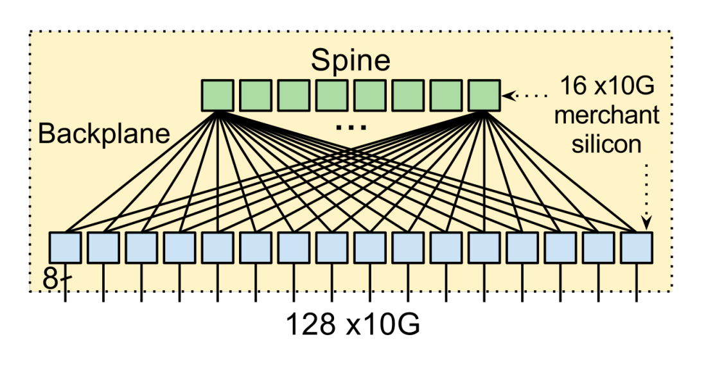

### 第二层：局部网络控制层 

B4 网络中，一个 Controller 服务可以控制多个交换机。而为了保证可用性，一个交换机是可以连接多个 Controller 服务的，而同一时间只会有一个 Controller 服务为这台交换机提供服务，并且一个数据中心中会包含由多个 Controller 服务实例构成的服务集群。

在局部网络控制层中，还会**使用 Paxos 协议负责所有控制功能的领导者（leader）选举**。

具体过程是这样的，每个节点上的 Paxos 实例对给定控制功能的可用副本集做应用程序级别的健康检测。当大多数的 Paxos 实例检测到故障时，他们就会从剩余的可用服务器集中选出一个新的负责人。然后，Paxos 会将递增的 ID 号回调给当选的 leader。leader 使用这个 ID 来向客户表明自己的身份。

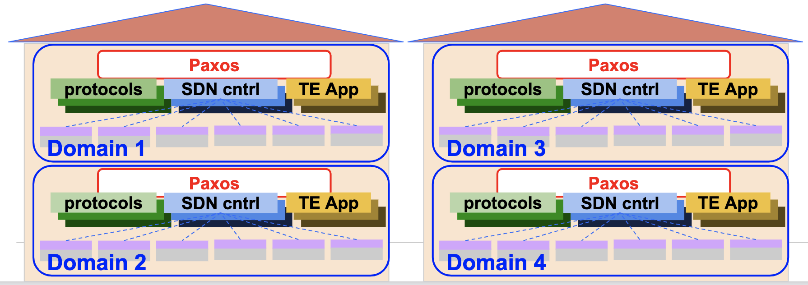

### 第三层全局控制层（Global） 

负责全局控制的 TE Server 通过 SDN Gateway 从各个数据中心的控制器收集链路信息，从而掌握路径状态。这些路径以 IP-In-IP 隧道的方式创建，通过 SDN 网关到达 Onix 控制器，最后下达到交换机。

当一个新的业务数据需要传输时，应用程序会估计它在传输时需要的带宽，并为它选择一个最佳路径，这样可以让链路的带宽利用率达到整体最佳。

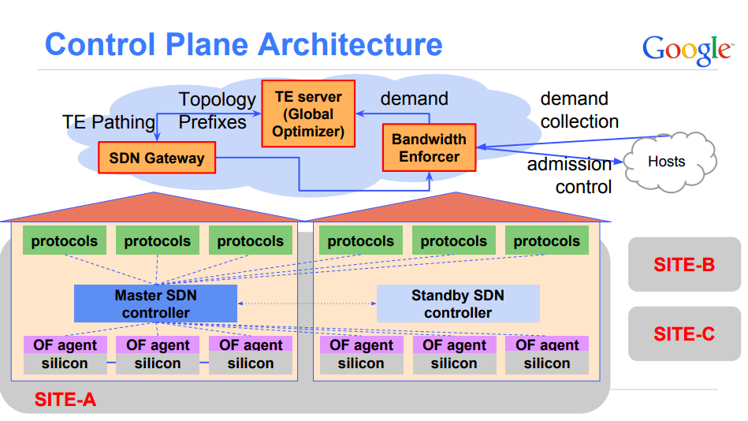

## SDN 原理 

开放网络基金会 ONF（Open Networking Foundation）则站在了 Google B4 等前人经验的基础上，当然也是将 SDN 架构分为三层，如下。

应用层是由包含了各种不同的的业务逻辑的应用构成的。

- 控制层主要负责数据平面相关资源的编排、调度、网络拓扑的维护以及状态信息管理等工作。

- 数据层相对来说逻辑更轻，主要负责数据的转发、处理以及运行时的一些状态收集工作。

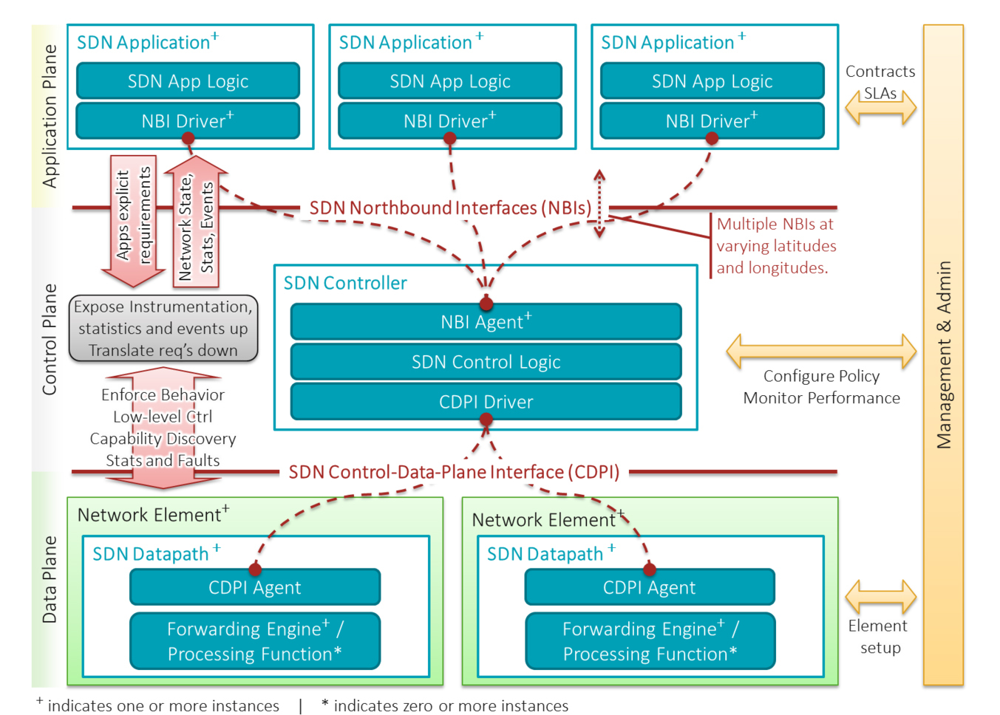

### SDN 的基本特征和优势 

SDN 主要包含三个基本特征，我们可以分别来看一下。

1. 控制逻辑与转发逻辑分离。转发平面主要是由受控的转发设备构成，具体的转发方式和相关业务逻辑则由分离在控制面的控制应用程序控制。

2. 开放的 API。通过开放的南北向 API，可以实现应用和网络的无缝集成，让应用只需要关注自己的逻辑，不需要关注底层的实现细节。

3. 集中控制：集中的控制平面可以获取网络资源的全局信息，并根据业务需求进行全局分配和优化。

结合我们前面所讲的 SDN 的特征，我帮你梳理了 SDN 的几大优势。

1. 灵活性，动态调整网络设备的配置，不再需要手动配置每台设备了。

2. 网络硬件简化（如白盒交换机等）。只需要关注数据处理和转发，与具体业务特性解耦，加速新业务特性的引入。

3. 自动化的网络部署、操作和维护以及故障诊断。

为了加深大家对 SDN 的理解，接下来让我们一起给予开源的控制面 ONOS 以及数据面 Mininet 进行一下组网试验。

## 开放网络操作系统 ONOS 组网实践 

ONOS 是一个开源的、分布式的网络操作系统控制平台，可以满足运营商对网络业务的电信级需求。

自 ONOS 诞生以来，就已经汇聚了很多知名服务提供商 (如 ATT、NTT 通信)、以及一些高标准网络设备供应商、运营商、合作伙伴（如英特尔、爱立信、Ciena、富士通、华为、NEC、CNIT、CREATE-NET、Infoblox、SRI）等，得到了 ONF 的全力支持。目前，ONOS 已经得到业界越来越多的认可与支持。

我们前面讲过 SDN 分为控制面和数据面，对应到开源实现中 ONOS 就是控制面的具体实现，而 Mininet 对应的就是数据面实现。Mininet 是由斯坦福大学基于 Linux 容器架构开发的一个**云原生虚拟化网络仿真工具**。

使用 ONOS+Mininet 我们可以快速创建一个包含主机、交换机、SDN 控制器以及链路的虚拟网络，并且 Mininet 创建的交换机也是支持上文讲到的 OpenFlow 协议的，这也使得它具备了高度的灵活性。使用这个工具，我们可以在本地轻松搭建一个 SDN 开发、调试环境。

### 下载虚拟机镜像 

首先，让我们使用官方打包好的[镜像](镜像)virtualbox 安装 Mininet，这种方式安装比较简单高效。

### 安装 Mininet 

如下图所示，下载 mininet-2.3.0-210211-ubuntu-20.04.1-legacy-server-amd64-ovf.zip，解压后导入虚拟机即可。

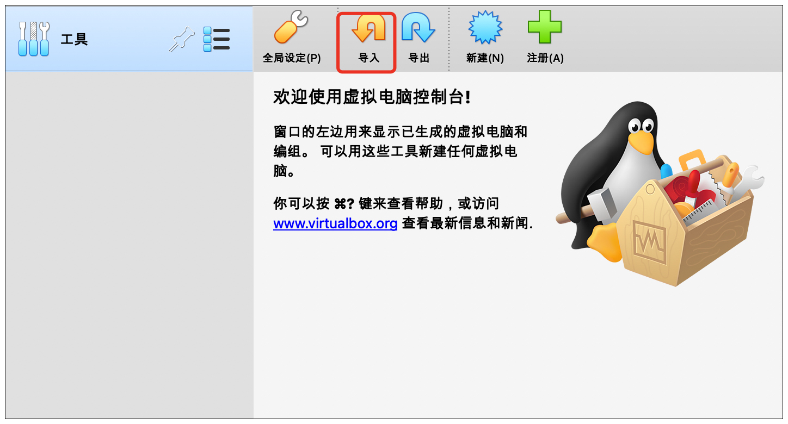

如下图所示，导入完毕之后，我们正常启动虚拟机。

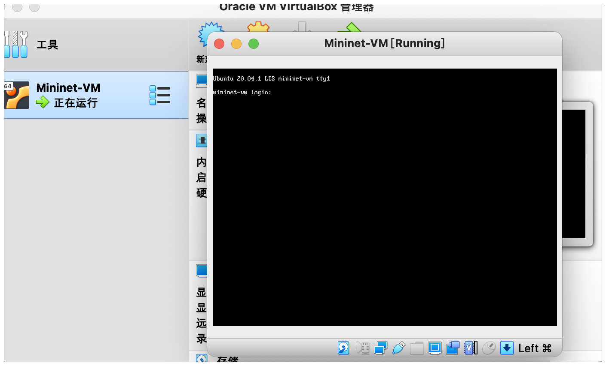

导入成功后，使用用户名 / 密码：mininet/mininet 即可登录。接下来，我们需要运行文稿中的命令安装 docker。

```sql
sudo apt-get update
sudo apt install curl
sudo apt install ssh
curl -fsSL https://get.docker.com | bash -s docker --mirror Aliyun
```

安装好 Docker 之后，我们在虚拟机中执行文稿后面这条命令，拉取 ONOS 的镜像（如果因为某些网络环境原因镜像拉取速度过慢，你可以尝试搜索使用 docker 镜像加速服务）。

```null
docker pull onosproject/onos
```

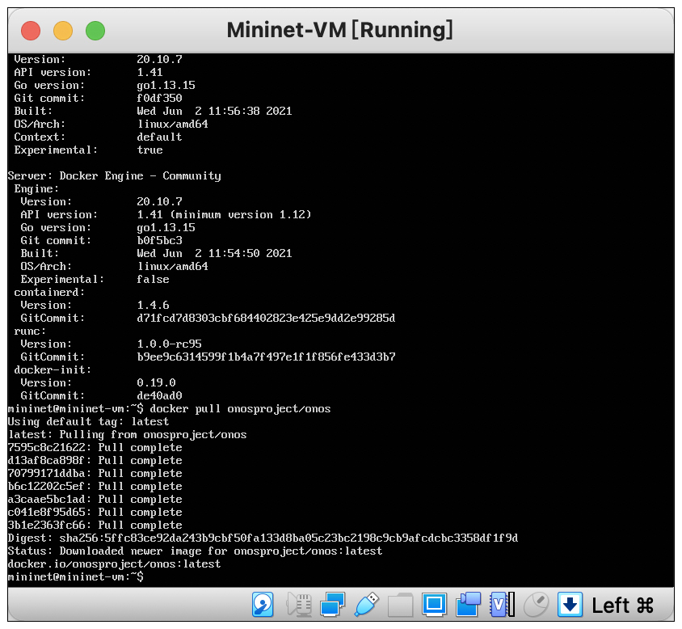

### 创建 Mininet 容器连接 ONOS 

好，现在安装 Mininet 的工作就完成了。下面我们运行后面的 docker run 命令，创建 ONOS 容器。

```sql
docker run -t -d --name onos1 onosproject/onos
```


然后，我们可以通过容器 id 获取 ONOS 容器的 IP，代码如下。

```javascript
docker inspect --format '{{ .NetworkSettings.IPAddress }}' <container-ID>
```


得到 IP 之后，我们使用 ssh 登陆 ONOS，用户名密码都是 karaf。

```python
ssh -p 8101 karaf@172.17.0.2
app activate org.onosproject.openflow #启用openflow
app activate org.onosproject.fwd #启用forward转发功能
```

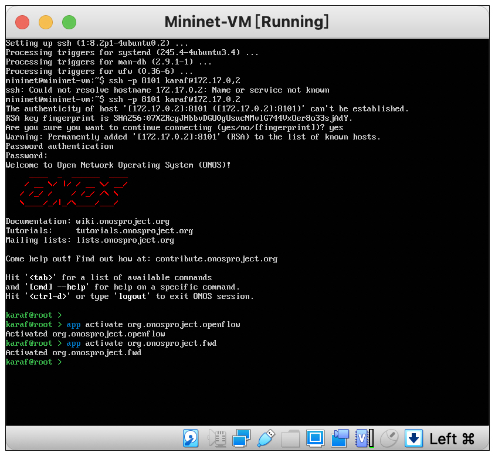

接着，我们需要退出 onos 登录，返回虚拟机中，配置 mininet 连接到 ONOS。

```python
sudo mn --topo tree,2 --controller remote,ip=172.17.0.2 #创建临时网络
pingall #网路连通性检测
```

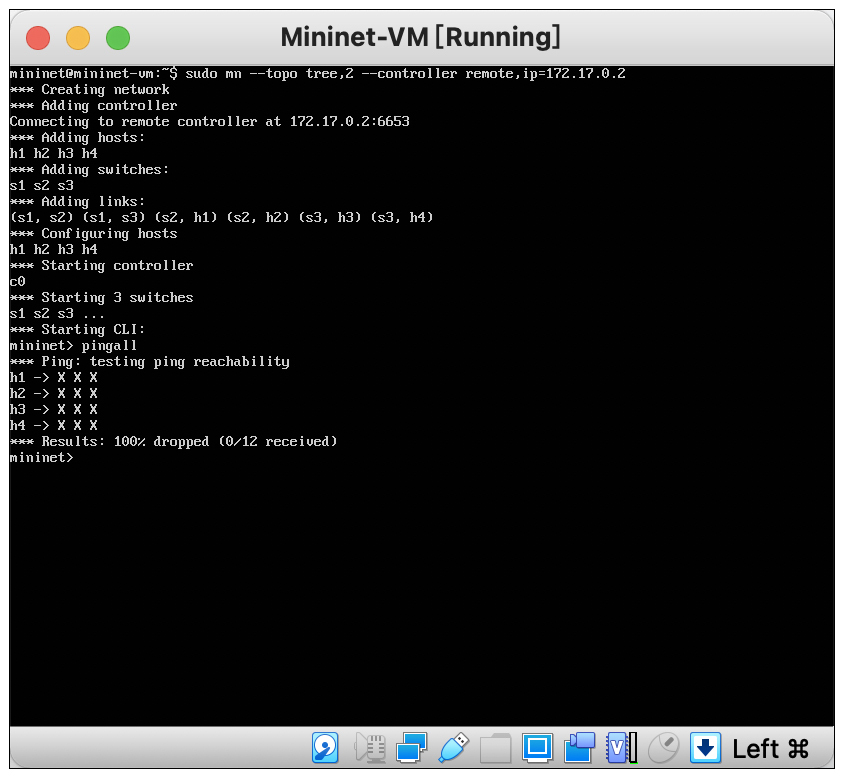

### ONOS 查看拓扑 

查看拓扑是通信组网的基本操作，我在后面还画了一张网络拓扑图。相信经过实战体会，再结合图示，你对网络节点和数据流转的理解会更上一层楼。

打开 URL：[http://172.17.0.2:8181/onos/ui/login.html](http://172.17.0.2:8181/onos/ui/login.html)

账号 / 密码：karaf

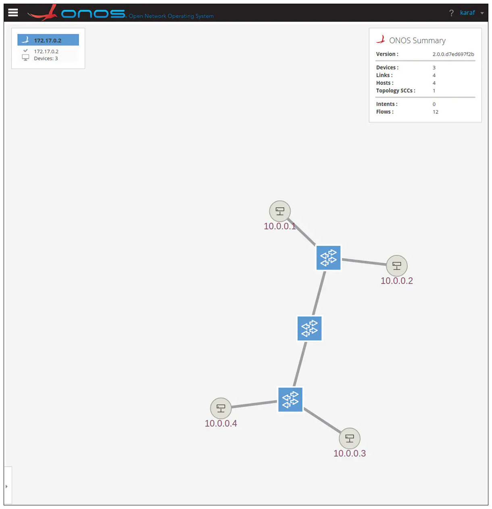

（说明：先把容器的网络映射到虚拟机，再把虚拟机的网络映射到本地即可。docker run 的时候加上 -p 8000:80 这样的参数，就可以映射到虚机了，然后再改一下 VBox 的网络设置。）

### ONOS CLI 

karaf 进入 ONOS 之后，除了开启各类设置，它本身也是一个 CLI，可以查看各类信息，例如后面这些信息。

- devices：查看交换机

- links：查看链路

- hosts：查看主机

- flows <tab 键 >：查看所选交换机之间的路径

更多命令和实验，你可以参考[ONOS 官方文档](ONOS 官方文档)自己探索。

## 重点回顾 

好，这节课的内容告一段落了，我来给你做个总结。

我们先从传统互联网组网的方式开始逐渐了解了互联网架构，随着认识的深入我们发现传统三层架构是存在缺点的，于是我们引入了各种优化方案来不断迭代、演进出了以 SDN 为代表的现代互联网基础架构。

最后，我们**基于 ONOS 和 MiniNet 搭建了 SDN 的实验环境**，了解到了一次 **SDN 组网的基本流程**，同时跑通了我们第一个实验。


## 思考题 

请思考一下，我们目前的互联网架构属于中心化架构还是去中心化架构呢？你觉得未来的发展趋势又是如何？

## 拓展阅读 

1.[可扩展的商用数据中心网络架构](可扩展的商用数据中心网络架构)。

2.[B4：使用全球部署的软件定义广域网的经验](B4：使用全球部署的软件定义广域网的经验)。

欢迎你在留言区记录你的学习收获，或者跟我交流探讨。也推荐你把今天这节课分享给身边的朋友。

我是 LMOS，我们下节课见！

