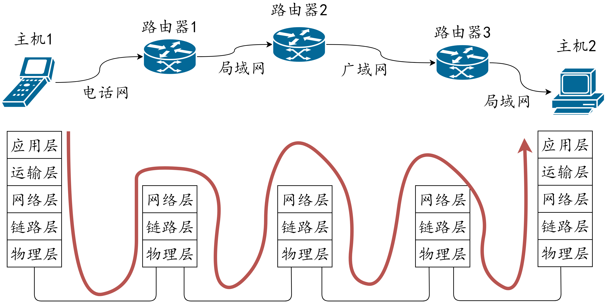
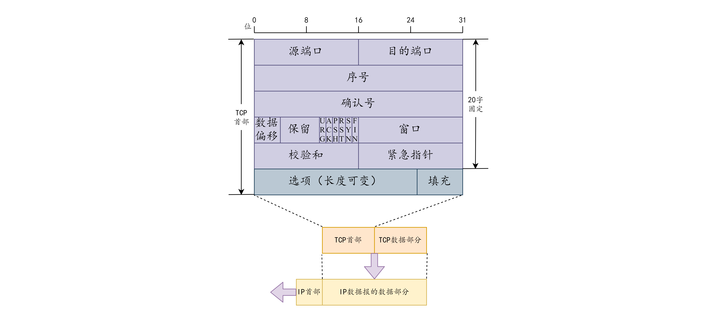

# 学习资源

📹 视频 : [韩立刚- 计算机网络](https://www.bilibili.com/video/av9876107)

📚 书籍 : [计算机网络 第七版 作者：谢希仁](https://book.douban.com/subject/26960678/)

📚 书籍 : [TCP/IP 详解](https://book.douban.com/subject/1088054/)

# 计算机网络概述

## 计算机网络的体系结构

- **分层：**
  - 各层之间是独立的，灵活性好，易于实现和维护。
  - 网络排错：从低级到高级**一层一层地排错**。
- **OSI 七层模型：**
  - 应用层：就是能产生网络流量的应用程序。
  - 表示层：数据的表示、加密、压缩。
  - 会话层：应用程序之间建立的会话。
  - 传输层：可靠传输（建立会话）、不可靠传输、流量 控制
  - 网络层：进行逻辑地址寻址，实现不同网络之间的路径选择。
  - 数据链路层：封装数据、添加物理层地址
  - 物理层：提供物理规范，如线缆标准、接口标准、电压。
- **五层模型：**
  - 应用层：任务是通过应用程序间的交互来完成特定网络应用。应用层协议定义的是应用程序间的通信和交互规则。如：DNS，HTTP。
  - 运输层：任务是负责向**两台主机中进程之间的通信**提供**通用的数据传输**服务。**TCP和UDP。**
  - 网络层：负责为分组交换网上的不同主机提供通信服务。发送数据时，把落差把运输层产生的报文段或用户数据包封装成分组（IP数据包，数据包）进行传送。**IP协议。**
  - 数据链路层：两台主机间的数据传输，总是在一段一段的链路上传送的，在两个相邻节点之间传送数据时，数据链路层把网络层的IP数据包**组装成帧（framing）**，每一帧都包含必要的**控制信息**。接收端可以根据控制信息决定是否丢弃除了差错的帧，或进行拼接。
  - 物理层：在物理层传送数据的 单位是比特，同上。

## 计算机网络的性能指标

- **速率：**
  - 指的是连接在计算机网络上的主机在数字信道上**数据的传送速率**，也成为**数据率(data rate)或比特率(bit rate)。单位是bit/s（或b/s、bps）**。当比较大时，还可以写成 kbps、Mbps、Gbps等。除以8才是byte。例如：服务端与客户端进程间的通信速。
- **带宽：**
  - 指的是单位时间内网络中**某信道（如网卡）**所能通过的**“最高数据率”**，**单位是bit/s**。
- **吞吐量：**
  - 单位时间内通过**某个网络（或信道、接口）的实际数据量**，即总的流量。
- **时延：**
  - **时延(delay 或 latency)** 是指数据（一个报文或分组，甚至比特）从网络的一段传送到另一端所需要的时间。也称 **延迟** 或 **迟延** 。
  - **发送时延（transmission delay）：** 是指主机或路由器发送数据帧所需要的时间，就是把数据帧全部送出去所用的时间。
  - **传播时延（propagation delay）：** 是指电磁波在信道中传播一定的距离需要花费的时间。
  - **处理时延：** 主机或路由器在收到分组时要花费一定的时间进行处理。
  - **排队时延：** 分组在进入路由器后，要先在输入队列中排队等待处理，在路由器确定了转发接口后，还要在输出队列中排队等待转发，这就产生了排队时延。排队时延的长短取决于网络当时的通信量。
  - **总时延 = 发送时延 + 传播时延 + 处理时延 + 排队时延**
- **往返时间 RTT（Round-Trip Time）：**
  - 从发送方发送数据开始，到发送方收到接收方的确认的总时间。如：ping 的时间

# 物理层

&#160;&#160;&#160;&#160;这个部分正是我们**通信工程**专业本科所学内容，发现所有内容来自所学的《通信原理》、《高频电子线路》、《电磁场与电磁波》。内容即数字信号转换为模拟信号的过程。

# 数据链路层

数据链路层使用的信道：

&#160;&#160;&#160;&#160;点对点信道：使用一对一的点对点通信方式

&#160;&#160;&#160;&#160;广播信道：使用一对多的广播通信方式，过程比较复杂，需要专用的协议来协调

## 使用点对点信道的数据链路层

### 三个基本问题

#### 封装成帧：

封装成帧：就是在一段数据前后分别添加首部和尾部，确定帧的界限，然后就构成了一个帧

- 添加首部和尾部的作用：进行帧定界(确定帧的界限)；包含许多必要的控制信息
- 帧长：帧的数据部分加上帧首部和帧尾部的长度
  最大传送单元MTU：链路层协议规定的所能传送的帧的数据部分长度上限
  帧格式：

- 帧界定的方法：可用特殊的帧定界符，在ACSCII码中，用SOH表示帧的首部开始，EOT表示帧的结束
- 帧界定的作用：判断收到的帧是否完整，不完整则丢弃

#### 透明传输：

- 透明传输：不管什么数据，都能完整无差错的通过这个数据链路层，数据链路层对数据没有妨碍，数据链路层对数据时透明的

- 透明传输中的问题：若数据中的某个字节的二进制代码恰好组成了帧界定符，就会出现错误

- 解决方法：字节填充，在控制字符和特殊字符前插入一个转义字符"ESC"`(类似于转义字符)`，而真正的首部和尾部前不加

#### 差错检测：

- 比特差错：在传输中可能会产生比特差错，1可能变0，0可能变1
- 误码率：在一段时间，传输错误的比特占所有传输比特总数的比率，与信噪比有关

### 点对点协议PPP

 对于点对点的链路，目前使用最广泛的是PPP协议 

#### PPP协议的特点

- 作用域：用户计算机和ISP通信时所使用的数据链路层协议

- PPP协议应满足的需求：

  (1)简单：对数据链路层的帧，不需要纠错、序号、流量控制，简单作为首要要求；收到帧进行CRC检验，无差错则接收，反之丢弃

  (2)封装成帧：必须规定特殊的字符作为帧定界符，使接收端从收到的比特流中准确找出帧的开始和结束位置

  (3)透明性：必须保证数据传输的透明性，要能解决碰巧出现和帧定界符一样的比特组合的问题

  (4)多种网络层协议：必须能够在同一条物理链路上同时支持多种网络层协议的运行，如IP等；在局域网和路由器上同样如此

  (5)多种类型链路：必须能够在多种链路上运行

  (6)差错检验：必须能够对接收端收到的帧进行检测，并立即丢弃有差错的帧

  (7)检测连接状态：必须能够自动检测链路是否处于正常工作状态

  (8)最大传送单元：必须对每一种类型的点对点链路设置MTU的标准默认值；促进各种实现之间的互操作性，若高层协议发送的分组数据部分超过MTU值，则丢弃并返回差错

  (9)网络层地址协商：必须提供一种机制使通信的两个网络层的实体能够通过协商知道或能够配置彼此的网络层地址

  (10)数据压缩协商：必须提供方法来协商使用数据压缩算法

- PPP的特点：不支持多点线路，只支持点对点的链路通信，只支持全双工链路

- PPP协议不需要的功能：*纠错*、流量控制、序号、多点线路、半双工或单工链路（只工作在点对点链路）

- PPP协议的组成：

  (1)将IP数据报封装到串行链路的方法；PPP支持异步链路，也支持面向比特的同步链路；IP数据报在PPP帧中数据部分，收到MTU限制

  (2)用来建立、配置和测试链路连接的链路控制协议LCP

  (3)网络控制协议NCP，其中每一个协议支持不同的网络层协议

#### PPP协议的帧格式

首部和尾部分别为4个字段和2个字段

- 标志字段F：规定为0x7E，表示一个帧的开始或结束，就是帧的定界符

- 地址字段A：规定为0xFF

- 控制字段C：规定为0x03

- 协议字段：

  (1)当协议字段为0x0021时，PPP帧的信息字段就是IP数据报。

  (2)当协议字段为0xC021时，PPP帧的信息字段就是PPP链路控制协议LCP的数据。

  (3)当协议字段为0x8021时，PPP帧的信息字段就是网络层的控制数据。

- 信息字段：长度可变，不超过1500字节

- 帧减压序列FCS：CRC中使用的冗余码

## 使用广播信道的数据链路层

### 以太网的MAC层

#### MAC帧格式： 

以太网数据帧长度：64~1518

各字段含义：

- 类型：用来标志上一层使用的是什么协议
- 数据：长度在46~1500字节
- FCS：帧检验序列，使用CRC检验
- 填充字段：当数据字段长度小于46字节时，MAC子层会在数据字段后面加入一个整数字节的填充字段，以保证MAC帧长不小于64字节
- 插入的8字节：从MAC子层传到物理层时要在帧前插入8字节，由硬件生成
- 前同步码：7字节；使接收端的适配器在接收MAC帧时能迅速调整时钟频率，使其和发送端时钟同步
  帧开始定界符：定义为10101011；用来表示帧开始

#### 无效的MAC帧：

(1)帧的长度不是整数个字节

(2)用收到的帧检验序列FCS查出差错

(3)收到的帧的MAC客户数据长度不在46 ~ 1500字节之间，或MAC帧长度不在64 ~ 1518

# 网络层

## 网络协议

网络协议IP是TCP／IP体系中两个最主要的协议之一，也是最重要的互联网标准协议之一。与IP协议配套使用的还有三个协议：

- 地址解析协议ARP
- 网际控制报文协议ICMP
- 网际组管理协议IGMP

还有一个逆地址解析协议RARP，现在已经淘汰不用了。因为现在的DHCP协议已经包含了RARP协议的功能。

IP协议经常使用ARP协议，而ICMP和IGMP协议要使用IP协议。因此在网络层图中，ICMP和IGMP位于IP上，ARP位于IP下。

### 分类的IP地址

IP地址的编址方法共经历了三个阶段：

- 分类的IP地址
- 子网的划分
- 构成超网

这里的IP地址都是指IPv4中的地址，即32位的IP地址。

#### 分类的IP地址

&#160;&#160;&#160;&#160;是指将IP地址划分为若干个固定类，每一类地址都由两个固定长度的字段组成，其中第一个是网络号，它标志主机或路由器所连接到的某个网络，一个网络号必须在整个网络范围都是是唯一的。第二个是主机号，它标志某台主机或路由器本身。一个主机号在它前面的网络号所指明的网络范围内必须是唯一的。

&#160;&#160;&#160;&#160;IPV4简单粗暴地把IP地址分为五类。分类方法如下图所示：

也就是说，分为以下几类：

- A类: 0.0.0.0-127.255.255，可指派网络号126个（2^7-2个）,网络号全0和网络号127不可用。可指派主机号2^24-2个，主机号全0和全1这两个不可用。

- B类: 128.0.0.0-191.255.255.255，可指派网络号2^14-1个，128.0.0.0不可指派。可指派主机号2^16-2，因为主机号全0和全1不可用。

- C类: 192.0.0.0-223.255.255.255，可指派网络号2^21-1个，192.0.0.0不可用，可指派主机号2^8-2，因为主机号全0和全1不可用。

- D类: 224.0.0.0-239.255.255.255，是多播地址，用于多播（一对多通信）

- E类: 240.0.0.0-255.255.255.255，保留为以后所用。

&#160;&#160;&#160;&#160;这其中除了段0和段127之外，还有一些IP地址因为有其他的用途，是不可以用作普通IP的。还有一部分被用作私有IP地址。

**(1)环回地址：127.x.x.x**

如127.0.0.1 等效于localhost或本机IP。 一般用于测试使用。例如：ping 127.0.0.1来测试本机TCP/IP是否正常。http://127.0.0.1:8080 等效 http://localhost:8080

**(2)私有IP**

&#160;&#160;&#160;&#160;与私有IP地址对应的是公有地址（Public address），由Inter NIC（Internet Network Information Center 因特网信息中心）负责。这些IP地址分配给注册并向Inter NIC提出申请的组织机构。通过它直接访问因特网。 　　

&#160;&#160;&#160;&#160;私有IP的出现是为了解决公有IP地址不够用的情况。从A、B、C三类IP地址中拿出一部分作为私有IP地址，这些IP地址不能被路由到Internet骨干网上，Internet路由器也将丢弃该私有地址。如果私有IP地址想要连至Internet，需要将私有地址转换为公有地址。这个转换过程称为网络地址转换（Network Address Translation，NAT），通常使用路由器来执行NAT转换。

范围如下：

A类: 10.0.0.0~10.255.255.255

B类:172.16.0.0~172.31.255.255

C类:192.168.0.0~192.168.255.255

## 地址解析协议 ARP

通信时使用了两个地址：

- IP 地址（网络层地址）
- MAC 地址（数据链路层地址）

在实际应用中，有这样一个问题：已经知道了一个机器（主机或路由器）的IP地址，如何找出其相应的硬件地址？

答案是地址解析协议ARP

### ARP的两个要点

- 网络层使用的IP地址，但在实际网络的链路上传送数据帧时，必须使用硬件地址。
- 每一个主机都设有一个 ARP 高速缓存 (ARP cache)，里面有所在的局域网上的各主机和路由器的 IP 地址到硬件地址的映射表。这个映射表经常动态更新（新增或超时删除）

ARP对保存在高速缓存中的每一个映射地址项目都设置生存时间（如１０～２０分钟），凡是超过生存时间的映射项目就会从高速缓存中删除掉。

## IP数据报的格式

一个 IP 数据报由首部和数据两部分组成。

最高位在左边，记为0 bit；最低位在右边，记为31 bit

首部的前一部分是固定长度，共 20 字节，是所有 IP 数据报必须具有的。

在首部的固定部分的后面是一些可选字段，其长度是可变的。

### 首部各部分含义

- 版本:占 4 位，指 IP 协议的版本目前的 IP 协议版本号为 4 (即 IPv4)
- 首部长度:占4位，可表示的最大数值是15个单位(一个单位为 4 字节)因此IP 的首部长度的最大值是 60 字节
- 区分服务:占8位，用来获得更好的服务,在旧标准中叫做服务类型，但实际上一直未被使用过，1998 年这个字段改名为区分服务，只有在使用区分服务(DiffServ)时，这个字段才起作用，一般的情况下都不使用这个字段
- 总长度:占16位，指首部和数据之和的长度，单位为字节，因此数据报的最大长度为 65535 字节（２^16－１），总长度必须不超过最大传送单元 MTU。在IP层下面每一种数据链路层协议都规定了一个数据帧中的数据字段的最大长度，这称为最大传送单元 MTU
- 标识:占16位，它是一个计数器，用来产生数据报的标识。这个标识并不是序号，是在数据报大小超过网络的MTU而进行分片时，这个字段值被复制到分片后的每一个数据报的标识字段中，使分片后的各数据报最后能正确的重装为原来的数据报。
- 标志(flag):占3位，目前只有前两位有意义
    - MF：标志字段的最低位（第1位）是 MF (More Fragment)
        - MF=1 表示后面“还有分片”
        - MF=0 表示最后一个分片
    - DF：标志字段中间的一位（第2位）是 DF (Don't Fragment)
　　　　只有当 DF=0 时才允许分片
- 片偏移:占12位，指较长的分组在分片后某片在原分组中的相对位置，片偏移以 8 个字节为偏移单位
- 生存时间：占8位，记为TTL (Time To Live) 数据报在网络中可通过的路由器数的最大值，TTL 字段最初是用秒做单位，现在已改成跳数做单位，路由器在每次转发数据报之前就把TTL值减1，被转发之前减到0则丢弃。推荐的初始值由分配数字 RFC 指定，当前值为 64，发送 ICMP 回显应答时经常把 TTL 设为最大值 255
- 协议:占8位，指出此数据报携带的数据使用何种协议以便目的主机的IP层将数据部分上交给哪个处理过程，1表示为 ICMP 协议, 2表示为 IGMP 协议, 6表示为 TCP 协议, 17表示为 UDP 协议
- 首部检验和:占16位，只检验数据报的首部不检验数据部分，因为数据报每经过一个路由器一些字段如生存时间、标志、片偏移都可能发生变化。不检验数据部分为了减少计算的工作量，这里不采用 CRC 检验码而采用简单的计算方法进一步减少了计算的工作量。
- 源地址和目的地址:都各占 4 字节，分别记录源地址和目的地址

### 首部可变部分

- IP 首部的可变部分就是一个选项字段，用来支持排错、测量以及安全等措施，内容很丰富。
- 选项字段的长度可变，从 1 个字节到 40 个字节不等，取决于所选择的项目。但最后必须是4字节的整数倍（不够用全0的字段填充）。
- 增加首部的可变部分是为了增加 IP 数据报的功能，但这同时也使得 IP 数据报的首部长度成为可变的。这就增加了每一个路由器处理数据报的开销。

# 传输层

网络层只把分组发送到目的主机，但是真正通信的并不是主机而是主机中的进程。传输层提供了进程间的逻辑通信，传输层向高层用户屏蔽了下面网络层的核心细节，使应用程序看起来像是在两个传输层实体之间有一条端到端的逻辑通信信道。

## UDP 和 TCP 的特点
- 用户数据报协议 UDP（User Datagram Protocol）是无连接的，尽最大可能交付，没有拥塞控制，面向报文（对于应用程序传下来的报文不合并也不拆分，只是添加 UDP 首部），支持一对一、一对多、多对一和多对多的交互通信。
- 传输控制协议 TCP（Transmission Control Protocol）是面向连接的，提供可靠交付，有流量控制，拥塞控制，提供全双工通信，面向字节流（把应用层传下来的报文看成字节流，把字节流组织成大小不等的数据块），每一条 TCP 连接只能是点对点的（一对一）。

### 区别：

**TCP是面向连接的，UDP是面向无连接的**

**TCP是可靠的**，丢包会有重传机制，流量控制，数据包校验；**UDP是不可靠的**，容易丢包

TCP是面向字节流，UDP是面向报文

TCP对系统资源要求较多，UDP对系统资源要求较少

TCP传输速度慢，UDP传输速度较快

TCP是端到端的，UDP支持一对一、一对多、多对多

TCP有拥塞控制，UDP无拥塞控制

## UDP的首段格式

首部字段只有 8 个字节，包括源端口、目的端口、长度、检验和。12 字节的伪首部是为了计算检验和临时添加的。

## TCP的首部格式

- 序号 ：用于对字节流进行编号，例如序号为 301，表示第一个字节的编号为 301，如果携带的数据长度为 100 字节，那么下一个报文段的序号应为 401。
- 确认号 ：期望收到的下一个报文段的序号。例如 B 正确收到 A 发送来的一个报文段，序号为 501，携带的数据长度为 200 字节，因此 B 期望下一个报文段的序号为 701，B 发送给 A 的确认报文段中确认号就为 701。
- 数据偏移 ：指的是数据部分距离报文段起始处的偏移量，实际上指的是首部的长度。
- 确认 ACK ：当 ACK=1 时确认号字段有效，否则无效。TCP 规定，在连接建立后所有传送的报文段都必须把 ACK 置 1。
- 同步 SYN ：在连接建立时用来同步序号。当 SYN=1，ACK=0 时表示这是一个连接请求报文段。若对方同意建立连接，则响应报文中 SYN=1，ACK=1。
- 终止 FIN ：用来释放一个连接，当 FIN=1 时，表示此报文段的发送方的数据已发送完毕，并要求释放连接。
- 窗口 ：窗口值作为接收方让发送方设置其发送窗口的依据。之所以要有这个限制，是因为接收方的数据缓存空间是有限的。

## TCP的三次握手

假设 A 为客户端，B 为服务器端。

首先 B 处于 LISTEN（监听）状态，等待客户的连接请求。

A 向 B 发送连接请求报文，SYN=1，ACK=0，选择一个初始的序号 x。

B 收到连接请求报文，如果同意建立连接，则向 A 发送连接确认报文，SYN=1，ACK=1，确认号为 x+1，同时也选择一个初始的序号 y。

A 收到 B 的连接确认报文后，还要向 B 发出确认，确认号为 y+1，序号为 x+1。

B 收到 A 的确认后，连接建立。

### **三次握手的原因，为什么不是两次**

第三次握手是为了防止失效的连接请求到达服务器，让服务器错误打开连接。

客户端发送的连接请求如果在网络中滞留，那么就会隔很长一段时间才能收到服务器端发回的连接确认。客户端等待一个超时重传时间之后，就会重新请求连接。但是这个滞留的连接请求最后还是会到达服务器，如果不进行三次握手，那么服务器就会打开两个连接。如果有第三次握手，客户端会忽略服务器之后发送的对滞留连接请求的连接确认，不进行第三次握手，因此就不会再次打开连接。

要说TCP为什么是三次握手，那么其实换个角度而言，就是要证明2次太少，4次又没必要。
所谓的三次握手，他的本质是什么？TCP是可靠传输协议，他的本质其实就是要确定客户端和服务端，他们的发送和接收能力是没有问题的。也就是客户端要考察服务端的发送和接收能力，服务端也要考察客户端的发送和接收能力。

#### 第一次握手

肥朝小声逼逼：第一次握手服务端收到了数据包，确定了客户端的发送能力是没有问题的（如图）

#### 第二次握手

肥朝小声逼逼：第二次握手客户端收到了数据包，这个时候，就能证明服务端的发送能力是没有问题的。但是服务端的接收能力有没有问题呢？第一次握手的时候，我们提出的问题是“怎么找到肥朝的公众号？”，收到的回答是“公众号搜索名称肥朝就可以了，你试下可以了告诉我”。回答正好是我们刚才问的，那就说明，服务端的接收能力是没有问题的（如图）

那么，回到刚开始的问题，为啥两次握手不行，因为这个时候，客户端已经确定了服务端的发送和接收能力都没有问题，但是服务端，却没有确定，客户端的接收能力，到底有没有问题。

#### 第三次握手

肥朝小声逼逼：第三次握手，服务端收到了数据包，发现确实是刚才提问的答案，那么，就确定了客户端的接收能力是没有问题的。

再次回到刚才的问题，3次，是完成双方考察发送和接收能力的最少次数。这也就是为啥不是2次，也不是4次。

## TCP的四次挥手

以下描述不讨论序号和确认号，因为序号和确认号的规则比较简单。并且不讨论 ACK，因为 ACK 在连接建立之后都为 1。

A 发送连接释放报文，FIN=1。

B 收到之后发出确认，此时 TCP 属于半关闭状态，B 能向 A 发送数据但是 A 不能向 B 发送数据。

当 B 不再需要连接时，发送连接释放报文，FIN=1。

A 收到后发出确认，进入 TIME-WAIT 状态，等待 2 MSL（最大报文存活时间）后释放连接。

B 收到 A 的确认后释放连接。

### 四次挥手的原因

客户端发送了 FIN 连接释放报文之后，服务器收到了这个报文，就进入了 CLOSE-WAIT 状态。这个状态是为了让服务器端发送还未传送完毕的数据，传送完毕之后，服务器会发送 FIN 连接释放报文。

### TIME_WAIT

客户端接收到服务器端的 FIN 报文后进入此状态，此时并不是直接进入 CLOSED 状态，还需要等待一个时间计时器设置的时间 2MSL。这么做有两个理由：

确保最后一个确认报文能够到达。如果 B 没收到 A 发送来的确认报文，那么就会重新发送连接释放请求报文，A 等待一段时间就是为了处理这种情况的发生。

等待一段时间是为了让本连接持续时间内所产生的所有报文都从网络中消失，使得下一个新的连接不会出现旧的连接请求报文。

## TCP 滑动窗口

窗口是缓存的一部分，用来暂时存放字节流。发送方和接收方各有一个窗口，接收方通过 TCP 报文段中的窗口字段告诉发送方自己的窗口大小，发送方根据这个值和其它信息设置自己的窗口大小。

发送窗口内的字节都允许被发送，接收窗口内的字节都允许被接收。如果发送窗口左部的字节已经发送并且收到了确认，那么就将发送窗口向右滑动一定距离，直到左部第一个字节不是已发送并且已确认的状态；接收窗口的滑动类似，接收窗口左部字节已经发送确认并交付主机，就向右滑动接收窗口。

接收窗口只会对窗口内最后一个按序到达的字节进行确认，例如接收窗口已经收到的字节为 {31, 34, 35}，其中 {31} 按序到达，而 {34, 35} 就不是，因此只对字节 31 进行确认。发送方得到一个字节的确认之后，就知道这个字节之前的所有字节都已经被接收。

## TCP 流量控制
流量控制是为了控制发送方发送速率，保证接收方来得及接收。

接收方发送的确认报文中的窗口字段可以用来控制发送方窗口大小，从而影响发送方的发送速率。将窗口字段设置为 0，则发送方不能发送数据。

## TCP 拥塞控制
如果网络出现拥塞，分组将会丢失，此时发送方会继续重传，从而导致网络拥塞程度更高。因此当出现拥塞时，应当控制发送方的速率。这一点和流量控制很像，但是出发点不同。流量控制是为了让接收方能来得及接收，而拥塞控制是为了降低整个网络的拥塞程度。

# 应用层

无非是各种应用，如FTP、HTTP、SSH等。

# 参考

[1] 计算机网络学习笔记——计算机网络概述

[https://www.cnblogs.com/yuanyb/p/9697139.html ](https://www.cnblogs.com/yuanyb/p/9697139.html)

[2] 计算机网络知识点总结-第三章：数据链路层

[https://blog.csdn.net/weixin_43093481/article/details/86683996](https://blog.csdn.net/weixin_43093481/article/details/86683996) 

[3] 计算机网络之网络层

[https://www.cnblogs.com/ChangAn223/p/10849345.html](https://www.cnblogs.com/ChangAn223/p/10849345.html)

[4] 计算机网络之传输层

[https://www.cnblogs.com/liyao0312/p/11396313.html](https://www.cnblogs.com/liyao0312/p/11396313.html)